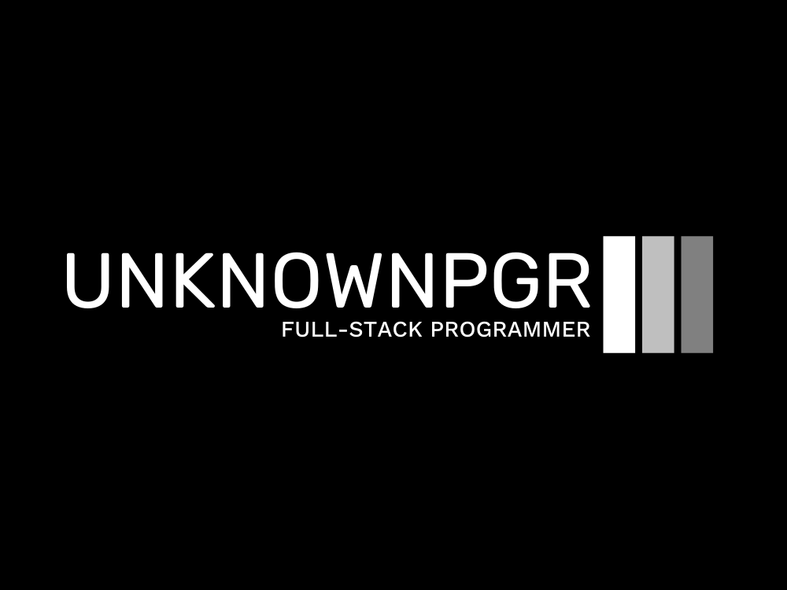

# @unknownpgr/github-blog

<p align="center">

</p>

- Blog : https://unknownpgr.com/
- Repository : https://github.com/unknownpgr/unknownpgr.github.io

I wrote a new blog framework that satisfies the criteria below.

- Writing a post should be simple.
- It should be easy to change blog configuration.
- It should not be affected by environment including OS.
- It should support unicode.

## Usage

1. Make a directory for new post in `/post`.

2. Write a post markdown file with yaml formatter. The filename can be anything as long as it ends in `.md`. Below is a template for yaml formatter.

   ```yaml
   ---
   title: This is title!
   category: this_is_category.
   date: 2022-11-30 # Date is optional.
   ---
   # Blog post comes here.
   ```

3. Build blog by running `build.sh` script. Date will be automatically added to formatter if there are no date attribute.

4. Generated files will be placed in `/docs` directory. Notice that any files previously in `/docs` directory will be removed whenever blog is built.

5. In order to publish blog with `GitHub Pages`, enable `Pages` and change branch setting of `GitHub Pages` to `/docs`
