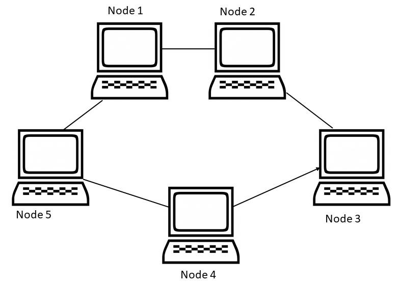

이 글은 웹의 동작 원리에 대한 기초를 설명합니다. 주변 비전공자들 중 웹 공부를 하고자 하는 사람들이 참 많은데, 웹의 기초적인 동작 방식을(서버-클라이언트 구조, HTTP, JS등을) 몰라서 헤매는 경우가 많은 것을 발견했습니다. 그래서 이런 친구들을 도와주고자 웹 기초에 대해 한번 정리해보고자 합니다.

# 네트워크는 어떻게 물리적으로 구성되나?

우리가 웹을 다루기에 앞서, 먼저 네트워크라는 게 뭔지 한번 정리해보고 가는 게 좋을 것 같습니다. 우리가 네트워크라 부르는 것은 컴퓨터 여러 개를 통신할 수 있도록 연결해놓은 구조를 말합니다. 세계 2차대전 때 컴퓨터가 처음으로 발명되었는데 이때 한 컴퓨터에 중요한 정보를 모두 저장했다가 그 컴퓨터가 폭격당해서 망가지면 큰일나니까, 정보를 여러 군데에 나누어 라는 아이디어에서 출발한 것이 네트워크입니다. 즉, 네트워크란 서로 통신할 수 있도록 연결된 컴퓨터들의 모임을 말합니다.

물론 처음에는 아래 그림과 같이 단순히 몇 개의 컴퓨터를 물리적인 전선으로 잇고, 이 전선을 통해서 정보를 전달하는 데에 그쳤을 것입니다.


이렇게 서로 정보를 전달해야 할 컴퓨터를 모두 연결하는 네트워크 구성 방식을 full mesh라 부릅니다. 그런데 이 구조에는 아주 큰 문제가 있습니다. 컴퓨터가 많아지면 많아질수록 필요한 전선이 기하급수적으로 늘어난다는 점입니다.  예를 들어서 위 구조에서 컴퓨터를 두 개만 더 넣어도 아래 그림과 같이 연결이 훨씬 복잡해집니다.


그런데 우리가 어떤 컴퓨터를 통해서 정보를 보낼 때, 굳이 한 번에 보낼 필요가 없고 다른 컴퓨터를 거쳐서 보내는 것도 가능하다고 생각해봅시다. 그럴 경우에는 사실은 아래와 같은 구조로 네트워크를 구성해도 큰 문제가 없을 것입니다.



이 경우 네트워크에 속한 어떤 컴퓨터에서도, 몇 개의 컴퓨터를 거치면 다른 컴퓨터로 정보를 보내고 받을 수가 있습니다.

물론 여기에도 문제가 있습니다. 만약 연결이 두 개 이상 끊기면 네트워크가 반으로 쪼개진다는 점입니다. 이러한 문제를 해결하기 위해서 아래와 같은 여러가지 네트워크 구조(network topology라 합니다)들이 제시되었고, 현재 우리는 Star, 혹은 Star를 여러 개 엮은 Tree 형 네트워크를 가장 많이 사용하고 있습니다.


실제로 우리가 집에서 컴퓨터나 스마트폰을 사용할 때에는 모든 기기를 하나의 공유기에 물려서 사용하게 됩니다. 그 공유기가 바로 Star의 central hub에 해당합니다.

그렇기 때문에 만약 공유기에서 랜선을 뽑아서 인터넷이 안 되도록 만든다 하더라도, 같은 공유기에 접속돼 있는 핸드폰과 컴퓨터는 당연히 같은 네트워크에 속해 있으므로 서로 통신할 수 있습니다.

정리하자면, 네트워크란 그냥 컴퓨터들을 서로 통신할 수 있게 여러가지 방법으로 이어놓은 것에 불과하다는 것입니다.

# 인터넷이란?

세계에는 정말 많은 네트워크들이 있습니다. 컴퓨터를 두 개 이상 연결하기만 하면 네트워크가 되니까요. 이런 여러개의 네트워크들 중, 가장 큰, 그래서 세상의 컴퓨터들 중 대부분이 다 연결돼있는 가장 거대한 네트워크를 인터넷이라 부릅니다. 그러므로 인터넷이란, 일반적으로 통신 기술의 이름처럼 사용하고 있지만 실은 기술의 이름같은 게 아니라 하나의 범국가적 초 거대 네트워크를 부르는 고유명사입니다. 그래서 영어로 인터넷을 부를 때에도 그냥 internet이라 하지 않고 The Internet 이라 부릅니다. I를 항상 대문자로 쓰는 이유도 Internet이 고유명사이기 때문입니다.

그러므로 우리가 네이버나 구글에 접속하려 할 때 접속이 불가능하면 '인터넷이 안 된다'라고 말하는데, 이는 실제로는 '인터넷이라는 네트워크에 접속이 안 돼 있다' 라는 말과 같은 말입니다.

또한 그렇기 때문에 인터넷은 주인이 없습니다. 인터넷이란 그냥 거대한, 서로 연결된 컴퓨터들의 집합에 불과할 뿐입니다. 우리가 인터넷을 사용할 때 사용료를 내는 것은 인터넷의 사용료를 내는 것이 아니라 인터넷에 연결하기 위한 '회선'에 대한 사용료를 내는 것입니다.

## Internet Protocol

이 인터넷에 접속해서 다른 컴퓨터들과 통신하려면 특정한 통신 규약을 지켜 줘야 합니다. 어쨌든 인터넷에 있는 컴퓨터들끼리는 0과 1로 이루어진 신호를 서로 주고받을텐데, 서로 보낸 신호가 무슨 의미인지 이해할 수 있으려면 서로가 미리 약속된 규칙에 따라 신호를 주고받을 필요가 있기 때문입니다. 마치 우리가 입으로 아무 소리나 낼 수 있지만, 상대방이 이를 이해하기 위해서는 한국어나 영어와 같이 특정한 규칙에 따른 소리를 내야 하는 것과 같은 맥락입니다. 이렇게 '인터넷에서 사용하는 통신 규약'을 Internet Protocol, 줄여서 IP라 부릅니다. 물론 지금은 IP가 인터넷뿐만이 아닌 네트워크 자체의 표준처럼 되었으므로 인터넷이 아닌 네트워크(인트라넷이라 부름)에서도 대부분 IP를 사용합니다. 

IP는 기본적으로 모든 컴퓨터에 고유한 주소가 부여되는 것을 전제합니다. 이 주소가 바로 우리가 일반적으로 IP라고 부르는 IP 주소입니다. IP 주소는 그냥 32자리 이진수, 즉  32비트 크기를 가지는 정수입니다. 보통 32비트를 0101011010..처럼 표현하면 읽기 힘드니까, 8비트씩 끊은 후 (이렇게 8비트씩 끊은 단위를 옥텟(Octet)이라 부릅니다) 각 옥텟을 10진수로 바꾸고, 각 옥텟을 구분하기 위해 점을 찍어서 `172.217.31.174`처럼 표현합니다. (참고로 저 주소는 Google의 IP 주소입니다. 주소창에 한번 넣어보세요.)

그런데 IP가 처음 발명될 때만 하더라도 지구상의 인구가 70억을 넘고 그 인구가 모두 컴퓨터를 한두 개 정도 가지게 될 줄은 상상도 하지 못했어서 IP 주소를 32bit로 설정했었습니다. 그러면 최대 $2^{32}=4,294,967,296$개의 주소가 존재할 수 있고, 이 정도면 충분할 거라 생각했던 것입니다. 그런데 인터넷의 폭발적인 발달로 IP 주소가 점점 부족해지더니, 2011년 2월 4일 모든 IP 주소가 전부 소진되었습니다. IP 주소는 인터넷 할당 번호 관리기관(Internet Assigned Numbers Authority; IANA)에서 대륙별로 나누어주는데 이 기관에서 더이상 나누어줄 주소가 없음을 선언했습니다. 2015년에는 북미에서도 할당받은 IP 주소가 전부 고갈되었으며, 아시아에도 그렇게 많은 여분이 남아있지는 않습니다.

그래서 이제는 기존에 사용하던 IP 버전 4 (보통 IPv4로 표기)를 업그레이드한 IP 버전 6 (보통 IPv6으로 표기)이 슬슬 보급되고 있습니다. IPv6은 128bit의 주소를 사용하는데, 계산해보면 십진수로 38자리나 되는 엄청나게 큰 수입니다.

> TMI :
>
> $2^{128}=340282366920938463463374607431768211456$
>
> 이 숫자는 너무나도 커서, 지구 표면에 IP주소를 할당한다고 하면 1제곱 **나노**미터에 IP 주소를 66만개씩 할당할 수 있습니다.

## Local Network

아직은 IPv6 이 그렇게 많이 보급되지는 않았으므로 일반적으로는 공유기 등을 사용하여 한 IP 주소를 여러 개로 쪼개서 사용합니다. 이때 공유기는 공유기에 연결된 기기들에 다시 IP 주소를 부여하는데, 이 IP주소는 공유기 밖에서는 쓸 수가 없고 공유기 안에서만 쓸 수 있는 주소입니다. 이때 공유기가 가지는 IP주소를 외부 IP주소라 부르고 공유기 안에서만 쓸 수 있는 주소를 내부 IP 주소라 합니다. 그리고 이렇게 공유기와 거기에 연결된 컴퓨터들이 이루는 네트워크를 local network라 합니다.

이 구조는 마치 아파트와도 비슷합니다. 땅이 별로 없으니까 건물 하나 지을 자리에 층을 높여서 여러 세대가 들어갈 수 있도록 구성하고, 아파트 자체의 주소는 하나이지만(외부 IP주소) 그 안에서 세대 호수(내부 IP주소)를 부여해서 각 세대를 구분할 수 있게 구성합니다.

그러므로 인터넷에서는 내부 IP주소는 전혀 의미가 없습니다. 인터넷에서 내부 IP주소를 안다는 것은 마치 '우리집은 404호야.' 와 같이 무슨 아파트인지는 전혀 모르는 상태에서 세대 호수만 아는 것과도 같습니다. IP 주소와 건물 주소의 차이점은, 우리가 편지를 쓸 때에는 주소를 적은 부분이 충분히 넉넉해서 그냥 건물 자체의 주소와 세대 호수를 둘 다 써 주면 되지만, IP 규약을 통해 통신할 때에는 주소를 쓸 수 있는 칸이 32bit로 제한되어있어서 외부 IP 주소(건물 주소)를 쓰고 나면 내부 IP주소(세대 호수)를 쓸 칸이 없고, 내부 IP 주소를 쓰면 외부 IP를 쓸 칸이 없다는 것 정도입니다.

그렇기 때문에  공유기 밖에서는 공유기에 연결된 컴퓨터들을 서로 구분할 수 없으며 공유기 안에 접속할 수도 없습니다. 공유기를 쓰면 해킹 공격에서 비교적 안전하다고 하는데 그게 바로 이런 이유에서입니다.

물론 때로는 공유기 밖에서 안에 연결해야 되는 경우가 있습니다. 그런 경우에는 포트포워딩이라는 기법을 사용합니다. 아마 마인크래프트 등 게임 서버를 집에서 돌려보신 분이라면 익숙할 거라 생각합니다. 포트포워딩이란 공유기 밖에서 들어오는 트래픽을 전부 공유기 안에 있는 한 컴퓨터에 몰아버리는 것으로, 다시 아파트의 예시를 들자면 아파트 외부에서 아파트에 보낸 편지는 전부 특정 세대에 몰아줘버리는 것으로 생각할 수 있습니다.

사실 이 과정은 따지고 들어가면 NAT(Network Address Transition) table부터 해서 정말 다룰 게 많습니다. 이 글에서는 웹의 전반적인 구조를 이해하는 것을 목표로 하므로 그런 복잡한 것들은 다루지 않고 넘어가도록 하겠습니다.

## Domain

도메인이란 별 게 아니라, 서버에 접속하기 위해서 IP 주소를 사용하려고 하니 입력도 귀찮거니와 외우기도 힘드니까, 이 IP 주소에 외우기 쉬운 별명을 붙이는 것에 불과합니다. 예를 들어 구글에 접속하려고 주소창에 `172.217.31.174`를 치려면  귀찮으니까, 짧고 외우기 쉽게 `google.com`이라는 별명을 붙이는 것입니다.

최근에는 이 도메인을 이용해서, 한 서버에 여러 도메인을 부여받은 후 이 도메인에 따라 서로 다른 기능을 제공하는 경우가 있습니다. 이를 reverse proxy라고 부릅니다. 사람으로 따지면 똑같은 사람을 부르는데 '철수야' 라고 부르면 친구의 역할을 수행하고, '철수 선생님'이라고 부르면 학교 선생님의 역할을 수행하는 거라고 생각하시면 되겠습니다.

# 웹의 구성

사실 이제부터가 본론입니다. 우리가 정말 자주 사용하는 '웹'이라는 말은 실은 World Wide Web (WWW)를 줄여서 부르는 말입니다. WWW란 네트워크를 통해 컴퓨터간에 정보를 전달하는 시스템을 말하는데, 그 정보 전달이란 기본적으로 다음과 같은 순서로 이루어집니다.

1. 어떤 컴퓨터 A가 다른 컴퓨터 B에 있는 정보를 가져오기를 원한다.
2. A가 B의 IP Address로 특정 정보를 요청(request)한다.
3. B는 그런 정보가 있으면 그 정보를, 만약 주면 안 되는 정보거나 그런 정보가 없을 경우에는 에러를 응답(response)한다.

즉 기본적으로 웹에서 정보의 교환이란 **'요청에 대한 응답'** 구조로 이루어집니다. 요청하지도 않았는데 자료를 넘겨주는 경우는 거의 없으며, 유일하다고 할 만한 예시는 메신저의 알림 정도입니다. (이는 매우매우 특수한 경우입니다.) 이때 자료를 제공(serve)해주는 컴퓨터를 서버(server)라 하며, 자료를 요청하는 컴퓨터를 클라이언트(client)라 부릅니다. 이 부분은 중요하니 잘 기억해두시기 바랍니다.

## Server

생각보다 많은 사람들이 서버 컴퓨터는 뭔가 특별한 기능을 가진 컴퓨터라 생각합니다. 그러나 서버와 클라이언트는 컴퓨터가 수행하는 일종의 역할을 말하는 것으로 서버 컴퓨터나 클라이언트 컴퓨터가 물리적으로 다른 것은 아닙니다. 우리가 가게에 가면 주인과 고객 사이에 거래가 일어나지만, 가게 주인도 다른 가게에 가면 고객이 되고 고객이 자기 가게를 열면 주인이 되는 것과 비슷합니다. 그러므로 우리 노트북이나 스마트폰도 (보통 그렇게 사용하지는 않지만) 서버로 쓰려면 서버로 쓸 수 있으며, 네이버 데이터센터에 있는 서버들도 다른 서버에 요청을 하면서 클라이언트가 되는 경우가 있습니다. (이 경우는 매우 잦습니다.) 이것 역시 가게 주인이 다른 가게에 가서 고객이 되는 일은 많지만, 일반적인 고객이 가게를 여는 경우는 별로 없는 것과 비슷합니다.

그런데 네이버나 구글의 데이터센터를 보면 아무리 생각해도 그냥 컴퓨터라고는 보기 힘든  기계들이 가득합니다. 이건 그냥 데이터센터는 엄청나게 많은 정보를 처리하니까 거기에 특화된 형태로 컴퓨터를 만들어서 이렇게 된 것이지, 이것도 그냥 하나의 컴퓨터라는 사실에는 변함이 없습니다. 극단적으로 말하자면 이 컴퓨터들에서도 키보드 마우스 모니터 연결해서 마인크래프트 돌릴 수 있습니다.

## HTTP와 URL

우리가 WWW를 통해 자료를 요청할 때, 어떤 자료를 원하는지를 명시하는 방법이 있습니다. 그 방법이 바로 **Uniform Resource Locator**(URL)입니다. URL은 다음과 같은 구조로 되어있습니다.

```
protocol:hostname/path
```

예를 들어서 `https`라는 protocol을 사용해서 `naver.com`이라는 host에 있는 `index.html`이라는 자료를 원한다면 그 URL은 아래와 같습니다. (protocol에 대해서는 아래에 다루겠습니다.)

```
https:naver.com/index.html
```

실제로 이 URL을 크롬 등 브라우저의 주소창에 집어넣으면 `naver.com`의 `index.html`문서가 로드됩니다. 아마 여러분은 콜론(:)다음에 슬래시 두 개가 있는 형태인

```
https://naver.com/index.html
```

이 더 익숙할 텐데, 이는 World Wide Web을 만든 사람인 Tim Berners-Lee가 [WWW를 만들 때 실수해서](https://www.zdnet.com/article/double-slash-in-web-addresses-a-bit-of-a-mistake/) 그렇게 된 거고, 사실 슬래시는 별 의미가 없습니다.

그리고 우리가 서버에 URL을 통해 자료를 요청할 때 단순히 URL하나만 제공해도 괜찮을 수도 있겠지만, 어떤 유저가 요청했는지, 요청하는 자료의 타입은 무엇인지(예를 들어 이미지인지 아니면 텍스트파일인지), 어떤 브라우저를 사용해서 요청했는지 등 여러가지 함께 줘야 할 정보가 많습니다. 이런 기타 정보들을 함께 서버에 주기 위한 규약이 **Hypertext Transfer Protocol**(HTTP)입니다. HTTP request는 아래와 같이 생겼습니다.

```
GET /index.html HTTP/1.1
Host: www.example.com
User-Agent: Mozilla/4.0 (compatible; MSIE5.01; Windows NT)
Accept-Language: en-us
Accept-Encoding: gzip, deflate
Connection: Keep-Alive
```

- `GET`은 이 요청이 자료를 *가져오기* 위한 요청이라는 것을 나타냅니다. 서버에 자료를 *업로드할* 경우에는 `GET`대신`POST`가 저 위치에 들어가게 됩니다. 
- `/index.html`는 자료를 가져올 위치입니다. 웹 서버의 루트 디렉토리 `/`에서 `index.html`이라는 파일을 요구하고 있습니다.
- `HTTP/1.1`은 이 프로토콜이 HTTP 1.1버전임을 나타냅니다. HTTP도 여러 버전이 있으므로 이를 구분하기 위해 표기하는 것입니다.
- `Host: www.example.com`은 자료를 요구할 서버를 말합니다. 이는 현재 요청이 올바른 요청인지 검사하는 용도로 사용됩니다. 예를 들어 `www.abcd.com`이라는 주소를 가진 서버에 `www.examle.com`의 데이터를 요구하는 요청이 들어왔다면 이는 잘못된 요청이 분명하므로 서버는 그 요청을 처리하지 않습니다.
- 그 아래에는 요청에 대한 다양한 정보들이 들어갑니다.

물론 이는 간단한 예시이며 실제 브라우저에서 생성하는 요청은 훨씬 더 복잡합니다.

## Web Browser

물론 이런 요청을 우리가 직접 적은 후에 `CURL`등의 툴을 통해서, 혹은 진짜 소켓 통신을 통해 가져오는 것도 가능합니다. 그러나 일반적으로 그럴 일은 많지 않으며, 보통은 웹 브라우저를 사용합니다. 웹 브라우저는 사용자가 입력한 URL을 HTTP request로 변환한 후 적절한 서버에 전송합니다. 그러면 서버가 데이터를 돌려줄 것이고, 그 데이터를 적절히 처리하게 됩니다. 웹 브라우저에서 하는 두 가지 주요한 기능은 Hypertext Markup Language(HTML) 렌더링과 JavaScript 실행입니다.

HTML 렌더링은 말 그대로 HTML을 렌더링하는 것입니다. 우리가 일반적으로 보는 웹 페이지는 HTML이라는 형식의 텍스트로 이루어져있습니다. 아래는 간단한 HTML의 예시입니다.

```html
<!DOCTYPE html>
<html lang="en">
<head>
    <meta charset="UTF-8">
    <meta http-equiv="X-UA-Compatible" content="IE=edge">
    <meta name="viewport" content="width=device-width, initial-scale=1.0">
    <title>Document</title>
</head>
<body>
    <div>
        Hello World!
    </div>
</body>
</html>
```

이 텍스트를 해석해서 이쁜 그래픽으로 만들어주는 것이 웹 브라우저의 첫 번째 역할입니다.

그런데 
