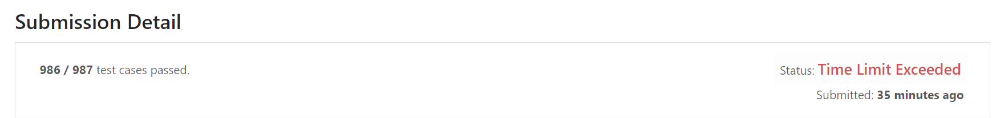
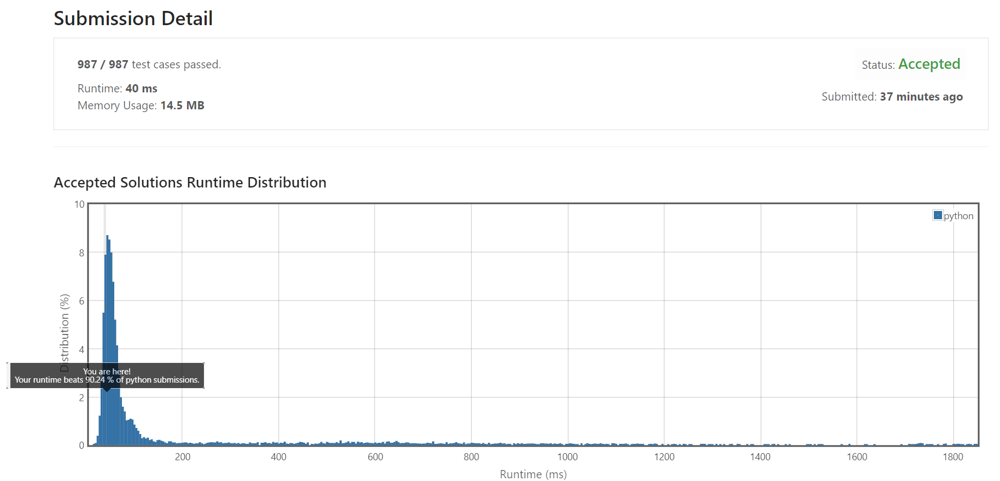
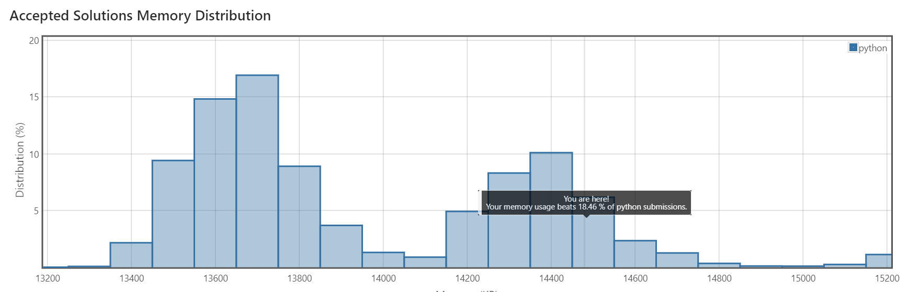

다음 문제로 뭘 풀까 하다가 양심없게도 알고리즘 소모임에서 이번에 진행하는 `LeetCode` 문제를 보고 풀어보기로 했습니다. 오늘 풀어 본 문제는 `반복되는 문자가 없는 가장 긴 부분문자열`이라는 문제인데요. 말 그대로

1. 주어진 문자열의 연속되는 부분 문자열 중
2. 반복되는 문자가 하나도 없는 것들 중
3. 가장 긴 것의 길이는?

이라는 문제였습니다.

# $O(n^2)$ 접근

저는 처음에 이것이 $O(n^2)$ 시간/공간복잡도를 필요로 하는 dynamic programming 문제인줄로만 생각했습니다. 그래서 `dp`라는 이름의 2차원 배열을 만들고, `dp[s][e]`를 채웠습니다. `dp[s][e]`는

- 만약 주어진 문자열에서 `s` 번째에서 시작해서 `e`번째에서 끝나는 부분 문자열이 반복되는 문자가 없을 경우
  - 그 부분 문자열을 값을 가지고
- 반복되는 문자가 있을 경우
  - False를 값으로 가집니다.

이렇게 구성할 경우, `dp[s][e]`의 값을 알아내려면 `dp[s+1][e]`와 `dp[s][e-1]`의 값만 알면 됩니다. 그러므로 `dp[x][x]=str[x]`로 초기화하고 점차 이 배열을 채워나가면서 `문자열 길이 = e-s+1`의 최댓값을 구하면 됩니다.

(실제로는 `dp[s][e]`에는 문자열 전체가 아니라 시작 문자와 끝 문자만 저장되면 됩니다. 그러나 이 알고리즘은 실패한 알고리즘이므로 아이디어만 설명하고 넘어갑니다.)

이 알고리즘은 `dp`배열을 구상하고 채우는 것이 약간 복잡할 뿐, 아이디어만 떠올리면 별로 어렵지 않습니다. 그래서 금방 python으로 코딩한 후, 제출해봤습니다. 아래는 소스코드입니다.

```python
class Solution(object):
    def lengthOfLongestSubstring(self, st):
        """
        :type s: str
        :rtype: int
        """
        l = len(st)
        if l==0:
            return 0
        dp = [[False]*l for _ in range(l)]
        '''
        dp[s][e] = substr[s][e] including s,e
        '''
        for i in range(l):
            dp[i][i] = st[i]
        ml = 1
        for i in range(1,l):
#           i = string length - 1
            trueFlag = False
            for j in range(l-i):
                s = j
                e = s+i
                a = dp[s+1][e]
                b = dp[s][e-1]
                if (a is not False) and (b is not False) and (b[0] is not a[-1]):
                    ml = i+1
                    dp[s][e] = st[s]+st[e]
                    trueFlag = True
                else:
                    dp[s][e] = False
            if not trueFlag:
                return ml
        return ml
```


결과는...



하나가 시간이 부족해서 안 되네요. 맞왜틀을 몇 번 시전하고 난 후, 입력을 자세히 살펴보니 아래와 같은 문자열이 계속 반복되고 있었습니다. (`LeetCode`에서는 친절하게도 실패한 입력이 무엇인지를 알려줬습니다.)

```
abcdefghijklmnopqrstuvwxyzABCDEFGHIJKLMNOPQRSTUVWXYZ0123456789!\"#$%&'()*+,-./:;<=>?@[\\]^_`{|}~
```

그러므로 전체 문자열 길이가 $m$이라 하고, 이 문자열의 길이가 $k$라 하면 길이 $k$미만의 부분 문자열에서는 반복이 절대 나타나지 않습니다. 이 경우, 제 알고리즘에서는 시간복잡도가 $O(2mk-k^2)$이 됩니다. 이는 $m$과 $k$에 대해 단조증가입니다. 그런데 대충 보니 $m$은 문제에서 제시한 최댓값정도인 듯하고, $k$는 가능한 모든 문자를 사용했으므로 또한 최댓값이 됩니다. 그래서 이것이 가능한 입력 중 최악의 입력케이스였습니다.

# $O(n)$ 접근

 근데 한참 고민하다 보니까, 그냥 해결책이 떠올랐습니다. `dp`배열을 저렇게 구상할 게 아니라, 이렇게 하면 어떨까?

```
dp[i]=i번째 문자열을 끝으로 하는 반복되는 문자가 없는 가장 긴 부분문자열의 시작 위치
```

그리고 딕셔너리 `la`를 만들어서, 다음과 같이 정의합니다.

```
la[x]=현재 위치 이전에 문자 x가 나타난 마지막 위치. x가 한 번도 만약 나타나지 않았으면 0.
```

이렇게 하면 다음과 같은 알고리즘을 사용할 수 있습니다.

- 부분문자열의 최대 길이를 `maxLength=0`이라 두자.
- 위치 `i`에서 문자가 `x`라 하자.
- 만약 마지막으로 `x`가 나타난 위치가 `dp[i-1]`보다 작다면, 이는 `dp[i-1]`에서 `i`사이에는 중복된 문자가 하나도 없다는 뜻이다.
  - 그러므로 `dp[i]=dp[i-1]`
- 만약 마지막으로 `x`가 나타난 위치(`la[x]`)가 `dp[i-1]`보다 크다면, 이는 `la[x]+1`과 `i`사이에는 중복된 문자가 하나도 없다는 뜻이다.
  - 그러므로 `dp[i]=la[x]+1`
- `i-dp[i]+1`이 `maxLength`보다 크다면 `maxLength=i-dp[i]+1`.

사실 이 알고리즘을 다시 한 번 살펴보면 `dp`배열에서 오직 `i-1`번째 인덱스에만 접근한다는 것을 알 수 있습니다. 그러므로 `dp`는 굳이 배열로 구성할 필요 없이 그냥 변수 하나로 둬도 무방합니다.

따라서 다음과 같이 코드를 작성해봤습니다. 아래 코드에서 `av`가 `dp`와 같은 의미입니다.

```python
class Solution(object):
    def lengthOfLongestSubstring(self, st):
        l = len(st)
        if l<2:
            return l
        la = {st[0]:0}
        av = 0
        ml = 0
        for i in range(1,l):
            if st[i] in la:
                av = max(av,la[st[i]]+1)
            la[st[i]]=i
            if (i-av)>ml:
                ml = i-av
        return ml+1
```

코드가 훨씬 짧고 간결해졌습니다.



제출 결과, 모든 케이스를 통과했고 상위 10%정도 실행 속도라고 하네요. ㅎㅎ

아래쪽에는 사용한 메모리에서 어느 정도 위치에 있는지를 보여주는데요.



흠... 뭔가 제가 모르는, 메모리를 더 적게 사용하는 방법이 있나 봅니다. 어쨌든 통과했고... 빠르면 된 거 아니겠습니까.ㅎ

메모리도 그래프가 저렇게 생겨서 그렇지, 5%정도밖에 차이가 나지 않습니다. 그런 걸 보니 뭔가 변수 하나 더 쓰고 말고 정도의 차이인가 봅니다.