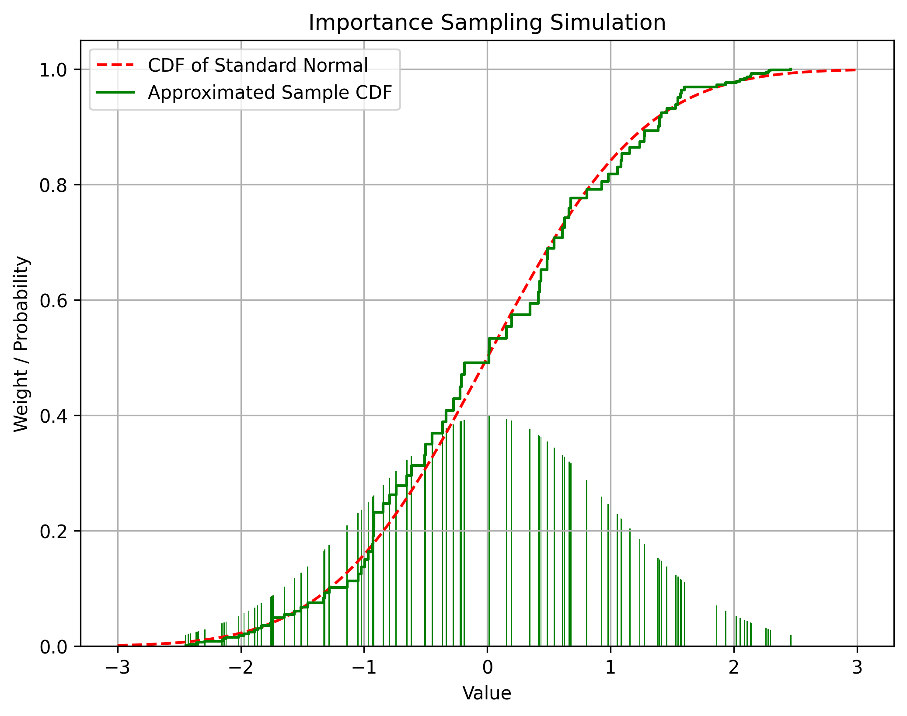

이번에는 미뤄뒀던 파티클 필터를 공부해봤습니다. 이 글의 목적은 파티클 필터의 원리를 누구나 이해할 수 있도록 상세히 설명하는 것입니다.

인터넷을 찾아보면 논문을 포함하여 파티클 필터에 대해 상세히 설명해놓은 글은 수도 없이 많습니다. 그러나 쉽게 설명해놓은 글들은 중요한 개념들을 증명 없이 추상적인 비유로만 설명하고 있습니다. 그렇게 되면 코드로 구현하는 것은 쉬울지라도 그것이 왜 동작하거나 동작하지 않는지, 알고리즘을 변형해도 수학적으로 최적을 보장하는지 알기 어렵습니다.

반대로 논문처럼 내용을 구체적으로 설명한 글들은 대부분 쉬운 부분을 설명하지 않고 넘어갑니다. 그런데 그 쉬운 부분이라는 것이 식의 전개나 인수분해 수준이 아니라 여러가지 복잡한 정리를 적용해야 증명할 수 있어 그 흐름을 이해하기가 어려운 경우가 많았습니다. 더군다나 위키피디아와 논문을 포함한 상당수의 글들은 다양한 표기법들을 설명 없이 사용하고 있어 애초에 식의 올바른 의미를 해석하는 것조차 어렵습니다.

그래서 고등학생 정도의 수학적 지식만 가지고 있는 사람도 이해할 수 있도록, 그러나 추상적인 개념뿐만이 아니라 엄밀한 수학적 증명까지 포함하여 파티클 필터에 대해 설명하고자 합니다.

구체적으로 다음과 같은 배경 지식이 필요합니다.

- 고등학교 수준의 확률론 (조건부 확률, 결합확률, 베이즈 정리)
- 적분의 개념

내용이 길기 때문에 문어체로 정리합니다.

# 필터(Filter)

파티클 필터를 포함한 다양한 필터를 이해하기 위해서는 먼저 필터의 개념을 파악하는 것이 필수적이다. 신호처리 및 제어공학에서 필터란 다양한 신호가 중첩된 신호에서 원하는 신호만을 통과시키는 장치나 그런 수학적인 구조를 뜻한다.

필터가 필요한 이유는 신호에는 필연적으로 잡음이 포함되기 때문이다. 제어나 신호처리의 관점에서는 모든 신호를 원하는 신호와 잡음의 합으로 간주한다. 신호가 손실 없이 전달되는 이상적인 환경에서는 필터가 불필요하겠으나 실제로는 측정의 불확실성을 포함한 여러 원인으로 잡음이 포함되므로 필터가 필요하다.

필터의 동작은 근본적으로 신호의 값을 얻는 과정과 이로부터 참값을 어림하는 과정으로 나뉜다. 이때 신호의 값을 얻는 것을 **측정(measurement)** 또는 **관측(observation)** 이라고 하며, 이로부터 참값을 어림하는 것을 **추정(estimate)** 또는 **예측(prediction)** 이라고 한다.

신호의 특성에 따라 필터는 다양한 방법으로 구현된다. 예를 들어 전자공학에는 주로 신호와 잡음의 주파수가 다르다. 이로부터 원하는 주파수 대역을 제외한 나머지를 감쇄시키는 방법으로 필터를 구현하게 된다. 그 중 가장 기본적인 것은 이동평균이다. 이동평균은 이전의 측정값들의 (가중)평균으로부터 현재 시점의 참값을 추정하는 것으로, 이는 주파수 영역에서는 고주파 신호를 감쇄시키는 것으로 볼 수 있다.

반면 시스템이 복잡하거나 비선형성이 커서 이러한 방법으로는 신호와 잡음을 구분하기 힘든 경우가 있다. 그런 경우 확률론에 기반한 필터를 사용할 수 있다. 확률적 필터는 신호의 단일 참값을 추정하기보다는 신호의 확률분포를 구하는 방식으로 접근한다. 이것은 수학적으로는 아래와 같이 현재 시점까지의 측정값들이 주어질 때 참값의 조건부 확률분포로 표현된다.

$$
p(x_t | z_t, z_{t-1}, \cdots, z_0)
$$

> 확률분포 안에서 콤마 `,`가 사용된 경우 결합확률분포 ($a\cap b$)를 의미한다. 그러므로 위 식은 아래와 같이 해석하면 된다.
>
> $$
> \begin{align*}
> p(x_t | z_t, z_{t-1}, \cdots, z_0) &= p(x_t | z_t \cap z_{t-1} \cap \cdots \cap z_0)\\
> &= p(x_t \cap z_t \cap z_{t-1} \cap \cdots \cap z_0) / p(z_t \cap z_{t-1} \cap \cdots \cap z_0)
> \end{align*}
> $$

# 베이즈 필터(Bayes Filter)

베이즈 필터란 이미 알고 있는 다른 확률분포들을 조합하여 위 확률분포를 표현하는 방법이다. 왜냐하면 위 식은 단순히 '측정값들이 주어질 때 참값의 확률분포'라는 문장을 수학적으로 표현한 것일 뿐이며, 그 확률분포를 계산하는 방법은 전혀 알려주지 않기 때문이다.

베이즈 필터에서는 아래 두 확률분포를 이미 알고 있다고 가정한다.

- $p(z_t | x_t)$: 참값이 주어졌을 때 측정값의 확률분포
- $p(x_t | x_{t-1})$: 이전 참값이 주어졌을 때 참값의 확률분포

이 두 확률분포를 각각 **측정 모델(measurement model)** 과 **시스템 모델(system model)** 이라고 하며 이 두 확률분포를 이용하여 참값의 확률분포를 다음과 같이 재귀적으로 계산할 수 있다.

$$
p(x_t | z_{t-1}, z_{t-2}, \cdots, z_0) = \int p(x_t | x_{t-1}) p(x_{t-1} | z_{t-1}, z_{t-2}, \cdots, z_0) dx_{t-1}
$$

$$
p(x_t | z_t, z_{t-1}, \cdots, z_0) = \frac{p(z_t | x_t) p(x_t | z_{t-1}, z_{t-2}, \cdots, z_0)}{\int p(z_t | x_t) p(x_t | z_{t-1}, z_{t-2}, \cdots, z_0) dx_t}
$$

아래에서는 베이즈 필터를 유도하기 위해 필요한 다른 개념들을 설명하고 이로부터 베이즈 필터를 유도한다.

## 조건부 독립(Conditional Independence)

베이즈 필터의 유도에는 조건부 독립의 개념이 많이 사용되므로 조건부 독립을 이해하는 것이 중요하다. 조건부 독립이란 **어떤 사건 $A$가 주어졌을 때** 사건 $B$와 $C$가 독립이라는 것을 의미한다. 아래는 조건부 독립에 대한 다양한 표현이며, 이는 모두 동치이다.

- $p(B, C|A) = p(B|A)p(C|A)$: $A$가 주어졌을 때 $B$와 $C$의 결합확률분포는 $B$와 $C$의 확률분포의 곱과 같다.
- $p(A \cap B \cap C) = p(A \cap B) p(A \cap C) / P(A)$: 위 식을 조건부 확률의 정의에 따라 전개한 것
- $p(B|A, C) = p(B|A)$: $A$가 주어졌을 때 $B$의 확률분포는 $C$에 영향을 받지 않는다.
- $p(C|A, B) = p(C|A)$: $A$가 주어졌을 때 $C$의 확률분포는 $B$에 영향을 받지 않는다.

이때 중요한 것은 $B$와 $C$가 독립이라는 것은 $A$가 주어졌을 때에만 성립한다는 것이다. 즉, $B$와 $C$가 $A$에 대하여 조건부 독립인 경우 일반적으로 $B$와 $C$는 독립이 아니다.

또한 두 변수 $A, B$가 다른 변수 $C$에 대해 조건부 독립인 경우 다음과 같은 중요한 성질이 성립한다.

$$
p(A | B) = \int p (A |C) p(C|B) dC
$$

이 방정식을 Chapman–Kolmogorov Equation (CKE)라고 한다. 좀 더 정확히는 CKE는 여러 확률변수에 대한 좀 더 일반적인 방정식을 말하는 것이며 위 방정식은 3개의 확률 변수를 다루는 CKE의 특수한 경우라고 할 수 있다.

증명은 다음과 같다.

> $A$와 $B$가 $C$에 대해 조건부 독립이므로
>
> $$
> p(A | C) = p(A | B, C)
> $$
>
> 이것을 위 식에 대입하면
>
> $$
> p(A | B) = \int p(A | B, C) p(C | B) dC
> $$
>
> 우변을 조건부 확률의 정의에 따라 전개하면
>
> $$
> = \int \frac{p(A \cap B \cap C)}{p(B \cap C)} \frac{p(C \cap B)}{p(B)} dC\\
> $$
>
> $$
> = \int \frac{p(A \cap B \cap C)}{p(B)} dC
> $$
>
> 전체 확률의 법칙(law of total probability)에 의해
>
> $$
> = \frac{p(A \cap B)}{p(B)}
> $$
>
> 조건부 확률의 정의에 의해
>
> $$
> = p(A | B)
> $$

## 마르코프 체인(Markov Chain)

어떠한 시스템이 다음과 같은 성질을 만족할 때 이 시스템을 **마르코프 체인**이라고 한다.

$$
p(x_t | x_{t-1}, x_{t-2}, \cdots, x_0) = p(x_t | x_{t-1})
$$

이는 시스템의 현재 상태가 그 직전의 상태에만 의존하고 다른 과거의 상태들에는 의존하지 않는다는 것을 나타낸다. 현실의 물리 현상을 포함한 많은 시스템이 이러한 성질을 만족한다.

마르코프 체인은 조건부 독립의 관점에서 해석할 수 있다. 즉, $x_{t-1}$가 주어졌을 때 $x_t$의 확률분포는 $x_{t-2}, \cdots, x_0$에 대해 조건부 독립이다.

## 은닉 마르코프 체인(Hidden Markov Chain)

그러나 일반적으로는 시스템의 전체 상태를 직접 측정하는 것은 불가능하며 시스템의 일부분을 간접적으로만 측정할 수 있다. 이러한 마르코프 체인을 **은닉 마르코프 체인(hidden Markov chain)** 이라고 한다.

$$
\begin{array}{cccccccccc}
X_{0} & \to & X_{1} & \to & X_{2} & \to & X_{3} & \to & \cdots & \text{signal} \\
\downarrow & & \downarrow & & \downarrow & & \downarrow & & \cdots & \\
Z_{0} & & Z_{1} & & Z_{2} & & Z_{3} & & \cdots & \text{observation}
\end{array}
$$

위 도식에서 화살표 $X$는 상태이며 직접 측정이 불가능하다. $Z$는 측정을 통해 얻어진 관측값이다. 화살표 $A\to B$는 확률변수 $B$가 오직 $A$에만 의존한다는 것을 나타낸다. 이는 $A$가 아닌 임의의 확률변수 $C$에 대하여 $B$와 $C$는 $A$에 대한 조건부 독립이 된다는 의미로도 해석할 수 있다.

## 베이즈 정리(Bayes' theorem)

베이즈 정리란 조건부 확률에 대하여 아래 관계가 성립한다는 것을 말한다.

$$
p(A|B) = \frac{p(B|A)p(A)}{p(B)}
$$

베이즈 정리는 다음과 같은 두 가지 방법으로 해석할 수 있다.

- 역확률 문제: $P(B|A)$가 주어졌을 때 $P(A|B)$를 구하는 것
  - 예) 병에 걸렸을 때 양성반응을 보이는 확률이 주어졌을 때, 반대로 양성반응을 보였을 때 병에 걸려있을 확률을 구하는 것
- 사후 확률 추정: 사전확률 $P(A)$를 측정값 $B$를 통해 더 정확한 확률로 업데이트하는 것
  - 예) 일반적으로 어떤 병에 걸릴 확률을 알고 있었는데 검사 결과를 새롭게 알게 되었을 때 병에 걸릴 확률을 다시 계산하는 것

베이즈 필터는 사후확률 추정의 관점에서 베이즈 정리를 사용한다. 즉, 기존에 알고 있던 확률분포에 측정값을 반영해 더 정확한 확률분포로 업데이트하는 것을 반복한다.

## 베이즈 필터의 유도

구하고자 하는 확률분포를 다시 상기해보면 다음과 같다.

$$
p(x_t | z_t, z_{t-1}, \cdots, z_0)
$$

이것을 계산하기 위해 아래와 같은 두 확률분포를 알고 있다고 가정한다.

- $p(x_t | x_{t-1})$: 시스템 모델
- $p(z_t | x_t)$: 측정 모델

이로부터 다음과 같이 베이즈 정리를 적용하여 베이즈 필터를 유도한다.

먼저 구하고자 하는 식에 그대로 베이즈 정리를 적용하면

$$
p(x_t | z_t, z_{t-1}, \cdots, z_0) = \frac{p(z_t, z_{t-1}, \cdots, z_0 | x_t) p(x_t)}{p(z_t, z_{t-1}, \cdots, z_0)}
$$

이때 $z_t$는 은닉 마르코프 체인의 가정에 따라 오직 $x_t$에만 의존하므로 $x_t$가 아닌 임의의 확률변수 $k$에 대해 조건부 독립이다. 즉, 다음이 성립한다.

$$
\forall k \neq x_t, p(z_t, k | x_t) = p(z_t | x_t) p(k | x_t)
$$

이로부터 $k=z_{t-1}, z_{t-2}, \cdots, z_0$로 두면

$$
p(z_t, z_{t-1}, \cdots, z_0 | x_t) = p(z_t | x_t) p(z_{t-1}, z_{t-2}, \cdots, z_0 | x_t)
$$

이것을 다시 베이즈 정리에 적용하면

$$
= \frac{p(z_t | x_t) p(z_{t-1}, z_{t-2}, \cdots, z_0 | x_t) p(x_t)}{p(z_t, z_{t-1}, \cdots, z_0)}
$$

그런데 조건부 확률의 정의에 따라 $p(z_{t-1}, z_{t-2}, \cdots, z_0 | x_t) p(x_t) = p(z_{t-1}, z_{t-2}, \cdots, z_0, x_t)$이므로

$$
= \frac{p(z_t | x_t) p(z_{t-1}, z_{t-2}, \cdots, z_0, x_t)}{p(z_t, z_{t-1}, \cdots, z_0)}
$$

분모와 분자를 각각 $p(z_{t-1}, z_{t-2}, \cdots, z_0)$으로 나누면

$$
= \frac{p(z_t | x_t) p(x_t | z_{t-1}, z_{t-2}, \cdots, z_0)}{p(z_t | z_{t-1}, z_{t-2}, \cdots, z_0)}
$$

이때 분모 $p(z_t | z_{t-1}, z_{t-2}, \cdots, z_0)$은 앞서 조건부 독립 섹션에서 다뤘던 CKE에 의해 다음과 같이 분해된다.

$$
p(z_t | z_{t-1}, z_{t-2}, \cdots, z_0) = \int p(z_t | x_t) p(x_t | z_{t-1}, z_{t-2}, \cdots, z_0) dx_t
$$

이것을 다시 식에 대입하면 다음을 얻는다.

$$
p(x_t | z_t, z_{t-1}, \cdots, z_0) = \frac{p(z_t | x_t) p(x_t | z_{t-1}, z_{t-2}, \cdots, z_0)}{\int p(z_t | x_t) p(x_t | z_{t-1}, z_{t-2}, \cdots, z_0) dx_t}
$$

이 식에서 알지 못하는 부분은 $p(x_t | z_{t-1}, z_{t-2}, \cdots, z_0)$이다. 이때 마르코프 모델의 가정에 따라 $x_t$는 오직 $x_{t-1}$에만 의존하므로 $x_t$는 $z_{t-1}, z_{t-2}, \cdots, z_0$과 조건부 독립이다. 따라서 마찬가지로 CKE에 의하여 다음과 같이 분해된다.

$$
p(x_t | z_{t-1}, z_{t-2}, \cdots, z_0) = \int p(x_t | x_{t-1}) p(x_{t-1} | z_{t-1}, z_{t-2}, \cdots, z_0) dx_{t-1}
$$

이때 이 식에서 모르는 부분인 $p(x_{t-1} | z_{t-1}, z_{t-2}, \cdots, z_0)$은 원래 구하고자 했던 식 $p(x_t | z_t, z_{t-1}, \cdots, z_0)$에서 첨자만 하나 줄어든 형태이다. 이로부터 다음과 같은 재귀적인 추정을 수행할 수 있다.

1. $p(x_{t-1} | z_{t-1}, z_{t-2}, \cdots, z_0)$를 알고 있다고 가정한다.
1. 이로부터 $p(x_t | z_{t-1}, z_{t-2}, \cdots, z_0)$를 계산한다. 이것은 $t-1$ 시점까지의 정보를 바탕으로 $t$ 시점의 참값의 확률분포를 계산하는 것이므로 이 과정을 **추정** 또는 **예측** (prediction)이라고 한다.
1. 이로부터 $p(x_t | z_t, z_{t-1}, \cdots, z_0)$를 계산한다. 이것은 추정값에 새로운 측정값을 반영하여 참값의 확률분포를 재계산하는 것이므로 이 과정을 **업데이트** (update)라고 한다.

처음 계산을 시작할 때는 초기 추정값 $p(x_0)$이 필요하다. $p(x_0)$은 아무런 정보도 없는 경우의 확률분포이므로 균등확률분포나 정규분포 등을 사용할 수 있으며 더 정밀한 초기 추정값을 사용할수록 이후 추정이 정확해진다.

위와 같이 참값의 확률분포를 추정하는 방식을 **베이즈 필터**라고 하며, 모든 확률적 필터링의 이론적 기반이 된다.

그런데 베이즈 필터는 예측 과정에서 적분을 수행해야 한다. 그런데 비선형이거나 수치적으로 정의된 함수의 적분은 매우 어렵거나 때로는 불가능한 경우가 많다. 또한 식이 재귀적이기 때문에 적분 역시 재귀적으로 수행하게 된다. 따라서 일반적으로는 베이즈 필터를 곧바로 현실의 문제에 적용할 수 없으며, 이를 근사하는 다양한 방법들이 제시되었다.

**칼만 필터**는 베이즈 필터의 시스템 모델이 선형이라고 가정하고, 측정 모델에서 측정 오차가 정규분포라고 가정하여 적분을 해석적으로 풀 수 있도록 근사한 것이다. 현실에서 오차는 실제로 정규분포를 따르는 경우가 많고 시스템이 선형적인 경우도 많아 이를 많이 사용한다.

이 글에서 다룰 **파티클 필터**는 몬테 카를로 샘플링을 이용하여 베이즈 필터를 근사하는 방법이다.

# 파티클 필터(Particle Filter)

앞서 베이즈 필터는 다음과 같은 두 단계의 반복으로 참값의 확률분포를 추정한다고 하였다.

- 예측
  $$p(x_t | z_{t-1}, z_{t-2}, \cdots, z_0) = \int p(x_t | x_{t-1}) p(x_{t-1} | z_{t-1}, z_{t-2}, \cdots, z_0) dx_{t-1}$$
- 업데이트
  $$p(x_t | z_t, z_{t-1}, \cdots, z_0) = \frac{p(z_t | x_t) p(x_t | z_{t-1}, z_{t-2}, \cdots, z_0)}{\int p(z_t | x_t) p(x_t | z_{t-1}, z_{t-2}, \cdots, z_0) dx_t}$$

그런데 일반적으로 시스템은 2차원 이상의 벡터이며 시스템 모델은 행렬방정식으로 주어진다. 그러므로 예측 단계의 적분은 고차원에서의 다중 적분이 되며 적분 영역도 대단히 복잡해질 수 있다.

## 경험적 분포 함수(Empirical Distribution Function)

이런 경우 경험적 분포 함수(empirical distribution function)를 이용하여 적분을 근사할 수 있다. 경험적 분포 함수는 어떤 확률분포함수의 값을 직접 구하기는 어렵지만 샘플링하는 것은 쉬운 경우 그 측정값들을 샘플링하여 이를 통해 확률분포를 근사하는 방법이다. 이때 샘플의 개수가 충분히 많아지면 샘플들의 분포는 원래 확률분포에 수렴하게 된다. 이를 수학적으로는 아래와 같이 표현할 수 있다.

$$
\hat p(x) := \frac{1}{n} \sum_{i=1}^n \delta(x - x_i) \approx p(x)
$$

이때 $x_i$는 확률분포 $p(x)$로부터 샘플링한 값이고 $\delta(x - x_i)$는 Dirac-delta 함수로 $\delta(0) = \infty$이고 $\delta(x) = 0$ ($x \neq 0$)이다. Dirac-delta 함수의 적분은 1이 된다.

또는 누적분포함수의 형태로 표현할 수도 있다.

$$
\hat F(x) = \frac{1}{n} \sum_{i=1}^n \bold{1}_{x_i \leq x}\approx F(x)
$$

이때 $\bold{1}_{x_i \leq x}$는 $x_i \leq x$일 때 1, 그렇지 않으면 0인 함수이다.

아래는 정규분포로부터 샘플링한 샘플들로 경험적 분포함수를 계산한 것이다.

## 중요도 샘플링(Importance Sampling)

그런데 경험적 분포함수를 실제 현실에서의 실험이 아니라 시뮬레이션을 통해 구하기 위해서는 원래 확률분포를 알고 있어야 한다는 문제가 있다. 즉, 확률분포를 구하기 위해서 경험적 샘플링을 사용하려고 했는데 그러려면 원래 확률분포를 알고 있어야 된다는 역설적인 문제가 발생한다.

이때 원래 확률분포에서 샘플링이 불가능하더라도 중요도 샘플링(importance sampling)을 사용하면 샘플링을 통해 확률분포를 근사할 수 있다. 중요도 샘플링은 다음과 같이 확률분포 $p(x)$를 알지 못하더라도 다른 확률분포 $q(x)$로부터 샘플링하여 이를 이용하여 $p(x)$의 기대값을 근사하는 방법이다.

$$
E_p[f(x)] = \int f(x) p(x) dx = \int f(x) \frac{p(x)}{q(x)} q(x) dx \approx \frac{1}{n} \sum_{i=1}^n f(x_i) \frac{p(x_i)}{q(x_i)}
$$

아래는 균등확률분포로부터 중요도 샘플링을 사용하여 정규분포의 누적확률밀도함수를 근사한 것이다.

이때 샘플링을 수행하는 확률분포 $q(x)$를 중요도 분포(importance distribution) 또는 제안 분포(proposal distribution)라고 한다. 제안 분포는 원래 분포의 확률밀도가 0보다 큰 곳에서 0이 아닌 값을 가지는 임의의 확률분포를 선택할 수 있으나, 원래 분포화 유사할수록 근사의 정확도가 높아진다. 제안 분포는 일반적으로 샘플링하기 쉬운 정규분포나 균등분포 등을 사용한다.

다만 중요도 샘플링의 결과로 얻어진 확률분포는 그 평균은 원래 확률분포에 수렴하지만 그 분산은 원래 확률분포와 다르다는 것을 유의해야 한다.

## 순차 중요도 샘플링(Sequential Importance Sampling)

파티클 필터는 앞서 언급한 것처럼 중요도 샘플링을 사용하여 베이즈 필터를 근사한다. 이것을 순차 중요도 샘플링 (Sequential Importance Sampling; SIS)라고 한다. SIS의 증명은 약간 복잡하다. 먼저 각 입자가 시간이 흐름에 따라 특정한 확률분포를 따라 움직일 때, 그 궤적 자체의 확률분포를 구한 후 그것이 또한 입자의 확률분포와 같음을 보일 것이다.

> 일반적으로 다른 글들을 보면 이 계산에서는 제안 확률분포를 전부 $q$라는 하나의 기호로 표기한다. 그러나 이 글에서는 혼동을 피하기 위해 서로 다른 확률분포에는 서로 다른 기호를 할당할 것이다. 기호 $p$는 일반적으로 어떤 확률변수의 확률분포를 나타내는 것이며, 그 외 다른 기호들은 특정한 확률분포를 나타내는 것이다. 이들을 혼동해서는 안 된다.

### 입자 궤적의 확률분포

먼저 초기 확률분포 $q_0(x)$로부터 $n$개의 샘플 $x_0^{(1)}, x_0^{(2)}, \cdots, x_0^{(n)}$을 추출한다. 자명히 $p(x_0) = q_0(x)$이다.

> 각 입자 $x_0^{(i)}$가 시간의 흐름에 따라 $r_t^{(i)}(x^{(i)}_{t+1})$라는 확률분포를 따라 이동한다고 하자. 이때 입자가 그 다음 순간에 있을 위치는 일반적으로 그 이전 순간에 있었던 위치에 의존한다. 그러므로 명시적으로 표시되지는 않았지만 $r_t^{(i)}(x^{(i)}_{t+1})$는 일반적으로 $x^{(i)}_t$에 종속이다.

그렇다면 각 입자 $x^{(i)}$에 대하여, 입자가 처음에 $x_0^{(i)}$에 있고, 그 다음 순간에는 $x_1^{(i)}$에 있을 확률은 다음과 같다.

$$
p(x_1^{(i)}, x_0^{(i)}) = q_0(x_0^{(i)}) r_0^{(i)}(x_1^{(i)})
$$

확장하면, 각 입자가 시간에 따라 궤적 $x_0^{(i)}, x_1^{(i)}, \cdots, x_t^{(i)}$를 따라 움직일 확률은 다음과 같다.

$$
p(x_t^{(i)}, x_{t-1}^{(i)}, \cdots, x_0^{(i)}) = q_0(x_0^{(i)}) r_0^{(i)}(x_1^{(i)}) r_1^{(i)}(x_2^{(i)}) \cdots r_{t-1}^{(i)}(x_t^{(i)})
$$

이때 시간 $t$에서 입자 궤적의 확률분포를 $q_t$라고 하자. 그러면 $q_t$는 다음과 같이 표현된다.

$$
q_t(x_0^{(i)}, x_1^{(i)}, \cdots, x_t^{(i)}) = q_0(x_0^{(i)}) r_0^{(i)}(x_1^{(i)}) r_1^{(i)}(x_2^{(i)}) \cdots r_{t-1}^{(i)}(x_t^{(i)})
$$

이것을 점화식 형태로 표현하면 다음과 같다.

$$
q_t(x_0^{(i)}, x_1^{(i)}, \cdots, x_t^{(i)}) = q_{t-1}(x_0^{(i)}, x_1^{(i)}, \cdots, x_{t-1}^{(i)}) r_{t-1}^{(i)}(x_t^{(i)})
\tag{1}
$$

이것이 각 입자가 시간에 따라 특정한 궤적을 따라 움직일 확률분포다.

### 상태 궤적의 확률분포

다음으로 우리가 얻고자 하는, 원래 상태의 확률분포는 다음과 같다.

$$
p(x_0, x_1, \cdots, x_t | z_0, z_1, \cdots, z_t)
$$

이것은 앞에서 다뤘던 확률분포들과는 약간 다르다. 앞에서는 현재 시점까지의 관측값들이 주어졌을 때 현재 상태의 확률분포를 다뤘다. 그러나 이것은 현재 시점까지의 관측값들이 주어졌을 때 이전 시점 상태들의 확률분포를 모두 포함한다.

이때 적절한 가중치 $w_t^{(i)}$가 있어서 중요도 샘플링의 원리에 따라 입자의 확률분포가 구하고자 하는 확률분포를 근사한다고 가정하자. 즉, 아래 조건을 만족한다고 하자.

$$
p(x_0, x_1, \cdots, x_t | z_0, z_1, \cdots, z_t) \approx \sum_{i=1}^n w_t^{(i)} \delta(x_0, x_1, \cdots, x_t - x_0^{(i)}, x_1^{(i)}, \cdots, x_t^{(i)})
$$

우리가 얻고자 하는 것은 이 $w_t^{(i)}$를 구하는 것이다. 중요도 샘플링에 따르면 $w_t^{(i)}$는 다음과 같아야 한다.

$$
w_t^{(i)} = \frac{p(x_0^{(i)}, x_1^{(i)}, \cdots, x_t^{(i)} | z_0, z_1, \cdots, z_t)}{q_t(x_0^{(i)}, x_1^{(i)}, \cdots, x_t^{(i)})}
$$

식이 길어지기 때문에 앞으로는 $x_0^{(i)}, x_1^{(i)}, \cdots, x_t^{(i)}$를 간단히 $x_{0:t}^{(i)}$로 표기하겠다. 이 표기법을 사용하면 위 식은 다음과 같이 간단히 표현된다.

$$
w_t^{(i)} = \frac{p(x_{0:t}^{(i)} | z_{0:t})}{q_t(x_{0:t}^{(i)})}
\tag{2}
$$

이제 우변의 분자를 베이즈 정리를 사용하여 분해할 것이다. 먼저 이 식을 조건부 확률의 정의에 따라 그대로 전개하면

$$
p(x_{0:t}^{(i)} | z_{0:t}) = \frac{p(x_{0:t}^{(i)}, z_{0:t})}{p(z_{0:t})}
$$

조건부 확률의 정의에 따라 $z_{t}$만을 따로 빼내면

$$
= \frac{p(z_t | x_{0:t}^{(i)}, z_{0:t-1}) p(x_{0:t}^{(i)}, z_{0:t-1})}{p(z_{0:t})}
$$

다시 조건부 확률의 정의에 따라 $x_{t}^{(i)}$만을 따로 빼내면

$$
= \frac{p(z_t | x_{0:t}^{(i)}, z_{0:t-1}) p(x_{t}^{(i)} | x_{0:t-1}^{(i)}, z_{0:t-1}) p(x_{0:t-1}^{(i)}, z_{0:t-1})}{p(z_{0:t})}
$$

분모와 분자를 모두 $p(z_{0:t-1})$로 나누면

$$
= \frac{p(z_t | x_{0:t}^{(i)}, z_{0:t-1}) p(x_{t}^{(i)} | x_{0:t-1}^{(i)}, z_{0:t-1}) p(x_{0:t-1}^{(i)}, z_{0:t-1}) / p(z_{0:t-1})}{p(z_{0:t}) / p(z_{0:t-1})}
$$

조건부 확률의 정의에 따라

$$
= \frac{p(z_t | x_{0:t}^{(i)}, z_{0:t-1}) p(x_{t}^{(i)} | x_{0:t-1}^{(i)}, z_{0:t-1}) p(x_{0:t-1}^{(i)} | z_{0:t-1})}{p(z_t | z_{0:t-1})}
$$

이때 이 식의 분모는 상수이므로 생략할 수 있다. 지금 구하는 것은 $w_t^{(i)}$의 분자인데, $\sum_{i=1}^n w_t^{(i)} = 1$이므로 각 $w_t^{(i)}$의 상대적인 크기만 중요하기 때문이다. 그러므로

$$
p(x_{0:t}^{(i)} | z_{0:t}) \propto p(z_t | x_{0:t}^{(i)}, z_{0:t-1}) p(x_{t}^{(i)} | x_{0:t-1}^{(i)}, z_{0:t-1}) p(x_{0:t-1}^{(i)} | z_{0:t-1})
$$

여기서 마르코프 체인 가정에 따라 무시할 수 있는 변수들을 소거하면 다음과 같은 결론을 얻는다.

$$
p(x_{0:t}^{(i)} | z_{0:t}) \propto p(z_t | x_{t}^{(i)}) p(x_{t}^{(i)} | x_{t-1}^{(i)}) p(x_{0:t-1}^{(i)} | z_{0:t-1})
\tag{3}
$$

이것이 관측값들이 주어졌을 때 상태가 특정한 궤적을 따를 확률분포다.

### 중요도 업데이트

다음으로 이를 통하여 중요도 업데이트 식을 유도한다. 식 (3)을 식 (2)에 대입하면

$$
w_t^{(i)} \propto \frac{p(z_t | x_{t}^{(i)}) p(x_{t}^{(i)} | x_{t-1}^{(i)}) p(x_{0:t-1}^{(i)} | z_{0:t-1})}{q_t(x_{0:t}^{(i)})}
\tag{4}
$$

식 (4)에 식 (1)을 대입하면

$$
w_t^{(i)} \propto \frac{p(z_t | x_{t}^{(i)}) p(x_{t}^{(i)} | x_{t-1}^{(i)}) p(x_{0:t-1}^{(i)} | z_{0:t-1})}{q_{t-1}(x_{0:t-1}^{(i)}) r_{t-1}^{(i)}(x_t^{(i)})}
$$

$t-1$시간의 항을 묶어내면

$$
w_t^{(i)} \propto  \frac{p(z_t | x_{t}^{(i)}) p(x_{t}^{(i)} | x_{t-1}^{(i)})}{r_{t-1}^{(i)}(x_t^{(i)})}\frac{p(x_{0:t-1}^{(i)} | z_{0:t-1})}{q_{t-1}(x_{0:t-1}^{(i)})}
$$

$w_t^{(i)}$의 정의에 따라

$$
w_t^{(i)} \propto \frac{p(z_t | x_{t}^{(i)}) p(x_{t}^{(i)} | x_{t-1}^{(i)})}{r_{t-1}^{(i)}(x_t^{(i)})} w_{t-1}^{(i)}
$$

이것이 파티클 필터의 가장 기초적인 업데이트 공식이며, 이것을 Sequential Importance Sampling(SIS)라고 한다.

이때 $r_t^{(i)}(x_t^{(i)})$를 적절히 $p(x_t^{(i)} | x_{t-1}^{(i)})$로 선택하면 식이 다음과 같이 간단해진다.

$$
w_t^{(i)} \propto p(z_t | x_{t}^{(i)}) w_{t-1}^{(i)}
$$
