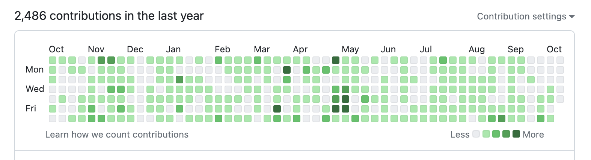

> Translated with the help of ChatGPT and Google Translator

I felt the 18 months spent in military service were too precious to waste. It felt like my growth had halted during a period when I should have been continuously studying and growing, due to military service. Perhaps because I joined the army relatively late, many of my friends who had already been discharged were actively pursuing their growth, which made me feel this way even more strongly. Therefore, I decided not to waste the 18 months in the army. I had prepared a lot before enlistment and continued various endeavors as planned after enlistment.

> For foreign readers, the military service in South Korea is mandatory for all male citizens. The duration of the service is 18 months.

This article summarizes my study experiences over 18 months. Through this article, I aim to record what I studied and hope it can be of some help to those who will join the army later than I did.

# Server Setup

I believe that to study any field, you must actually do it. Just as a person learning piano won't improve by only reading sheet music or textbooks without actually playing the piano, a programmer won't improve without actually working on applications or infrastructure. Therefore, setting up an environment where I could develop and deploy services in the army was a very important goal for me.

As a preparatory step before enlistment, I set up a server at home. Having a server available 24/7 makes a big difference compared to using something like cloud IDEs. As mentioned earlier, if you have a development environment set up on a server, you can access and develop from anywhere. I mainly used VSCode with the SSH extension to connect to the server for development. Moreover, for developers, a server is not only a place where files can be stored securely but also a test bed where implemented services can be uploaded without cost concerns.

- Hardware details can be found [in this article](https://unknownpgr.com/posts/unboxing-pc).
- It is connected through a domain via AWS Route53.
- This domain is equipped with [a custom-built DDNS](https://github.com/unknownpgr/route53-ddns) to respond to IP changes.
- K3S is installed to allow various services to be deployed.
- Guacamole has been uploaded to this server to connect to other machines.
- In case of emergency, [Code Server](https://code.visualstudio.com/docs/remote/vscode-server) is uploaded on Kubernetes.

Especially in the army's cyber information room, you cannot install programs at will, and ports other than 80 or 443 are mostly blocked. Therefore, it is important to set up a development environment that can be accessed even in such situations in advance.

> For foreign readers, the 'cyber information room' is the only place where soldiers can use computers connected to the internet. It is a place where soldiers can use the internet, but it is heavily restricted.

# Development Environment Setup

After enlisting, I chose an EC2 Windows Server Instance as my primary development environment. Before enlistment, I planned to use the server I had set up or leave a MacBook at home to connect via VNC. However, for the following reasons, I decided to set up a new environment:

- I needed a GUI for versatility. There were many cases, such as MATLAB or image processing, where a GUI was necessary.
- Comparing VNC and RDP available in Windows, RDP is much faster.
- I specifically chose Windows Server because it was the only Windows image providing a desktop environment.
- I created an [EC2 Controller](https://github.com/unknownpgr/ec2-webui) to turn on this server only when needed.

# What I Actually Did

In the army, I mainly worked on tasks that could take a long time. For example, I carried out a comprehensive refactoring of the products I had made. It could be difficult to do such refactoring in civilian life because it takes a long time. However, military life never seems to end, so I could refactor comfortably.

I realized that there was a lot of idle time in the army when I wasn't doing anything. So, I chose a study method that could efficiently use this time. Especially, I read books whenever I had a chance.

- Below are some computer-related books that had a significant impact on me while in the army:
  - Understanding the Linux Kernel (3rd)
  - TCP/IP Illustrated Volume 1
  - Clean Architecture
  - The Data Science Design Manual
  - Basic Electromagnetism (a textbook for my major)
- I also read various non-computer-related general knowledge books:
  - The 100-Year-Old Man Who Climbed Out the Window and Disappeared
  - Literacy for Citizens (kr: 시민의 교양)
  - The New Poverty (kr: 새로운 가난이 온다)
  - To Kill a Mockingbird
  - Sapiens
  - Mankiw's Principles of Economics
  - The Concert of Management (kr: 경영학 콘서트)

Whenever I felt bored, I revisited various mathematical and engineering concepts.

- I revisited circuit analysis based on impedance in electronic circuits.
- I went through proofs of various concepts in linear algebra again.
- Through contemplation of statistics and probability, I gained various insights into statistics.
  - The sensor algorithm based on Bayes' theorem that I developed previously was also an extension of such studies.

I also worked on various projects.

- I created a tunneling server that could access an HTTP server within a private network.
- Participating in the Army Startup Competition, I developed a service that automatically analyzes real estate registration to prevent lease fraud.

# Conclusion

Checking the computer usage logs in the cyber information room, I found that I had spent over 950 hours. The title of this article, 950 hours, reflects that. Initially, I used someone else's account but created my own later, so the actual time spent is likely over 1000 hours.

From this, I believe I was able to continue developing without wasting 18 months. I hope others can also use their time in the army efficiently and not waste it.

# Postscript

I wanted to get the computer usage logs from the cyber information room. However, the management program did not allow copying text or have an export function. After struggling for a while, I ended up using Wireshark to capture the TCP stream. Fortunately or unfortunately, the data was transmitted in plaintext, so I was able to save the data and write a parsing script to find out the total usage time.
