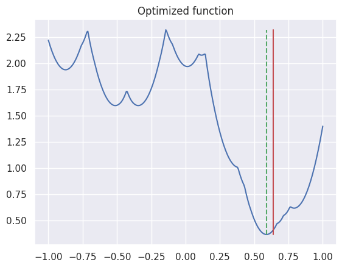

> Translated with the help of ChatGPT and Google Translator

A line sensor is a sensor used in a line tracer type robot. It is used to estimate the position of a line relative to the center of the sensor so that the robot can follow the line.

Line sensors can be implemented in various forms. Here, we deal with an algorithm that estimates the position of the line when using multiple Infrared (IR) sensors in a row, as shown in the example below.

```
IR0---IR1---IR2---IR3---IR4---IR5---IR6---IR7
```

Before discussion, let's define the position of IR0 as -1 and the position of IR7 as 1 for each IR sensor's position $x_n$. That is, let's say $x_n=2n/7-1$.

## Existing algorithm

The robot club I work in, [Zetin] (https://zetin.uos.ac.kr), estimated the position of the line using a weighted average as shown below.

Regarding the sensor value $v_n$, let's say that the sensor value is 0 when it detects a black background with nothing, and that the value is 1 when the sensor goes exactly above the white line. The value of the sensor located at the border of the line is between 0 and 1.

At this time, previously, the position of the line was estimated by giving weight to the sensor value as follows.

$$
\hat{x} = \frac{\sum_{n=0}^7 x_nv_n}{\sum_{n=0}^7 v_n}
$$

Although this method is very simple, it can lead to greatly incorrect estimates of line position if noise is included. To improve this, I implemented an algorithm to estimate line position using Bayes' theorem.

## Bayes' theorem

Bayes' theorem is as follows.

$$
P(A|B) = \frac{P(B|A)P(A)}{P(B)}
$$

In this equation

- $P(A)$ is the prior probability,
- $P(A|B)$ is the posterior probability,
- Likelihood of $P(B|A)$,
- $P(B)$ is called evidence.

At this time, if $P(B)$ is an event that depends on $P(A)$, it is organized as follows using the law of overall probability.

$$
P(A|B) = \frac{P(B|A)P(A)}{\sum_{A}P(B|A)P(A)}
$$

If the distribution is a continuous probability distribution, it is expressed as follows.

$$
P(A|B) = \frac{P(B|A)P(A)}{\int_{A}P(B|A)P(A)dA}
$$

## Line estimation using Bayes’ theorem

What we want to know is the position $p$ of the line given the values $\vec v= (v_0, v_1, \cdots, v_7)$ of the 8 sensors. To do this, we will obtain the probability density function for the line position $p$ and select the $p$ value with the highest value. Since this probability density estimates the distribution of sensor positions given sensor values, it is expressed as the conditional probability $P(p|\vec v)$. However, since we do not know this conditional probability, we will obtain this probability distribution using Bayes' theorem of continuous probability distribution summarized earlier as shown below.

$$
P(p|\vec v) = \frac{P(\vec v|p)P(p)}{\int_{p}P(\vec v|p)P(p)dp}
$$

In this equation, in order to determine the prior probability $P(p)$, the distribution of sensor values must be measured. Since the line-following robot follows the line position to 0, the actual sensor value will have a distribution centered on 0. However, here, for general purpose, let us assume a uniform distribution in an appropriate range instead of this assumption. In this case, this range can be slightly larger than $[-1,1]$, because the sensor can detect the line even if the line is slightly outside the outermost sensor. (This is also a difference from the existing algorithm. In the existing algorithm, the position of the line is always within $[-1,1]$.)

That is, within that range, $P(p)=k$. Accordingly, the equation is transformed as follows.

$$
P(p|\vec v) = \frac{P(\vec v|p)}{\int_{p}P(\vec v|p)dp}
$$

From this, you can immediately estimate the probability distribution by simply finding $P(\vec v|p)$. And since the denominator of the above equation is a constant, finding $p$ that maximizes the above equation is the same as finding $p$ that maximizes $P(\vec v|p)$.

As mentioned above, in Bayes' theorem, $P(\vec v|p)$ is called likelihood. Therefore, this method is called **Maximum Likelihood Estimation (MLE)**.

> However, the maximum likelihood method usually assumes that random variables are sampled from the same probability distribution. However, in this case, the probability distribution of values is different depending on the sensor location, so it is different from the general maximum likelihood method. However, since estimating the parameter - in this case the line position - is fundamentally the same as maximizing the likelihood, it would be safe to call this approach the maximum likelihood method.)

To find this, we will obtain the probability distribution of the sensor value according to the distance between the line and the sensor for one sensor, and then expand this to the probability distribution for the sensor value vector.

First, let's denote the probability distribution that the sensor value is $v$ for a sensor $d$ away, that is, the probability density function, as $f_d(v)$. At this time, the reason why it appears as a probability distribution rather than a single value is due to noise. Let us assume that these noises are independent of each other. (In reality, there are noise sources (external light, etc.) that have a similar effect on all sensors, so they will not be independent, but it is safe to assume that they are independent.) Then, the probability distribution $P(\vec v|p)$ for the sensor value vector. is expressed as follows:

$$
P(\vec v|p) = \prod_{n} f_{|x_n-p|}(v_n)\\
$$

in other words,

1. When the position of the line is given
2. From this, the probability density function of each sensor value expected is
3. Probability density obtained by inputting actual sensor values
4. Expressed as a product.

To check whether this is the correct probability distribution, check whether the integral is 1. According to Pubini's theorem, it can be shown that it becomes 1 as follows.

$$
\begin{align}
\int_v P(\vec v|p)dv
&=\int_{v_1}\int_{v_2}\cdots\int_{v_n}\prod_{n} f_{|x_n-p|}(v_n)dv_1dv_2\cdots dv_n \\
&= \prod_{n} \int_{v_n} f_{|x_n-p|}(v_n)dv_n\\
&= \prod_{n} 1\\
&=1
\end{align}
$$

> Pubini's theorem is the theorem that in Riemann integral, if $f(x,y)$ is continuous for a square area $R$, the equation below holds true.
>
> $$
> \int_R f(x,y)dA = \int_a^b\int_c^d f(x,y)dxdy
> $$
>
> From this, if $f(x,y)$ is expressed as the product of two functions $f_1(x)f_2(y)$, the equation below is established.
> $$\int_R f(x,y)dA = \int_a^b\int_c^d f_1(x)f_2(y)dxdy = \int_a^b f_1(x)dx\int_c^d f_2(y)dy$$
> This can be easily extended to higher dimensions.

Therefore, if you substitute the obtained $P(\vec v|p)$ into the above equation, it is organized as follows.

$$
P(p|\vec v) = \frac{\prod_{n} f(v_n, |x_n-p|)}{\int_{p}\prod_{n} f(v_n, |x_n-p|)dp }
$$

From this, what we want to know is $p$ that maximizes this value. At this time, the denominator of this equation is a constant, so maximizing it is the same as maximizing the numerator. Therefore, it is organized as follows.

$$
\hat{p} = \arg\max_p \prod_{n} f(v_n, |x_n-p|)
$$

The above equation is obtained by multiplying the probability density function several times, so the number may be very large or small. Therefore, log transformation is performed and summarized as follows.

$$
\hat{p} = \arg\max_p \sum_{n} \log f(v_n, |x_n-p|)
$$

## Experiment

We implemented this in Python and experimented with it. For the experiment, the probability density function of the sensor value according to distance was defined as follows.

$$
v\sim\mathcal{N}(\mu, 0.1)\\
\mu=\max(1-3|d|,0)
$$

If the actual line position is set to 0.64, the sensor value is measured as follows.


However, since real sensors inevitably contain noise, normal distribution noise was added.


From this, the line position can be estimated as follows.


- The red solid line indicates the actual line position.
- The blue curve represents the log likelihood of the expected line position.
- The green dotted line indicates the line position estimated from this.
- The blue dotted line represents the line position estimated from the old algorithm.

This shows that the new algorithm estimates the line position more accurately than the existing algorithm.

## optimization

Since this uses multiple exponential and logarithmic operations, the amount of calculation may be too large to be calculated in an embedded system. And since the value may be very small, errors may occur due to floating point calculations.

At this time, this can be optimized by making the following assumptions.

1. Assume that the probability density function of sensor values is normal distribution.
1. The mean of the distribution is a function of line position.
1. The standard deviation of the distribution is a constant.
1. Sensor values are independent between sensors.

From these assumptions, let the mean of the sensor value distribution for the distance $x$ between the sensor and the line be $\mu(x)$ and the standard deviation be $\sigma$. Then, the probability density function of the sensor value is organized as follows.

$$
f(v,x) = \frac{1}{\sqrt{2\pi}\sigma}\exp\left(-\frac{(v-\mu(x))^2}{2\sigma^2} \right)
$$

Next, let the location of each sensor be $p_n$ and the measured sensor value be $v_n$. Then $p(v|x)$ is organized as follows.

$$
\begin{align}
p(v|x) &= \prod_{n} f(v_n, |x-p_n|)\\
&= \prod_{n} \frac{1}{\sqrt{2\pi}\sigma}\exp\left(-\frac{(v_n-\mu(|x-p_n|))^2}{2 \sigma^2}\right)
\end{align}
$$

Therefore, the log likelihood obtained by taking the logarithm of this equation is summarized as follows.

$$
\begin{align}
\log p(v|x) &= \sum_{n} \log \frac{1}{\sqrt{2\pi}\sigma}\exp\left(-\frac{(v_n-\mu(|x -p_n|))^2}{2\sigma^2}\right)\\
&= \sum_{n} \left(\log \frac{1}{\sqrt{2\pi}\sigma}-\frac{(v_n-\mu(|x-p_n|))^2}{2 \sigma^2}\right)\\
&= -\sum_{n} \left(\log \sqrt{2\pi}\sigma+\frac{(v_n-\mu(|x-p_n|))^2}{2\sigma^2}\right )\\
&= -n\log \sqrt{2\pi}\sigma-\frac{1}{2\sigma^2}\sum_{n} (v_n-\mu(|x-p_n|))^2
\end{align}
$$

However, what we want to find is $x$ that maximizes this equation. Therefore, if we ignore the constant term and constant product, it can be summarized as follows. (Note that `argmax` is changed to `argmin` by changing the sign.)

$$
\begin{align}
\hat{x} &= \arg\min_x \sum_{n} (v_n-\mu(|x-p_n|))^2\\
\end{align}
$$

From this, we can confirm that this equation is independent of the standard deviation of the sensor.

To summarize, it can be applied to actual robots as follows. First, perform the following in the tuning step:

1. Measure the sensor value $v$ by changing the distance $d$ between the sensor and the line. At this time, measurements are made by applying various noises, such as providing external light at one location or slightly changing the angle of the line.
2. Find the function $\mu(d)$ that represents the average of $v$ according to $d$. The best thing is to obtain a physical model based on the distance between the sensor and the line and then tune the parameters according to the actual measured values. However, it would also be okay to simply linearly interpolate the actual measurements or curve fit an appropriate curve.

From this, the inference step performs the following:

1. Find the measured sensor value $v_n$.
2. Iterate through the possible $x$ values and calculate $x$ that maximizes $\sum_{n} (v_n-\mu(|x-p_n|))^2$. ($p_n$ is the location of the sensor.)

- This is very simple and can be fully implemented in C language, etc.
- Additionally, through this optimization, the calculation that previously took about 1.14 seconds could be reduced to 0.0004 seconds.
- Because logarithms or exponents are not used in calculations, less precise operations can be used than floating point numbers. If the range is adjusted appropriately, it can be sufficiently implemented with integer arithmetic.

Below is an implementation of this in Python.

```python
import numpy as np

def mu(ds):
     ds = 1-np.abs(ds)*3
     ds = np.maximum(ds,0)
     return ds

def optimized(values,positions,mu,xs):
     n = len(values)
     result = np.zeros(len(xs))
     for i in range(n):
         result += (values[i]-mu(xs-positions[i]))**2
     return result

vs = [ ... ] # measured sensor values
ps = np.linspace(-1,1,8) # sensor positions
xs = np.linspace(-1,1,300) # candidate positions
ys = optimized(vs,ps,mu,xs) # log likelihood
x_hat = xs[np.argmin(ys)] # estimated position
```

Below is a visualization of the results of the above code. Likewise, the solid red line represents the actual line position, and the green dotted line represents the line position estimated from this. (The sensor values used are different from above.)


## conclusion

- An algorithm was implemented to estimate the position of the line sensor using Bayes' theorem.
- Through this, it was possible to estimate the line position more accurately than the existing algorithm.
- Also, by optimizing this, we were able to reduce the amount of calculation.
