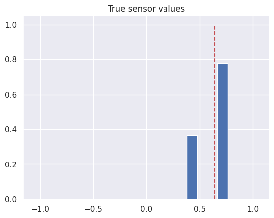
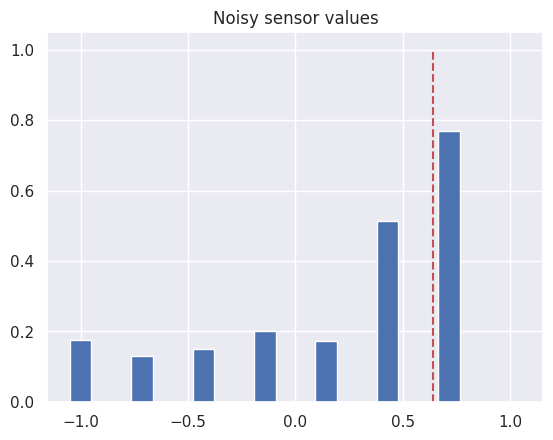
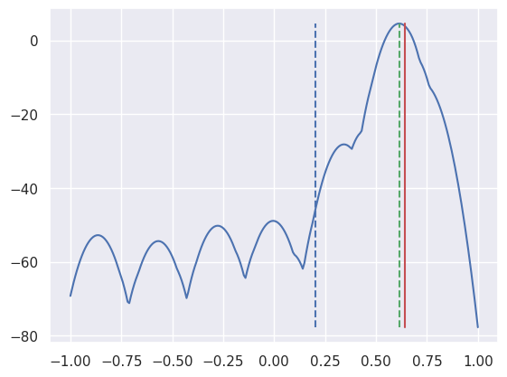

라인 센서란 라인트레이서형 로봇에서 사용되는 센서로, 로봇이 라인을 따라갈 수 있도록 센서의 중심으로부터 상대적인 라인의 위치를 추정하는 데 사용된다.

라인 센서는 여러 형태로 구현될 수 있다. 여기서는 그중 아래 예시와 같이 여러 개의 IR 센서를 일렬로 나열하여 사용할 때 라인의 위치를 추정하는 알고리즘을 다룬다.

```
IR0---IR1---IR2---IR3---IR4---IR5---IR6---IR7
```

논의에 앞서 각 IR센서의 위치 $x_n$에 대하여 IR0의 위치는 -1, IR7의 위치는 1로 정의하자. 즉 $x_n=2n/7-1$이라 하자.

## 기존 알고리즘

내가 활동하는 로봇 동아리 [제틴](https://zetin.uos.ac.kr)에서는 아래와 같이 weighted average를 사용하여 라인의 위치를 추정하였다.

센서 값 $v_n$에 대하여 아무것도 없는 검은 바탕을 감지할 때 센서 값이 0, 흰 라인 위에 센서가 정확히 올라갈 때 값이 1이라 하자. 라인의 경계에 위치한 센서의 값은 0과 1 사이의 값이 된다. 그리고 센서에는 필연적으로 노이즈가 포함된다.

이때 기존에는 위치에 센서 값으로 weight를 주어서 다음과 같이 라인의 위치를 추정하였다.

$$
\hat{x} = \frac{\sum_{n=0}^7 x_nv_n}{\sum_{n=0}^7 v_n}
$$

이를 베이즈 정리를 기반으로 개선하고자 한다.

## 베이즈 정리

베이즈 정리는 다음과 같다.

$$
P(A|B) = \frac{P(B|A)P(A)}{P(B)}
$$

이때 만약 $P(B)$가 $P(A)$에 의존하는 사건이면 다음과 같이 표현된다.

$$
P(A|B) = \frac{P(B|A)P(A)}{\sum_{A}P(B|A)P(A)}
$$

연속확률분포의 경우 다음과 같이 표현된다.

$$
P(A|B) = \frac{P(B|A)P(A)}{\int_{A}P(B|A)P(A)dA}
$$

## 베이즈 정리를 이용한 라인 추정

먼저 알고자 하는 것은 센서 8개의 값 $\vec v= (v_0, v_1, \cdots, v_7)$이 주어졌을 때 라인의 위치 $p$이다. 이를 위해서 라인의 위치 $p$에 대한 확률밀도함수를 구하고 그중 가장 높은 값을 가지는 $p$값을 선택할 것이다. 이는 센서 값들이 주어졌을 때 센서 위치의 분포를 추정하는 것이므로 조건부 확률 $P(p|\vec v)$로 표현된다. 그런데 이 조건부 확률을 알지 못하므로 아래와 같이 앞서 정리한 연속확률분포의 베이즈 정리를 이용하여 구할 것이다.

$$
P(p|\vec v) = \frac{P(\vec v|p)P(p)}{\int_{p}P(\vec v|p)P(p)dp}
$$

이 식에서 사전 확률 $P(p)$를 정하기 위해서는 센서 값의 분포를 측정해야 한다. 라인 추종형 로봇은 라인 위치가 0이 되도록 추종하므로 실제 센서의 값은 0을 중심으로 하는 분포를 가질 것이다. 그러나 우리는 범용성을 위해 이러한 가정을 하지 않을 것이다. 대신 적당한 범위에서 균일한 분포를 가진다고 가정하자. 이때 이 범위는 $[-1,1]$보다 조금 더 커도 되는데, 왜냐하면 가장 바깥 쪽 센서보다 라인이 살짝 밖에 있는 경우에도 센서가 라인을 감지할 수 있기 때문이다.

즉, 그러한 범위 내에서 $P(p)=k$이다. 이에 따라 식은 다음과 같이 변형된다.

$$
P(p|\vec v) = \frac{P(\vec v|p)}{\int_{p}P(\vec v|p)dp}
$$

이로부터 $P(\vec v|p)$만 구하면 곧바로 확률분포를 추정할 수 있다. 이를 구하기 위해 센서 하나에 대하여 라인과 센서의 거리에 따른 센서 값의 확률분포를 구한 뒤, 이를 센서 값 벡터에 대한 확률분포로 확장할 것이다.

먼저 거리가 $d$ 떨어진 센서에 대하여 센서 값이 $v$일 확률 분포, 즉 확률밀도함수가 $f_d(v)$라고 가정하자. 그러면 센서 값 벡터에 대한 확률분포$P(\vec v|p)$는 다음과 같이 표현된다.

$$
P(\vec v|p) = \prod_{n} f_{|x_n-p|}(v_n)\\
$$

즉,

1. 라인의 위치가 주어질 때
2. 이로부터 예상되는 각 센서 값의 확률밀도함수에
3. 실제 센서 값을 넣어 얻은 확률밀도의
4. 곱으로 표현된다.

이것이 올바른 확률분포인지는 그 적분이 1이 되는지를 확인해보면 된다. 이는 푸비니의 정리에 따라 다음과 같이 1이 됨을 보일 수 있다.

$$
\begin{align}
\int_v P(\vec v|p)dv
&=\int_{v_1}\int_{v_2}\cdots\int_{v_n}\prod_{n} f_{|x_n-p|}(v_n)dv_1dv_2\cdots dv_n \\
&= \prod_{n} \int_{v_n} f_{|x_n-p|}(v_n)dv_n\\
&= \prod_{n} 1\\
&=1
\end{align}
$$

- (1): $P(\vec v|p)$의 정의에 따라
- (2): 푸비니의 정리
- (3): $f$가 확률분포이므로 $f(v_n)$의 적분값은 1이다.

> 푸비니의 정리란 리만 적분에서 정사각형 영역 $R$에 대하여 $f(x,y)$가 연속이면 아래 등식이 성립한다는 정리이다.
>
> $$
> \int_R f(x,y)dA = \int_a^b\int_c^d f(x,y)dxdy
> $$
>
> 이로부터 $f(x,y)$가 두 함수의 곱 $f_1(x)f_2(y)$으로 표현되는 경우 아래 등식이 성립힌다.
> $$\int_R f(x,y)dA = \int_a^b\int_c^d f_1(x)f_2(y)dxdy = \int_a^b f_1(x)dx\int_c^d f_2(y)dy$$
> 이는 쉽게 고차원으로 확장할 수 있다.

그러므로 얻은 $P(\vec v|p)$를 위의 식에 대입하면 다음과 같이 정리된다.

$$
P(p|\vec v) = \frac{\prod_{n} f(v_n, |x_n-p|)}{\int_{p}\prod_{n} f(v_n, |x_n-p|)dp}
$$

이로부터 알고자 하는 것은 이 값을 최대화하는 $p$이다. 이때 앞서 보였듯이 이 식의 분모는 상수이므로 이를 최대화하는 것은 분자를 최대화하는 것과 같다. 그러므로 다음과 같이 정리된다.

$$
\hat{p} = \arg\max_p \prod_{n} f(v_n, |x_n-p|)
$$

이는 확률밀도함수를 여러 번 곱하는 과정이므로 숫자가 대단히 크거나 작아질 수 있다. 그러므로 로그 변환하여 다음과 같이 정리한다.

$$
\hat{p} = \arg\max_p \sum_{n} \log f(v_n, |x_n-p|)
$$

## 실험

이를 Python으로 구현하여 실험해보았다. 실험을 위하여 거리에 따른 센서 값의 확률밀도함수를 다음과 같이 정의하였다.

$$
v\sim\mathcal{N}(1-3|d|, 0.1)
$$

실제 라인 위치를 0.64로 두면 아래와 같이 센서 값이 측정된다.


그런데 실제 센서에는 잡음이 필연적으로 포함되므로 정규분포 잡음을 추가하였다.


이로부터 라인 위치를 추정하면 다음과 같다.


- 붉은 실선은 실제 센서 위치를 나타낸다.
- 파란 곡선은 예상되는 센서 위치의 로그 우도(likelihood)를 나타낸다.
- 초록색 점선은 이로부터 추정된 센서 위치를 나타낸다.
- 파란색 점선은 예전 알고리즘으로부터 추정된 센서 위치를 나타낸다.

이를 통해 새로운 알고리즘이 기존 알고리즘보다 더 정확하게 라인 위치를 추정한다는 것을 알 수 있다.
