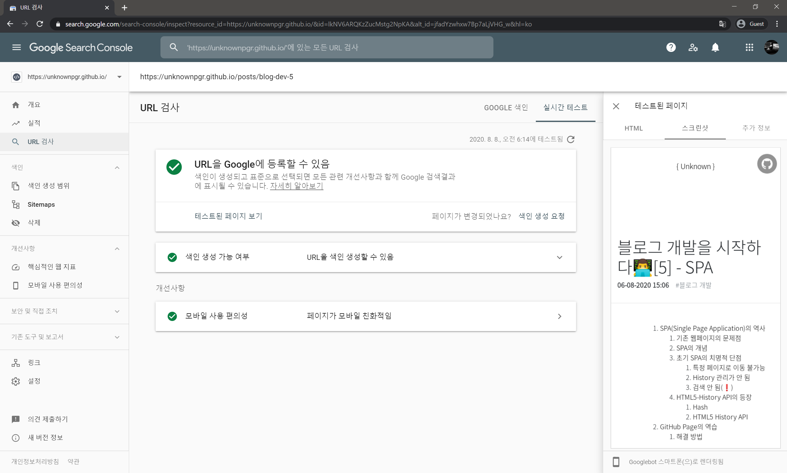

이전 포스트에서는 정적 서비스밖에 제공하지 않는 GitHub Page에서 어떻게 SPA를 만들었는지 다뤘습니다. `404.html`파일에 스크립트를 삽입하여 메인 페이지로 리다이렉트하는 방법을 사용했었는데요.


네...항상 그래왔고, 지금도 그러고 있고, 앞으로도 그러겠지만, 이게 또 문제가 됩니다.

# Sitemap

우리가 어떤 웹페이지를 새로 만들었을 때, 이것이 구글이나 네이버와 같은 검색 엔진에 노출되려면 웹 크롤러가 우리 사이트에 방문하여 페이지들을 색인(index)에 추가해야 합니다. 이때 검색 엔진이 사이트의 최신 상태를 빠릿빠릿하게(?) 업데이트하고 검색이 잘 될 수 있도록 하는 것을 Search Engine Optimization (SEO)라고 합니다. SEO를 하는 방법 중 하나는 검색엔진에 Sitemap을 제출하는 것으로, 위키피디아에 따르면 Sitemap이란 어떤 웹사이트의 구성을 알려주는 목록입니다.

> A **site map** (or **sitemap**) is a list of pages of a web site.

구체적으로는 <u>웹 크롤러</u>가 사이트의 구성을 알 수 있도록 만들어놓은 <u>XML파일</u>을 뜻하는데, 보통 아래와 같이 생겼습니다. 웹사이트 관리자는 이 파일을 검색엔진에게 제출하고, 검색엔진은 이 파일에 있는 사이트들을 검색엔진의 색인(index)에 추가합니다. 그러면 검색을 했을 때에 해당 페이지가 검색엔진에 노출됩니다.

```xml
<?xml version="1.0" encoding="utf-8"?>
<urlset xmlns="http://www.sitemaps.org/schemas/sitemap/0.9"
   xmlns:xsi="http://www.w3.org/2001/XMLSchema-instance"
   xsi:schemaLocation="http://www.sitemaps.org/schemas/sitemap/0.9 http://www.sitemaps.org/schemas/sitemap/0.9/sitemap.xsd">
    <url>
        <loc>http://example.com/</loc>
        <lastmod>2006-11-18</lastmod>
        <changefreq>daily</changefreq>
        <priority>0.8</priority>
    </url>
</urlset>
```

(또는 [제 블로그의 sitemap](https://unknownpgr.github.io/sitemap.xml)을 직접 보셔도 좋겠습니다.)

위 예시의 `<url>`부분을 보면 여러 속성이 들어있는 것을 볼 수 있습니다.

- `<loc>` : location의 약어로, 사이트에 포함되어있는 주소를 알려줍니다.
- `<lastmod>`: last modified의 약어로, 가장 최근에 수정된 시간을 의미합니다.
- `<chagefreq>`: change frequency의 약어로, 해당 페이지가 수정되는 빈도를 의미합니다. 다음과 같은 값을 가질 수 있습니다.
  - `always` : 방문할 때마다 페이지가 바뀜을 의미
  - `hourly`
  - `daily`
  - `weekly`
  - `monthly`
  - `yearly`
  - `never` : 아카이브 페이지와 같이 절대 바뀌지 않는 페이지를 의미
- `<priority>`: 말 그대로 페이지의 우선순위를 의미합니다. 0.0~1.0까지의 값을 가질 수 있으며, 기본값은 0.5입니다. 한 사이트 내에서 페이지의 중요도를 비교하여 나타낼 때 쓰입니다. (그러므로 이 수치를 전부 1.0으로 설정한다고 해서 검색 상위에 노출되거나 하지는 않습니다.)

그 외에도 여러 속성이 있으므로 [위키백과를 참조](https://en.wikipedia.org/wiki/Sitemaps#Element_definitions)해보시기 바랍니다.

# 404

그런데 검색엔진이란 유용한 정보를 찾기 위해 만들어졌으므로, 당연히 404페이지는 색인에 포함시키지 않습니다. 문제는 제 블로그가 SPA를 서비스하기 위하여 404페이지를 거쳐서 리다이렉션을 한다는 것입니다. 404페이지를 거치는 시간은 0.1초도 되지 않겠지만, 어쨌든 HTTP response header에는 404가 찍혀 있을 것이고 크롤러는 거기에서 탐색을 멈춰버립니다. 결과적으로는 메인 페이지를 제외한 어떤 페이지도 인덱싱이 제대로 이뤄지지 않았습니다.

# 해결

이건 아무리 생각해봐도 깔끔한 해결 방법이 떠오르지 않았습니다. 그래서 어쩔 수 없이 그냥 모든 포스트에 해당하는 html파일을 만들었습니다(...)

예를 들자면 아래와 같은 파일입니다.

```html
<!-- https://unknownpgr.github.io/posts/2020-07-21/index.html -->
<script>window.location.replace('/?page=%2Fposts%2F2020-07-21');</script>
```

GitHub Page가 정적 서버이기는 하지만, 파일이 아니라 디렉토리로 접근했을 경우 해당 디렉토리의 index.html을 대신 보내주는 것 정도는 해 줍니다. 그러므로 `https://unknownpgr.github.io/posts/2020-07-21`페이지로 접근하면 위 파일이 반환되고, 사용자는 `404.html`을 사용한 방법과 똑같이 원하는 페이지로 이동하게 됩니다. 추가적으로 `404.html`의 경우 현재 페이지 URL을 알아내는 과정이 필요한데, 이 방법의 경우 페이지 주소가 하드코딩되어있어 페이지 전환 속도가 (아주 조금) 빨라지는 장점도 있습니다.

# SPA vs 여러 페이지

이 해결책을 적용하기 전 SPA를 포기하고 여러 페이지로 이뤄진 블로그를 만드는 것이 좋은지, 아니면 이렇게 임시방편으로 하는 게 좋은지 고민을 좀 해 봤습니다. SPA를 포기하지 않은 이유는 아래와 같습니다.

- SPA를 포기하면 블로그의 전체 용량이 더 커진다. (모든 포스트에 복잡한 index.html파일이 필요하므로)
- 앞으로 Google Analytics를 추가하는 등 index.html을 건드릴 일이 생길 텐데, 그럴 때마다 업데이트를 해야 하므로 처리가 복잡하다.
- 이런 리다이렉션 과정은 맨 처음 사이트 접속 시에만 이루어지는 것이고, 한번 접속한 후 사이트 내에서 이동할 때에는 browser router가 사용된다. 그러므로 이 방법을 사용한다고 해서 심각한 속도 저하가 일어나거나, 매번 리다이렉션을 해야 하는 것은 아니다.
- 리다이렉션을 거침에도 불구하고 검색엔진이 필요한 내용을 제대로 인식한다.
- 
