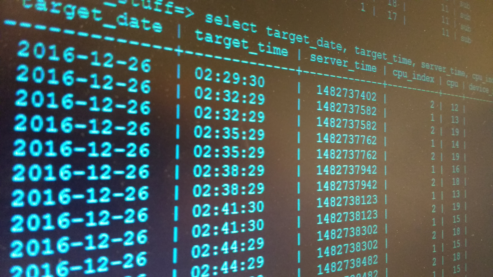

이번에 연구실에서 어떤 프로젝트를 진행하면서 아주 크기가 큰 데이터베이스를 다룰 일이 생겼습니다. 구체적으로는 용량이 80GB~100GB 정도이며 9억 개 정도의 row를 포함하고 있습니다. 이 데이터베이스는 연구용으로 사용되기 때문에 특이하게도 insert, select 모두 별로 자주 발생하지 않습니다. (아무리 잦아도 하루에 한두 번 정도입니다.) **그러나** 한 번 select 할 때마다 매우 대용량의 데이터를 한 번에 가져와야 할 뿐더러 여러 테이블을 join해서 가져와야만 합니다. 즉, 데이터베이스를 최대한 효율적으로 구성해야만 하는 상황에 놓였습니다.

# 데이터베이스 인덱스(Index)란?

 이럴 때 사용해야 하는 것이 데이터베이스의 인덱스입니다. 인덱스란, 그 이름에서도 알 수 있듯이 데이터베이스에서 특정 column, 혹은 column들을 기준으로 데이터베이스의 열 순서를 저장해서 검색 속도를 향상시켜주는 자료구조입니다. 인덱스를 사용하면 순차 탐색 대신 이진 탐색이나 임의 접근이 가능하므로 탐색 속도가 매우 향상됩니다. 뿐만아니라 UNIQUE 등 다양한 제약 조건을 구현하는 데에도 인덱스가 사용됩니다.

## 인덱스는 어떻게 구현되나?

 저는 MySQL 데이터베이스를 이용하고 있습니다. MySQL에서 인덱스는 B-Tree를 사용하여 구현됩니다. B-Tree는 이쁘게 균형이 잘 잡힌 N진 트리를 말하는 것으로, 모든 terminal node의 depth가 동일하다는 특징을 가지고 있습니다. 이 특징 덕분에 탐색, 삽입, 삭제의 시간 복잡도가 모두 $\log n$이 됩니다.

## 인덱스는 어떻게 설정하나?

인덱스의 설정은 다양한 관점에서 접근할 수 있습니다.

### 개수

먼저 인덱스의 개수를 생각해보겠습니다. 일반적으로 인덱스는 3~5개 정도의 컬럼에 설정합니다. 너무 인덱스를 적게 설정하면 탐색 시간이 길어질 것이고, 너무  많이 설정하면 테이블을 조작(삽입, 삭제 등)할 때 시간이 너무 길어질 것입니다.

### Multi-Column Index VS Multiple Indexes

다음으로 여러 컬럼에 대한 인덱스를 만들 때, 여러 컬럼을 참조하는 하나의 인덱스를 만들지 아니면 한 개의 컬럼을 참조하는 여러 개의 인덱스를 만들지 고민해봐야 합니다.

먼저 여러 컬럼을 참조하는 하나의 인덱스를 만든다면, 그 인덱스에 설정된 컬럼을 순서대로 참조할 때에만 속도의 이점을 봅니다. 예컨데 컬럼 (A, B, C)에 대해 인덱스를 생성한다면, Order By나 Where 등 인덱스를 참조하는 곳에서 A, B, C 순서로 참조해야만 인덱스가 전부 사용됩니다. B만 사용하거나 B, C만 사용한다면 인덱스가 사용되지 않습니다.

반면 하나의 컬럼을 참조하는 인덱스를 여러 개 만들 경우 어떤 컬럼을 참조하더라도 속도의 이점이 있습니다. 그러나 이 경우 여러 개의 검색 조건이 있을 때 하나의 인덱스만 사용됩니다.

즉 검색 조건으로 사용되는 컬럼과 그 순서가 항상 일정하다면 인덱스 하나가 여러 컬럼을 참조하도록 설정하는 것이 유리합니다. 반면 검색할 때마다 조건으로 사용되는 컬럼이 달라지거나 아니면 그 순서가 달라지는 경우 여러 개의 인덱스를 사용하는 편이 유리합니다.

### 컬럼 설정 방법

그리고 만약 한 개 인덱스가 여러 개의 컬럼을 참조하도록 설정하는 경우 어떤 컬럼을 우선적으로 설정할지 생각해봐야 합니다. 예를 들어 어떤 학교의 학생을 저장하는 데이터베이스가 있습니다. 이때 학년과 학과 기준으로 데이터베이스를 조회하려 합니다. 이때 (학년, 학과) 순서로 인덱스를 설정하는 것이 좋을까요, (학과, 학년) 순서로 인덱스를 설정하는 것이 좋을까요?

이 경우 컬럼의 cardinality를 고려해야 합니다. Cardinality는 집합의 원소 수를 뜻하며 일반적으로 '기수'로 번역됩니다. **인덱스는 cardinality가 큰 순서로 지정하는 것이 좋습니다.** 왜냐하면 cardinality가 클수록 중복된 행이 적으므로 탐색 범위가 빠르게 줄어들기 때문입니다.

예컨대 학년은 보통 1, 2, 3, 4학년이 있으므로 cardinaity가 4가 됩니다. 반면 학과는 일반적으로 수십 개정도가 있습니다. 그러므로 이 경우 (학과, 학년) 순서로 인덱스를 지정하는 편이 좋습니다.

 예를 들어 총 학생이 1,000 명이고 4개의 학년, 20개의 학과를 가진 학교를 생각해보겠습니다. (학생들은 모든 학년, 학과에 똑같이 분포되어있다고 가정하겠습니다.) 그러면 학과부터 인덱스를 설정할 경우 한 번의 인덱스 조회만으로 탐색 범위가 50건으로 줄어드는 반면, 학년으로 인덱스를 설정할 경우 한 번 인덱스 조회를 하면 탐색 범위가 250건으로 줄어듭니다.

### Covering Index

Covering index란 **탐색에 필요한 모든 컬럼을 포함하고 있는 인덱스**입니다. 즉, covering index가 설정된 테이블을 탐색할 때에는 실제 테이블의 내용에는 접근할 필요 없이 인덱스에만 접근해서 조회가 가능합니다. 만약 조회할 때 인덱스가 아닌 테이블 자체의 내용에 접근하게 되면 일단 인덱스와 테이블 내용에 둘 다 접근하므로 속도가 느려질 뿐더러 데이터 블록을 통째로 읽어와야 하므로 처리하는 데이터 양도 늘어납니다. 이때 covering index를 사용하게 되면 컬럼을 선택하는 과정에서는 오직 인덱스만을 이용하여 효율적으로 컬럼을 선택한 후, 나중에 데이터를 가져올 때 실제 테이블 내용에 접근하여 가져오면 되므로 효율적입니다. Covering index를 사용할 때에는 index에 포함된 컬럼들만을 사용하여 primary key를 조회한 후, 이를 subquery로 하여 실제 데이터를 조회하면 됩니다.

### 삽입 전에 설정 VS 삽입 후에 설정

인덱스를 맨 처음부터 설정하고 테이블에 데이터를 삽입하는 것이 효율적일지, 반대로 테이블에 데이터를 모두 삽입한 후에 인덱스를 설정하는 것이 효율적인지도 생각해볼 만한 문제입니다. 만약 데이터의 입출력이 잦고 유일성 등이 엄격하게 보장되어야 하는 경우라면 어쩔 수 없이 데이터 삽입 이전에 인덱스를 설정해야겠지만, 그렇지 않을 경우 **데이터를 모두 삽입한 후 인덱스를 설정하는 것이 더욱 효율적**입니다. 제 경우에도 대용량의 데이터를 한 번 삽입한 후 계속 조회만 하는 형태였으므로 데이터를 인덱스 없이 미리 전부 삽입해놓고 후에 인덱스를 설정하였습니다.

# 효율적인 Select 방법

그런데 인덱스를 설정한다고 해서 모든 select 연산이 저절로 빨라지는 것은 아닙니다. 주의깊게 select 구문을 설계해야만 효율적인 쿼리를 작성할 수 있습니다.

## Operations Equal(=), Range(<, >), IN, Functions

먼저 select를 할 때 사용하는 연산에 따라 사용할 수 있는 인덱스의 범위가 달라집니다.

- 등호 연산 `=` 을 사용할 때에는 언제나 인덱스가 사용되며, 인덱스가 여러 컬럼에 걸쳐 있을 경우 그 다음 컬럼에도 인덱스 사용이 가능합니다.
- 포함 연산 `IN` 은 등호 연산을 여러 번 사용하는 것과 같으므로 등호 연산과 같습니다.
- 범위 연산 `>`, `<` 을 사용할 때에는 **해당 컬럼에만 인덱스가 적용되며 그 다음 인덱스는 사용할 수 없습니다.**
  - 그러므로 범위 연산이 간단할 경우 (e.g. `0 < x AND x < 3`) 이를 `IN` 을 사용하도록(e.g. `x IN (1,2)`) 바꾸는 편이 좋습니다.
- **컬럼에 함수를 적용할 경우 인덱스를 사용할 수 없습니다.** 그러므로 인덱스를 사용할 컬럼에는 함수를 사용하면 안 됩니다.
  - 예컨대 `x*10<100` 은 인덱스가 사용되지 않지만 `x<100/10` 은 인덱스가 사용됩니다.

## Subquery VS Join

**대부분의 경우 join이 subquery보다 우수합니다.** 왜냐하면 대부분의 DBMS에서 subquery는 인덱스를 비롯한 최적화가 잘 안 되는 반면, join은 최적화가 잘 되기 때문입니다. 또한 RDB의 작동 원리를 생각해볼 때 SQL이 선언형 언어라는 것을 고려하면 join이 더 효율적인 방법입니다. Join은 선언적인 반면 subquery는 절차적이기 때문입니다.

# 참고문헌

- [https://d2.naver.com/helloworld/1155](https://d2.naver.com/helloworld/1155)
- [https://ko.wikipedia.org/wiki/%EC%9D%B8%EB%8D%B1%EC%8A%A4_(%EB%8D%B0%EC%9D%B4%ED%84%B0%EB%B2%A0%EC%9D%B4%EC%8A%A4)](https://ko.wikipedia.org/wiki/%EC%9D%B8%EB%8D%B1%EC%8A%A4_(%EB%8D%B0%EC%9D%B4%ED%84%B0%EB%B2%A0%EC%9D%B4%EC%8A%A4))
- [https://jojoldu.tistory.com/243](https://jojoldu.tistory.com/243)