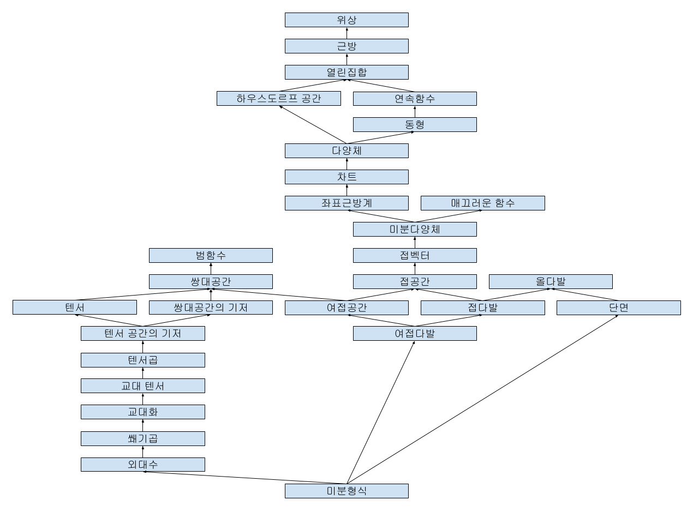

수학에서 미분을 다음과 같이 표현한다.

$$
\frac{df}{dx} = \lim_{h\to 0} \frac{f(x+h) - f(x)}{h}
$$

이러한 관점에서는 $d/dx$가 하나의 연산자로 작용하는 것처럼 보이며, 이것을 $dx$와 $dy$로 따로 분리하여 생각하는 것은 말이 되지 않는다. 그런데 때로는 이러한 표기가 등장하기도 한다.

$$
df=\frac{\partial f}{\partial x}dx + \frac{\partial f}{\partial y}dy
$$

또는 미분방정식을 풀 때 다음과 같은 방법을 사용하기도 한다.

$$
\frac{dy}{dx} = f(x)\\
\therefore dy = f(x)dx\\
\therefore y = \int f(x)dx
$$

이런 측면에서 $dx$와 $dy$는 일종의 실수 값을 가지는, 일반적인 사칙연산을 적용해도 되는 변수로서 사용되는 것처럼 보인다.

그래서 구체적으로 $dx$, $dy$가 무엇인지 궁금해졌다. 그래서 이것이 무엇인지를 조사했다.

## 구조

본문은 다음과 같은 구조로 구성되어있다.

#### 범함수(Functional)

범함수는 분야에 따라 그 정의가 조금씩 다른데, 일반적으로는 공간 $X$에서 그 공간의 field $F$로의 함수를 말한다. 즉, $f: X \to F$이다. 그러므로 $\mathbb{R}^n$ 벡터공간을 다룰 때 범함수는 벡터를 실수에 대응시키는 함수다. 예를 들어 함수 $f(v)=|v|$는 범함수이다.

범함수의 특수한 경우로 함수의 집합 위에 범함수를 정의할 수 있다. 이 경우 범함수는 함수를 하나의 실수에 대응시키는 함수다. 예를 들어 함수 $f: \mathbb{R} \to \mathbb{R}$에 대해 $f \mapsto f(0)$는 범함수이다.

#### 쌍대공간(Dual Space)

벡터공간 $V$의 쌍대공간 $V^*$은 $V$의 선형범함수들의 집합으로 정의한다. 그런데 벡터 공간의 선형함수, 즉 선형변환은 곧 행렬이다. 그리고 범함수는 벡터를 스칼라에 대응시키므로 이것은 $n\times1$행렬, 즉 원래 벡터와 같은 크기의 벡터로 생각할 수 있다. 그러므로 벡터공간의 쌍대공간은 원래 벡터공간과 같은 크기를 가지는 벡터들로 이루어진 벡터공간이 된다.

#### 쌍대공간의 기저(Dual Basis)

벡터공간 $V$의 기저 $\{v_1, v_2, \cdots, v_n\}$에 대해 집합 $\{u_1, u_2, \cdots, u_n\}$을 다음과 같이 정의하자.

$$u_i(v_j) = \delta_{ij}$$

즉, $u_i$는 $v_i$에 대해 1을, 그 외의 다른 기저 벡터에 대해 0을 대응시키는 선형 범함수다. 다르게 말하자면 이것은 벡터를 기저 $v_i$의 성분으로 대응시키는 함수다. 이는 다음과 같이 보일 수 있다.

$$
\begin{align*}
v &= \sum_{i=1}^n v_i c_i\\
\therefore u_i(v) &= u_i\left(\sum_{j=1}^n v_j c_j\right) = \sum_{j=1}^n c_j u_i(v_j) = c_i\\
\therefore v &= \sum_{i=1}^n v_i u_i(v)
\end{align*}
$$

그러므로 임의의 선형 범함수 $f$에 대해

$$
f(v) = f\left(\sum_{i=1}^n v_i u_i(v)\right) = \sum_{i=1}^nf(v_iu_i(v)) = \sum_{i=1}^nf(v_i)u_i(v)
$$

이므로 $f$는 $u_i$의 선형결합으로 표현된다. 또한 이로부터

$$
f(v) = \sum_{i=1}^nc_iu_i(v)
$$

라고 할 때

$$
f(v_i) = \sum_{j=1}^n c_j u_j(v_i) = c_i
$$

이므로

$$
f = 0 \iff f(v_i) = 0 \iff c_i = 0
$$

이다. 따라서 $u_i$는 선형 독립이며, $V^*$의 기저가 된다.

> 단 이는 기저가 유한한 경우에만 성립한다. 무한차원의 경우에는 이것이 성립하지 않는다.

#### 텐서(Tensor)

텐서는 쌍대 공간을 일반화한 것이다. 쌍대 공간에서 그 원소인 선형 범함수는 하나의 벡터를 스칼라에 대응시키는 함수였다면, 텐서는 여러 벡터를 스칼라에 대응시키는 다중 선형 사상(multilinear map)이다. 즉, 텐서는 다음과 같이 정의된다.

$$
T: V_1 \times V_2 \times \cdots \times V_n \to F
$$

이때 $n$을 텐서의 계수, 또는 차수(rank)라 한다.

더 엄밀하게는, 텐서는 벡터 공간에 대하여 $l$개의 쌍대 벡터와 $m$개 벡터에 대한 다중 선형 사상으로 정의되며 이를 $(l, k)$-텐서라 한다.

$$
T: \underbrace{V^* \times V^* \times \cdots \times V^*}_{l} \times \underbrace{V \times V \times \cdots \times V}_{m} \to F
$$

#### 텐서 공간의 기저

텐서의 집합은 벡터공간을 이룬다. 따라서 텐서 공간에 기저를 줄 수 있다.

#### 텐서곱(Tensor Product)

텐서곱은 두 텐서 $T_1: V_1 \times V_2 \times \cdots \times V_n \to F$와 $T_2: W_1 \times W_2 \times \cdots \times W_m \to F$에 대해 다음과 같이 정의되는 $n+m$차 텐서다.

$$
T_1 \otimes T_2(v_1, v_2, \cdots, v_n, w_1, w_2, \cdots, w_m) = T_1(v_1, v_2, \cdots, v_n)T_2(w_1, w_2, \cdots, w_m)
$$

#### 교대 텐서(Alternating Tensor)

교대 텐서는 벡터의 순서를 바꾸었을 때 그 부호가 바뀌는 텐서를 말한다. 즉, $k$차 텐서 $T$에 대하여, 임의의 $i, j$ (단 $i \neq j, 1 \leq i, j \leq k$)에 대해 다음이 성립하면 $T$는 교대 텐서다.

$$
T(\cdots, v_i, \cdots, v_j, \cdots) = -T(\cdots, v_j, \cdots, v_i, \cdots)
$$

#### 교대화(Alternation)

임의의 $k$차 텐서 $T$에 대해, $T$를 교대 텐서로 만드는 연산을 교대화라 한다. 교대화는 다음과 같이 정의된다.

$$
Alt(T)(v_1,\cdots,v_k) = \frac{1}{k!}\sum_{\sigma \in S_k} \text{sgn}(\sigma)T(v_{\sigma(1)}, v_{\sigma(2)}, \cdots, v_{\sigma(k)})
$$

> 이때 $S_k$는 $k$개의 원소를 가지는 대칭군이다. 대칭군이란 집합에 대하여 그 전단사함수의 집합을 말한다. 다르게 말하면, $S_k$는 $k$개의 원소를 가지는 모든 순열의 집합이다. 그러므로 대칭군의 크기는 $k!$이다. 순열에서 두 원소의 순서를 바꾸는 것을 교환이라 하며, 원래의 순서대로 순열을 바꾸는 데 짝수번의 교환이 필요하면 이 순열의 부호는 양수, 홀수번의 교환이 필요하면 음수다. 이것을 수식으로 나타내면 다음과 같다.
>
> $$
> \text{sgn}(\sigma) = (-1)^{\text{number of transpositions in }\sigma}
> $$

#### 쐐기곱(Wedge Product)

교대 텐서의 텐서곱을 하면 그 결과는 교대 텐서가 아니다. 그러므로 교대 텐서는 텐서곱에 대해서는 닫혀있지 않으며, 따라서 교대 텐서의 공간을 정의할 수 없다. 이에 따라 교대 텐서에 대해 닫혀있게 되는 연산을 정의할 필요가 있으며, 이에 따라 다음과 같이 쐐기곱을 정의한다.

$$
T_1 \wedge T_2 = \frac{(n+m)!}{n!m!}Alt(T_1 \otimes T_2)
$$

쐐기곱에 대해 다음 성질이 성립한다.

- $T_1 \wedge T_2 = (-1)^{nm}T_2 \wedge T_1$
- $T_1 \wedge T_2 = 0 \iff T_1 \otimes T_2 = 0$

#### 외대수(Exterior Algebra)

외대수란 벡터 공간에 대하여 그 벡터들의 반대칭 조합 및 그 위에 정의된 이항 연산을 가지는 대수적 구조를 말한다. 교대 텐서와 쐐기곱은 외대수의 예시이다.

#### 위상(Topology)

위상이란 집합 위에 어떤 점과 그 근방에 대한 정보를 가진 구조를 부여하는 것이다. 위상은 다양한 방식으로 정의될 수 있다. 그중 열린집합을 사용한 정의는 다음과 같다.

- 공집합과 전체집합은 열린집합이다.
- 유한개의 열린집합의 교집합은 열린집합이다.
- 임의의 열린집합의 합집합은 열린집합이다.

즉, 위상 자체를 열린 집합을 통해 정의하기 때문에 열린 집합은 무정의 용어이다. 다르게 말하면 어떤 집합이 열린 집합인지 닫힌 집합인지는 위상에 따라 달라질 수 있다. 예를 들어 일반적인 실수 위상에서 열린집합은 다음과 같이 정의된다.

- $\forall x \in A, \exists \epsilon > 0 \text{ s.t. } (x-\epsilon, x+\epsilon) \subset A$

이 경우 정수 집합 $\mathbb{Z}$은 열린집합이 아니다. 왜냐하면 정수 $x$에 대해, 그 어떤 $\epsilon>0$에 대해서도 $(x-\epsilon, x+\epsilon)$는 정수 집합의 부분집합이 아니기 때문이다.

그러나 정수 집합이 열린집합이 되도록 위상을 정의하면, 예를 들어서 이산 위상과 같은 경우, 정수 집합은 열린집합이 된다.

#### 근방(Neighborhood)

위상공간 속에서 점 $x$에 대한 근방이란 $x$를 포함하는 열린집합을 부분집합으로 가지는 집합을 말한다. $x$의 열린 근방이란 $x$를 포함하는 열린집합을 말한다. 실수 공간 $\mathbb{R}$에서 $x$의 열린 근방은 $(x-\epsilon, x+\epsilon)$와 같은 구간이다.

#### 하우스도르프 공간(Hausdorff Space)

하우스도르프 공간은 서로 다른 두 점을 겹치지 않는 열린 근방으로 둘러쌀 수 있는 공간이다. 조금 더 구체적으로는 임의의 서로 다른 두 점 $x, y$에 대해 $x\in U, y\in V, U\cap V = \emptyset$인 열린집합 $U, V$가 존재하면 그 공간은 하우스도르프 공간이다.

예를 들어 실수 공간 $\mathbb{R}$은 하우스도르프 공간이다. 왜냐하면 임의의 서로 다른 두 실수 $x, y$에 대해 $\epsilon = |x-y|/2$로 두면 $x\in(x-\epsilon, x+\epsilon), y\in(y-\epsilon, y+\epsilon)$이고 $(x-\epsilon, x+\epsilon) \cap (y-\epsilon, y+\epsilon) = \empty$이기 때문이다.

#### 연속함수

위상수학에서 연속함수라는 것은 위상공간 $X, Y$에 대하여, 임의의 $Y$의 열린집합의 역상이 $X$의 열린집합이 되는 함수를 말한다.

#### 동형(Homeomorphism)

위상 공간 $X, Y$가 동형 관계에 있다는 것은 $X$와 $Y$ 사이에 다음과 같은 조건을 만족하는 함수 $f: X \to Y$가 존재한다는 것을 말한다.

- $f$는 일대일 대응이다.
- $f$는 연속함수다.
- $f$의 역함수 $f^{-1}$도 연속함수다.

이때 이 함수 $f$를 위상동형사상이라 한다.

앞서 열린집합을 정의함으로써 위상공간을 정의하였다. 이때 동형 관계는 위상동형사상과 그 역사상이 모두 열린집합을 보존한다. 따라서 위상동형인 공간은 말 그대로 같은 위상을 가진다는 것을 알 수 있다.

두 집합이 동형이면 $X \cong Y$로 나타낸다.

#### 다양체(Manifold)

다음을 만족하는 공간을 $n$차원 다양체라 한다.

1. $M$은 하나 이상의 차원을 가진 Hausdorff 공간이다.
2. $M$위의 임의의 점이 $\mathbb{R}^n$과 동형인 근방을 가진다.

#### 차트(Chart)

다양체 $M$ 위의 차트란 $M$의 열린 부분집합 $U$와 $U$에서 $\mathbb{R}^n$으로의 위상동형사상 $\phi: U \to \mathbb{R}^n$의 쌍 $(U, \phi)$를 말한다. 미분다양체 위의 점을 $\mathbb{R}^n$의 각 성분으로 대응시키는 함수 $x^i$를 차트의 좌표함수라 한다. 즉,

$$
\phi(p) = (x^1(p), x^2(p), \cdots, x^n(p))
$$

#### 좌표근방계(Atlas)

다양체 $M$ 위의 좌표근방계란 다음 조건을 만족하는 $M$ 위의 차트들의 집합을 말한다.

- 차트들의 정의역($U$)의 합집합이 $M$이다. 즉, 차트들의 정의역은 $M$의 열린 덮개를 이룬다.

#### 매끄러운 함수(Smooth Function)

$\mathbb{R}^n$ 위의 함수 $f$가 매끄러운 함수라는 것은 $f$가 무한번 미분가능하다는 것을 말한다.

#### 미분다양체(Differentiable Manifold)

다양체 위에 미분구조를 부여한 것을 미분다양체라 한다. 구체적으로, 다양체 $M$에 좌표근방계가 주어지고 그 좌표근방계의 임의의 두 차트 $(U, \phi), (V, \psi)$에 대해 $U \cap V \neq \emptyset$이면 $\phi \circ \psi^{-1}$가 $\mathbb{R}^n$ 위의 매끄러운 함수가 될 때 $M$은 미분다양체라 한다.

이때 이러한 함수 $\phi \circ \psi^{-1}$를 전이함수라 하며, 전이함수는 서로 다른 차트 $U$와 $V$를 $R^n$ 내의 치역으로 사상했을 때 그 사이의 사상을 정의한다.

미분다양체는 다양체와는 다르게 미분이나 매끄러운 함수를 정의할 수 있다. 미분 또는 매끄러움은 국소적 성질로, 미분다양체 위의 곡선 $f: \mathbb{R} \to M$이 매끄럽다는 것은 임의의 $t$에 대하여 $f(t)$가 포함된 차트 $(U, \phi)$가 존재하여 $\phi \circ f$가 매끄럽다는 것을 말한다.

#### 접벡터(Tangent Vector)

접벡터는 다양한 방법으로 정의할 수 있는데, 그중 한 가지 방법은 다음과 같이 곡선을 이용하여 정의하는 것이다.

$$
v = \frac{d \gamma(t)}{dt}\Bigg|_{t=0}
$$

이때 $\gamma: \mathbb{R} \to M$은 $\gamma(0) = p$인 $M$ 위의 곡선이다. 이때 중요한 것은 $v$ 자체는, 미분다양체가 유클리드 공간이나 그 부분집합으로 정의된 경우가 아니라면, 유클리드 공간의 원소가 아니라는 점이다. 물론 미분다양체의 정의에 따라 이 점을 포함하도록 정의된 차트를 사용하여 $v$를 유클리드 공간의 원소로 사상할 수 있다. 그러나 $v$자체는 미분다양체 위에서 정의된 벡터이지 유클리드 공간의 원소가 아니다. 이것을 이해하는 것은 중요한데, 왜냐하면 이러한 이유로 접벡터가 미분다양체의 고유한 성질이며 차트에 의존하지 않는다는 것을 알 수 있기 때문이다. 이러한 접벡터를 이용함으로써 미분을 비롯한 미분다양체의 다양한 성질이 차트의 선택과 무관하게 정의될 수 있다.

이때 이러한 접벡터의 정의를 따르면 $f(0) = g(0) = p$인 곡선 $f$와 $g$에 대하여 $f\equiv g := f'(0) = g'(0)$으로 정의되는 동치관계는 동치류를 이루며, 이 동치류는 접벡터와 일대일 대응한다. 그러므로 이 동치류, 즉 함수들의 집합을 접벡터라고 할 수도 있다.

다른 방법은 derivation(어떻게 번역해야 할지 모르겠음)을 이용하는 방법으로, 다양체 $M$ 위의 점 $p$에서 derivation $D$는 라이프니츠 룰

$$
D(fg) = f(p)D(g) + g(p)D(f)
$$

을 만족하는 linear map $D: (M\to \mathbb{R}) \to \mathbb{R}$으로 정의된다. 이때 접공간을 이러한 모든 derivation의 집합으로 정의하는 것이다. 여기에 다음과 같은 규칙을 주면 이 집합은 벡터공간이 된다.

$$
\begin{align*}
(D_1+D_2)(f) &= D_1(f) + D_2(f)\\
(\lambda D_2)(f) &= \lambda D_2(f)
\end{align*}
$$

> 이것은 엄밀하게는 $(M \to \mathbb{R})\to \mathbb{R}$ 위의 linear map이 아니라 $M$위에 주어진 결합 대수(associative algebra) 위의 linear map이다. 그러나 이것까지 따지면 너무 복잡해지므로 여기서는 간단하게 생각하기로 한다.

#### 접공간(Tangent Space)

다양체 $M$의 점 $p$에 대한 접공간 $T_pM$은 $M$의 점 $p$에서의 접벡터들의 집합이며 $T_pM$으로 표기한다.

#### 올다발(Fiber Bundle)

올다발은 국소적으로 두 공간을 곱한 것과 동형인 공간이다. 올다발 $E$는 다음과 같은 네 가지 요소로 정의된다.

- 베이스 공간(base space): $B$
- 올(fiber): $F$
- 사상(projection map): $\pi: E \to B$
- 올다발의 국소적 구조(local structure): $\pi^{-1}(U) \cong U \times F$

조금 더 구체적으로는 집합이 올다발이 되기 위해서는 올다발 내의 점 $x$에 대하여 $\pi(x)$를 포함하는 베이스 공간의 근방 $U$가 존재하여 $\pi^{-1}(U) \cong U \times F$를 만족해야 한다.

즉, 대략적으로 올다발 $E$는 국소적으로 $B \times F$와 동형일 뿐만 아니라, 베이스 공간 $B$의 임의의 점에 대하여 그 점을 포함하는 근방 $U$에 대해 $\pi^{-1}(U) \cong U \times F$를 항상 찾을 수 있는 공간이다.

#### 접다발(Tangent Bundle)

다양체 $M$의 접다발은 $M$의 각 점 $p$와 그 접공간 $T_pM$으로 이루어진 올다발이며 $TM$으로 표기한다.

#### 단면(Section)

올다발 $E$의 단면은 다음을 만족하는 함수 $s: B \to E$이다. 즉, 단면은 베이스 공간의 각 점 $b$을 올다발 $E$의 점 $s(b)$로 대응시키는 함수다.

$$
\pi \circ s = \text{id}_B
$$

다양체의 접다발의 단면은 다양체 위의 점을 다양체 위의 점과 그 점에 해당하는 접공간의 원소, 즉 접벡터에 대응시키는 단면의 특수한 경우다. 그러므로 다양체의 접다발의 단면은 다양체 위의 벡터장이다.

#### 여접공간(Cotangent Space)

여접공간이란 접공간의 쌍대공간을 말하며 $T_p^*M$으로 표기한다. 그러므로 여접공간의 원소는 $M$의 점 $p$와 그 점에 대응하는 접공간 위에 정의된 선형함수로 이루어진다. 따라서 여접공간의 원소는 접공간에 대한 $(0, 1)$-텐서다.

#### 여접다발(Cotangent Bundle)

다양체 $M$의 여접다발 또는 공변접다발은 $M$의 각 점 $p$와 그 여접공간 $T_p^*M$으로 이루어진 올다발이며 $T^*M$으로 표기한다. 즉, 여접다발의 각 점은 $M$의 점 $p$와 그 접공간 위의 선형함수로 이루어진다.

#### 작용(Action)

미분기하에서 '작용'이란, 한 객체가 다른 객체를 또 다른 객체와 대응시키는 경우에 사용하는 추상적인 표현이다. 그러므로 맥락에 따라 그 의미가 다르며, 일반적으는 A가 B에 작용하면 C를 반환한다(얻는다)와 같이 표현한다. 예를 들어서 어떤 함수가 실수를 받아서 다른 실수를 반환하는 경우, 이것은 '함수가 실수에 작용하여 실수를 얻는다' 라고 표현할 수 있다. 또는 벡터의 길이를 반환하는 norm연산자의 경우, norm연산자는 벡터에 작용하여 스칼라를 반환한다고 표현할 수 있다. 또는 반대로 벡터가 norm 연산자에 작용하면 스칼라를 반환한다고도 표현할 수 있다.

물론 그렇기 때문에 '2는 3에 작용하여 5를 반환한다'와 같이 아무런 대응 관계를 (이 경우에는 덧셈 $\mathbb{R}\times \mathbb{R}\to \mathbb{R}$) 작용으로 표현할 수도 있으나, 미분기하에서는 앞의 norm 연산자의 예시와 같이 어떤 객체가 다른 객체의 성질을 측정하는 도구로 사용될 때 주로 작용이라는 표현을 사용하는 듯하다. (확실하지 않음)

#### 미분형식(Differential Form)

미분다양체 $M$위에 정의된 $k$-미분형식 또는 간단하게 $k$-형식 $\omega$는 $M$의 각 점 $p$에 대해 매끄럽게 변하는 $(0,k)$-교대 텐서 $\omega_p:(T_pM)^k \to \mathbb{R}$의 집합이다.

이것은 1-형식을 살펴보면 좀 더 쉽게 이해할 수 있다. 먼저 모든 $(0, 1)$-텐서는 정의에 따라 교대 텐서이므로 교대성은 고민할 필요가 없다. 그러므로 1-미분형식은 각 점 $p$에 대해 $T_pM$위에 정의된, p에 따라 매끄럽게 변하는 선형함수의 집합이다. 이것은 다시 말해 점 $p$에 대하여 그 여접공간 $T_p^*M$의 원소를 대응시키는 함수로도 볼 수 있다. 따라서 1-미분형식은 여접다발의 단면이다.

따라서 $(T_pM)^k$위에 정의된 $k$차 교대 텐서들의 모음은 외대수의 정의에 의하여 $T_p^*M$에 외대수를 주었을 때 그중 $k$차수를 가지는 텐서의 집합이다. 그러므로 미분형식은 $M$의 여접다발 $T^*M$에 외대수를 주었을 때, 그 외대수 공간의 $k$차수 부분의 원소의 단면, 더 정확하게는 단면의 집합이 된다.

#### 접벡터와 미분연산자

그런데 이것은 엄밀하게 정의되기는 하나, 미분에 대한 일반적인 직관과는 잘 연결되지 않는다. 예를 들어 미분다양체를 $\mathbb{R}^2$이라 하고 이 위의 1-형식을 생각해보자. 먼저 $\mathbb{R}^n$ 공간의 열린 부분집합으로 정의된 미분다양체에 대해서는 그 접공간 역시 $\mathbb{R}^n$이 되고, 따라서 여접공간 역시 $\mathbb{R}^n$이다. 그러므로 $\mathbb{R}^2$ 위의 미분형식은 단순히 $\mathbb{R}^2$ 을 $\mathbb{R}^2$에 대응시키는 매끄러운 벡터장이 된다. 이것은 일반적으로 함수의 기울기나 변화율과 관계된 미분과는 아무런 연관이 없어 보인다.

여기서 중요한 아이디어는 접벡터를 단순한 벡터가 아니라 그 방향의 방향미분 연산자로 간주하는 것이다. 앞서 접벡터는 다음과 같이 정의되었다.

$$
v = \frac{d \gamma(t)}{dt}\Bigg|_{t=0}
$$

이때 이 접벡터를, 다음과 같은 방식으로, 미분다양체 위에 정의된 함수 $f:M\to \mathbb{R}$에 작용하여 변화율을 반환하는 미분연산자로 간주할 수 있다. 이것은 다르게 말하면 $p$에서 $f$의 방향으로의 변화율, 즉 방향미분을 계산하는 것이다.

$$
v(f) = \frac{d f(\gamma(t))}{dt}\Bigg|_{t=0}
$$

앞서 언급했듯 접벡터는 차트, 즉 대응되는 유클리드 공간과 무관한 미분다양체 자체의 성질이다. 그러므로 이러한 정의는 미분다양체 위의 함수에 차트와 무관한 변화율의 정의를 제공한다.

#### 접공간의 기저

차트 $\phi$가 주어질 때 그 차트의 좌표함수 $x^i$는 미분다양체 위에 정의된 함수로 볼 수 있다. 여기에 대하여 편미분 연산자를 다음과 같이 정의하자.

$$
\frac{\partial f}{\partial x^i}(p) = \frac{\partial (f\circ \phi^{-1})}{\partial x^i}\Bigg|_{\phi(p)}\\
=\frac{\partial (f\circ \phi^{-1}(x^1, x^2, \cdots, x^n))}{\partial x^i}\Bigg|_{\phi(p)}
$$

이러한 좌표함수에 대한 편미분 연산자 $\frac{\partial}{\partial x^i}$는 접벡터공간의 기저를 이루며, 이러한 미분연산자들의 선형결합으로 미분연산자의 집합을 정의할 수 있다.

물론 미분연산자, 즉 접벡터는 또한 곡선의 동치류로도 정의할 수 있다. 이러한 측면에서 함수 $f$를 $x_i$로 편미분하는 것은 다음과 같은 곡선 $\gamma_i(t)$를 정의하여 $f$에 대한 변화율을 측정하는 것으로 해석할 수 있다.

$$
\gamma_i(t) = \phi^{-1}(\phi(p) + t e_i)=\phi^{-1}(x^1(p), x^2(p), \cdots, x^i(p)+t, \cdots, x^n(p))
$$

즉, 접공간의 기저가 $\frac{\partial}{\partial x^i}$라는 것은 곡선 $\gamma_i(t)=\phi^{-1}(\phi(p) + t e_i)$의 동치류들이 그러한 동치관계로 정의되는 공간의 기저를 이룬다는 것과 같다.

#### 미분형식

앞서 미분형식이란 여접다발의 매끄러운 단면이라고 하였다. 그러므로 이를 이해하기 위해서는 미분형식의 공간, 즉 여접공간의 기저를 알아볼 필요가 있다.

앞서 쌍대공간을 정의할 때 쌍대공간의 기저를 다음과 같이 정의하였다.

$$
u_i(v^j) = \delta_{ij}
$$

그러므로 여접공간의 기저를 $u^i$라고 하면 다음과 같이 정의할 수 있다.

$$
u^i\left(\frac{\partial}{\partial x^j}\right) = \delta_{ij}
$$

이것은 또한 어떤 미분이 다음과 같이 좌표함수에 대한 편미분 연산자의 결합으로 표현될 때, 여접공간의 기저는 각 편미분 연산자의 성분을 반환하는 함수임을 알 수 있다.

$$
u^i\left(v^1\frac{\partial}{\partial x^1} + v^2\frac{\partial}{\partial x^2} + \cdots + v^n\frac{\partial}{\partial x^n}\right) = v^i
$$

그러므로 여접벡터는 다음과 같이 기저의 선형결합으로 표현된다.

$$
\omega = \sum_i \omega_i u^i
$$

이때 미분형식이란 단순히 한 점에서의 여접벡터가 아니라 여접다발의 매끄러운 단면이라 하였다. 그러므로 각 $\omega_i$는 미분다양체 위에 정의된 매끄러운 함수여야 한다. 이것은 그러므로 다음과 같이 표현할 수 있다.

$$
\omega_p = \sum_i \omega_i(p) u^i
$$

이러한 미분형식은 그러므로 다음과 같이 미분연산자에 작용한다.

$$
\omega_p\left(v^1\frac{\partial}{\partial x^1} + v^2\frac{\partial}{\partial x^2} + \cdots + v^n\frac{\partial}{\partial x^n}\right) = \sum_i \omega_i(p) v^i
$$

일반적으로 여접공간의 기저는 $dx^i$로 표기하며, 이러한 미분형식은 다음과 같이 표현된다.

$$
\omega = \sum_i \omega_i dx^i
$$

그러므로 $dx$나 $dy$와 같은 것은 사실 정의상 벡터이고 여접공간의 기저이며 접벡터를 실수로 대응시키는 연산자다.

## 예시

#### 전미분

함수 $f:\mathbb{R}^n \to \mathbb{R}$에 대한 전미분은 다음과 같이 정의된다.

$$
df = \sum_i \frac{\partial f}{\partial x^i}dx^i
$$

이것은 $w_i = \frac{\partial f}{\partial x^i}$로 정의된 미분형식이다. 그러므로 $df$는 미분연산자 $v=\sum_i v^i\frac{\partial}{\partial x^i}$에 대하여 다음과 같이 작용한다.

$$
df(v) = \sum_i \frac{\partial f}{\partial x^i}dx^i\left(\sum_j v^j\frac{\partial}{\partial x^j}\right)
$$

이때 $dx^i\left(\frac{\partial}{\partial x^j}\right) = \delta_{ij}$이므로 다음과 같이 정리된다.

$$
df(v) = \sum_i \frac{\partial f}{\partial x^i}v^i
$$

즉, 전미분은 어떤 접벡터가 주어질 때 그 접벡터 방향의 변화율을 반환하는 연산자이다.

#### 미분방정식

다음과 같은 미분방정식을 가정하자.

$$
\frac{dy}{dx} = f(x, y)
$$

이때 $\frac{d}{dx}$를 하나의 연산자로 간주하면 아래와 같이 표현하는 것은 불가능하다.

$$
\frac{dy}{dx} = f(x, y) \iff dy = f(x, y)dx
$$

그러나 미분형식의 엄밀한 정의에 따라 $dx$와 $dy$는 일종의 연산자임을 알고 있으므로 이러한 형식으로 표현하는 것이 이상하지 않다. 구체적으로, 여기에 어떤 미분연산자 $v=v_x\partial/\partial x + v_y\partial/\partial y$가 주어졌을 때, 위 식은 다음과 같이 작용한다.

$$
\begin{align*}
dy(v) = f(x, y)dx(v) &\iff dy(v_x\partial/\partial x + v_y\partial/\partial y) = f(x, y)dx(v_x\partial/\partial x + v_y\partial/\partial y)\\
&\iff v_y = f(x, y)v_x
\end{align*}
$$

그러므로 이 식은 미분연산자 혹은 방향벡터에 대한 제약조건이 된다.

이것을 단순히 표현의 이해가 아니라 실질적으로 유용하게 사용하려면 미분 형식과 적분의 관계, 외미분에 대해 이해해야 한다. 그러나 그것은 지금의 논의를 벗어나므로 나중에 다루기로 한다.

#### 곡선

다음과 같은 곡선을 가정하자.

$$
x^2 + y^2 -1 = 0
$$

이것은 일반적인 함수 형태가 아니라 음함수의 형태이므로 일반적인 방식으로 $dy/dx$를 구할 수 없다. 그러나 이것을 미분 형식의 측면에서 생각해보자.

미분 형식의 측면에서 위와 같은 미분형식은 미분다양체 위의 접벡터를 실수로 대응하는 함수다. 앞서 접벡터는 곡선의 동치류로 정의되었으므로, 이 미분다양체 위의 곡선을 찾아야 한다. 이는 다음과 같이 간단히 찾을 수 있다.

$$
\gamma_p(t) = (\cos (t+\theta), \sin (t+\theta))
$$

이때 $\theta$는 $p=(\cos \theta, \sin \theta)$가 되는 값이다.

이제 이 곡선에 대한 접벡터를 구하면 다음과 같다.

$$
\frac{d\gamma(t)}{dt} = (-\sin (t+\theta), \cos (t+\theta))
$$

각 미분형식 $dx, dy$는 이 접벡터에 다음과 같이 작용한다.

$$
\begin{align*}
dx\left(\frac{d\gamma(t)}{dt}\right) &= -\sin (t+\theta)\\
dy\left(\frac{d\gamma(t)}{dt}\right) &= \cos (t+\theta)
\end{align*}
$$

그러므로 $dy/dx$는 다음과 같이 계산된다.

$$
\frac{dy}{dx}(\frac{d\gamma(t)}{dt}) = \frac{\cos (t+\theta)}{-\sin (t+\theta)} = -\frac{p_x}{p_y}
$$

이는 (한 점에 대해서는) 접벡터의 선택과 무관하게 상수이므로 간단히 아래와 같이 표현할 수 있다.

$$
\frac{dy}{dx} = -\frac{p_x}{p_y} \Bigg|_p
$$

## 결론

수학에서 $dx$, $dy$와 같은 추상적인 기호들이 엄밀하게 어떻게 정의되는지를 살펴보았다. 이것은 미분 형식이라 불리며 미분다양체 위에서 공변접다발의 매끄러운 단면으로 정의되는 일종의 연산자로, 어떤 미분다양체의 한 점에서의 접벡터가 주어졌을 때 그 접벡터로부터 특정 축 방향의 변화율을 반환하는 역할을 한다.

일반적인 곡선에서 $dy/dx$는 한 점에서 어떤 접벡터를 가져오더라도 같은 값을 반환하므로 이것은 실수처럼 쓸 수 있었던 것이고, 전미분 $df=\sum_i \frac{\partial f}{\partial x^i}dx^i$는 접벡터의 선택에 따라 그 값이 달라지므로 하나의 수로 정할 수 없고 위와 같이 표현한 것임을 이해할 수 있다.
