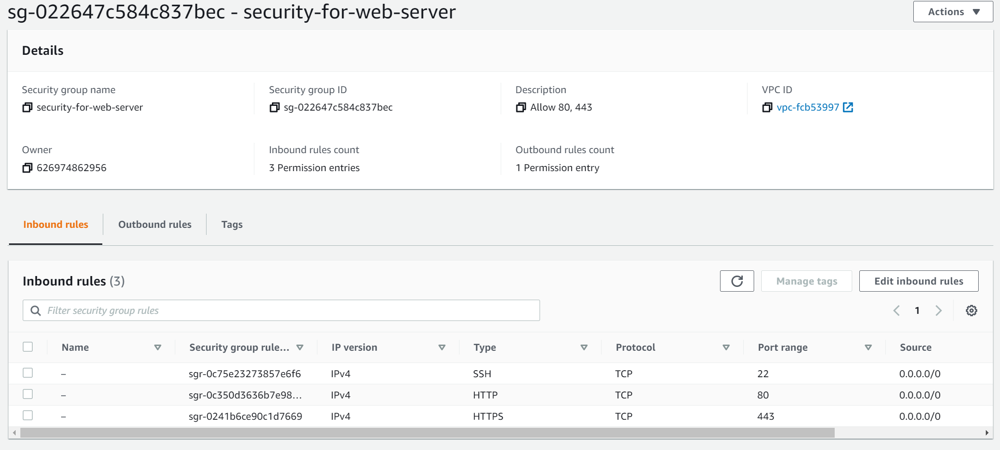
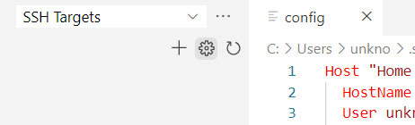
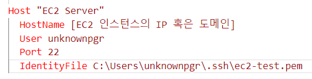
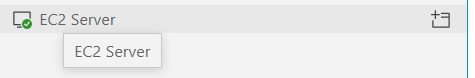

이 글에서는 EC2 인스턴스에 안전하게 VSCode SSH를 연결하는 방법을 정리합니다.

# 1. Security Group 생성



적당히 위와 같이 SSH를 허용하는 Security Group을 생성하고, EC2에 설정해줍니다.

# 2. 사용자 생성

AWS웹 콘솔을 통해 EC2 인스턴스에 접속한 후, 다음 명령어를 통해 적절한 유저를 생성해줍니다. 기본 유저 `ubuntu`를 사용하지 않는 이유는 혹시 모를 해킹을 방지하기 위해서입니다.

```bash
sudo useradd -m [사용자 이름]
sudo usermod -aG sudo [사용자 이름]
```

이후 다음 명령어를 통해 비밀번호를 생성해줍니다. 비밀번호는 반드시 매우 길고 안전하게 만들어야 합니다.

```bash
sudo passwd [사용자 이름]
```

# 3. SSH Key 생성

위 2번 과정을 통해 생성한 유저로 로그인한 후, 아래 명령어들을 통해 SSH Key를 생성해줍니다. 아래 명령어는 홈 디렉토리로 이동하신 후에(`cd ~`) 수행해주시면 됩니다. 아마 로그인하신 후 디렉토리를 이동하시지 않으셨다면 이미 이 디렉토리에 위치해있을 것입니다.

```bash
mkdir .ssh
chmod 700 .ssh
touch .ssh/authorized_keys
chmod 600 .ssh/authorized_keys
ssh-keygen -m PEM
cat .ssh/id_rsa.pub >> .ssh/authorized_keys
```

제가 본 어떤 튜토리얼에는 마지막의 `-m PEM` 옵션이 없었는데, 이것을 설정하지 않으면 SSH 클라이언트에서 private key를 인식하지 못하는 것 같습니다. 혹시 제 서버/로컬에서만 그런 것일 수도 있으니 만약 위 명령어대로 했을 때 접속이 안 되는 분이 계시다면 `-m PEM` 옵션을 설정하지 마시고 한번 시도해보시기 바랍니다.

`authorized_keys` 파일은, 그 파일 안에 `id_rsa.pub`의 내용을 적어 두면 해당 key를 통해 현재 유저로 로그인하는 것을 허용해주는 설정 파일입니다. `touch` 명령어를 통해 이 파일을 생성하지 않고 `.ssh/id_rsa.pub>.ssh/authorized_keys` 로 즉시 생성해도 별 문제가 없지만, 이렇게 하면 혹시 기존에 이미 파일이 있을 경우 덮어쓰게 될 위험이 있어 위와 같이 해 두 었습니다.

# 4. Private Key 다운로드

```bash
cat .ssh/id_rsa
```

명령어를 통해 private key를 콘솔에 출력하고, 이를 복사해둡니다. 로컬에서 `C:\Users\[User name]\.ssh` 폴더에 적당한 이름으로 키 파일을 생성합니다. 저는 아래와 같이  파일을 만들었습니다.

```
C:\Users\unknownpgr\.ssh\ec2-test.pem
```

# 5. VSCode 설정

VSCode에서 `config` 파일을 엽니다. `config` 파일을 열기 위해서는 Remote explorer extension에서 설정 버튼을 누르면 됩니다.



그러면 옵션이 여러 개 나올 텐데, 이 중에서 제일 위의 옵션을 선택하시면 됩니다. 파일이 열리면 다음과 같이 SSH 클라이언트 설정을 추가해줍니다.



# 6. 접속

이제 SSH Targets 섹션을 보면 새로운 타겟이 추가돼있습니다.



오른쪽의 새 창에서 연결하기 버튼을 누르면 바로 접속됩니다.