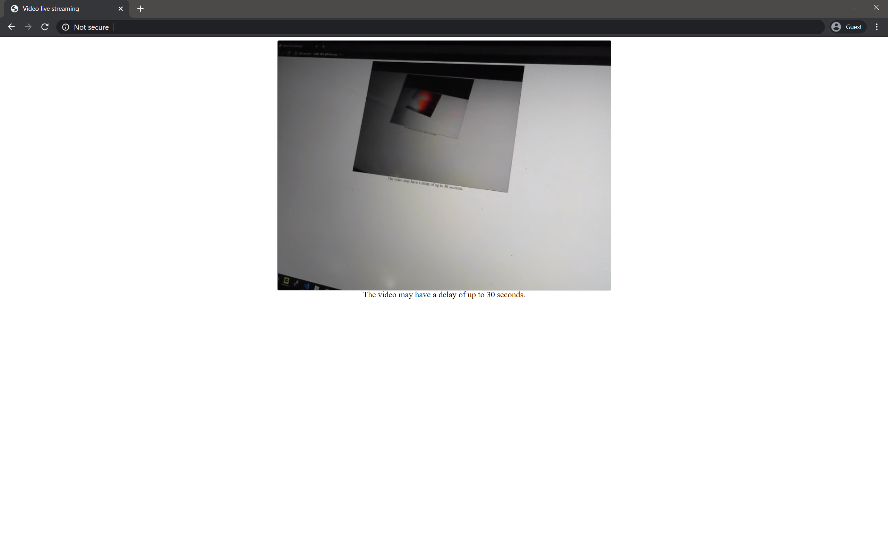

> Translated with the help of ChatGPT and Google Translator

While working on a project this time, I had to implement live streaming. You need to receive video from a camera and view it in a web browser. After Googling, I couldn't find a solution that would cleanly implement this. So I decided to implement this myself.

- [GitHub Repo](https://github.com/unknownpgr/node-webcam-streaming)

The biggest problem with video, especially live streaming, is how to receive the video and how to stream it. Fortunately, I had had similar experiences several times before and knew of two solutions.

1. Using OpenCV, etc., convert camera <u>video to image and send to client</u>. The client continuously updates and displays images. Therefore, in reality, it is not a video but just a rapidly changing image.
2. Use <u>[FFmpeg](https://ffmpeg.org/)</u>.

At first glance, solution number 1 seems quite simple and ignorant. However, in practice, the video quality and FPS are quite good, it is easy to implement (there is no need to go through the trouble of encoding), and it is especially useful when you need to do some processing on the video before sending it. However, it has the disadvantage of not being able to transmit sound. So this time I decided to implement solution number 2.

# What we did before

When I used FFmpeg in the past, I didn't know much about the protocol that enabled real-time video transmission. So I had to take a fairly low-level approach, and used the following method.

1. Convert the webcam video to webm format using FFmpeg and pipe the output stream to `stdout` to receive it from the Node.js server.
2. The Node.js server stores the received stream in a buffer.
3. When the buffer is full, put the buffer into the queue.
4. If the client requests video, the server takes the buffer out of the queue and transmits it to the client.
5. The client adds a buffer to the video tag using HTML5’s [Media Source API](https://developer.mozilla.org/en-US/docs/Web/API/MediaSource).

Looking at the commit record, this was implemented in February 2019, so it's roughly right before I graduated from high school. Now that I look at it, it is a very inefficient implementation. In the first place, two people cannot receive streaming at the same time.

# What I did this time

This time, instead of doing that, I decided to take full advantage of FFmpeg's features. The code is really simple, so you might understand it better if you look at the [source code](https://github.com/unknownpgr/node-webcam-streaming/blob/master/index.js) directly.

- FFmpeg can output using HTTP Live Streaming (HLS), which creates a `.m3u8` file and several `.ts` files as output. The `.ts` file is a segment file that divides the video into pieces, and the `.m3u8` file is a meta file that contains information about `.ts` files.
- The Node.js server just serves those files statically.
- The client uses the [hls.js](https://github.com/video-dev/hls.js#getting-started) library to view videos using the `video` tag. Of course, some browsers play the file well even if you pass the `.m3u8` file to the `src` of the `video` tag without an external library. However, this did not work in Chrome Desktop, the most major browser, so I decided to just use the library.

Below is a copy of the FFmpeg command executed in Node.js. If you have FFmpeg installed, you can just type it straight into the terminal and it will work.

```bash
ffmpeg -f v4l2 -i /dev/video0 -c:v libx264 -crf 23 -pix_fmt yuv420p -hls_time 2 -hls_list_size 5 -hls_delete_threshold 1 -hls_flags delete_segments -f hls public/video.m3u8
```

Let’s look at the factors one by one. There is also an explanation in the source code.

- `-f v4l2`: Sets the input format to v4l2 (webcam).
- `-i /dev/video0`: Read video from `/dev/video0` (webcam).
- `-c:v libx264`: Sets the output video format to `libx264`.
- `-crf 23`: Sets the Constant Rate Factor (CRF) to 23. CRF is a factor related to image quality. The lower it is, the better the image quality is. 23 is the default value.
- `-pix_fmt yuv420p`: Set the pixel format to Y:U:V = 4:2:0. This is because some players only support this format, so in practice, if you don't do this, the video will be broken in Chrome. [See explanation](https://trac.ffmpeg.org/wiki/Encode/H.264).
- `-hls_time 2`: Sets the length of the ts file to 2 seconds. (I don't know why, but this option didn't work properly on my computer, and the files were about 8 seconds long.)
- `-hls_list_size 5`: Set the length of the `.ts` file list to be included in the `.m3u8` file to a maximum of 5. This is a necessary option because it is real-time streaming. It is inefficient to include all segments, even those created a long time ago, in the `.m3u8` file, so only the most recent 5 segments are included.
- `-hls_delete_threshold 1`: Allows up to 1 segment not included in `.m3u8`. Explanation later.
- `-hls_flags delete_segments`: Delete old segments.
- `-f hls public/video.m3u8`: Output file name. This will create `.ts` files like `video.ts`.

Among the above options, `-hls_list_size`, `-hls_delete_threshold`, and `-hls_flags delete_segments` are a set of three options. The explanation is a bit complicated, but the `-hls_flags delete_segments` option is an option to delete old segments as mentioned above, and the `-hls_delete_threshold` option determines how many segments not included in `.m3u8` will be considered old. This is an option to specify.

For example, assume `hls_list_size` is 7 and `hls_delete_threshold` is 3. Then, `.m3u8` will have information about a total of 7 segments: n, n+1, n+2...n+6. At this time, because `hls_delete_threshold` is 3, segments up to n-1, n-2, and n-3 are not considered old, but from n-4 onwards are considered old. Therefore, there will always be 10 `.ts` files.

The reason why the `hls_delete_threshold` option is necessary is because although a specific segment has been deleted from the segment list of `.m3u8`, there may be clients that continue to download the segment due to problems such as Internet speed.

If you give this option, the files will be updated in real time, and the client can play real-time video as if playing a regular HLS file. Below is a screenshot.



You can view the video taken from the webcam by streaming it as HTML. (I deleted the URL because I am using a private server.)

# references

- [FFmpeg RTMP HLS conversion method](https://superuser.com/questions/714974/convert-rtmp-streaming-to-hls-streaming-using-ffmpeg)

  - The first answer was very helpful. However, among the options below, `-hls_wrap` has been deprecated. Instead, you can use `-hls_delete_threshold 1 -hls_flags delete_segments` like I did.

    ```bash
    ffmpeg -v verbose -i rtmp://host:port/stream -c:v libx264 -c:a aac -ac 1 -strict -2 -crf
    18 -profile:v baseline -maxrate 400k -bufsize 1835k -pix_fmt yuv420p -flags -global_header -hls_time
    10 -hls_list_size 6 -hls_wrap 10 -start_number 1 pathToFolderYouWantTo/streamName.m3u8
    ```

- [CRF Description](https://superuser.com/questions/677576/what-is-crf-used-for-in-ffmpeg)

- [How to receive webcam input from FFmpeg](https://trac.ffmpeg.org/wiki/Capture/Webcam)

- [How to install FFmpeg on CentOS](https://linuxize.com/post/how-to-install-ffmpeg-on-centos-8/)
