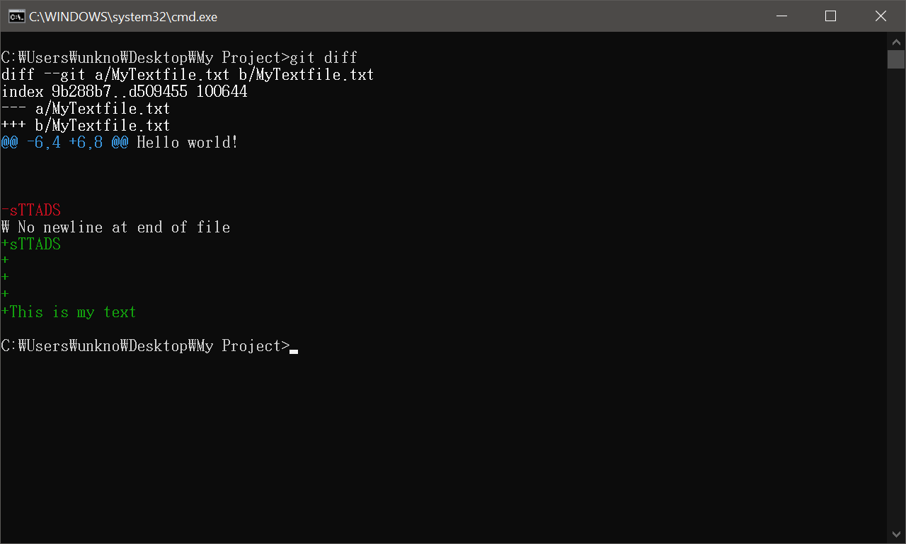

깃(Git)과 깃허브(GitHub)는 프로그래밍을 하는 사람이라면 거의 반드시 사용하는 툴입니다. 근래에는 취업 시 포트폴리오로 깃허브 계정을 제출하는 경우도 많아서, 저는 친구들이나 후배들에게 깃과 깃허브를 쓰기를 권장합니다.

 그러나 인터넷을 찾아 보면 깃과 깃허브에 대해 쉽게 설명해놓은 사이트들이 잘 나오지 않았습니다. 그래서 다른 사람에게 깃에 대해 알려줄 때 좀 더 쉽게 알려주고자, 블로그에 글로 정리해두고자 합니다.

# 🐙🧾Git은 왜 필요한가?

결론부터 말하자면, <u>Git은 프로젝트(내부의 파일들)의 버전을 관리해주는 프로그램</u>입니다.

보통 프로젝트를 진행할 때, 파일들의 특정 버전을 저장해두고 싶은 때가 있습니다. 예를 들자면,

- 프로그램을 하나 만들었더니 정상적으로 잘 동작합니다.
- 그런데 이때 새로운 기능을 추가하고 싶은데, 이 기능을 추가하다가 기존의 내용을 망쳐버릴 수도 있습니다.
- 그래서 이 버전을 다른 곳에 저장해뒀다가, 혹시라도 실패하면 가져와서 복구합니다.

또는 이런 경우도 있습니다.

- 프로젝트 진행 과정을 기록해두고 싶습니다.
- 그래서 예를 들자면, 일주일에 한 번씩 사본을 만들어 저장해둡니다.

이때 사람들은 아래와 같이 파일 이름을 바꾸어서 관리하곤 합니다.

(이 이미지를 [퍼온 곳](https://bbs.ruliweb.com/community/board/300712/read/19635391)을 보면, 이런 작업과 관련된 온갖 고충을 다 볼 수 있습니다...)

바로 이럴 때 Git이 필요합니다. 깃은 이런 버전 작업을 매우 쉽게 관리할 수 있도록 도와줍니다.

# 🖨그냥 파일을 복사하면 안 되는가?

파일을 그대로 복사하는 방식에는 약간 문제가 있습니다.

- 대부분의 파일들이 수천 줄의 텍스트로 이루어졌고, 여러 개의 파일들을 동시에 수정하기 때문에 눈으로 보아서는 <u>무엇이 달라졌는지 알기가 아주 힘듭니다.</u> 디자인에서는 큰 차이가 없다면 별 문제가 없을 수 있지만, 프로그래밍에서는 단 한 글자만 바꾸더라도 프로젝트 전체가 전혀 작동하지 않을 수도 있습니다. (e.g. 세미콜론을 빼 먹는다던가...)

- 버전을 많이 만들면 많이 만들수록 <u>용량이 매우 빠르게 커집니다.</u> 예를 들어 200MB짜리 프로젝트를 다섯 번만 백업하더라도 벌써 1GB가까운 크기가 됩니다.

- 한 명의 사람이 파일 하나를 완전히 맡아 진행하는 디자인과 다르게, 프로그래머는 <u>협업을 하는 경우</u>가 많습니다. 그런 경우 상당히 일이 복잡해집니다.

  - 원본 버전에서 `개발자 A`가 파일 `a,b,c`를 수정해서 버전 `A1`을 만들었습니다.
  - `개발자 B`는 파일 `b,c,d`를 수정해서 버전 `B1`을 만들었습니다. 심지어 `b`와 `c`는 `개발자 A,B`모두 동시에 수정한 파일들입니다.
  - 이제 이걸 하나의 파이널 버전으로 합쳐야 하는데...음...

  사실 이런 경우야 `개발자 A,B`가 모여서 하루 날 잡고 합치면 됩니다.

  - 그런데 만약 개발자가 30명이나 되고, 파일이 2만개정도 된다면?
  - 모든 개발자가 원본으로부터 개발을 시작한 게 아니라, `개발자 A`가 만든 `A1`버전으로부터 `개발자 B`가 `B1` 버전을 만들고, `B1`으로부터 `개발자 C`가 `C1`을 만들고, `A1`과 `C1`을 합친 후 `개발자 B`가 `B2`를 다시 만들고, 그것을 다시 `A1`에 합치고....와 같이 된다면?
  - 그 와중에 프로젝트 전체 크기가 10GB나 된다면? 그래서 프로젝트를 다른 사람 컴퓨터로 복사하기만 해도 오랜 시간이 걸린다면?

프로젝트가 커질수록 이런 문제들이 발생하면서, 정작 버전 관리가 개발하는 것보다 더 힘들어집니다. 이렇게 기존 방법들의 문제점을 나열한 이유는, <u>Git이 바로 이런 문제점을 해결하기 위해서 존재</u>하기 때문입니다. 깃에는 branch 등 복잡한 기능들이 많이 있습니다. 그런 기능들이 필요한 배경을 먼저 알고 공부하면 그런 기능을 익히기 더 쉬울 것입니다.

# ⚙ Git은 어떻게 동작하는가?

먼저 Git이 설치되어있다는 가정 하에 실제로 설명드리겠습니다. [코딩팩토리 블로그 글](https://coding-factory.tistory.com/245)을 보시면 설명이 잘 되어 있습니다.

## 리포지토리 만들기

앞서 깃은 프로젝트 버전을 관리해주는 프로그램이라고 설명했었습니다. 그러려면 각 버전들이 어딘가에 저장이 돼야 할 텐데요. 그 <u>버전들이 저장되는 곳을 `Repository(리포지토리, 저장소)`라고 부릅니다.</u> 이제 아래와 같이 프로젝트 폴더를 하나 만들고, 이 프로젝트에 리포지토리를 만들어보겠습니다.

프로젝트 폴더에서 커맨드라인 창을 열어줍니다. 파워쉘도 괜찮습니다. 파워쉘을 열기 위해서는 `Shift`키를 누른 채로 우클릭을 하면 메뉴에 파워쉘 열기 버튼이 있을 것입니다.

이후 열린 커맨드라인에서 `git init` 커맨드를 입력해줍니다. 그러면 아래와 같이 깃 리포지토리가 초기화되었다는 메시지가 뜹니다.

이제 깃을 사용할 준비가 다 되었습니다.

그런데 프로젝트 폴더를 보시면 아무 것도 변한 게 없습니다. 분명히 리포지토리를 생성했다고 했는데, 어떻게 된 걸까요?

이는 숨김 파일을 보이도록 해 보면 알 수 있습니다.

위와 같이 `.git`이라는 숨겨진 디렉토리가 보입니다. 이 숨겨진 디렉토리 안에 깃 설정 정보, 각 버전들 등 여러 데이터가 들어 있습니다. 물론 저 폴더 안에 단순히 프로젝트 전체의 사본이 날짜별로 들어있거나 한 것은 아닙니다. 이는 아래 Git Workflow 섹션에서 설명하겠습니다.

## 파일 상태

Git은 파일들을 아래 이미지에서 보이는 세 가지 단계로 관리합니다. (정확히는 `파일`을 관리하는 것이 아니라 `변경사항`을 관리하는 것입니다. 그러나 이 글은 기초적인 개념을 소개하는 글이므로 이는 생략하겠습니다.)

`Working Directory`는 우리가 작업하고 있는 디렉토리를 말합니다. 그냥 프로젝트 폴더입니다.

`Repository`는 앞서 보았듯이 버전들이 저장되는 장소입니다.

`Staging Area`는 약간 헷갈리는 개념입니다. 간단히는 `Working Directory`와 `Repository` 사이에 있는 임시 저장 공간이라고 생각하시면 됩니다. 좀 차이가 있기는 합니다만, 블로그에 글을 작성할 때, 작성을 완료해서 포스팅하기 전에 임시 저장 단계가 있습니다. 그런 거라고 생각하시면 됩니다.

(사실 `Staging Area`는 버전 관리에서 꼭 필요한 것은 아니라서, Git외의 다른 버전 관리 시스템에서는 이 기능이 없는 경우도 있습니다.)

포스트 임시 저장과 `Staging Area`의 차이는, 포스트는 임시 저장 없이 바로 포스팅할 수 있지만 깃에서는 반드시 임시저장을 해야 하고, <u>임시저장을 한 내용만 새로운 버전으로 만들 수 있다는 것입니다.</u>

### Working Directory

그러면 프로젝트에서 내 파일들이 어떤 단계에 있는지 확인해보겠습니다. 커맨드라인에 `git status`를 입력하면 다음과 같이 파일의 상태가 나옵니다.

파일이 `Untracked files`라고 되어 있는데, `Untracked` 혹은 `Modified`, `Deleted`는 임시 저장해둔 `Staging Area`의 내용과 `Working Directory`의 내용이 다르다는 것을 알려줍니다.

- 우리는 아직 `Staging Area`에 아무것도 저장을 하지 않았기 때문에 임시 저장소에는 `MyTextFile.txt`자체가 없습니다. 그럴 경우 `untracked`가 표시됩니다.
- 만약  `Staging Area`에 파일이 있기는 한데, 그 내용이 다를 경우는 `modified`가 표시됩니다.
-  `Staging Area`에는 파일이 있는데 `Working Directory`에는 파일이 없다면 `deleted`가 표시됩니다.

### Staging Area

`MyTextFile.txt`파일을 임시저장하려면 `git add MyTextfile.txt`과 같이 `git add`이후에 원하는 파일 이름을 입력하면 됩니다. 만약 프로젝트 폴더 안에 있는 모든 파일들을 전부 임시저장하려면 `git add .`과 같이 파일 이름 대신 점을 쓰면 됩니다. 보통 파일을 일일이 저장하는 것은 매우 귀찮기 때문에, 특별한 일이 없으면 후자를 사용합니다.

이후 `git status`를 입력하여 파일의 상태를 확인해보면 `Changes to be committed`섹션으로 파일이 이동해있습니다. 이는 파일이 `Staging Area`에 임시 저장되었다는 의미입니다. 여기에서는 파일 앞에 `new file`이라고 표시됩니다. 이것 역시 아까와 유사하게 `Repository`와 `Staging Area`의 내용이 다르다는 것을 알려줍니다.

- 우리는 임시저장만 하고 어떤 버전도 생성하지 않았기 때문에 `Repository`에는 `MyTextFile.txt`가 없습니다. 그럴 경우 `new file`이라고 뜹니다.
- 아까와 비슷하게 `Repository`에 파일이 있기는 한데 `Staging Area`와 내용이 다를 경우 `modified`가 표시됩니다.
- `Repository`에는 파일이 있는데 `Staging Area`에는 없을 경우에는 `deleted`라고 표시됩니다.

이제 파일들을 임시저장했기 때문에, 드디어 새로운 버전을 만들 수 있습니다.

### Repository

여태까지 우리가 만들었던 리포지토리는 비어있던 상태였습니다. 이제 리포지토리에 새로운 버전을 추가해보겠습니다. 버전을 만드는 작업을 `Commit(커밋)`이라고 합니다.

`git commit -m "Initial commit"` 명령어를 입력해줍니다. 뒤에 `Initial commit`부분은 각 버전에 붙는 설명인데, 이를 커밋 메시지라 합니다. 보통 이 버전이 이전 버전에서 무엇을 수정한 것인지를 써 줍니다. 우리는 맨 처음 버전을 만드는 것이고, 이전 버전이 없기 때문에 저렇게 써 주었습니다. 예를 들어 새로운 기능을 추가했다면 `Add new feature ~~`과 같이 커밋 메시지를 쓸 수 있습니다.

그러면 아래와 같이 이 버전에서 어떤 일이 이루어졌는지를 알려주는 로그가 뜹니다.

메시지의 내용은 그냥 그렇구나~하고 넘기시면 됩니다. 아직 `브랜치`나 `변경 사항`에 대한 내용을 다루지 않았기 때문입니다.

어쨌든 이제 새로운 버전을 만들었기 때문에, 언제든 이 버전으로 다시 돌아오거나, 이 버전과 다른 버전을 비교할 수 있습니다. 새로운 버전을 추가하고 싶으면 아래 과정을 반복하면 됩니다.

1. 파일을 추가하거나 내용을 변경하는 등 여러 작업 수행
2. `git add . `명령어를 통해 `Staging Area`로 임시저장
3. `git commit -m "Some message"`명령어를 통해 새로운 커밋(버전) 생성

그래서 보통 깃을 다룰 때에는 `버전`이라는 말보다는 `커밋`이라는 말을 자주 사용합니다. *변경 사항을 커밋해서...*처럼 새로운 버전을 만들었다는 의미의 동사로 사용하기도 하고, *이전 커밋을 보면...*처럼 버전이라는 의미의 명사로 사용하기도 합니다. 앞으로는 버전이라는 말 대신 커밋이라는 말을 사용하도록 하겠습니다.

## 예시

다음과 같은 과정을 수행해보겠습니다.

1. 새로운 파일 추가
2. git add . / git commit하여 새로운 커밋 생성
3. 파일의 내용을 수정
4. git add .
5. 파일을 삭제
6. git status

그러면 아래와 같이 표시됩니다.

- 3번 단계에서 파일을 수정한 후 `git add`를 수행하여 임시저장을 했습니다. 그러므로 `Changes to be committed` 섹션에는 `Repository`와 `Staging Area`에서 파일의 내용에 차이가 있으므로 `modified`가 표시됩니다.
- 5번 단계에서 파일을 삭제했지만, `git add`를 수행하지는 않았습니다. 그러므로 `Staging Area`에는 여전히 파일이 있으나 `Working Directory`에는 파일이 없습니다. 따라서 아래쪽 섹션에는 `deleted`가 표시됩니다.

## Git Workflow

그런데 맨 처음에 설명할 때, 사본을 만들 때의 단점 중 하나가 용량이 매우 커진다는 점이었습니다. 그리고 Git이 이런 문제를 해결했다고도 언급했는데, 어떻게 사본을 많이 만들면서도 용량을 적게 쓸 수 있을까요?

이는 Git이 내부적으로는 `commit`을 할 때 모든 내용을 전부 다 저장하는 것이 아니라, <u>변경된 내용이 무엇인지만 저장</u>하기 때문입니다.

- 100M나 되는 매우 큰 텍스트 파일이 있다고 가정해봅시다.
- 이때 이 파일의 123번째 줄이 `ASDF`였는데 이를 `ㅁㄴㅇㄹ`로 바꾸었습니다.
- 그러면 Git은 새로운 커밋을 만들 때에는 `123번째 줄이 ASDF에서 ㅁㄴㅇㄹ로 바뀌었음` 이라는 정보만 저장합니다.

이와 같이 Git의 각 커밋은 바로 이전 커밋으로부터 어떤 차이가 있는지만을 저장하고 있습니다. 위 리포지토리 만들기 섹션에서 `.git`폴더 안에 프로젝트의 사본이 들어있는 것은 아니라고 말했습니다. 그게 바로 이런 이유에서입니다.

물론 그렇다고 해서 옛날 버전으로 돌아가기 위해서 각 커밋을 하나하나 취소해야 한다거나 하지는 않습니다. 우리가 사용할 때에는 마치 프로젝트 전체가 백업된 것처럼 사용하면 됩니다.

### Git Diff

추가로, 두 커밋 사이에 어떤 변화가 생겼나 확인하는 방법을 알려드리겠습니다.

먼저 `git log`를 사용하면 아래와 같이 어떤 커밋들이 있었는지 그 리스트를 볼 수 있습니다.

각 커밋은 위에 보이는 `91156f75...`와 같은 고유 번호가 있습니다.

이제 `git diff 커밋1고유번호 커밋2고유번호`를 입력하면 두 커밋의 차이를 볼 수 있습니다. 물론 저 긴 문자들을 다 입력할 필요는 없고 맨 앞의 네다섯 글자 정도만 입력해주면 됩니다.

만약 그냥 `git diff`를 입력하면 현재 `Working Directory`의 내용과 가장 최근 커밋을 비교하여 보여줍니다.

# 다음엔?

순서는 좀 다를 수 있지만 아래와 같은 내용을 포스팅해보려 합니다.

- GitHub란?
- Branch란?
- 공동 작업하기

물론 되돌리기(Revert), Checkout 등 깃의 중요한 기능을 전혀 다루지 않았습니다. 그러나 그런 것들은 깃의 근본적인 원리만 이해했다면 다른 사람들이 설명해둔 내용을 보고 쉽게 이해할 수 있습니다. 반대로 깃의 원리를 이해하지 못하고 기능만 알고 사용한다면, 깃을 비효율적으로 사용하게 될 뿐만 아니라 오류가 나는 일(보통 커밋이 꼬인다고 함)이 많아집니다. (경험담)

개인적으로는 [pro Git book 한국어판](https://git-scm.com/book/ko/v2)이 목차별로 정리가 잘 되어 있어 좋은 것 같습니다.

# 요약

## 깃으로 새로운 버전(커밋)만드는 방법

1. 커맨드라인에 `git init` 입력하여 초기화
2. 원하는 작업 수행
3. `git add .`입력하여 임시저장
4. `git commit -m "커밋 메시지"`입력하여 커밋.

## 깃 / 커밋의 이해

- 깃은 버전 관리 시스템.
- 버전을 만드는 과정, 또는 그렇게 만들어진 각 버전을 커밋이라 부름.
- 커밋은 프로젝트의 모든 정보를 담고 있는 것이 아니라, 이전 커밋과의 차이점만을 담고 있음.
- 이 커밋들이 저장되는 장소를 리포지토리(Repository)라 부름. 약간 다르기는 하지만, 대충 `.git`디렉토리 안에 있다고 생각하면 됨.

# 더 알아보기

아래는 깃을 효율적으로 사용하기 위해 알면 좋은 것들입니다. 구체적인 사용법은 구글에 물어보시면 좋습니다.

- `.gitignore` : 이 파일에 적힌 파일이나 폴더는 데스노트처럼, 깃이 아예 없는 것처럼 관리합니다. 굳이 저장할 필요 없는 파일들(e.g. 임시파일/로그파일 등)을 여기 적어두면 좋습니다.
- `GitHub Desktop` : 깃헙에서는 깃을 GUI로 사용할 수 있는 프로그램을 제공합니다. 커맨드라인보다 사용하기가 훨씬 편리합니다.
- `VSCode에서 Git사용하기` : VS코드에서는 아예 내부적으로 깃을 관리할 수 있는 GUI를 제공합니다. 코딩하면서 깃도 관리할 수 있어서, 개인적으로는 `GitHub Desktop`보다 이것을 훨씬 더 많이 사용합니다.