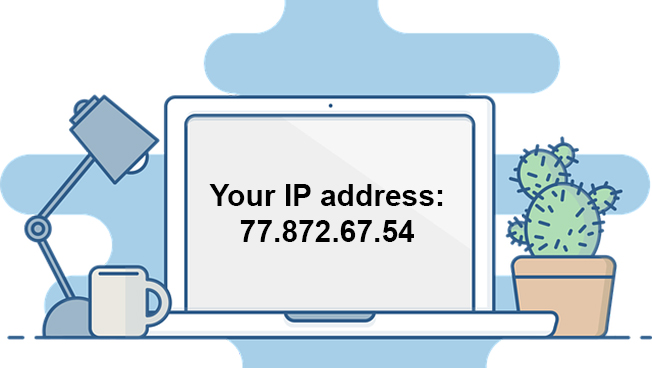

#  공인 IP 주소란 무엇인가?

네트워크에 관심이 있는 사람이라면 누구나 공인 IP 주소와 사설 IP 주소가 무엇인지 알고 있습니다. 공인 IP 주소란 인터넷에서 대상을 식별할 수 있는 고유한 주소이고, 사설 IP주소는 인터넷이 아닌 사설망에서 사용하는 주소입니다.

# 사설 IP 주소의 할당 방법

네트워크를 잘 공부한 사람이라면 보통 사설 IP주소가 어떻게 할당되는지에 대해서는 잘 알고 있습니다. 라우터에서 DHCP를 통해 각 컴퓨터에게 주소를 할당할 수도 있고, 아니면 그냥 컴퓨터가 자신의 IP주소를 마음대로 설정해버릴 수도 있습니다. 물론 네트워크 내의 IP 주소 중 다른 컴퓨터와 겹치지 않는 IP 주소를 골라야 합니다. 그렇지 않으면 충돌이 발생할 것이고, 그 경우 정상적으로 네트워킹이 이루어지지 않습니다. (보통 IP가 겹칠 경우, 늦게 설정한 컴퓨터의 네트워크 접속이 차단됩니다.) 

# 공인 IP 주소의 의문점

그런데 저는 IP에 대해 가만히 생각해보다가, 몇 가지 궁금한 것이 생겼습니다.

## 어떤 매커니즘으로 겹치지 않는가?

일단 공인 IP주소는 어떻게 할당되는 걸까요? 전 세계의 그 어떤 컴퓨터도 동일한 공인 IP주소를 가지고 있지 않습니다. 어떻게 이런 일이 가능한 걸까요?

## 다른 사람의 IP 주소를 훔쳐오는 것은 왜 불가능한가?

그리고 생각해보면, 사설 네트워크에서는 다른 사람의 주소를 훔쳐오는 것이 가능합니다.

1. 어떤 컴퓨터 A가 주소 a를 사용 중이다.
2. A컴퓨터가 꺼졌다.
3. B컴퓨터가 A가 꺼진 틈을 타, 자신의 주소를 a로 설정한다.
4. A컴퓨터가 켜졌다.
   - 만약 A컴퓨터가 DHCP를 사용한다면 다른 주소를 할당받을 것이다.
   - 만약 고정 IP 주소를 사용 중이었다면, B 컴퓨터가 이미 그 주소를 사용중이므로 A컴퓨터는 네트워크 접속이 차단된다.

그런데 가만히 생각해보면 인터넷은 거대한 단일 네트워크이므로 이와 똑같은 일이 가능하지 않을까요? 우리 아랫집의 공인 IP 주소를 알아내서, 그 컴퓨터가 꺼져있는 동안 내가 그 주소를 사용하면 나는 공인 IP를 구매하지 않아도 그 사람인 척 하고 무료로 인터넷을 쓸 수 있지 않을까요?

## 우리집과 아랫집은 어떻게 구분되는가?

마지막으로, 인터넷 요금은 분명히 각 세대별로 부과됩니다. 세대별로 인터넷을 개통하거나 끊을 수도 있습니다. 이게 어떻게 가능한 걸까요? 어떻게 통신사에서는 우리집과 바로 아랫집을 구분하는 걸까요?

믈론 IP주소를 기준으로 구분하는 것이 아니냐고 생각할 수도 있습니다만, 일반적으로 통신사에서 부여하는 IP주소는 유동적으로 바뀌기 때문에 IP로 세대를 특정하는 것은 불가능합니다. 또 인터넷이 개통되지 않았을 때에는 애초에 IP주소가 할당되지 않았기 때문에 IP주소를 바탕으로 IP주소를 할당하게 되는 모순이 발생합니다.

# 해답

위 모든 의문의 해답은 IP 주소의 할당 구조를 천천히 살펴봄으로써 알 수 있었습니다.

1. 모든 IP주소의 초기 소유권은 Internet Assigned Numbers Authority(IANA) 라는 단체가 가지고 있습니다. 이 단체는 각 대륙별로 사용가능한 IP 주소 범위를 할당합니다.
2. 각 대륙별 주소 관리 기관에서는 다시 각 국가별로 IP 주소 범위를 할당합니다.
3. 각 국가별 주소 관리 기관에서는 Internet Service Provider (ISP)들에게 IP 주소를 할당해줍니다. 그러므로 ISP는 국가를 대신하여 IP 주소 할당을 할 수 있으며, 따라서 [관리대행자](https://xn--3e0bx5euxnjje69i70af08bea817g.xn--3e0b707e/jsp/business/management/isCurrent.jsp)라고도 합니다.

다음으로 이러한 관리대행자가 어떻게 인터넷을 할당하는지 알아보겠습니다.

사실 그 답은 생각해보니까 쉽게 알 수 있었는데, 바로 모든 가정과 통신사가 1:1로 연결되어있다는 것이었습니다. 언듯 생각하기에는 모든 가정의 모든 주소를 통신사와 1:1로 연결하는 것은 불가능해보이지만, 사실은 그런 서비스가 이미 있습니다. 바로 가정에서 사용되는 전화입니다. (저는 세대상 전화 모뎀(Dial-up MODEM)이라는 것이 이미 사라지고 난 후에 태어난 세대라 바로 여기까지 생각이 미치지 못했었습니다.)

아주 오래 전, 모든 통신이 전화 모뎀을 사용해서 공급되었을 때를 생각해보면 당연히 전화 회선 단위로 통신이 공급되었을 것이고, 통신사는 전화번호를 통해서 모든 세대를 구분할 수 있었을 것입니다.물론 이때의 컴퓨터 통신은 우리가 말하는 인터넷 혹은 WWW가 아니라 전화를 걸어 서버에 직접 1:1로 접속하는 Virtual Terminal 방식이었으며, 따라서 IP주소같은 것은 없었습니다. (IP라는 말 자체가 Internet Protocol 입니다.)

이후 ADSL/VDSL 등을 거쳐 전화선을 대신하는 전용 인터넷선이 들어오게 되었고, 현재는 Fiber to the Home (FTTH) 기술이 보급되어 심지어 광통신이 각 세대까지 들어오고있습니다. 그럼에도 통신의 본질은 달라지지 않아서 각 통신사는 각 세대의 FTTH MODEM과 1:1로 연결되어있고 모뎀의 MAC주소를 이용하여 세대를 구분합니다. 이렇게 1:1로 연결되는 통신 방법을 Point to Point Protocol (PPP)라 합니다.

물론 앞서 말한 1:1로 연결되어있다는 것은 논리적으로 그렇다는 것이고, 실제로는 수천만 개나 되는 선들이 전부 연결될 수는 없습니다. 실제로는 아파트의 네트워크 장비실 등에 광통신을 중개할 수 있는 라우터가 장치되어있으며, 외부에서는 물리적으로 단일 회선이 들어와서 내부에서 라우터를 통해서 여러 회선으로 쪼개집니다.

이렇게 물리적으로는 하나의 회선을 공유하지만 논리적으로는 PPP를 구현하기 위한 방법으로 Point to Point Protocol over Ehernet (PPPoE)이라는 기술이 있습니다. 이는 일반적인 ethernet을 이욯하여 PPP를  구현하는 기술입니다.

# 결론

- 어떤 매커니즘으로 공인 IP 주소가 겹치지 않는가?
  - IANA로부터 피라미드 형식으로 IP 주소가 할당되기 때문이다.
- 다른 사람의 IP 주소를 훔쳐오는 것은 왜 불가능한가? 우리집과 아랫집은 어떻게 구분되는가?
  - 각 세대의 모뎀은 통신사와 논리적으로 1:1 회선으로 연결돼있기 때문에 통신사는 각 회선별로 인터넷 공급을 제어할 수 있다. 따라서 사설 네트워크와 다르게 다른 회선이 사용 중인 IP를 사용하는 것은 불가능하다.
- 그 회선은 어쨌든 물리적으로 동일한 선로를 통해 연결되는데 어떻게 각 회선을 구분하는가?
  - 모뎀의 MAC을 기준으로 구분한다.
  - 그러므로 아랫집의 모뎀을 훔쳐 오면 그 사람의 인터넷을 무료로 쓸 수 있다.

# 참고문헌

- [https://en.wikipedia.org/wiki/Point-to-Point_Protocol_over_Ethernet](https://en.wikipedia.org/wiki/Point-to-Point_Protocol_over_Ethernet)
- [https://community.fs.com/blog/pppoe-vs-dhcp-what-is-the-difference.html](https://community.fs.com/blog/pppoe-vs-dhcp-what-is-the-difference.html)
- [https://namu.wiki/w/VT](https://namu.wiki/w/VT)
- [https://namu.wiki/w/ADSL](https://namu.wiki/w/ADSL)
- [https://namu.wiki/w/FTTH](https://namu.wiki/w/FTTH)
- [https://xn--3e0bx5euxnjje69i70af08bea817g.xn--3e0b707e/jsp/business/management/piList.jsp](https://xn--3e0bx5euxnjje69i70af08bea817g.xn--3e0b707e/jsp/business/management/piList.jsp)