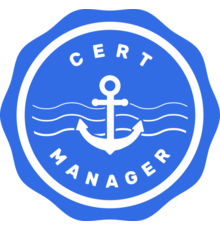

저번 포스팅에서 Traefik을 이용하여 일반(http) Ingress를 구축하는 과정을 정리습니다. 이번 포스팅에는 Cert Manager를 사용하여 자동으로 Widcard Domain에 대한 Certification을 생성하는 과정을 정리해보고자 합니다.



# Cert-Manager

먼저 아래 커맨드를 사용하여 Cert-Manager를 배포해줍니다.

```bash
helm repo add stable https://charts.helm.sh/stable
helm repo update
helm install cert-manager --namespace cert-manager stable/cert-manager
```

그러면 Cert-Manager deployment와 함께 다양한 CRD들이 설정됩니다. 그중 중요한 세 가지 CRD가 있는데, 아래와 같습니다.

- Certificate
- Issuer
- ClusterIssuer

## Certificate

먼저 Certificate란 직역하자면 '증명', 혹은 '증명서' 라는 뜻으로 어떤 사실을 확인해주는 문서를 말합니다. TLS를 구축할 때 certificate라 함은 특정 도메인을 소유하고 있음을 증명하는 전자 증명서로 우리가 흔히 도메인 인증서라고 부르는 바로 그 문서입니다. 이 인증서는 원래 신뢰할 만한 기관에서 각종 검사를 거친 후 발행하는 것이었지만, Let's encrypt와 Certbot을 사용하면 그런 복잡한 절차 없이 자동으로 도메인 인증서를 발급받고 갱신할 수 있습니다.

쿠버네티스에서 Certificate는 아래와 같은 리소스로 표현됩니다.

```yaml
apiVersion: cert-manager.io/v1alpha2
kind: Certificate
metadata:
  name: <CERT_NAME>
spec:
  secretName: <SECRET_NAME>
  dnsNames:
  	- <DNS_NAMES_HERE>
  	# 아래 두 행은 DNS 이름의 예시입니다.
    - server.unknownpgr.com
    - *.server.unknownpgr.com
  issuerRef:
    name: <ISSUER_NAME>
    kind: <ISSUER_KIND>
```

이 리소스를 생성하면 아래 설명할 Issuer에 의해 인증 절차가 진행된 후 인증서가 발급됩니다. 그러면 `<SECRET_NAME>` 이라는 이름의 시크릿이 생성되어 거기에 인증서 정보가 저장됩니다.

이때 중요한 부분은 와일드카드 도메인의 설정 방법입니다. 위 Certificate의 `dnsNames` 필드를 보면  `*.server.unknownpgr.com`이라는 부분을 볼 수 있습니다. 이 부분이 바로 와일드카드 도메인을 설정하는 방법으로, 이렇게 애스터리스크를 앞에 붙여 주면 asdf.server.unknownpgr.com과 같은 모든 서브도메인을 한 번에 인증하는 인증서를 발급받을 수 있습니다. 즉, 이 와일드카드 인증서 하나만 발급받아놓으면 서비스를 만들 때 매번 Certificate를 새로 생성할 필요 없이 간단히 관리가 가능해집니다.

다만 이런 편리함이 있어서인지 와일드카드 도메인 인증서를 발급받는 것은 쉽지만은 않습니다. 아래 자세히 설명하겠습니다.

## Issuer

Issuer는 Certificate Authorities(CA), 즉 인증 기관을 나타내는 리소스입니다. Issuer는 Certificate를 발급하는 주체이며, Certificate를 발급하기 위해, 즉 자신이 특정 도메인을 소유했음을 증명하기 위해 특수한 과정을 수행하는데 이를 Challenge라 합니다.

Challenge에는 다양한 종류가 있습니다만 대표적으로 `http-01` Challenge와 `dns-01` Challenge가 사용됩니다.

> 쿠버네티스에서는 Challenge 역시 하나의 리소스로 표현되기는 합니다만 사용자가 직접 생성하지 않기 때문에 넘어가겠습니다.

### http-01

이 Challenge는 매우 간단합니다. ACME 클라이언트(=도메인을 소유하고 있다고 증명하고 싶은 사람)가 Let's encrypt로부터 특정한 토큰을 발급받은 후, 그 토큰을 도메인의 최상단 디렉토리에 `http://<YOUR_DOMAIN>/.well-known/acme-challenge/<TOKEN>`와 같이 파일 형태로 올려놓습니다. 그러면 Let's encrypt는 그 도메인으로 접속해서 진짜로 특정 파일이 존재하고, 그 파일의 내용이 자신이 발급한 토큰과 일치하는지를 확인합니다. 그래서 내용이 일치하면 인증서를 발급받을 수 있습니다.

### dns-01

이 Challenge는 비교적 복잡합니다. 만약 도메인을 완전히 소유하고 있다면, 그 도메인에 여러가지 레코드를 설정할 수 있을 것입니다. `dns-01` Challenge는 이를 이용합니다. 이번에는 `http-01` 방식과 마찬가지로 토큰을 발급받은 후 이 토큰을 `_acme-challenge.<YOUR_DOMAIN>`라는 이름의 TXT 레코드 안에 집어넣습니다. 이후 Let's encrypt에서 DNS 쿼리를 수행하여 실제로 이러한 TXT 레코드가 존재하고 그 내용이 자신이 발급한 토큰과 일치함이 확인되면 인증서를 발급받을 수 있습니다.

그런데 이렇게만 보면 `dns-01` 도 별로 복잡해보이지 않습니다. 하지만 위 내용은 모두 사람이 직접 수행하는 것이 아니라 Certbot이라는 프로그램이 대신 수행해줍니다. 사람은 단지 이메일, 도메인 등 간단한 정보만을 Certbot에 넘겨주면 됩니다. 이때 `http-01`은 자동화하기가 비교적 편하지만, `dns-01`은 DNS provider가 DNS 레코드를 수정할 수 있는 API를 제공하는 경우에만 사용할 수 있습니다. 그래서 설정이 상당히 까다롭습니다. 그런데 와일드카드 도메인은 오직 `dns-01` 방식을 사용할 경우에만 발급받을 수 있습니다. 그래서 저는 `dns-01` 방식을 어쩔 수 없이 사용하였습니다.

> 아래 설명은 AWS Route53 DNS Provider를 기준으로 합니다. Cert-Manager 공식 홈페이지에 [여러가지 DNS Provider에 따른  `dns-01` Challenge 설정 방법](https://cert-manager.io/docs/configuration/acme/dns01/)이 나와 있습니다.

이 방식을 사용하려면 먼저 DNS provider에서 DNS 레코드를 수정할 수 있는 계정을 생성해야 합니다. 아래와 같은 Permission을 가진 IAM계정을 생성합니다.

```json
{
  "Version": "2012-10-17",
  "Statement": [
    {
      "Effect": "Allow",
      "Action": "route53:GetChange",
      "Resource": "arn:aws:route53:::change/*"
    },
    {
      "Effect": "Allow",
      "Action": [
        "route53:ChangeResourceRecordSets",
        "route53:ListResourceRecordSets"
      ],
      "Resource": "arn:aws:route53:::hostedzone/*"
    },
    {
      "Effect": "Allow",
      "Action": "route53:ListHostedZonesByName",
      "Resource": "*"
    }
  ]
}
```

다음으로 이 계정의 Access key를 발급받아 아래와 같이 Secret으로 저장해줍니다.

```bash
# 환경 변수로 설정
AWS_SECRET_ACCESS_KEY=<SECRET_ACCESS_KEY>
# 파일로 저장
echo ${AWS_SECRET_ACCESS_KEY} > secret-access-key
# 시크릿 생성
kubectl create secret generic aws-route53-creds --from-file=secret-access-key --namespace cert-manager
# 파일 삭제
rm secret-access-key
```

다음으로 Issuer를 생성해줍니다.

```yaml
apiVersion: cert-manager.io/v1
kind: Issuer
metadata:
  name: le-wildcard-issuer
spec:
  acme:
    server: https://acme-staging-v02.api.letsencrypt.org/directory
    # server: https://acme-v02.api.letsencrypt.org/directory
    email: <YOUR_EMAIL>
    privateKeySecretRef:
      name: le-wildcard-issuer
    solvers:
      - dns01:
          route53:
            region: <YOUR_REGION>
            accessKeyID: <YOUR_ACCESS_KEY_ID>
            secretAccessKeySecretRef:
              name: aws-route53-creds
              key: secret-access-key
```

 위 Issuer를 보면 server 부분이 두 줄이며 하나가 주석처리되어있습니다. 이렇게 한 이유는 Let's encrypt 서버의 하루 인증 횟수에 제한이 있기 때문입니다. 맨 처음에 인증을 수행하다 보면 실패하는 경우가 많으므로 횟수 제한이 없는 staging 서버를 사용하여 여러 번 실패해본 후, 성공적으로 staging 인증서를 발급받고 나면 위 주석 처리한 부분만 바꾸어서 production용 인증서를 발급받으면 됩니다. (staging certificate는 브라우저에서 self-signed certificate와 마찬가지로 신뢰할 수 없다고 뜹니다.)

이후에는 위 Certificate 부분을 참고하여 Certificate를 생성하면 됩니다.

## ClusterIssuer

앞서 설명한 Issuer는 namespaced resource로, 하나의 네임스페이스 안에서만 사용할 수 있습니다. 그러나 클러스터 내에서 여러 네임스페이스에 똑같은 작업을 반복하려면 번거로우므로 모든 네임스페이스에서 접근하여 사용할 수 있도록 한 것이 ClusterIssuer입니다.

## Treafik 연동

이제 이렇게 Certificate를 발급받았으면 Traefik과 연동해야 할 것입니다. Traefik은 아래와 같이 IngressRoute에서 tls 필드를 지정해주는 것만으로 https termination을 해 줍니다.

```yaml
apiVersion: traefik.containo.us/v1alpha1
kind: IngressRoute
metadata:
  name: ingress-route-tls
spec:
  entryPoints:
    - websecure
  routes:
  - match: Host(`whoami.server.unknownpgr.com`)
    kind: Rule
    services:
    - name: whoami
      port: 80
  tls:
    secretName: cert-wildcard
```


# 참고 문헌

- [https://letsencrypt.org/docs/challenge-types/](https://letsencrypt.org/docs/challenge-types/)
- [https://www.scaleway.com/en/docs/tutorials/traefik-v2-cert-manager/](https://www.scaleway.com/en/docs/tutorials/traefik-v2-cert-manager/)
- [https://www.padok.fr/en/blog/traefik-kubernetes-certmanager](https://www.padok.fr/en/blog/traefik-kubernetes-certmanager)
- [https://blog.devgenius.io/quickstart-with-traefik-v2-on-kubernetes-e6dff0d65216](https://blog.devgenius.io/quickstart-with-traefik-v2-on-kubernetes-e6dff0d65216)
- [https://doc.traefik.io/traefik/https/acme/](https://doc.traefik.io/traefik/https/acme/)
