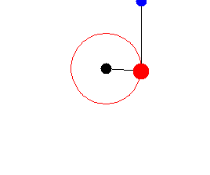

> Translated with the help of ChatGPT and Google Translator

I studied Lagrange mechanics briefly a while ago. I think I did it because I needed to do some complicated physics calculations during my senior year of high school, when everything was fun except for my studies, but I don't really remember what I was trying to do. I think it was probably to simulate a double pendulum.

Anyway, I'm going to use this again this time, so I'd like to organize it this time.

# calculus of variations

Lagrange mechanics uses a branch of mathematics called <u>variation calculus</u>, which is an extension of general calculus.

The method of variation deals with <u>functional functions</u>, which are functions whose domain is a set of functions. Of course, conjugate space can also be multiple sets, but this article will only deal with cases where conjugate space is a real number. In other words, if the set of functional functions that will be discussed in this article is $\mathbb{F}$, and the set of real numbers is $\mathbb{R}$, then $J:\mathbb{F}\rightarrow\mathbb{R} $ refers to the function. Examples of simple functional functions include:

$$
J[f] = \int_0^1(f(t))^2dt
$$

The functional function $J$ in the above formula takes a function $f$ as a parameter (assuming $f$ is a real function) and returns a real number.

In calculus, when there is a function, we investigate the relationship between slight changes in the value of the function due to slight changes in its parameters. Likewise, in the calculus of variation, when there is a slight change in the _function_, which is the parameter, we deal with what is the relationship with the <u>slight change (variation) of the functional function</u>. In particular, it is important to make the functional function the maximum or minimum. This maximum or minimum value is called <u>stationary value</u>, and the function that makes the functional function maximum or minimum is called the <u>stationary function or stationary point<. It is called /u>. For example, the above function has a commutation value of $0$ only when $f=0$, and $f=0$ becomes the commutation point (or commutation function).

# Euler-Lagrange equation

Of course, there are many important principles in the calculus of variation that I am not aware of, but the Lagrangian mechanics we will cover is mainly derived from an important equation called <u>Euler-Lagrange equation</u>.

The Euler-Lagrange equation is an equation for finding the stationary point of a functional function $S$ that looks like the formula below for a certain function $q$.

$$
S(q)=\int_a^bL(t,q(t),q'(t))dt
$$

At this time, $L$ is an arbitrary three-variable function for which all partial derivatives are continuous. (It is a general function. It is not a functional function.) And, of course, $q$ must be differentiable. For example, assuming $L(a,b,c)=a^2+c$, the above formula can be written as follows.

$$
S(q)=\int_a^bt^2+q'(t)dt
$$

(In this case, it is not difficult to see that $S(q)=q(b)-q(a)+(b^3-a^3)/3$.)

And if a certain stationary point of this type of functional function $S$ is called $q_0$, then $q_0$ satisfies the following equation.

$$
\frac{\partial L}{\partial q_0}-\frac{d}{dt}\frac{\partial L}{\partial q_0'}=0
$$

This equation is called the Euler-Lagrange equation.

## Basic lemma of variational calculus

In order to prove the Euler-Lagrange equation, you must first know the basic lemma of the calculus of variations. The basic lemma of the method of variation is,

- $f:[a,b]\rightarrow\mathbb{R}$ is a continuous function

- If the following holds true for any Compactly supported smooth function $\eta$
  $$
  \int_a^bf(x)\eta(x)dx=0
  $$
- $f(x)=0$.

This is the theorem.

In fact, in some ways, it seems quite natural. No matter what you multiply and integrate with $f$, if it is always 0, then $f$ is 0.

### proof

Actually, I am a computer science major, not a math major, so I don't know much about the condition of compactly supported smooth. However, after researching, it seems to be okay to consider it as infinitely differentiable across all real numbers (continuous across all real numbers, with no diverging values).

Let us prove this using the reductio ad absurdum method. In other words, $\int_a^bf(x)\eta(x)dx=0$ for any $\eta$, but at least some $x_0$ exists, such that $f(x_0)\not=0$. Suppose $f$ exists.

First, let us consider the case where $f(x_0)>0$.

Then, since $f$ is a continuous function, by the definition of a continuous function, there exists an interval $[c,d]$ that contains at least one $x_0$, so for $x$ where $x\in[c,d]$, $ It satisfies f(x)>0$. Of course $[c,d]\subset[a,b]$.

At this time, let us consider the following function:

$$
\eta(x) = ((x-c)(x-d))^4 \text{ where }x\in[c,d]\\
\eta(x) = 0 \text{ else}
$$

This function is a compactly supported smooth function. then

$$
\int_a^bf(x)\eta(x)dx\\
=\int_a^cf(x)\eta(x)dx+\int_c^df(x)\eta(x)dx+\int_d^bf(x)\eta(x)dx\\
=\int_c^df(x)\eta(x)dx
$$

When taking the interval $[c,d]$, it was set so that $f>0$, and since $\eta>0$, $\int_c^df(x)\eta(x)dx>0$ holds true. and therefore $\int_a^bf(x)\eta(x)dx>0$. However, this contradicts the initial assumption $\int_a^bf(x)\eta(x)dx=0$. So the assumption is false and no such $f$ exists.

Likewise, we can prove that $f(x_0)<0$.

### A little easier proof(?)

After thinking about it, I think that many of the functions handled in physics (especially mechanics) are compactly supported and smooth. Therefore, let’s add one more constraint that $f$ is compactly supported smooth.

In that case, if $\eta=f$, $\eta(x)f(x)=(f(x))^2\geq0$, so $\int_a^bf(x)\eta(x)dx\geq0$ , and we can intuitively see that the equal sign holds only when $f=0$.

## Proof of Euler-Lagrange equation

Before looking at functional functions, let's look at general functions first. In calculus, a vector function $f(\bold{x}):\mathbb{R}^n\rightarrow\mathbb{R}$ is said to be infinitesimal (or maximum) at $\bold{x}_0$. For $\bold{x}$

$$
\lim_{h\rightarrow0}\frac{f(\bold{x}_0+h\bold{x})-f(\bold{x}_0)}{h}=\frac{df(\bold{x }_0+h\bold{x})}{dh}=g(h)
$$

This refers to the case where $g(0)=0$. (Actually, you can write $f'(\bold{x}_0)=0$, but I deliberately introduced a new function called $g(h)$ to make it the same as when dealing with the functional functions below.) In other words, that point Even if a small change was made in a random direction in the surrounding area, if the amount of change was 0, it was considered an extreme point.

Likewise, the rectified value of a functional function can be thought of similarly.

Let’s take another look at the functional function described above. (**From now on, various variables appear, such as $t, h, q, \eta$, etc. The first two are real numbers, and the last two are functions. ** To avoid confusion as much as possible, if it is a function, use $q_0(t)$ I tried to indicate that it was a function and its parameters as much as possible.)

$$
S(q)=\int_a^bL(t,q(t),q'(t))dt
$$

If $q_0$ is a stationary point of the functional function $S$, that is, it minimizes or maximizes $S$, then any differentiable function $\eta$ such that $\eta(a)=\eta(b)=0$ will satisfy the following (similarly to the case of vector functions):

$$
\text{Let }\lim_{h\rightarrow0}\frac{S(q_0(t)+h\eta(t))-S(q_0(t))}{h}=\frac{dS(q_0(t )+h\eta(t))}{dh}=g(h)\\
\text{Then, }g(0)=0
$$

This means that even if the function $q_0$ is slightly changed by adding a very small function called $h\eta$, there will be no significant difference in the amount of change in $S$.

Now, let’s resubstitute the original expression into $S$ and organize it.

$$
\frac{dS(q_0+h\eta)}{dh}\\
=\frac{d\left(\int_a^bL(t,q_0(t)+h\eta(t),q_0'(t)+h\eta'(t))dt\right)}{dh}\ \
=\int_a^b\frac{L(t,q_0(t)+h\eta(t),q_0'(t)+h\eta'(t))}{dh}dt
$$

The integral equation may look complicated, but it has a lot of characters, but it is nothing more than the pre-differentiation of a multivariate function. Let's develop this once.

$$
\frac{L(t,q_0(t)+h\eta,q_0'(t)+h\eta'(t))}{dh}\\
=\frac{\partial L}{\partial t}\frac{\partial t}{\partial h}
+\frac{\partial L}{\partial (q_0(t)+h\eta(t))}\frac{\partial (q_0(t)+h\eta(t))}{\partial h}
+\frac{\partial L}{\partial (q_0'(t)+h\eta'(t))}\frac{\partial(q_0'(t)+h\eta'(t))}{\ partial h}
$$

The ceremony has become more complicated. However, there is a hidden trap here: when differentiating, such as $df(x)/dt$, when the variable of the function being differentiated and the variable being differentiated are different from each other, The point is that it becomes 0. For example, in the first term $\frac{\partial L}{\partial t}\frac{\partial t}{\partial h}$, if $\frac{\partial t}{\partial h}$ , it becomes 0. If we cancel all the terms that become 0, we can obtain a relatively neat equation as shown below. (From now on, there will be less confusion with parameters, so I will omit the function parameter $(t)$ to improve readability. However, since $L$ is a general function, not a general function, it can only receive scalars as parameters, and therefore <u>Please note that you are not passing the function itself as a parameter, but rather the function value</u>.)

$$
\eta\frac{\partial L}{\partial (q_0+h\eta)}
+\eta'\frac{\partial L}{\partial (q_0'+h\eta')}
$$

Let's put this back into the integral symbol.

$$
\frac{dS(q_0+h\eta)}{dh}=\int_a^b\eta\frac{\partial L}{\partial (q_0+h\eta)}
+\eta'\frac{\partial L}{\partial (q_0'+h\eta')}dt=g(h)
$$

Now let's go back to the very beginning.

> If $q_0$ is a stationary point of the functional function $S$, that is, it minimizes or maximizes $S$, then any differentiable function $\eta such that $\eta(a)=\eta(b)=0$ For $ we will be satisfied with:
>
> $$
> \text{Let }\lim_{h\rightarrow0}\frac{S(q_0+h\eta)-S(q_0)}{h}=\frac{dS(q_0+h\eta)}{dh}= g(h)\\
> \text{Then, }g(0)=0
> $$

Therefore, let’s say $g(0)=0$. Then we get the equation below:

$$
\int_a^b\eta\frac{\partial L}{\partial q_0}
+\eta'\frac{\partial L}{\partial q_0'}dt=g(0)=0
$$

Here, let's do a partial integration on the second term to eliminate $\eta'$. The partial integration formula is as follows.

$$
\int_a^b g(t)f'(t)dt=\left[g(t)f(t)\right]_a^b-\int_a^b g'(t)f(t)dt
$$

Let's do partial integration by setting $\eta=f$, $\frac{\partial L}{\partial q_0'}=g$.

$$
\int_a^b\eta(t)\frac{\partial L}{\partial q_0}+\eta'(t)\frac{\partial L}{\partial q_0'}dt\\
=\int_a^b\eta(t)\frac{\partial L}{\partial q_0}dt+\left[\eta(t)\frac{\partial L}{\partial q_0'}\right]_a^b -\int_a^b\eta(t)\frac{d}{dt}\frac{\partial L}{\partial q_0'}dt\\
=\int_a^b\eta(t)\frac{\partial L}{\partial q_0}-\eta(t)\frac{d}{dt}\frac{\partial L}{\partial q_0'}dt+ \left[\eta(t)\frac{\partial L}{\partial q_0'}\right]_a^b\\
=\int_a^b\left[\frac{\partial L}{\partial q_0}-\frac{d}{dt}\frac{\partial L}{\partial q_0'}\right]\eta(t) dt+\left[\eta(t)\frac{\partial L}{\partial q_0'}\right]_a^b=0
$$

However, first defining $\eta$

> ...if we maximize, for any differentiable function $\eta$ such that $\eta(a)=\eta(b)=0$...

I said so. Therefore, the second term becomes 0, and it can be simply summarized as follows.

$$
\int_a^b\left[\frac{\partial L}{\partial q_0}-\frac{d}{dt}\frac{\partial L}{\partial q_0'}\right]\eta(t)dt =0
$$

Now it is time to write the basic lemma of the calculus of variation that we proved earlier. $\eta$ is not a special function, but an arbitrary differentiable function. According to the basic lemma of the calculus of variations, for a function to always be 0 when multiplied by an arbitrary function and integrated, the function must be 0.

$$
\frac{\partial L}{\partial q_0}-\frac{d}{dt}\frac{\partial L}{\partial q_0'}=0
$$

From this we get the Euler-Lagrange equations. If you go up to the top and look at the part that introduces the Euler-Lagrange equations, you can see that they have exactly the same form.

# references

## Wikipedia

- [Lagrange mechanics](https://ko.wikipedia.org/wiki/%EB%9D%BC%EA%B7%B8%EB%9E%91%EC%A3%BC_%EC%97%AD%ED %95%99)
- [Euler-Lagrange equation](https://ko.wikipedia.org/wiki/%EC%98%A4%EC%9D%BC%EB%9F%AC-%EB%9D%BC%EA%B7% B8%EB%9E%91%EC%A3%BC\_%EB%B0%A9%EC%A0%95%EC%8B%9D)
- [Division of Variations](https://ko.wikipedia.org/wiki/%EB%B3%80%EB%B6%84%EB%B2%95)
- [Function](https://ko.wikipedia.org/wiki/%EB%B2%94%ED%95%A8%EC%88%98)

## Namu Wiki

- [Division of Variations](https://namu.wiki/w/%EB%B3%80%EB%B6%84%EB%B2%95#s-3)
