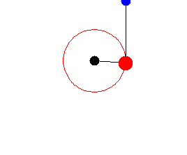

예전에 라그랑주 역학을 잠깐 공부했었습니다. 아마도 고3때 내신 공부 빼고 다 재미있었을 시절에 뭔가 복잡한 물리 계산을 할 필요가 있어 그랬었던 것 같은데 뭘 하려 했었는지는 잘 기억나지 않습니다. 아마도 이중 진자를 시뮬레이션하기 위해서였던 것 같기는 합니다.

어쨌든 이번에 이걸 다시 써먹을 일이 생겨서 이번에 한 번 정리해두고자 합니다.

# 변분법

라그랑주 역학은 <u>변분법</u>이라는, 일반적인 미적분을 확장한 수학 분야를 사용합니다.

변분법은 <u>범함수</u>라는 것을 다루는데, 범함수란 함수들의 집합을 정의역으로 갖는 함수를 말합니다. 물론 공역 역시 여러 집합이 될 수 있겠지만 이 글에서는 공역이 실수인 경우만을 다룰 것입니다. 즉, 이 글에서 다룰 범함수란 함수들의 집합을 $\mathbb{F}$라 하고, 실수 집합을 $\mathbb{R}$라 하면 $J:\mathbb{F}\rightarrow\mathbb{R}$ 인 함수를 말합니다. 간단한 범함수의 예시로는 다음과 같은 것이 있습니다.
$$
J[f] = \int_0^1(f(t))^2dt
$$
위 수식의 범함수 $J$는 어떤 함수 $f$를 매개변수로 받고($f$는 실함수라고 가정할 때), 실수를 반환합니다.

미적분에서는 어떤 함수가 있을 때 그 매개변수의 미소 변화에 따른 함숫값의 미소 변화가 어떤 관계가 있는지를 조사합니다. 마찬가지로 변분법에서도 그 매개변수인 *함수*의 미소 변화가 있을 때, <u>범함수의 미소 변화(변분)</u>와 어떤 관계가 있는지를 다룹니다. 특히 범함수를 최대나 최소로 만드는 경우가 중요한데, 이러한 최대값이나 최소값을 <u>정류값</u>이라 하며 범함수를 최대나 최소가 되게 하는 함수를 <u>정류함수 또는 정류점</u>이라 합니다. 예를 들어, 위의 함수의 경우 유일하게 $f=0$인 경우에 정류값 $0$을 가지며, $f=0$이 정류점(또는 정류함수)이 됩니다.

# 오일러-라그랑주 방정식

물론 변분법에는 제가 모르는 수많은 중요한 원리들이 있겠지만 우리가 다룰 라그랑주 역학은 주로 <u>오일러-라그랑주 방정식</u>이라는 중요한 방정식으로부터 유도됩니다.

오일러 라그랑주 방정식이란 어떤 함수 $q$에 대한 아래 수식처럼 생긴 범함수 $S$의 정류점을 찾기 위한 방정식입니다.
$$
S(q)=\int_a^bL(t,q(t),q'(t))dt
$$
이때 $L$은 모든 편미분이 연속인 임의의 3변수 함수입니다.(일반적인 함수입니다. 범함수가 아닙니다.) 그리고 물론 $q$는 미분가능해야 합니다. 예를 들어, $L(a,b,c)=a^2+c$라고 가정하면, 위 수식은 아래와 같이 쓸 수 있겠습니다.
$$
S(q)=\int_a^bt^2+q'(t)dt
$$
(이 경우 어렵지 않게 $S(q)=q(b)-q(a)+(b^3-a^3)/3$임을 알 수 있습니다.)

그리고 이러한 형태의 범함수 $S$의 어떤 정류점이 $q_0$라고 하면 $q_0$는 다음 방정식을 만족합니다.
$$
\frac{\partial L}{\partial q_0}-\frac{d}{dt}\frac{\partial L}{\partial q_0'}=0
$$
이 방정식을 오일러-라그랑주 방정식이라 부릅니다.

## 변분법의 기본 보조정리

오일러-라그랑주 방정식을 증명하기 위해서는 먼저 변분법의 기본 보조정리를 알아야 합니다. 변분법의 기본 보조정리란,

- $f:[a,b]\rightarrow\mathbb{R}$이 연속함수이고

- Compactly supported smooth 한 임의의 함수 $\eta$에 대해 다음이 성립한다면
  $$
  \int_a^bf(x)\eta(x)dx=0
  $$
  
- $f(x)=0$이다.

라는 정리입니다.

사실 어떻게 보면 되게 당연해보입니다. $f$와 무엇을 곱해서 적분하든 반드시 0이라면 $f$는 0이다.

### 증명

사실 저는 컴퓨터과학 전공이지 수학 전공이 아니므로 compactly supported smooth라는 조건에 대해 잘 알지 못합니다. 그러나 조사해본 바 모든 실수에서 무한번 미분가능(모든 실수에서 연속이며 발산하는 값 없음)한 것으로 간주해도 괜찮을 것 같습니다.

이것을 귀류법을 사용해서 증명해보도록 하겠습니다. 즉, 그 어떤 $\eta$에 대해서도 $\int_a^bf(x)\eta(x)dx=0$이지만, 적어도 어떤 $x_0$가 존재하여 $f(x_0)\not=0$인 그런 신기한 $f$가 존재한다고 가정해보겠습니다.

먼저 $f(x_0)>0$인 경우를 고려해보겠습니다.

그러면 $f$는 연속함수이므로 연속함수의 정의상 적어도 하나의 $x_0$를 포함하는 어떤 구간 $[c,d]$가 존재하여 $x\in[c,d]$인 $x$에 대해 $f(x)>0$를 만족합니다. 물론 $[c,d]\subset[a,b]$입니다.

이때 다음과 같은 함수를 생각해보겠습니다.
$$
\eta(x) = ((x-c)(x-d))^4 \text{ where }x\in[c,d]\\
\eta(x) = 0 \text{ else}
$$
이 함수는 compactly supported smooth한 함수입니다. 그러면
$$
\int_a^bf(x)\eta(x)dx\\
=\int_a^cf(x)\eta(x)dx+\int_c^df(x)\eta(x)dx+\int_d^bf(x)\eta(x)dx\\
=\int_c^df(x)\eta(x)dx
$$
가 되는데, 구간 $[c,d]$를 잡을 때 $f>0$이 되도록 잡았고, 또한 $\eta>0$이므로 $\int_c^df(x)\eta(x)dx>0$이 성립하며 따라서 $\int_a^bf(x)\eta(x)dx>0$입니다. 그런데 이는 맨 처음에 했던 가정 $\int_a^bf(x)\eta(x)dx=0$과 모순됩니다. 따라서 가정이 거짓이며 그런 $f$가 존재하지 않습니다.

마찬가지로 $f(x_0)<0$인 경우를 증명할 수 있습니다.

### 좀 더 쉬운 증명(?)

가만히 생각해봤는데, 물리학(특히 역학)에서 다루는 함수는 상당수가 compactly supported smooth할 것이라 생각됩니다. 그러므로 $f$가 compactly supported smooth라는 제약을 하나 더 추가해봅시다.

그럴 경우 $\eta=f$라 두면 $\eta(x)f(x)=(f(x))^2\geq0$이므로 $\int_a^bf(x)\eta(x)dx\geq0$이고 등호는 오직 $f=0$일 때에만 성립함을 직관적으로 알 수 있습니다.

## 오일러-라그랑주 방정식의 증명

일단 범함수를 살펴보기 전에 일반적인 함수를 먼저 살펴봅시다. 미적분학에서는 어떤 벡터함수 $f(\bold{x}):\mathbb{R}^n\rightarrow\mathbb{R}$이 $\bold{x}_0$에서 극소(혹은 극대)라 함은 임의의 $\bold{x}$에 대해
$$
\lim_{h\rightarrow0}\frac{f(\bold{x}_0+h\bold{x})-f(\bold{x}_0)}{h}=\frac{df(\bold{x}_0+h\bold{x})}{dh}=g(h)
$$
라 할 때 $g(0)=0$인 경우를 말하는 것이었습니다. (사실 $f'(\bold{x}_0)=0$이라고 써도 되지만 아래 범함수를 다룰 때와 똑같은 형태로 만들기 위해 일부러 $g(h)$라는 새로운 함수를 도입했습니다.) 즉, 그 점 주변에서 임의의 방향으로 미소한 변화를 주더라도 변화량이 0일 경우 극점이라고 생각했었습니다.

마찬가지로 범함수의 정류값 역시 비슷하게 생각할 수 있습니다.

위에 서술했던 범함수를 다시 한번 살펴봅시다. (**앞으로는 변수가 $t,h,q,\eta$등 여러가지가 나옵니다. 앞의 두 가지는 실수이며 뒤의 두 가지는 함수입니다.** 최대한 헷갈리지 않도록 함수일 경우 $q_0(t)$와 같이 최대한 함수임과 그 매개변수임을 나타내도록 했습니다.)
$$
S(q)=\int_a^bL(t,q(t),q'(t))dt
$$
만약 $q_0$가 범함수 $S$의 정류점이라면, 즉 $S$를 최소화하거나 최대화한다면, $\eta(a)=\eta(b)=0$인 임의의 미분가능한 함수 $\eta$에 대해 (벡터함수의 경우와 유사하게)다음을 만족할 것입니다.
$$
\text{Let }\lim_{h\rightarrow0}\frac{S(q_0(t)+h\eta(t))-S(q_0(t))}{h}=\frac{dS(q_0(t)+h\eta(t))}{dh}=g(h)\\
\text{Then, }g(0)=0
$$
이는 함수 $q_0$에 $h\eta$라는 아주 작은 함수를 더해서 미소하게 변화시킨다 하더라도 $S$의 변화량에는 별 차이가 없을 거라는 의미입니다.

그러면 이제 $S$에 원래 식을 다시 대입한 후 정리해보도록 하겠습니다.
$$
\frac{dS(q_0+h\eta)}{dh}\\
=\frac{d\left(\int_a^bL(t,q_0(t)+h\eta(t),q_0'(t)+h\eta'(t))dt\right)}{dh}\\
=\int_a^b\frac{L(t,q_0(t)+h\eta(t),q_0'(t)+h\eta'(t))}{dh}dt
$$
적분되는 식은 복잡해 보이지만 문자가 많아서 그렇지 다변수함수의 전미분에 불과합니다. 이걸 한 번 전개해보겠습니다.
$$
\frac{L(t,q_0(t)+h\eta,q_0'(t)+h\eta'(t))}{dh}\\
=\frac{\partial L}{\partial t}\frac{\partial t}{\partial h}
+\frac{\partial L}{\partial (q_0(t)+h\eta(t))}\frac{\partial (q_0(t)+h\eta(t))}{\partial h}
+\frac{\partial L}{\partial (q_0'(t)+h\eta'(t))}\frac{\partial(q_0'(t)+h\eta'(t))}{\partial h}
$$
식이 더 복잡해져버렸습니다. 그러나 여기에는 함정이 숨어 있는데 바로 $df(x)/dt$처럼 미분할 때 미분되는 함수의 변수와 미분하는 변수가 서로 다를 경우 0이 된다는 점입니다. 예를 들어 첫 번째 항의 $\frac{\partial L}{\partial t}\frac{\partial t}{\partial h}$에서 $\frac{\partial t}{\partial h}$이 그런 경우로, 0이 됩니다. 이렇게 0이 되는 항들을 전부 소거하면 아래와 같이 비교적 깔끔하게 정리된 식을 얻을 수 있습니다. (앞으로는 매개변수로 헷갈릴 일이 별로 없으므로 가독성을 높이기 위해 함수의 매개변수 $(t)$를 생략하겠습니다. 그러나 $L$은 범함수가 아니라 일반 함수이므로 반드시 스칼라만을 매개변수로 받을 수 있고, 따라서 <u>함수 자체를 매개변수로 넘기는 것이 아니라 함숫값을 넘기는 것임</u>을 유의하시기 바랍니다.)
$$
\eta\frac{\partial L}{\partial (q_0+h\eta)}
+\eta'\frac{\partial L}{\partial (q_0'+h\eta')}
$$
이걸 다시 적분 기호 안으로 집어넣겠습니다.
$$
\frac{dS(q_0+h\eta)}{dh}=\int_a^b\eta\frac{\partial L}{\partial (q_0+h\eta)}
+\eta'\frac{\partial L}{\partial (q_0'+h\eta')}dt=g(h)
$$
이제 다시 맨 처음의 논의로 돌아가봅시다. 

> 만약 $q_0$가 범함수 $S$의 정류점이라면, 즉 $S$를 최소화하거나 최대화한다면, $\eta(a)=\eta(b)=0$인 임의의 미분가능한 함수 $\eta$에 대해 다음을 만족할 것입니다.
> $$
> \text{Let }\lim_{h\rightarrow0}\frac{S(q_0+h\eta)-S(q_0)}{h}=\frac{dS(q_0+h\eta)}{dh}=g(h)\\
> \text{Then, }g(0)=0
> $$
> 

그러므로 $g(0)=0$이라고 둬 봅시다. 그러면 아래 식을 얻습니다.
$$
\int_a^b\eta\frac{\partial L}{\partial q_0}
+\eta'\frac{\partial L}{\partial q_0'}dt=g(0)=0
$$
여기서 $\eta'$을 없애주기 위해 두 번째 항에 부분적분을 한 번 해봅시다. 부분적분 공식은 아래와 같습니다.
$$
\int_a^b g(t)f'(t)dt=\left[g(t)f(t)\right]_a^b-\int_a^b g'(t)f(t)dt
$$
$\eta=f$, $\frac{\partial L}{\partial q_0'}=g$로 놓고 부분적분을 해보겠습니다.
$$
\int_a^b\eta(t)\frac{\partial L}{\partial q_0}+\eta'(t)\frac{\partial L}{\partial q_0'}dt\\
=\int_a^b\eta(t)\frac{\partial L}{\partial q_0}dt+\left[\eta(t)\frac{\partial L}{\partial q_0'}\right]_a^b-\int_a^b\eta(t)\frac{d}{dt}\frac{\partial L}{\partial q_0'}dt\\
=\int_a^b\eta(t)\frac{\partial L}{\partial q_0}-\eta(t)\frac{d}{dt}\frac{\partial L}{\partial q_0'}dt+\left[\eta(t)\frac{\partial L}{\partial q_0'}\right]_a^b\\
=\int_a^b\left[\frac{\partial L}{\partial q_0}-\frac{d}{dt}\frac{\partial L}{\partial q_0'}\right]\eta(t)dt+\left[\eta(t)\frac{\partial L}{\partial q_0'}\right]_a^b=0
$$
그런데 처음에 $\eta$를 정의하기를

> ...최대화한다면, $\eta(a)=\eta(b)=0$인 임의의 미분가능한 함수 $\eta$에 대해...

라고 했었습니다. 그러므로 두 번째 항은 0이 되고, 아래와 같이 간단하게 정리됩니다.
$$
\int_a^b\left[\frac{\partial L}{\partial q_0}-\frac{d}{dt}\frac{\partial L}{\partial q_0'}\right]\eta(t)dt=0
$$

이제 앞서 증명했던 변분법의 기본 보조정리를 쓸 차례입니다. $\eta$는 특별한 함수가 아니고 미분가능한 임의의 함수입니다. 변분법의 기본 보조정리에 따라 어떤 함수가 임의의 함수와 곱해서 적분했을 때 항상 0이 되려면 그 함수는 0이어야만 합니다.
$$
\frac{\partial L}{\partial q_0}-\frac{d}{dt}\frac{\partial L}{\partial q_0'}=0
$$
이로부터 오일러-라그랑주 방정식을 얻습니다. 맨 위로 올라가서 오일러-라그랑주 방정식을 소개한 부분을 보면 완벽히 똑같은 형태임을 알 수 있습니다.

# 참고문헌

## 위키백과

- [라그랑주 역학](https://ko.wikipedia.org/wiki/%EB%9D%BC%EA%B7%B8%EB%9E%91%EC%A3%BC_%EC%97%AD%ED%95%99)
- [오일러-라그랑주 방정식](https://ko.wikipedia.org/wiki/%EC%98%A4%EC%9D%BC%EB%9F%AC-%EB%9D%BC%EA%B7%B8%EB%9E%91%EC%A3%BC_%EB%B0%A9%EC%A0%95%EC%8B%9D)
- [변분법](https://ko.wikipedia.org/wiki/%EB%B3%80%EB%B6%84%EB%B2%95)
- [범함수](https://ko.wikipedia.org/wiki/%EB%B2%94%ED%95%A8%EC%88%98)

## 나무위키

- [변분법](https://namu.wiki/w/%EB%B3%80%EB%B6%84%EB%B2%95#s-3)

