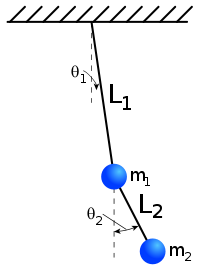

> Translated with the help of ChatGPT and Google Translator

In the last post, we learned about the method of variation, which is the mathematical basis for using Lagrange mechanics. In this post, we will cover what is called a generalized coordinate system.

# What is a generalized coordinate system?

So what is the difference between a generalized coordinate system and a simple coordinate system?

The term <u>coordinates</u> we commonly use refers to a number system that represents a location. For example, the location of our country is approximately 127 degrees east longitude and 38 degrees north latitude. If expressed in tuple format, it can be written as (127E,38N). This is a spherical coordinate system and is used to specify a point on a sphere. Also, in engineering, a Cartesian coordinate system is often used, which is based on the distance from the origin in each axis direction.

However, in physics, there are times when this coordinate system is inconvenient. This is the case when there are <u>constraints</u>.

## Constraints

In physics, <u>constraints</u> are any constraints that limit the movement of an object. Let's give several examples to help you understand.

1. In the case of a balloon floating in an infinitely large three-dimensional space, there are no constraints limiting its position. So, in order to accurately know the location of this device, you must know all three coordinates $x,y,z$. You can use a spherical coordinate system based on distance from the observer, azimuth, and altitude, but no matter what special coordinate system you use, you must know the three values to determine the location of the instrument.

2. But let’s think about a cable car hanging in a three-dimensional space. This cable car must move along a straight cable given by $x=2y=z3$, and cannot move freely beyond the cable. In this case, you can accurately determine the location of the cable car by knowing only one of the $x,y,z$ values. This is because if you only know one of the three, the remaining values are determined from that. In this case, the ‘cable’ becomes a constraint that limits the movement of the cable car. From this example, you can see that when constraints are introduced, fewer coordinates are needed to determine the position.

3. Of course, not all constraints are the same. Consider a car moving in a two-dimensional plane. In the case of this car, it can go anywhere in a two-dimensional plane if you take the time, but locally it can only move back and forth. With a car facing forward, it would not be possible to just move to the right without changing direction. (It would have been really easy to park if that were the case.) This is also a kind of constraint.

4. The train case also has good constraints. When a train runs on the ground (with different elevations), you need to know three values: latitude, longitude, and altitude to know the exact location of the train. However, since trains can only run on rails, in reality, you only need to know the distance from the starting point to pinpoint the train's location. (Let's assume there is no crossroads, etc.) This is also a constraint condition.

## Holonomic confinement and non-holonomic confinement

These constraints can be divided into holonomic constraints and non-holonomic constraints. Holonomic constraint is a constraint in which the constraints depend only on the position and time of the object, as in numbers 2 and 4 of the examples above. (However, neither examples 2 nor 4 depend on time.) In other words, the constraint in which the positional relationship of $n$ particles can be expressed as follows is called holonomic constraint.

$$
f(x_0,y_0,z_0,x_1,y_1,z_1,...,x_n,y_n,z_n,t)=0
$$

In the cable car in example 2, there were two constraints as shown below (although expressed as one equation).

$$
x-2y=0\\
2y-3z=0
$$

On the other hand, non-holonomic constraints refer to constraints that depend not only on the location and time of the object but also on other factors, as in condition 3. In example 3, <u>direction</u> is included in the constraint condition, so this corresponds to a non-holonomic constraint.

## degrees of freedom

The minimum number of coordinates to express the position of an object is called <u>degrees of freedom</u>. As can be seen in the example above, holonomic constraints reduce the object's degrees of freedom. More precisely, when a $d$ dimensional system with $n$ particles has $k$ holonomic constraints, the system has $nd-k$ translational degrees of freedom. In the cable car example above, we can mathematically confirm that in a 3D system with 1 particle, there are 2 constraints, so $nd-k=1$, and therefore the degree of freedom is 1.

In the first paragraph, I said that ordinary coordinate systems can be inconvenient in physics, and here's why. This is because constraints reduce the degrees of freedom, allowing the system to be analyzed using much fewer variables.

## Generalized coordinates

In order to efficiently analyze a system when there are constraints like this, it is essential to describe a system! A collection of only the necessary $nd-k$ variables is called a <u>generalized coordinate system</u>. The most intuitive example is the double pendulum.

In the case of a two-dimensional double pendulum like the picture above, a total of four coordinate values ($x,y$ coordinates of the first pendulum, $x,y$ coordinates of the second pendulum) are required to represent it. However, the pendulum has the following two constraints:

$$
x_1^2+y_1^2=L_1^2\\
(x_1-x_2)^2+(y_1-y_2)^2=L_2^2
$$

Therefore, if you calculate it, you can see that this system can be described with only two variables because it has a degree of freedom of $nd-k=2\times2-2=2$. In the picture above, the variable, that is, the generalized coordinate system, is set to $\theta_1,\theta_2$, which is the angle that each pendulum makes with the vertical line.

Of course, a generalized coordinate system only needs two variables to describe the real system, so you can set it in any way as long as you can properly describe the system. For example, there is no problem using the $x$ position of the first pendulum and the angle value $(x_1,\theta_2)$ of the second pendulum as generalized coordinates.

However, the $y$ value of the first pendulum should not be selected as the generalized coordinate. This is because locations with the same $y$ value are not unique. The $x$ value was selected that way because the top is blocked in the picture above. If the pendulum can swing to a position higher than the origin, there may be two positions with the same $x$ value, so it should not be selected this way.

## Generalization speed

Now that we know the generalization coordinates, let's finally define the generalization rate. Just because the velocity in the coordinate system is defined as

$$
v=\dot{x}=\frac{dx}{dt}
$$

Similarly, in the Albanized coordinate system, velocity can be defined as follows: (In physics, differentiation is indicated by putting a dot over the variable. It is the same as prime($'$).)

$$
\dot{q}=\frac{dq}{dt}
$$

For example, in the case of a simple pendulum whose generalized coordinate is the angle with the vertical line, the generalized velocity becomes the angular velocity of the pendulum.

---

If it seems like the post suddenly stopped for some reason, it's normal. I was originally going to write a Lagrangian post here, but it got too long so I cut it.
