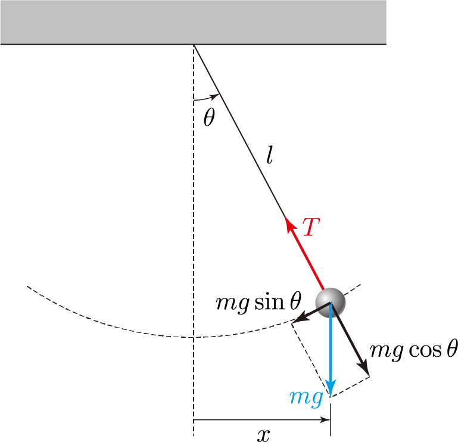

> Translated with the help of ChatGPT and Google Translator

# Lagrangian and action

I think we're almost there now. In the conclusion of the Lagrange mechanics series, let's learn about Lagrangian and action. (Now we finally have a term that seems directly related to Lagrange mechanics.)

## Lagrangian

The Lagrangian $L$ is defined as the potential energy $T$ of a system minus the kinetic energy $U$. in other words

$$
L=T-U
$$

It goes. For example, consider a two-dimensional system with two particles. The Lagrangian of this system is as follows:

$$
T=mgy_1+mgy_2=mg(y_1+y_2)\\
U=\frac{1}{2}m(\dot{x_1}^2+\dot{y_1}^2)+\frac{1}{2}m(\dot{x_2}^2+\dot{ y_2}^2)
=\frac{1}{2}m(\dot{x_1}^2+\dot{y_1}^2+\dot{x_2}^2+\dot{y_2}^2)\\
\therefore L=mg(y_1+y_2)-\frac{1}{2}m(\dot{x_1}^2+\dot{y_1}^2+\dot{x_2}^2+\dot{y_2} ^2)
$$

However, this is expressed using a Cartesian coordinate system rather than a generalized coordinate system, and the Lagrangian must be expressed using a generalized coordinate system. Of course, if there are no constraints, the generalized coordinate system = Cartesian coordinate system.

As a simple example with constraints, the Lagrangian of a pendulum with the angle $\theta$ with the vertical line as the generalized coordinate is calculated as follows. $L$ is the length of the pendulum.

$$
T=mgy=mg\cos\theta\\
U=\frac{1}{2}mv^2=\frac{1}{2}m(L\dot\theta)^2\\
\therefore L=mg\cos\theta-\frac{1}{2}m(L\dot\theta)^2
$$

## action

Therefore, the Lagrangian in general becomes a function of the generalized coordinate $q(t)$, its derivative $\dot{q(t)}$, and time $t$.

$$
L(q(t),\dot{q}(t),t)
$$

At this time, its time integral is called an action, and the action becomes a functional function for the generalized coordinate function $q(t)$.

$$
S[q]=\int_{t_0}^{t_1}L(q(t),\dot{q}(t),t)dt
$$

## Principle of least action

At this time, the principle of least action means that when a system $q(t_1)$ becomes $q(t_2)$, the change minimizes the action $S$.

What this means is, let's assume that the state of a system changes. For example, suppose a particle moves from $(x_1,y_1)$ to $(x_2,y_2)$. At this time, there are infinitely many paths connecting these two points, which means that the path that the particle actually takes must minimize the Lagrangian time integral $S$ when passing through that path. Therefore, this path function becomes the rectification value of the functional function $S[q]$, and by applying the Euler-Lagrange equation discussed in the last posting, there are certain $n$ generalized coordinates $q_1,q_2,...,q_n$ It can be seen that the change in the system consisting of satisfies the following simultaneous partial differential equations.

$$
\frac{\partial L}{\partial q_i}-\frac{d}{dt}\frac{\partial L}{\partial\dot{q_i}}=0
$$

Voila!

Now, if you insert any system into that system of partial differential equations, the path will automatically pop out.

# apply

In fact, Lagrangian mechanics has some non-intuitive aspects, unlike Newtonian mechanics. This is because in Lagrangian mechanics, the principle of least action mentioned above is considered to be a fundamental principle of nature, and other physical laws such as $F=ma$ are derived from it. I think I could have explained it better if I knew why the principle of least action exists, but my studies are limited, so I don't know that much yet...ㅠㅠ

However, although Lagrangian mechanics may seem counterintuitive and complex in its solution, it provides a very powerful method for the analysis of complex systems, especially constrained systems. Because, as you can see above, having constraints means that each component of the position affects the other components. Therefore, to analyze a constrained system using Newtonian mechanics, the relationships between each component must also be considered. Especially in systems with multiple particles, the positions between particles may also affect each other.

However, since Lagrangian mechanics uses only generalized coordinates and generalized momentum with all influencing factors removed, all equations can be interpreted <u>independent</u>. Therefore, interpretation becomes very convenient. Some articles say that it is convenient because Newtonian mechanics uses vectors, while Lagrangian mechanics uses scalars, and this is also consistent with the story. If there are constraints, each component of the vector is not independent, so the vector cannot be arbitrarily decomposed into components.

Another advantage is that mechanical analysis is possible. Since Lagrangian mechanics really follows a set methodology, there is no need for humans to analyze the system themselves. As long as the relationship between generalized coordinates and Cartesian coordinates and the potential energy are given, the program can do the analysis. In fact, below we will use a Matlab script to automatically perform system analysis.

## example

Even if Lagrange mechanics is not intuitively clear, you can get a feel for it by looking at examples.

### Free fall

We just have a particle with no constraints. Let us analyze the motion of this particle. Of course, we know from Newtonian mechanics that these particles just fall in free fall.

First, we can assume that this particle is the same as a generalized coordinate system or just a Cartesian coordinate system. At this time, if we find the Lagrangian,

$$
L=T-U=mgy-m(\dot{x}^2+\dot{y}^2)/2
$$

, and here, if we apply the above Euler-Lagrange equation to the generalized coordinate $x$,

$$
\frac{\partial L}{\partial x}-\frac{d}{dt}\frac{\partial L}{\partial\dot{x}}
=\frac{dm\dot{x}}{dt}=m\ddot{x}=0\\
\therefore\ddot{x}=0
$$

If we apply the Euler-Lagrange equation to $y$, we get

$$
\frac{\partial L}{\partial y}-\frac{d}{dt}\frac{\partial L}{\partial\dot{y}}
=mg-m\ddot{y}=0\\
\therefore \ddot{y}=-g
$$

You get This is exactly the result we get using $F=ma$ in Newtonian mechanics. There is no acceleration in the x direction, and it accelerates in the y direction at $-g$ speed.

### Elastic simple pendulum



Let’s analyze the pendulum system above. However, since it is boring to just call it a pendulum, let's think that the string connecting the wall and the pendulum is not a rigid body but a spring with a spring coefficient of $k$. (Of course, you could consider the size and weight of the spring, but that would be too complicated, so let's assume that the mass of the spring is 0 and is infinitely thin.) Therefore, this pendulum swings left and right and undergoes extremely complex movements in which the length of the string changes.

First, let's find the generalized coordinates for this pendulum. Because the string of this pendulum is a spring, there is nothing limiting its position. It is therefore an unconstrained system, and therefore two generalized coordinates can be chosen. Intuitively, I will choose the length of the spring $l$ and the angle $\theta$ that this spring makes with the vertical line. (Because the mass of the spring is 0, the spring is straight rather than bent.) Of course, you can choose the $x,y$ coordinates of the pendulum, but it will be much easier to interpret if you choose them this way.

Next, calculate the Lagrangian and solve the equation. The Lagrangian is given as follows.

$$
T = -mgl\cos\theta+\frac{1}{2}kl^2\\
U = \frac{1}{2}m(\dot{l}^2+(l\dot\theta)^2)\\
\therefore L = -mgl\cos\theta +\frac{1}{2}kl^2 - \frac{1}{2}m(\dot{l}^2+(l\dot\theta)^2 )
$$

Ah...but anyone can see that differentiating it seems cumbersome. So this time, instead of doing differentiation by hand, let's perform the calculation using a Matlab script. Below is the script I wrote.

``matlab
clear;

% Define the variable you want to interpret
syms l(t) theta(t) m g k

% system definition
x = l*sin(theta)
y = -l*cos(theta)
U = m*g*y + k\*l.^2/2

%================================================================================ ==========
% From this point on, you can use it without having to change it depending on your system.
%================================================================================ ==========

Find % kinetic energy T and calculate Lagrangian
T = m\*(diff(x,t).^2+diff(y,t).^2)/2
L = T - U

%================================================================================ ==========
% Expand Euler-Lagrange equations for generalized coordinate l
%================================================================================ ==========

% You cannot differentiate a function as a function in MATLAB. Therefore, briefly replace the function with a variable.
syms lt l_t
LT = subs(L,diff(l,t),l_t);
LT = subs(LT,l,lt);

% Partial calculation of the Euler-Lagrange equation
E1 = diff(LT,lt);
E2 = diff(LT,l_t);

%In order to calculate the differentiating part with t in the second term, the function used as a variable is converted back into a function.
E1 = subs(E1,lt,l);
E1 = subs(E1,l_t,diff(l,t));
E2 = subs(E2,lt,l);
E2 = subs(E2,l_t,diff(l,t));

% Calculate the Euler-Lagrange equation
Eq = E1-diff(E2,t) == 0;

% Summary
EqL = simplify(Eq,'Steps',100);

%================================================================================ ==========
% Expand Euler-Lagrange equations for generalized coordinates theta
%================================================================================ ==========

% You cannot differentiate a function as a function in MATLAB. Therefore, briefly replace the function with a variable.
syms thetat theta_t
LT = subs(L,diff(theta,t),theta_t);
LT = subs(LT,theta,thetat);

% Partial calculation of the Euler-Lagrange equation
E1 = diff(LT,thetat)
E2 = diff(LT,theta_t)

%In order to calculate the differentiating part with t in the second term, the function used as a variable is converted back into a function.
E1 = subs(E1,thetat,theta);
E1 = subs(E1,theta_t,diff(theta,t));
E2 = subs(E2,thetat,theta);
E2 = subs(E2,theta_t,diff(theta,t));

% Calculate the Euler-Lagrange equation
Eq = E1-diff(E2,t) == 0;

% Summary
EqT = simplify(Eq,'Steps',100);

%================================================================================ ==========
% Display the final result
%================================================================================ ==========

latex(EqL)
latex(EqT)

```

Unfortunately, MATLAB does not support differentiating expressions as symbolic functions. So I had no choice but to construct the expression using a special trick of replacing expressions with variables. As a result, our MATLAB code interpreted the above complex system very nicely and returned it in LaTeX form as shown below. That's cool. I can't believe this thing runs on a personal computer. We salute the advancement of computers.

$$
m\,\frac{\partial ^2}{\partial t^2} l\left(t\right)+k\,l\left(t\right)=m\,l\left(t\right) \,{\left(\frac{\partial }{\partial t} \theta \left(t\right)\right)}^2+g\,m\,\cos\left(\theta \left(t \right)\right)\\
l\left(t\right)\,\frac{\partial ^2}{\partial t^2} \theta \left(t\right)+2\,\frac{\partial }{\partial t} \ theta \left(t\right)\,\frac{\partial }{\partial t} l\left(t\right)+g\,\sin\left(\theta \left(t\right)\right) =0\vee l\left(t\right)=0\vee m=0
$$

In particular, MATLAB was smarter than me and even suggested two self-evident solutions in the second equation that I had not considered. Of course, we don't deal with cases like this, so it's not particularly useful, but...

Although this result is well-organized, it is quite complex. However, in reality, it is bound to be complicated. Originally, pendulum motion is a non-linear differential equation, but since a spring is added to it, there is absolutely no way that the answer will come out in a pretty form. I expect that chaotic behavior like a double pendulum will occur. In any case, it seems impossible to solve this equation well analytically to obtain $l(t)$ or $\theta(t)$.

Therefore, let us solve this equation using numerical analysis. If you look closely at this equation, you can see that it is in very good form, with only one second-order derivative. Therefore, it is a form that is very easy to solve through numerical analysis because the second-order differentiation can be easily organized.

Of course, I really hate calculations, and I don't want to solve even simple theorems myself, so I'll solve it with a Matlab script.

``matlab
%================================================================================ ==========
% Use substitution again to transform into form for second derivatives and clean it up
%================================================================================ ==========

syms l__t theta__t

EqL = subs(EqL,diff(l,t,t),l__t);
EqT = subs(EqT,diff(theta,t,t),theta__t);
SL = solve(EqL,l__t);
ST = solve(EqT,theta__t);
SL = simplify(SL,10)
ST = simplify(ST,10)
latex(SL)
latex(ST)
```

If you add this to the bottom of the above script, you can get the following result. (The value actually output is the formula to the right of the equal sign, and the part to the left of the equal sign is the part I wrote myself.)

$$
\ddot{l} = g\,\cos\left(\theta \left(t\right)\right)+l\left(t\right)\,{\left(\frac{\partial }{\partial t} \theta \left(t\right)\right)}^2-\frac{k\,l\left(t\right)}{m}\\
\ddot\theta=-\frac{2\,\frac{\partial }{\partial t} \theta \left(t\right)\,\frac{\partial }{\partial t} l\left(t \right)+g\,\sin\left(\theta \left(t\right)\right)}{l\left(t\right)}
$$

Then, finally, let's write an HTML+ES6 script that renders this using numerical analysis and check whether the movement is truly plausible. [Below](https://unknownpgr.github.io/lagrange-mechanics/sim.html) is a simple simulation I made.

<iframe src="https://unknownpgr.github.io/lagrangian-mechanics/sim.html" height="800px" width="100%" style="border:none;"></iframe>

> I updated the simulation code after writing this post. The post covered the case where the entire pendulum string is a spring, but the simulation shown above deals with the case where part of the string is rigid and part is a spring.

As a result of the execution, I was a bit surprised to see a very regular and clean result rather than a chaotic result, which was a bit different from what I expected. Of course, it seems like it would actually work like that if you attached a ball to a rubber band. I looked for other references to see if I had made a mistake calculating the Lagrangian, but it seems I did it correctly. Nature is amazing. How can such a complex and unpredictable formula produce such a clean result?

# conclusion

I have written three posts introducing Lagrange mechanics and using it to analyze complex systems. Since it's definitely exam period, everything besides studying for the exam is fun.
