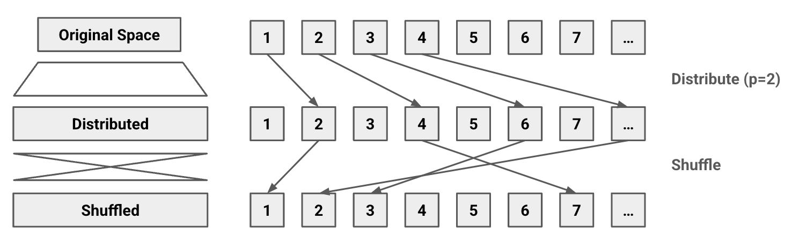

최근 더폼의 링크 단축기를 설계하고 구현했다. 이 과정에서 사용한 알고리즘 및 의사 결정을 정리한다.

## 고려사항

가장 중요하게 생각한 것은 간결성과 확장성이었다. 더폼은 소규모 팀으로 운영되는 프로젝트이므로 아키텍쳐가 간결하게 설계되지 않으면 그 유지보수 비용을 감당할 수 없게 된다. 인원이 많은 팀에서는 링크 단축기를 마이크로서비스 형태로 별도의 서비스로 관리하는 것이 어려운 일이 아니다. 그러나 소규모 팀에서는 이런 것들이 모두 큰 유지보수 부담이 된다. 확장성도 마찬가지로, 만약 확장성을 고려하지 않고 설계를 했다가 나중에 서비스를 확장해야 하는 일이 발생하면 그 비용이 훨씬 크다.

이에 따라 다음과 같은 상황 변화를 고려했다.

- 나중에 사용자 수나 단축된 링크 개수가 증가할 수 있다.
- 서버가 수평적으로 확장될 수 있다.
- 데이터베이스 샤딩을 해야 할 수 있다.
- 링크 단축기가 백엔드 로직이 아니라 MSA 형식으로 별도의 서비스로 분리될 수 있다.

그리고 다음과 같은 기능적 요구사항을 고려했다.

- 링크를 최대한 짧게 단축해야 한다.
- 같은 링크에 대해서는 같은 단축 링크를 반환해야 한다.
- 단축된 링크들로부터 순서를 추측할 수 없어야 한다.

## 설계

일반적으로 링크 단축기는 해시 기반으로 설계한다. 즉, URL을 해싱한 후 그 해시값을 단축 링크로 사용하는 방법이다. 그런데 이 방법은 해시 충돌이 발생하는 경우 충돌을 해결해야 하며 해시 공간의 크기를 결정해야 하는 이슈가 있다. 해시 공간을 너무 작게 잡으면 해시 충돌이 발생할 확률이 과도하게 높아지고 너무 크게 잡으면 단축 링크의 길이가 길어진다.

이러한 이유로 이번에는 새로운 접근법을 시도했다. URL에 대하여 고유한 auto-incremented 정수 id를 발급하고 그 id를 단축 URL로 취급하는 것이다. 이는 정수를 적절한 진수 표기법으로 나타내기만 하면 된다. URL의 path부분에는 영어 대소문자와 숫자가 사용 가능하므로 적어도 62진수를 사용할 수 있다.

이러한 방식은 아래와 같은 장점을 갖는다.

- 해시 충돌이 발생하지 않는다.
- 해시와 다르게 점진적으로 증가하는 숫자를 사용하므로 단축 URL의 길이가 비교적 짧다.
  - 해시 공간이 고정된 경우 단축된 URL이 적은 초반에도 열 자 이상의 단축 URL이 필요할 수 있다. 그러나 이와 같은 방법을 택하면 초반에는 무척 적은 글자수만이 필요하다. (62진수는 3자만 되더라도 238,328개의 단축 URL을 만들 수 있다.) 물론 나중에는 자릿수가 자연스럽게 늘어난다.
- 수평, 수직적 확장이 필요한 경우에도 쉽게 대응 가능하다.
  - n개 서버로 확장하는 경우 각 서버가 $kn+i (k \in \mathbb{N}, 0 \leq i < n)$ 번째 인덱스를 생성하도록 하면 서버간 통신이 없이도 충돌 없이 단축 URL을 생성할 수 있다.
- 키에 의미가 담기지 않는다.
  - 원본 URL에 개인정보 등이 담겨 있다면 경우에 따라 해시로부터 이 정보가 추측 가능할 수 있다. 해시 방식에서는 유저가 문제를 깨닫고 단축 URL을 삭제하더라도 링크가 작동하지 않을 뿐 원래 정보를 추론할 수 있다. 그러나 auto-incremented id를 사용하면 이러한 문제가 발생하지 않는다.

> 물론 이 방법은 같은 단축 URL에 서로 다른 단축 링크가 생길 수 있는 단점이 있다. 그러나 이것은 URL 생성 전 데이터베이스에서 한 번만 체크해주면 되는 일이다.

이 방식의 가장 큰 단점은 단축 URL이 순서대로 생성되기 때문에 그 다음번 URL이나 이전 URL을 무척 쉽게 추측할 수 있다는 것이다. 예를 들어 어떤 사람이 단축 URL을 여러번 생성했는데 a01, a02, a03이 생성됐다면 그 다음에는 a04가 생성될 것이라는 것을 쉽게 추측할 수 있다. 그런 경우 만약 해커가 개인정보를 수집하고 있다던가 공격할 수 있는 작동하는 사이트 목록을 알고 싶다면 이 URL 단축 사이트는 무척 좋은 정보원이 될 수 있다. 특히 더폼은 설문조사를 위한 서비스인데 설문지는 보통 설문지 자체에도 설문을 수행하는 사람의 연락처가 있는 경우가 많으므로 이는 더욱 큰 문제가 된다.

이에 따라 다음과 같은 알고리즘을 고안했다.

1. auto-incremented integer id $x$를 생성한다.
2. 단축 URL이 서로 인접하지 않도록 $x'=kx$를 생성한다. 예를 들어 x가 1, 2, 3이고 k가 100이라면 x'는 100, 200, 300이 된다.
3. x'에 (62진수로 표현할 때) 그 자릿수를 유지하는 pseudo random permutation 함수 $f$를 적용한다.
4. f(x')를 62진수 문자열 표현으로 변환하여 단축 URL로 사용한다.

f를 위와 같이 정의하는 이유는 무한 공간에서의 permutation을 정의하기가 어렵기 때문이다. 해시 공간처럼 유한한 공간에서는 permutation을 정의하는 것이 어렵지 않다. 그러나 정수 공간은 무한하므로 전체 공간상에서의 permutation이 간단히 정의되지 않는다. 따라서 정수 공간을 유한한 공간으로 분할한 후 그 안에서 permutation을 적용해야 한다.

이때 공간을 일정한 간격으로 분리한다고 가정해보자. 그렇다면 분할의 크기가 너무 작은 경우 permutation을 해도 값이 별로 변하지 않으므로 무의미하다. 극단적으로 분할을 1로 하는 경우 permutation을 전혀 하지 않는 것과 같다.

반대로 분할의 크기가 너무 큰 경우 대부분 자릿수가 큰 수가 나오게 된다. 왜냐하면 자릿수가 큰 숫자가 작은 숫자보다 훨씬 많기 때문이다. 특히 단축 URL에서는 62진수를 사용하므로 자릿수가 한자리 더 큰 수가 작은 수보다 61배나 많다. 그러면 이는 해시 방식에 대한 장점을 잃는 것이다.

따라서 자릿수를 유지하는 permutation을 정의하면 정수 공간 전체에서 permutation을 정의하면서도 원하는 자릿수를 유지할 수 있다.

## 구현

이는 다음과 같이 구현된다.

1. auto-incremented integer id $x$를 생성한다.
2. 임의의 범위 $[0, n]$에 대한 pseudo random permutation 함수 $f_n(x)$에 대하여
3. $d=p^{\lfloor \log_p (kx) \rfloor}$라 할 때 $x' = f_{(p-1)d-1}(kx - d)+d$를 생성한다. 여기서 $p$는 진수법이며 (이 경우 62) $k$는 URL 인접하지 않도록 하기 위한 상수다.
4. $x'$를 62진수로 표현한다.

### f 함수

이에 따라 f 함수를 잘 설계해야 한다. f를 추측할 수 있다면 인접한 URL을 곧바로 알 수 있게 되기 때문이다. 물론 링크 단축기는 보안이 대단히 중요한 서비스는 아니므로 암호학적으로 안전할 필요까지는 없다.

> 암호학적으로 안전하려면 brute-force에 대한 저항이 가능해야 한다. 그러려면 공간이 적어도 256bit는 되어야 하는데, 이는 URL 단축기로 사용하기에는 너무 크다.

그래서 간단히 Feistel network와 LCG를 조합한 함수를 사용했다.

Feistel network는 블록 암호에서 사용되는 구조로, 블록을 두 부분으로 나누어 각 부분에 대해 서로 다른 함수를 적용한 후 그 결과를 XOR하는 방식이다. 이 방식은 엔트로피를 크게 높이는 효과가 있다. 수학적으로는 다음과 같이 표현된다.

$$
L_{i+1} = R_i \\
R_{i+1} = L_i \oplus f(R_i, k_i)
$$

LCG는 Linear Congruential Generator의 약자로, 선형 합동식을 이용하여 숫자를 생성하는 방식이다. 다음과 같이 표현된다.

$$
x_{i+1} = (ax_i + b) \mod m
$$

LCG는 일반적으로 난수를 생성하기 위해 사용하는 방법으로 위 식을 계속 적용함으로써 난수를 생성한다. 그러나 이번에는 이것을 한 단계만 이용하여 permutation으로 사용했다. 위 식은 $a\perp m$라면 $[0, m-1]$범위의 permutation이 되기 때문이다.

그러므로 $a$의 선택이 중요하다. 만약 $a$와 $m$이 서로소가 아니라면 permutation이 아니게 되기 때문이다. 다행스럽게도 여기서는 범위인 $m$이 $(p-1)p^n$꼴이고 자릿수인 $p$는 URL-safe한 문자의 개수이므로 많아 봐야 64개를 넘기 힘들다. 그러므로 $m$의 모든 소인수는 $\sqrt {64}$보다 작음이 분명하다. 이에 따라 a로는 10 이상의 아무 소수나 선택해도 된다. 단, 너무 작은 수를 선택하는 경우 m이 커졌을 때 무쳑 규칙적인 permutation이 될 수 있어 8자리 이상의 큰 소수를 이용했다.

이 두 방식을 섞은 이유는 Feistel network가 범위가 $2^n$인 경우에만 사용할 수 있기 때문이다. 지금은 범위가 $(p-1)d$인 경우이므로 범위를 가능한 넓은 $2^n$ 범위로 나눈 후 그 안에서만 Feistel network를 적용하도록 했다. 그러면 범위의 뒷부분은 permutation이 되지 않는데, 이를 막기 위해 LCG를 사용하여 permutation을 적용한 후 한 번 더 Feistel network를 적용했다. 참고로 Feistal network는 두 번 적용하면 원래의 값으로 돌아오기 때문에 첫 번째 적용하는 경우와 두 번째 적용하는 경우의 key가 달라야 한다.

위 두 방식은 모두 O(1)연산일 뿐만 아니라 해시 함수 등에 비하면 연산량도 대단히 적다는 장점도 있다. (해시 함수는 기본적으로 위와 같은 연산을 수십 번 이상 반복해서 이루어진다.)

## 그 외

물론 이러한 구현에서 클린 아키텍쳐에 기반한 데이터베이스의 repository layer와 service layer 및 controller layer의 분리, 의존성 역전 및 주입, 실패 조건과 permutation change 비율을 포함하는 엄밀한 테스트 코드 등의 다양한 요소가 고려되었다. 그러나 이러한 부분은 다른 비슷한 글들에서 잘 설명되었으므로 생략한다.

## 결론

기존에 사용되지 않는 auto-incremented id 및 permutation에 기반한 링크 단축기를 설계하고 구현했다. 이는 해시 충돌을 방지하고 단축 URL의 길이를 짧게 유지하면서도 인접한 URL을 추측하기 어렵게 하는 장점을 갖는다. 이는 확장성과 간결성을 고려한 설계다.
