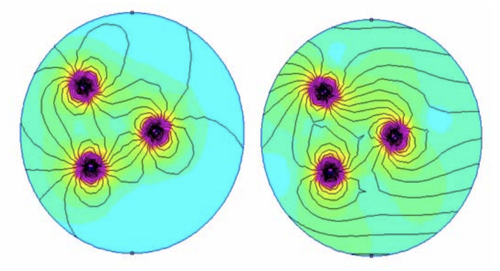

지자계 센서는 주변 자기장을 측정한다. 이때 센서는 보통 다양한 외란의 영향을 받으므로 그대로 사용하는 것은 불가능하고 캘리브레이션이 필요하다. 이러한 지자기 센서의 외란은 다음과 같이 모델링된다.

$$
\begin{align*}
y = T_\text{sf}T_\text{cc}(T_\text{si}m + b_\text{hi}) +b_\text{s} +\epsilon
\end{align*}
$$

이때 각 변수는 다음과 같다.
| 변수 | 설명 | 크기 |
|------|------|------|
| $y$ | Measurement, 측정값 | 3x1 벡터 |
| $m$ | Actual magnetic field, 실제 자기장 | 3x1 벡터 |
| $T_\text{sf}$ | Scale factor, 축별 계수 | 3x3 대각행렬 |
| $T_\text{cc}$ | Cross-coupling, 축 사이의 영향 | 3x3 행렬 |
| $T_\text{si}$ | Soft iron, 연철에 의한 센서 프레임에서의 자기장 왜곡 | 3x3 행렬 |
| $b_\text{hi}$ | Hard iron, 경철에 의한 센서 프레임에서의 자기장 왜곡 | 3x1 벡터 |
| $b_\text{s}$ | bias, 센서의 자체 편차 | 3x1 벡터 |
| $\epsilon$ | Noise, 잡음 | 3x1 벡터 |

#### 자성체

연철과 경철에 의한 자기장의 왜곡은 강자성체, 상자성체와 같은 물체의 자기 특성과 혼동될 수 있다. 그러므로 본문 내용에서 약간 벗어나지만 정리한다.

먼저 강자성, 반자성, 상자성은 자성체의 종류를 말하며 그 의미는 다음과 같다.

- 강자성체: 외부 자기장에 의해 자화되며 자기장을 제거해도 일부 자화가 유지됨
  - 예) 철, 니켈, 코발트
- 상자성체: 외부 자기장에 의해 약하게 자화되며 자기장을 제거하면 자화가 사라짐
  - 예) 알루미늄, 백금, 산호
- 반자성체: 외부 자기장에 반하는 자기장을 생성함
  - 예) 구리, 금, 물

다음으로 연철과 경철은 모두 강자성체의 종류다.

- 연철은 민감하게 자화되고 자화가 쉽게 풀리는 물질을 말하며, 따라서 코일 등에 사용된다.
- 반면 경철은 자화시키기 어렵지만 자화되면 오래 유지되는 물질을 말하며 일반적으로 말하는 영구자석을 의미한다.



위는 경철, 즉 자화된 강자성체에 의한 자기장의 왜곡을 나타낸다. 좌측의 이미지는 외부 자기장이 없는 공간에서 강자성체의 자기력선을 나타내며, 우측 이미지는 외부 자기장이 있는 경우의 자기력선을 나타낸다. 이와 같이 경철은 외부 자기장에 추가적인(additive) 자기장을 생성한다. 즉, bias로 작용한다.


반면 연철은 위와 같이 외부 자기장이 없을 때는 아무런 영향을 미치지 않으며, 외부 자기장이 가해질 시 자기장의 방향을 바꾼다.

다시 위 식으로 돌아와서, 위 식에는 상기한 외부 자성체를 포함한 다양한 요소가 있으나 일반적으로 위 구체적인 값을 전부 구하는 것은 필요하지 않으며 또한 단일 자기 센서만으로는 측정가능하지도 않는다. 그래서 일반적으로는 변수가 통합된 다음 형식을 사용한다.

$$
\begin{align*}
y = Tm + b + \epsilon
\end{align*}
$$

그러므로 캘리브레이션의 목표는 위 식의 $T$, $b$를 구하는 것이다. 이를 위하여 다양한 방법이 제안되었는데, 이는 본문 마지막의 레퍼런스를 참고하면 된다. 본문에서는 이러한 방법 중 하나인 Ellipsoid fitting을 사용하여 캘리브레이션을 수행한다.

## Ellipsoid fitting

지구 자기장은 국소적으로 일정하다고 가정할 수 있다. 이로부터 다양한 각도로부터 측정한 지구 자기장 벡터는 이상적으로는 구면 위에 놓이게 된다. 따라서 다양한 외란 및 왜곡을 포함한 측정값은 구에 대한 위 식의 적용이므로 타원체가 된다. 그러므로 이러한 타원체를 기술하는 파라매터를 구하면 반대로 타원체를 다시 구로 변환할 수 있다.

평행이동과 회전을 포함한 Ellipsoid의 일반화된 형태는 다음과 같다.

$$
\begin{align*}
Ax^2 + By^2 + Cz^2 + 2Dxy + 2Exz + 2Fyz + 2Gx + 2Hy + 2Iz + J = 0
\end{align*}
$$

> 단, 위 형태는 일반적인 이차 곡면의 형태이며 이것이 타원체가 되기 위해서는 A, B, C가 모두 양수여야 한다. 따라서 fitting 후 이것을 점검하는 것이 필요하다. 일반적으로는 타원체로 잘 fitting되나 센서 데이터가 부족한 경우 이러한 조건을 만족하지 못할 수 있다.

위 파라매터는 다음과 같은 least square problem을 풀어 구할 수 있다.

$$
\begin{align*}
\min_{A,\dots,J} \sum_{i=1}^{N} \left( Ax_i^2 + By_i^2 + Cz_i^2 + 2Dx_iy_i + 2Ex_iz_i + 2Fy_iz_i + 2Gx_i + 2Hy_i + 2Iz_i + J \right)^2
\end{align*}
$$

이것은 다음과 같이 행렬 형태로 표현할 수 있다.

$$
\begin{align*}
&\min_{A,\dots,J} \left\| \begin{bmatrix} x^2 & y^2 & z^2 & 2xy & 2xz & 2yz & 2x & 2y & 2z & 1 \end{bmatrix} \begin{bmatrix} A \\ \vdots \\ J \end{bmatrix} \right\|^2\\
=&\min_{\beta} \left\| D \beta\right\|^2
\end{align*}
$$

위 식에서 $x, y, z$는 각 측정값의 축별 성분을 담은 열벡터다.

그러나 위 식은 $\beta=0$인 자명한 해를 가진다. 따라서 부정이며, 해를 구하기 위해서는 추가적인 제약이 필요하다. 일반적으로 다음과 같은 제약을 추가한다.

$$
\| \beta \|^2 = 1
$$

이러한 제약조건 하에서의 최적해는 라그랑주 승수법을 사용하여 다음과 같이 구할 수 있다.

$$
\begin{align*}
\frac{\partial}{\partial \beta} \left( \left\| D \beta\right\|^2 + \lambda \left( \left\| \beta \right\|^2 - 1 \right) \right) = 0
\end{align*}
$$

이를 계산하면 다음과 같다.

$$
\begin{align*}
D^TD\beta + \lambda \beta = 0
\end{align*}
$$

이로부터 $\beta$는 $D^TD$의 고유벡터이며 $\lambda$는 고유값임을 알 수 있다. 물론 행렬은 여러 개의 고유값을 가지므로 그 중 하나를 골라야 한다. 이때 최적화하려는 원래의 식은 다음과 같았다.

$$
\begin{align*}
\min_{\beta} \left\| D \beta\right\|^2= \min_{\beta} \beta^TD^TD\beta
\end{align*}
$$

여기서 $\beta$가 고유 벡터임을 고려하면 이는 다음과 같이 곧 고유값이 된다.

$$
\begin{align*}
\beta^TD^TD\beta = \lambda \beta^T\beta = \lambda \|\beta\|^2= \lambda\\
\end{align*}
$$

따라서 구하고자 하는 파라매터는 가장 작은 고유값에 대응하는 고유벡터다.

## Ellipsoid Projection

위 과정에서 구한 Ellipsoid의 파라매터는 단지 측정값을 잘 나타내는 타원체의 파라매터일 뿐이며, 보정된 값을 얻기 위해서는 이를 다시 구로 변환하는 과정이 필요하다.

먼저 위 방정식의 계수 형태로 표현된 타원체의 식을 다음과 같이 행렬의 이차 형식으로 표현한다.

$$
\begin{align*}
\begin{bmatrix} x & y & z  \end{bmatrix} \begin{bmatrix} A & D & E \\ D & B & F \\ E & F & C \end{bmatrix} \begin{bmatrix} x \\ y \\ z \end{bmatrix} + 2\begin{bmatrix} G & H & I \end{bmatrix} \begin{bmatrix} x \\ y \\ z \end{bmatrix} + J = 0\\
\rightarrow x^TMx + 2b^Tx + J = 0
\end{align*}
$$

위 식은 타원체의 회전과 평행이동을 포함한 형식이다. 이를 먼저 원점으로 이동시킨다. 이를 위해서 타원체의 중심 $c$에 대하여 $x' = x - c$로 변수를 변환한다. 이때 타원체의 중심 $c$는 다음과 같이 구할 수 있다.

$$
\begin{align*}
c = -M^{-1}b
\end{align*}
$$

이를 대입하면 식은 다음과 같은 형식으로 변환된다.

$$
\begin{align*}
x'^TMx' + \text{const} = 0
\end{align*}
$$

이때 상수항은 단순히 타원체의 크기를 결정하는 수이므로 무시해도 된다.

다음으로 이것을 구 형태로 변환해야 한다. 즉, 적당한 변수 변환 $Q$가 존재하여 $y=Qx'$라고 할 때, $y^Ty + \text{const}=(Qx)^T(Qx)+ \text{const}=0$이 되도록 하는 $Q$를 찾아야 한다.
이는 행렬 $M$이 대칭행렬이므로 쉽게 찾을 수 있다. 대칭행렬은 spectral theorem에 의해 다음과 같이 대각화할 수 있기 때문이다.

$$
\begin{align*}
M = VDV^T
\end{align*}
$$

> 이러한 대각화는 다음과 같은 좋은 성질들을 가지고 있다.
>
> - $V$는 단위직교행렬이다. 즉, $V^TV = I$이다.
> - $V$의 열벡터는 $M$의 고유벡터이다.
> - $D$는 대각행렬이다. 즉, $D_{ij} = 0$ for $i \neq j$이다.
> - $D$의 대각성분은 $M$의 고유값이다.

이로부터 식을 다음과 같이 변형한다.

$$
\begin{align*}
x'^TMx' &= x'^TV^TDVx' (\because \text{spectral theorem})\\
&= x'^TV^TD^{1/2}D^{1/2}Vx' (\because D \text{ is diagonal})\\
&= (D^{1/2}Vx')^T(D^{1/2}Vx')\\
\end{align*}
$$

이로부터 $Q = D^{1/2}V$임을 알 수 있다.

> 이렇게 구한 $Q$는 타원체를 구로 변환하며, 그 크기는 신경쓰지 않는다. 그러나 일반적으로는 자기 센서를 사용할 때는 방향만 고려하고 크기는 신경쓰지 않기 때문에 크게 문제가 되지 않는다.

## Summary

정리하면 다음과 같다.

1. 측정값을 이용하여 Ellipsoid fitting을 수행한다. 이로부터 타원체의 파라매터를 구한다.
2. 구한 파라매터를 행렬 형태로 변환한다.
3. 이로부터 타원체의 중심 $c=-M^{-1}b$과 변환 행렬 $Q=D^{1/2}V$를 구한다.
4. 이제 입력값에 대하여 $y=Q(x-c)$를 계산하면 보정된 값을 얻을 수 있다.

## Implementation

아래는 위 과정을 Python으로 구현한 코드이다.

```python
#!/usr/bin/env python3

import matplotlib.pyplot as plt
import numpy as np

def read_data():
    # ...Read data form file...
    return np.array(data, dtype=np.float64)


def fit_ellipsoid(data):
    # Create the design matrix
    D = np.array(
        [
            [
                x**2,
                y**2,
                z**2,
                2 * x * y,
                2 * x * z,
                2 * y * z,
                2 * x,
                2 * y,
                2 * z,
                1,
            ]
            for x, y, z in data
        ]
    )

    # Find the eigenvector corresponding to the smallest eigenvalue
    eigvals, eigvecs = np.linalg.eig(D.T @ D)
    min_eigval_index = np.argmin(eigvals)
    T = eigvecs[:, min_eigval_index]

    # Create the matrix M
    M = np.array(
        [
            [T[0], T[3], T[4]],
            [T[3], T[1], T[5]],
            [T[4], T[5], T[2]],
        ]
    )

    # Create the vector b
    b = np.array([T[6], T[7], T[8]])

    # Calculate M^-1
    M_inv = np.linalg.inv(M)

    # Calculate the center of the ellipsoid
    c = -np.dot(M_inv, b)

    # Calculate the reverse transformation matrix Q
    D, V = np.linalg.eig(M)
    Q = np.dot(np.diag(np.sqrt(D)), V)

    # Normalize projection matrix (optional, just for visualization)
    projected = np.dot((data - c), Q)
    avg_len = np.mean(np.linalg.norm(projected, axis=1))
    Q = Q / avg_len

    return c, Q


def plot_data(data):
    fig = plt.figure()
    ax = fig.add_subplot(111, projection="3d")

    # Plot data
    ax.scatter(*zip(*data), c="r", marker="o")
    ax.plot(*zip(*data), c="b", marker="o")

    # Add unit sphere for comparison
    u = np.linspace(0, 2 * np.pi, 32)
    v = np.linspace(0, np.pi, 32)
    x = np.outer(np.cos(u), np.sin(v))
    y = np.outer(np.sin(u), np.sin(v))
    z = np.outer(np.ones(np.size(u)), np.cos(v))
    ax.plot_surface(x, y, z, color="y", alpha=0.1)

    ax.set_xlabel("X")
    ax.set_ylabel("Y")
    ax.set_zlabel("Z")
    ax.set_aspect("equal")


if __name__ == "__main__":
    x = read_data()
    c, Q = fit_ellipsoid(x)
    y = Q @ (x - c).T
    plot_data(y.T)
    plt.show()
```

아래는 실제 센서 데이터와 그 켈리브레이션 결과를 시각화한 것이다.

<iframe width="560" height="315" src="https://www.youtube.com/embed/Z8X60qRcjow?si=vh1XhVxY7fsV-EqG" title="YouTube video player" frameborder="0" allow="accelerometer; autoplay; clipboard-write; encrypted-media; gyroscope; picture-in-picture; web-share" referrerpolicy="strict-origin-when-cross-origin" allowfullscreen></iframe>

위 영상은 캘리브레이션 전의 데이터로, 찌그러진 타원체 형태임을 확인할 수 있으며 그 중심은 원점에서 심하게 벗어나있다. 그 이유는 해당 센서가 모터 근처에 설치되어있기 때문이다.

<iframe width="560" height="315" src="https://www.youtube.com/embed/dTZYFSQY79A?si=HBa4ijPgrK8OYWec" title="YouTube video player" frameborder="0" allow="accelerometer; autoplay; clipboard-write; encrypted-media; gyroscope; picture-in-picture; web-share" referrerpolicy="strict-origin-when-cross-origin" allowfullscreen></iframe>

위 영상은 캘리브레이션 후의 데이터로, 투명한 노란색 타원체는 반지름이 1이고 그 중심이 원점인 단위 구이다. 이로부터 캘리브레이션이 잘 되었음을 확인할 수 있다.

# Conclusion

지자계 센서는 다양한 외란에 의해 측정값이 왜곡되므로 캘리브레이션이 필요하다. 이를 위하여 Ellipsoid fitting을 사용하여 캘리브레이션을 수행하였으며, 이를 통해 측정값을 보정할 수 있었다.

# References

- [https://pmc.ncbi.nlm.nih.gov/articles/PMC8401862/](https://pmc.ncbi.nlm.nih.gov/articles/PMC8401862/)
- [https://www.nxp.com/company/about-nxp/smarter-world-blog/BL-MAGNETOMETER-PLACEMENT-WHERE-WHY](https://www.nxp.com/company/about-nxp/smarter-world-blog/BL-MAGNETOMETER-PLACEMENT-WHERE-WHY)
- [https://www.nxp.com/docs/en/application-note/AN4247.pdf](https://www.nxp.com/docs/en/application-note/AN4247.pdf)
