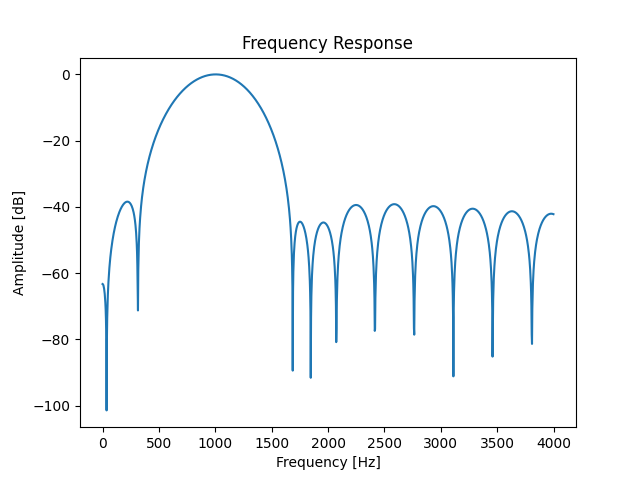

여가 시간에 심심풀이로 간단한 소프트웨어 모뎀을 제작했다.

<iframe width="560" height="315" src="https://www.youtube.com/embed/bQWD0ICCkIU?si=cqFzk62onM39hW6E" title="YouTube video player" frameborder="0" allow="accelerometer; autoplay; clipboard-write; encrypted-media; gyroscope; picture-in-picture; web-share" referrerpolicy="strict-origin-when-cross-origin" allowfullscreen></iframe>

소스코드는 아래 리포지토리에서 확인할 수 있다.

- [https://github.com/unknownpgr/modem](https://github.com/unknownpgr/modem)

## 모뎀(modem)

모뎀은 modulator와 demodulator의 합성어로 디지털 신호를 아날로그 신호로 변조(modulation)하거나 아날로그 신호를 디지털 신호로 복조(demodulation)하는 장치를 말한다. 변조된 아날로그 신호에서의 한 신호 단위를 심볼(symbol)이라고 한다. 심볼의 가짓수와 심볼당 비트 수는 다음과 같은 관계가 있다.

$$
\text{bits per symbol} = \log_2(\text{number of symbols})
$$

단위시간당 전송되는 심볼의 수를 baud rate라고 한다. baud rate는 bit rate와는 다르다. 예를 들어 1초당 1개의 심볼을 전송한다면 baud rate는 1이지만 이 심볼이 2개의 비트로 구성되어 있다면 bit rate는 2bps가 된다.

## 모뎀의 논리적 작동 방식

모뎀이 디지털 신호를 아날로그 신호로 변조하는 방식은 다양하다.

가장 직관적인 방식은 데이터가 0일 때는 전류를 흘리지 않고 데이터가 1일 때는 전류를 흘리는 방식이다. 이 방식은 사실상 아날로그 채널을 디지털 채널로 간주하는 것으로, 구현이 간단하나 여러 단점이 있다.

- 한 쪽으로만 전류가 흐르기 때문에 직류 성분이 생긴다.
  - 직류 성분이 생기면 전력 소모가 커진다.
  - 음성 통신이나 전파를 이용한 통신 등 교류 성분만 전송할 수 있는 매체를 사용할 수 없다.
- 외부 노이즈에 무척 취약하다.
- 한 매체를 통해서는 하나의 통신만을 할 수 있다.

그러므로 수십 센티미터 이내의 단일 선로를 통한 저속 유선 통신만이 가능하다.

이러한 문제점을 해결하기 위해 모뎀은 일반적으로 전송하려는 정보를 전송하려는 정보보다 더 높은(주로 10~40배 이상) 주파수의 신호로 바꾼 후 전송하는 방법을 사용한다. 일반적으로 변조나 복조라고 하면 기본적으로 이러한 방식을 의미한다.
이때 원본 정보를 통해 만들어진 아날로그 신호를 기반대역(baseband) 신호라고 하며 이 신호를 변조해서 전송하는 신호를 전송대역(bandpass) 또는 반송파(carrier) 신호라고 한다.

신호를 변조하는 방식에도 여러 가지가 있다. 가장 기본적으로는 정현파를 구성하는 세 가지 요소인 진폭, 주파수, 위상 중 하나를 변조하는 방식이 있다.

- **Amplitude Shift Keying(ASK)**: 진폭 변조, 반송파의 진폭을 기반대역 신호의 크기에 따라 변조
- **Frequency Shift Keying(FSK)**: 주파수 변조, 반송파의 주파수를 기반대역 신호의 크기에 따라 변조
- **Phase Shift Keying(PSK)**: 위상 변조, 반송파의 위상을 기반대역 신호의 크기에 따라 변조

또는 이들을 조합해서 사용하기도 하는데, 일반적으로 ASK와 PSK를 조함해서 사용하며 이를 **Quadrature Amplitude Modulation(QAM)** 이라고 한다. QAM은 8-QAM, 16-QAM, 64-QAM 등으로 나뉘며 각각 3비트, 4비트, 6비트를 전송할 수 있다. 전송할 수 있는 비트 수가 많아질수록 전송 속도는 빨라지나 그만큼 노이즈에 민감해진다.

## 모뎀의 물리적 작동 방식

데이터를 변조할 때는 입력 신호에 따라 반송파를 조절하기만 하면 되므로 비교적 간단하다. 예를 들어 ASK 방식을 사용한다면 multiplier를 사용해서 입력 신호와 반송파를 곱하면 되고, FSK 방식을 사용한다면 sine wave generator를 사용해서 반송파를 생성하면 된다.
그러나 복조는 이처럼 단순하지 않아서 다음과 같은 더 복잡한 방식이 필요하다.

```text
입력 신호 ==> Amplifier ==> band-pass filter ==> envelope detector ==> threshold detector ==> decoder* ==> 복조된 신호
```

- **amplifier**: 입력 신호를 증폭한다. 이는 입력 신호가 전달되는 동안 손실되는 것을 보상하기 위함이다.
- **band-pass filter**: 원하는 주파수의 신호만을 추출한다.
- **envelope detector**: 입력 신호의 envelope을 추출한다. 이는 ASK를 사용하는 경우 입력 신호의 진폭을 추출하고 FSK를 사용하는 경우 특정 주파수의 신호가 존재하는지 감지하기 위함이다.
- **threshold detector**: envelope detector의 출력을 이진화한다. 이로부터 입력 신호가 0인지 1인지 판단한다.
- **decoder**: 이는 논리적인 과정으로, threshold detector의 출력을 원래의 데이터로 복원한다. 추후 설명한다.

## 구현

`Python`을 사용, 소리를 통해서 FSK 방식으로 데이터를 변/복조할 수 있도록 구현했다. sampling frequency는 일반적으로 사용하는 44.1kHz, 심볼은 0과 1 두 개만을 사용했다. 이러한 경우 일반적으로 0을 나타내는 심볼을 `space`, 1을 나타내는 심볼을 `mark`라 부른다.

초기에는 `space`에 1kHz, `mark`에 2kHz의 주파수를 할당했다. 그런데 복조 시 오류율이 너무 높아 확인해본 결과 mark와 space의 에너지가 다르게 나타나는 현상이 관찰됐다. (주로 2kHz 에너지가 더 높았다.) 이에 다음과 같은 가설들을 세웠다.

- 마이크나 스피커의 특성으로 주파수별 감도가 다르다.
- 주파수가 높아지면 차수가 같더라도 FIR의 Q-factor가 높아진다. 이로 인해 2kHz대의 선택도가 더 높았다.
- 주파수가 두 배이므로 여러 비선형성 등으로 인해 harmonic등이 발생해서 영향을 미쳤다.

이 문제를 해결하고자 각 심볼 주파수를 7kHz, 8kHz로 올렸다. 이렇게 하면 주파수 사이의 거리는 1kHz로 유지되나 원래는 두 배 차이나던 주파수가 8/7만큼만 차이나므로 필터 크기나 장비 특성으로 인한 차이를 줄일 수 있을 것으로 생각되었다. 또한 7과 8이 서로소이므로 harmonic 역시 최소 56kHz는 되어야 겹친다. 이는 Nyquist theorem에 따르면 44.1kHz 샘플링 주파수로는 (안티엘리어싱을 고려하지 않으면) 샘플링되지 않는다. 그리고 주파수 변경 후 실험 결과 실제로 문제가 해결되었다.

#### Amplifier

처음에는 입력에 단순히 큰 상수를 곱해주었으나 이렇게 했더니 이후 단계가 입력 신호의 크기에 큰 영향을 받았다. 그래서 입력 신호의 크기로 입력 신호를 나눠주는 방법으로 문제를 해결했다.

입력 신호의 크기는 입력 신호의 절댓값을 cutoff frequency가 2Hz정도로 무척 낮은 IIR 필터를 통과시킴으로써 구했다. 이때 이 값은 입력 신호의 amplitude와 대략 비례하기는 하나 그 값은 다르다. 그러나 이 단계의 목적은 입력 신호의 크기를 일정하게 만들어주는 것이기 때문에 절대적인 크기는 무관하다.

> Envelope detection 시에는 Hilbert transform같은 wavelet transform을 사용할 수도 있으나 이렇게 하면 계산량이 많아지므로 사용하지 않았다.

#### Band-pass Filter

Band-pass filter는 푸리에 변환을 포함한 다양한 방법으로 구현할 수 있다. 그러나 가장 간단하고 효율적인 방법은 Finite Impulse Response(FIR) 필터를 사용하는 것이다. FIR 필터는 입력 신호의 일부를 저장하고 이를 이용해 출력 신호를 계산하는 방식으로 이는 실시간으로 계산할 수 있으며 필요한 만큼의 계산만을 수행하므로 효율적이다.

FIR을 구현할 때 중요한 것은 Q-factor이다. Q-factor는 필터의 선택도를 나타내는 지표로, -3dB bandwidth와 center frequency의 비율로 정의된다. Q-factor가 클수록 원하는 주파수만을 고를 수 있게 되지만 그만큼 계산량이 많아진다. 그리고 과도하게 높은 Q-factor를 사용하면 변조된 원본 신호까지 손실될 수 있으므로 적당한 Q-factor를 사용해야 한다.

FIR의 구현에는 `scipy.signal.firwin`을 사용했으며 이로부터 다음과 같은 필터를 얻었다.


이것은 다음과 같은 주파수 응답을 가진다.



그리고 이 필터로 간단한 변/복조 테스트를 진행했으며 다음과 같은 결과를 얻었다.


> 실제로는 space와 mark 주파수를 각각 추출하기 위해 두 개의 band-pass filter를 사용했다.

#### Envelope Detector

앞서 신호의 크기를 구했던 것과 마찬가지로 절댓값을 취하고 이로부터 envelope를 구했다. 다만 실험적으로 IIR보다 box filter가 더 좋은 결과를 보였기 때문에 box filter를 사용했다.

#### Threshold Detector

Threshold detector는 envelope detector의 출력을 이진화하는 역할을 한다. 이진화 시에는 space 주파수의 에너지와 mark 주파수의 에너지를 비교해 만약 space 주파수의 에너지가 더 크다면 0, mark 주파수의 에너지가 더 크다면 1로 판단했다.

#### Decoder

Decoder는 threshold detector의 출력을 원래의 데이터로 복원하는 역할을 한다. Threshold detector의 출력은 다음과 같은 특성을 가진다.

- 한 심볼을 여러 개의 0이나 1로 인식한다.
- 한 심볼은 오직 0이나 1로만 인식되는 것이 아닌, 잡음으로 인해 중간에 반대 부호의 신호가 삽입될 수 있다.
- 심볼의 길이는 전송 지연으로 약간씩 달라질 수 있다. (jitter)
- 실제로는 신호가 전송되지 않았지만 잡음으로 인해 신호를 인식할 수 있다.

이에 소프트웨어적으로 심볼 경계를 감지, PLL과 비슷한 방법으로 내부 타이머의 주기를 조절하는 방식으로 심볼을 복원했다. 이에 따라 처음 심볼이 전송될 때 루프가 수렴하는 것을 보장하기 위해 0과 1을 반복적으로 전송하는 sync data를 추가했으며 sync data와 실제 데이터를 구분하기 위해 preamble을 추가했다.

구체적으로는 소프트웨어 카운터를 구현한 후 이 카운터가 특정 값에 도달하면 심볼 경계로 판단하는 방식을 사용했다. 이때 입력 비트의 경계가 주기 내에 탐지된 경우 만약 반주기 이전에 탐지되면 카운터 값을 약간 줄이고 반대로 반주기 이후에 탐지되면 카운터 값을 약간 늘렸다.

## 결론

소프트웨어적으로 약 1kbps 전송 속도를 가지는 모뎀을 구현했다.
