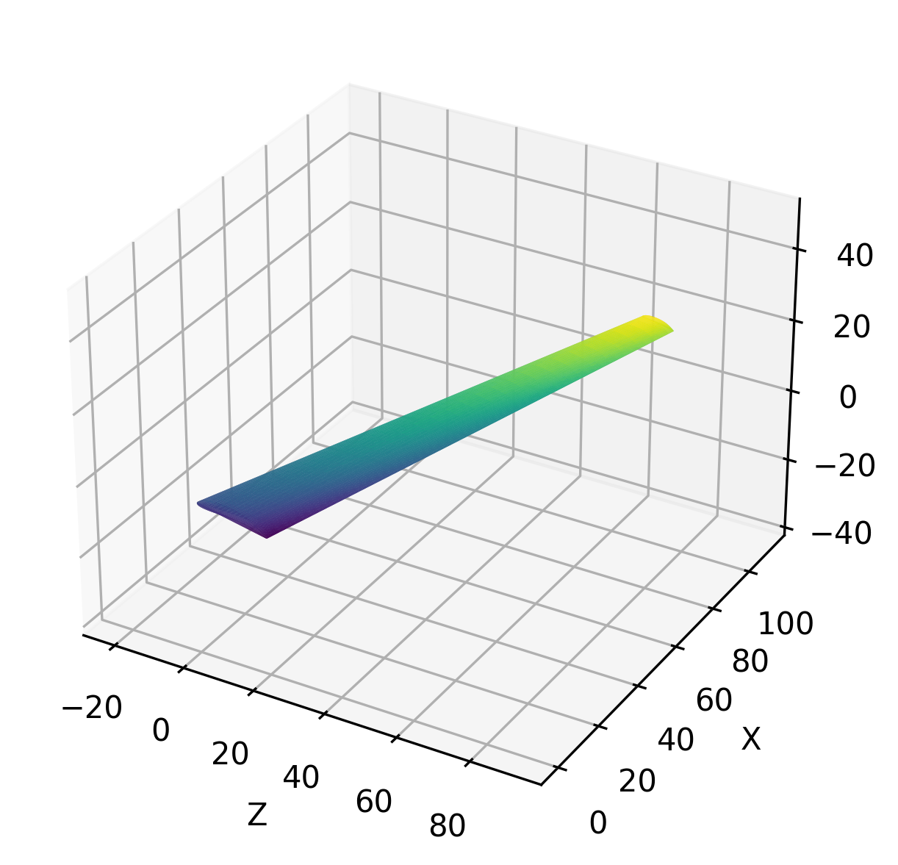
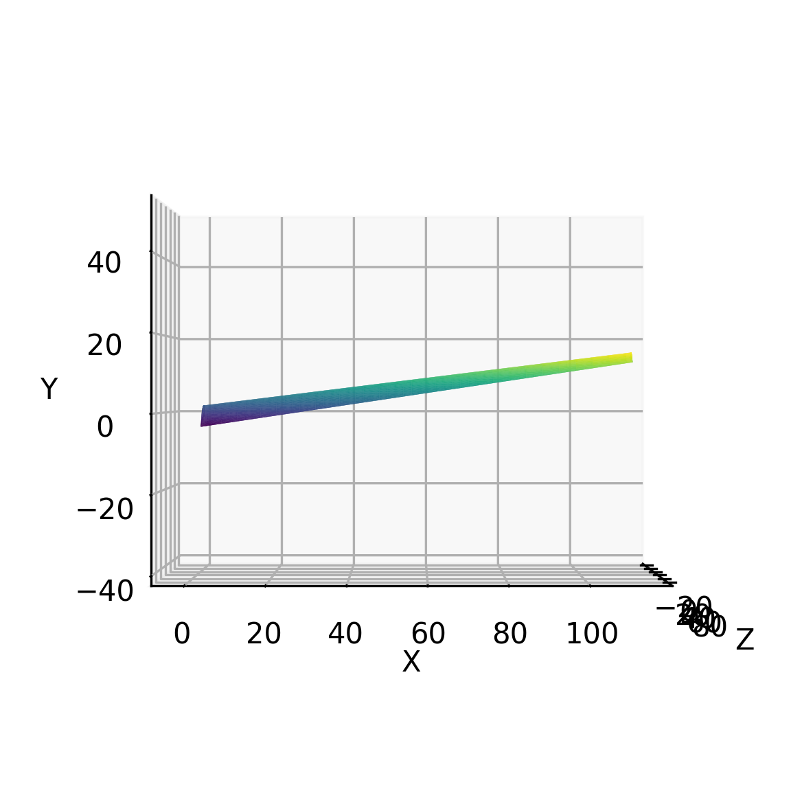
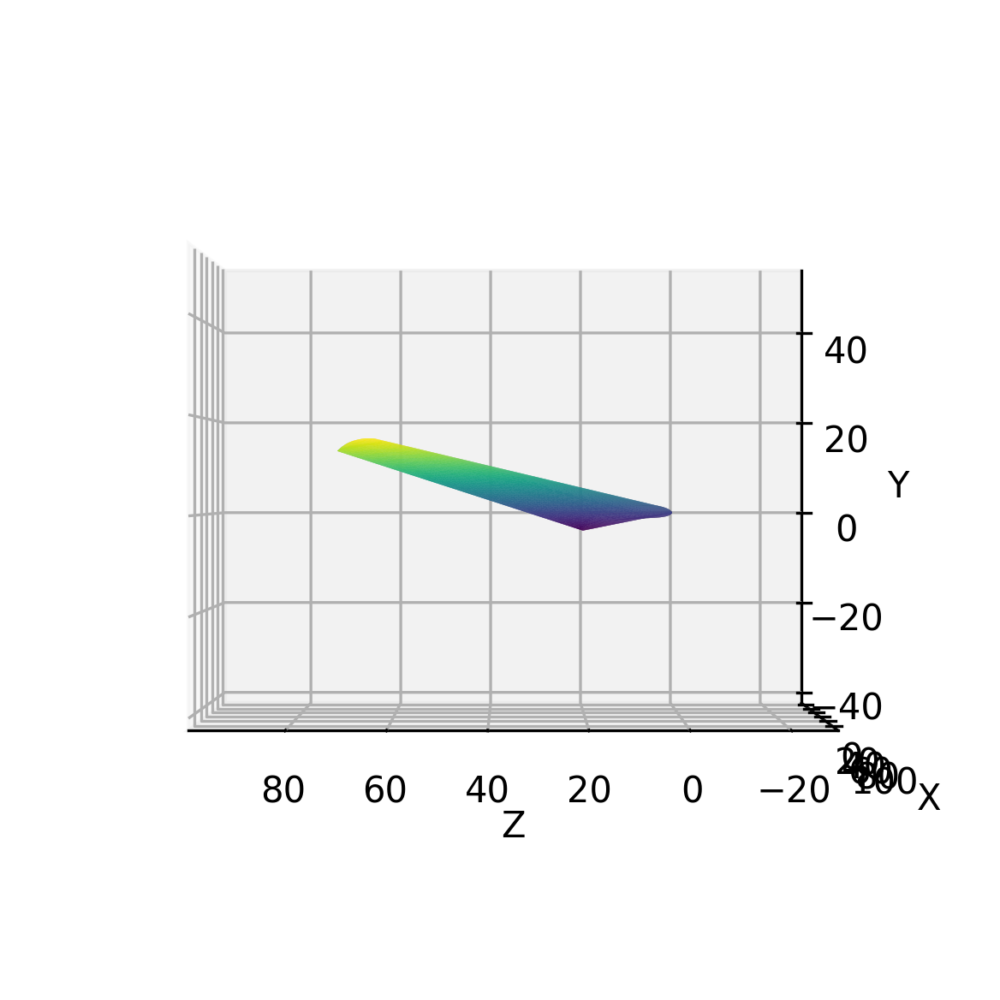
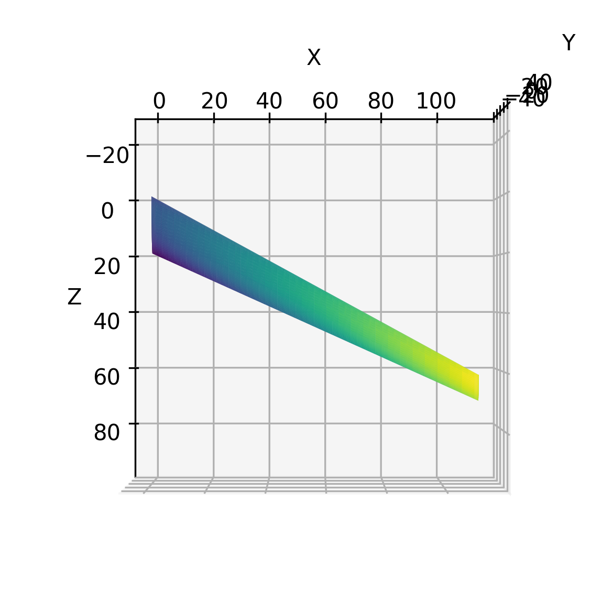
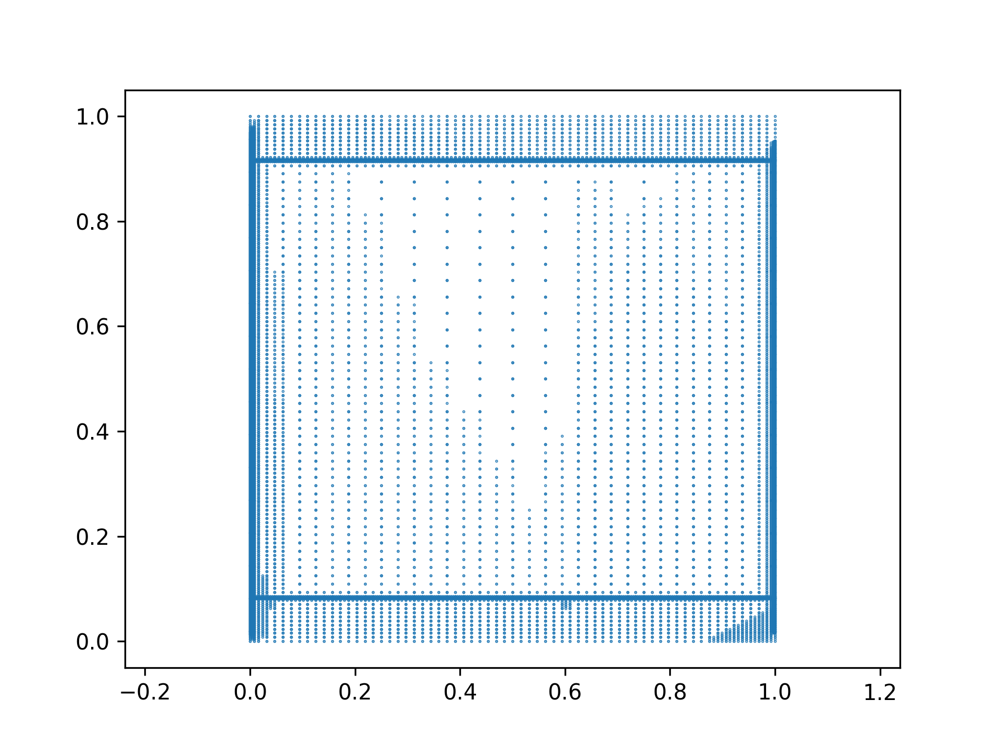

> Translated with the help of ChatGPT and Google Translator

I plan to try making an airplane in the future. At that time, the most difficult part to make seemed to be the wings, so I wrote a program to create a 3D model of the wings in advance. Below is the relevant repository.

- [https://github.com/unknownpgr/naca-airfoil-generator](https://github.com/unknownpgr/naca-airfoil-generator)

## Airfoil

The most basic thing about a wing is the shape of its cross section. The shape of the wing cross section is called an airfoil. Airfoil can of course have any shape, but is generally determined by the following parameters:

- **chord length**: length of wing cross section
- **thickness**: Thickness of wing cross section
  - **maximum thickness**: Maximum thickness of wing cross section
  - **maximum thickness position**: Maximum thickness position of wing cross section
- **mean camber line**: wing cross-section center line
  - **maximum camber**: maximum curvature of the wing cross-section
  - **maximum camber position**: Maximum curvature position of the wing cross section

One way to express the shape of this airfoil is the NACA airfoil. NACA stands for National Advisory Committee for Aeronautics, and NACA airfoil is a method of expressing the airfoil shape developed by NACA, an American aircraft research organization.

According to this method, first the thickness is given as follows.

$$
t(x) = 5t(0.2969\sqrt{x} - 0.1260x - 0.3516x^2 + 0.2843x^3 - 0.1015x^4)
$$

- $x$ is the ratio of the x-axis distance to the chord, taking values between 0 and 1. In other words, it represents the front edge of the wing when $x=0$, and the rear edge of the wing when $x=1$.
- $t$ is the ratio of the thickness of the wing cross-section to the chord.

The camber line is given as below.

$$
y_c = \begin{cases}
   \frac{m}{p^2}(2px - x^2) & \text{if } 0 \leq x \leq p \\
   \frac{m}{(1-p)^2}((1-2p) + 2px - x^2) & \text{if } p \leq x \leq 1
\end{cases}
$$

- $m$ represents maximum camber.
- $p$ represents the maximum camber position.

However, in this case, thickness refers to the thickness from the camber line to the normal direction. Accordingly, the upper surface and lower surface are given as follows.

$$
\begin{align*}
   x_u &= x - t(x)\sin(\theta) \\
   y_u &= y_c + t(x)\cos(\theta) \\
   x_l &= x + t(x)\sin(\theta) \\
   y_l &= y_c - t(x)\cos(\theta)
\end{align*}
$$

Therefore, the NACA airfoil is determined by three parameters: $m$, $p$, and $t$. This parameter is derived from the name of airfoil. NACA airfoil displays these values as four numbers, which are interpreted sequentially as $mptt$. For example, NACA 2412 gives $m=0.02$, $p=0.4$, $t=0.12$.

> In some cases, it is a 5-digit number, and the interpretation method is different. For more information, please refer to [Wikipedia](https://en.wikipedia.org/wiki/NACA_airfoil).

## Wing

Once you have determined the cross section of the wing, you now need to determine its overall shape. The shape of the wing is determined by the following parameters.

- **span(length)**: length of wings
- **aspect ratio**: The ratio of the length and width of the wings
- **taper ratio**: The ratio of the width of the front and rear ends of the wing
- **angle of attack**: The angle formed by the chord and the horizontal line
- **dihedral angle**: The angle at which the wing is tilted upward (or downward) when looking at the aircraft from the front.
- **sweepback angle**: The angle at which the wing is swept backwards.

> In addition, there may be various shape parameters such as twist or winglet, but we decided not to consider them now because they make the calculations too complicated.

Using these parameters, you can determine the shape of the wing. This can be easily achieved by simply applying an appropriate linear transformation to the airfoil.

## Model Generation

Now, in order to create a 3D model of the wing from this, we need to create a mesh from this formula. A mesh is a graph that divides a given surface into triangles and consists of vertices and a face consisting of three points. For this purpose, we developed the following simple algorithm.

1. Using the above formula, the surface of the wing can be expressed parametrically. Based on this, a parametric surface of the wing is created in the range of $u\in[0,1]$, $v\in[0,1]$.

1. From this we split the domain $[0,1]\times[0,1]$ into appropriately large triangles.

1. Define a function to determine whether the surface represented by the triangle is flat enough, and if the triangle is not flat enough, split the triangle into smaller triangles.

To determine whether a triangle is flat, assuming that the surface is expressed as a function $(x,y,z)=f(u,v)$, appropriate weights $w_a, w_b, w_c$ (where $w_a+w_b+w_c= 1$), $w_a f(u_a,v_a) + w_b f(u_b,v_b) + w_c f(u_c,v_c)$ and $f(w_a u_a + w_b u_b + w_c u_c, w_a v_a + w_b v_b + w_c You just need to determine if v_c)$ is close enough. This can be expressed in vector format as below:

First the weight list

$$
W = \begin{bmatrix}
   w_{0a} & w_{0b} & w_{0c}\\
   w_{1a} & w_{1b} & w_{1c}\\
   w_{2a} & w_{2b} & w_{2c}\\
   \text{...} & \text{...} & \text{...}\\
   w_{na} & w_{nb} & w_{nc}
\end{bmatrix}
$$

and the three points in the domain representing the triangle face are

$$
\bold{F} = \begin{bmatrix}
   u_a & v_a\\
   u_b & v_b\\
   u_c & v_c\\
\end{bmatrix}
$$

When you say

$$
d = f(W\bold{F}) - Wf(\bold{F})
$$

If the largest row vector of $d$ is sufficiently small, the triangle is determined to be sufficiently flat.

## Result

Below is the 3D model of the wing created from this.

And below is the vertex display in the domain.

- The horizontal axis is the span direction and the vertical axis is the chord direction.
  - To be exact, the vertical side starts at the front of the airfoil, moves backward along the upper surface, and then moves forward again along the lower surface.
- Therefore, when x is near 0 or 1, the curvature is large, so you can see that many vertices are gathered together.
- Because the upper and lower parts of y were used to close the sides of the wing, many vertices are gathered in the folded area.
- The side part after the fold is flat, so you can see that the vertices are small and evenly gathered.

## References

- [NACA airfoil - Wikipedia](https://en.wikipedia.org/wiki/NACA_airfoil)
- [De paula, Adson. (2016). The airfoil thickness effects on wavy leading edge phenomena at low Reynolds number regime. ](https://www.researchgate.net/figure/Main-geometric-parameters-of-an-aerodynamic-airfoil_fig22_305044784)
