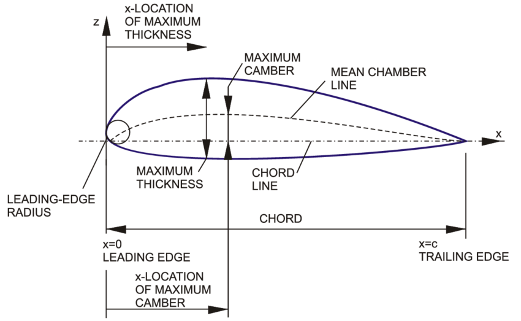

> Translated with the help of ChatGPT and Google Translator


I plan to try making an RC airplane in the future. At that time, the most difficult part to make seemed to be the wings, so I wrote a program to create a 3D model of the wings in advance. Below is the relevant repository.

- [https://github.com/unknownpgr/naca-airfoil-generator](https://github.com/unknownpgr/naca-airfoil-generator)

## Airfoil

The most basic thing about a wing is the shape of its cross section. The shape of the wing cross section is called an airfoil. Airfoil can of course have any shape, but is generally determined by the following parameters:



- **chord length**: length of wing cross section
- **thickness**: Thickness of wing cross section
  - **maximum thickness**: Maximum thickness of wing cross section
  - **maximum thickness position**: Maximum thickness position of wing cross section
- **mean camber line**: wing cross-section center line
  - **maximum camber**: maximum curvature of the wing cross-section
  - **maximum camber position**: Maximum curvature position of the wing cross section

One way to express the shape of this airfoil is the NACA airfoil. NACA stands for National Advisory Committee for Aeronautics, and NACA airfoil is a method of expressing the airfoil shape developed by NACA, an American aircraft research organization.

According to this method, first the thickness is given as follows.

$$
t(x) = 5t(0.2969\sqrt{x} - 0.1260x - 0.3516x^2 + 0.2843x^3 - 0.1015x^4)
$$

- $x$ is the ratio of the x-axis distance to the chord, taking values between 0 and 1. In other words, it represents the front edge of the wing when $x=0$, and the rear edge of the wing when $x=1$.
- $t$ is the ratio of the thickness of the wing cross-section to the chord.

The camber line is given as below.

$$
y_c = \begin{cases}
   \frac{m}{p^2}(2px - x^2) & \text{if } 0 \leq x \leq p \\
   \frac{m}{(1-p)^2}((1-2p) + 2px - x^2) & \text{if } p \leq x \leq 1
\end{cases}
$$

- $m$ represents maximum camber.
- $p$ represents the maximum camber position.

However, in this case, the thickness refers to the thickness from the camber line to the normal direction. Accordingly, the upper surface and lower surface are given as follows.

$$
\begin{align*}
   x_u &= x - t(x)\sin(\theta) \\
   y_u &= y_c + t(x)\cos(\theta) \\
   x_l &= x + t(x)\sin(\theta) \\
   y_l &= y_c - t(x)\cos(\theta)
\end{align*}
$$

Therefore, the NACA airfoil is determined by three parameters: $m$, $p$, and $t$. This parameter is derived from the name of airfoil. NACA airfoil displays these values as four numbers, which are interpreted sequentially as $mptt$. For example, NACA 2412 gives $m=0.02$, $p=0.4$, $t=0.12$.

> In some cases, it is a 5-digit number, and the interpretation method is different. For more information, please refer to [Wikipedia](https://en.wikipedia.org/wiki/NACA_airfoil).

## Wing

Once you have determined the cross section of the wing, you now need to determine its overall shape. The shape of the wing is determined by the following parameters.

- **span(length)**: length of wings
- **aspect ratio**: The ratio of the length and width of the wings
- **taper ratio**: The ratio of the width of the front and rear ends of the wing
- **angle of attack**: The angle formed by the chord and the horizontal line
- **dihedral angle**: The angle at which the wing is tilted upward (or downward) when looking at the aircraft from the front.
- **sweepback angle**: The angle at which the wing is swept backwards.

> In addition, there may be various shape parameters such as twist or winglet, but we decided not to consider them now because they make the calculations too complicated.

Using these parameters, you can determine the shape of the wing. This can be easily implemented by simply expanding the obtained airfoil in the span direction and changing its rotation or width.

## Model Generation

Now, in order to create a 3D model of the wing from this, we need to create a mesh from this formula. A mesh is a graph that divides a given surface into triangles and consists of vertices and a face consisting of three points. A denser mesh makes the model more accurate and smoother, but increases computational effort exponentially. On the other hand, a coarse mesh reduces the amount of computation, but may result in an inaccurate model. Accordingly, we devised the following simple algorithm:

### Initial Algorithm

1. The surface of the wing is expressed as a parametric function $F(u, v)$. ($u\in[0,1]$, $v\in[0,1]$)
1. Initialize face = [ (0,0), (0,1), (1,0), (1,1) ] and repeat the following process.
   1. Convert each point on the face to $F(u, v)$.
   2. Make sure the face is sufficiently flat.
   3. If the face is flat enough, add the face to the mesh.
   4. If the face is not flat enough, split the face into four equal parts. During division, 5 nodes are added consisting of the midpoint of each edge and the midpoint of the square.
   5. Repeat step 1 again for each split.

### Problem

However, using this method causes the following problems:

1. There are many overlapping nodes.
2. Edge inclusion relationship information is lost.

For example, let's assume that the following face segmentation is given in the domain.

```
┌───┬───┬───────┐
│   │   │       │
├───┼───┤   d   │
│   │ a │       │
├───┼───┼───────┤
│   │ b │       │
├───┼───┤       │
│   │ c │       │
└───┴───┴───────┘
```

- At this time, the lower left node of `a` and the upper left node of `b` are actually the same node. However, if you use the above algorithm as is, these two nodes will be treated as different nodes.
- The bottom node of c is originally the node contained in the bottom edge of the initial rectangle, but that information is lost. Information on the initial edge is essential when the model is a closed shape rather than a surface or when combining two or more models.
- The upper right node of a is included in the left edge of d. However, this information is also lost. Therefore, the right edge of a and the left edge of d are not connected.

### Improved Algorithm

To solve this problem, we devised a method of storing edges as a tree. This is how it works:

1. Edges must go from left to right or from bottom to top. ($x_2\geq x_1 \land y_2\geq y_1$)
1. An edge has a start node and an end node. If an edge can be further divided, the edge has a left child and a right child. The left child is an edge that connects the start node of an edge and the midpoint of the edge. The right child is an edge that connects the midpoint of an edge and the end node of the edge.

Expressing this in json format is as follows.

```js
// Edge without children
{
   "start": 1, // index of start node
   "end": 2, // index of end node
   "children": []
}

// Edge with children
{
   "start": 1,
   "end": 2,
   "children": [
     // Left child
     {
       "start": 1,
       "end": 3,
       "children": []
     },
     //Right child
     {
       "start": 3,
       "end": 2,
       "children": []
     }
   ]
}
```

Now, when we need to split an edge in half, we use the following algorithm:

1. If the edge has already been divided, the left child and right child are returned as is.
2. When the edge is not divided
   1. Create a new node at the midpoint.
   2. Create left child (start, middle) and right child (middle, end).
3. Returns left child and right child.

This is expressed in python pseudocode as follows.

```python
def divide_edge(edge):
    index_start, index_end, children = edge

    if len(children) == 2:
        return children

    start = points[index_start]
    end = points[index_end]
    middle = (start + end) / 2
    points.append(middle)
    index_middle = len(points) - 1

    child_start = [index_start, index_middle, []]
    child_end = [index_middle, index_end, []]
    children.append(child_start)
    children.append(child_end)

    return children
```

Using this method, no overlapping nodes occur and edge inclusion information is not lost.

### Flatness Check

Next we need to devise a way to check if the face is flat enough. At this time, two conditions must be satisfied for the face to be sufficiently flat.

1. All points on the faces must be approximately on the same plane.
1. The face must be convex.

If only the first condition is checked, even if a square in the domain changes to a U shape in the conjugate, the shape is judged to be flat and further division is not performed, and thus a problem may occur where a non-convex plane is converted to convex. . From this, we designed the following algorithm. First, faces and vertices are given as follows.

```
a────b
│    │
│    │
c────d
```

Appropriate sample points are given inside the face. I used 9 sample points as shown below.


First, to make calculations easier, we convert the face to a $z=0$ plane.

1. Convert all points on the face, including the sample point, to $F(u, v)$. Let's call the converted points $a$, $b$, $c$, and $d$, respectively.
1. Calculate the cross product of $ad$ and $bc$ and normalize it so that its length is 1. Assume this is the normal vector of the plane face.
   - If $a, b, c, and d$ actually form a plane, this would be an accurate calculation, but this is usually not the case.
1. Find the basis of the plane from the normal vector and vector $ad$ of the plane through the Gram-Schmidt process.
1. Transform the plane so that the normal vector of the plane becomes the $z$ axis and $a$ becomes the origin.

Next, we check whether this face is convex. However, the convexity of a closed curve is defined only in two dimensions. However, the points converted in the previous process do not lie on one plane. So, before applying the above method, first project each point onto the plane and then check the convexity. For a face to be convex, all of the following conditions must be satisfied:

- The test points in the shape are expressed as a linear combination of vector $ad$ and vector $ab$.
- All coefficients must be greater than 0.
- All coefficients must be less than 1.

Next, we check whether the face is sufficiently flat. A face being flat means that the z values of the sample points are almost 0, so if the z values of the sample points are sufficiently small, the face is judged to be flat.

In the above algorithm, the convex check part is calculated after assuming that the face and sample points are flat, so if the face is a curved surface with a large curvature, you may get an incorrect answer. However, even if it passes the convex check, we avoid this problem because we check flatness at the end. The reason why the convex check is performed before the flatness check is because the convex check is a stronger condition than the flatness check. Even if a face is sufficiently flat, if it is not convex, the face should not be judged to be flat. On the other hand, even if a non-convex face is flat, it can be immediately judged not to be flat. Below is the actual code implementing this.

```python
def __test_flatness(self, rect, func):
    """
    Test the flatness (linearity) of the given rect.
    """
    test_inputs = self.__test_weights @ rect
    test_outputs = func(test_inputs)

    """
    The transformed shape should be planar.
    It means that there exists a plane that contains all the points.

    A plane is determined by center point and normal vector.
    We can roughly assume that the center point is the average of the
    first four points, and the normal vector is the cross product of diagonals.
    """

    ps = test_outputs[:4]
    normal = np.cross(ps[0] - ps[3], ps[1] - ps[2])
    normal /= np.linalg.norm(normal)

    """
    Before calculating, for the ease of calculation, we can
    move the plane to be the z=0 plane.
    """

    test_outputs -= test_outputs[0]
    original_z = normal
    original_x = ps[0] - ps[3]
    original_x /= np.linalg.norm(original_x)
    original_y = np.cross(original_z, original_x)
    original_basis = np.vstack([original_x, original_y, original_z])
    original_basis_inv = np.linalg.inv(original_basis)
    test_outputs = test_outputs @ original_basis_inv

    """
    Before calculating the distance, we must check that the transformed shape is convex.
    It means that the other points can be represented as the convex combination of the first four points.
    we should flatten the points to the plane because the points are not on same plane in general.
    """

    flattened_points = test_outputs[:, :2]
    basis = flattened_points[1:3]
    test_points = flattened_points[4:]
    a = np.linalg.lstsq(basis.T, test_points.T, rcond=None)[0].T
    if np.any(a < 0) or np.any(a > 1):
        return np.inf

    """
    Because the plane is now the z=0 plane, the distance of the points to the plane
    is simply the z-coordinate of the points.
    """

    distances = test_outputs[:, 2]

    """
    The flatness of the shape is the maximum distance of the points to the plane.
    """

    return np.max(np.abs(distances))
```

### Weaving

If you want to create a closed shape, you need to join two edges into one edge. At this time, if the two edges are made to match each other, it will appear to be a closed shape, but 3D modeling tools or 3D printer slicers may not recognize this as a closed shape. Therefore, we need to add a face between the two edges. At this time, the two edges cannot be simply divided into triangles because they may consist of different numbers of nodes. Accordingly, we used the following algorithm: This is a two-pointer algorithm that adds a face between two edges to avoid twisting as much as possible.

```python
def weave_edges(self, edge1, edge2, reverse_face=False):
    vs1 = self.vertices[edge1]
    vs2 = self.vertices[edge2]

    new_faces = []
    i1 = 0
    i2 = 0

    norm = lambda v: np.linalg.norm(v)

    while i1 < len(vs1) - 1 or i2 < len(vs2) - 1:
        if i1 == len(vs1) - 1:
            new_faces.append([edge1[i1], edge2[i2], edge2[i2 + 1]])
            i2 += 1
            continue
        if i2 == len(vs2) - 1:
            new_faces.append([edge1[i1], edge2[i2], edge1[i1 + 1]])
            i1 += 1
            continue
        if norm(vs1[i1] - vs2[i2]) < norm(vs1[i1 + 1] - vs2[i2]):
            new_faces.append([edge1[i1], edge2[i2], edge2[i2 + 1]])
            i2 += 1
        else:
            new_faces.append([edge1[i1], edge2[i2], edge1[i1 + 1]])
            i1 += 1

    if reverse_face:
        new_faces = [f[::-1] for f in new_faces]

    self.faces = np.vstack([self.faces, new_faces])
```

### Triangulation

Lastly, a face constructed in this way must consist of four or more nodes. If the face consists of 4 nodes, it is simply divided diagonally. If it consists of 5 or more nodes, triangulation is performed by adding a new node that is the average of the edge nodes in the middle of the face and dividing the face based on this node.

There are methods that do not add new nodes, such as ear-clipping, but the above method was used for the following reasons.

- When you construct a face as described in this article, multiple nodes often lie on one straight line.
- In that case, if you do not add a new node, sharp walls will appear between faces.
- Since we performed a convex check on the face earlier, the midpoint is guaranteed to be contained within the face.

## Result

Below is the 3D model created using the above algorithm.


- Empty spaces are visible throughout the model. This is a rendering error in matplotlib. In reality, there is no such problem.

Below is the mesh for constructing the above model.


- Because the left and right sides of the model are closed, the lines overlap and appear dark.
- Because the top and bottom sides of the model are connected, lines are visible running up and down the model.

## References

- [NACA airfoil - Wikipedia](https://en.wikipedia.org/wiki/NACA_airfoil)
- [De paula, Adson. (2016). The airfoil thickness effects on wavy leading edge phenomena at low Reynolds number regime. ](https://www.researchgate.net/figure/Main-geometric-parameters-of-an-aerodynamic-airfoil_fig22_305044784)
