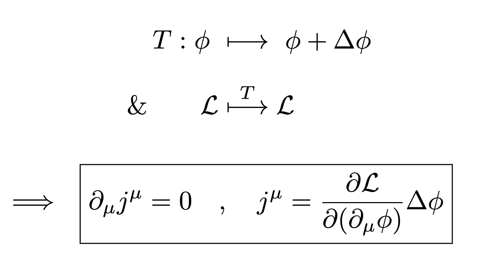

> Translated with the help of ChatGPT and Google Translator

Ever since I was in high school, I have been really curious about how Noether's Theorem works. However, I recently found a video that clearly explains Noether's theorem. So, I would like to summarize the contents.

<iframe width="560" height="315" src="https://www.youtube.com/embed/78wz4KSzUvo" title="YouTube video player" frameborder="0" allow="accelerometer; autoplay; clipboard- write; encrypted-media; gyroscope; picture-in-picture" allowfullscreen></iframe>

# What is Noether’s theorem?

First, let’s look at Noether’s theorem. Noether's theorem is the theorem that **if there is continuous symmetry in a system, a corresponding conserved physical quantity exists**. For example, spatial translational symmetry corresponds to the law of conservation of momentum, and rotational symmetry corresponds to the law of conservation of angular momentum.

But I couldn't understand this sentence at all. First of all, I didn't understand what continuous symmetry meant. I think this is probably because the abstract explanation was too abstract to understand, and the detailed explanation using formulas was too mathematical, so it was difficult to understand its meaning.

# Proof of Noether's theorem

Disclaimer: Please take this part as a mathematical demonstration of why the above proposition holds, rather than a mathematically rigorous proof. I'm not a math or physics major... haha

## Continuous symmetry

To understand Noether's theorem, we must first understand what continuous symmetry is. Of course, to do that you first need to understand what symmetry is. In physics or mathematics, symmetry refers to a situation where no matter what changes are made to a system, it remains the same as the original.

For example, consider mirror symmetry. If you think about the shape of a butterfly, it is reversed left and right, that is, even if you look at the shape reflected in a mirror, it is completely indistinguishable from the original shape. Therefore, the butterfly shape has mirror symmetry.

However, the same appearance can only be achieved when a butterfly is flipped left and right, and cannot be obtained when flipped at a 45° angle or upside down. Therefore, the mirror symmetry of the butterfly shape is not continuous.

Similarly, when rotating a butterfly shape, the rotational symmetry of the butterfly shape is not continuous because the same shape as the original shape can be obtained only in special cases such as rotating it by 0° or rotating it by 360°.

On the other hand, when you rotate a circle, the circle gets the same shape no matter what angle you rotate it. Therefore, the rotational symmetry of a circle is continuous.

## Mathematical expression of continuous symmetry

This symmetry is expressed mathematically in the concept of _cyclic coordinate_. (At least that's true in physics.)

> Cyclic coordinates are literally translated as ‘circular coordinates.’ It is not clear why this concept has this name. After a little searching, I found that this is because these variables usually correspond to rotational degrees of freedom. (Some answers said there were other reasons.)
>
> Source: https://physics.stackexchange.com/questions/66640/why-are-they-called-cyclic-coordinates

In this case, coordinate refers to the generalized coordinate in the Hamiltonian. Since the Hamiltonian and the Lagrangian are similar concepts, it seems safe to think of them as the Lagrangian. (Generalized coordinates and Lagrangian mechanics were previously covered in [Lagrangian mechanics series](/posts/lagrangian-1).)

For example, consider a particle moving in an infinitely large space without gravity or air resistance. This particle has kinetic energy $\frac{mv^2}{2}$ and no potential energy. The Lagrangian is given by $L=T-V$, so in this case $L=T=\frac{mv^2}{2}$. At this time, the position of the particle does not appear in the Lagrangian of this particle. Therefore, the particle's position $x, y$ becomes the cyclic coordinate for this system.

## Cyclic coordinates and symmetry

According to Lagrangian mechanics, a system (specifically its evolution over time) depends only on its Lagrangian. Therefore, cyclic coordinates that do not appear in the Lagrangian cannot have any effect on the system. In other words, changing the cyclic coordinate has no effect on the system, and therefore cyclic coordinate means symmetry. To be more specific, it means, “Even if the cyclic coordinates are changed, the system does not distinguish between before and after.”

In the example above, the coordinates were cyclic coordinates, which corresponds to spatial symmetry (translational symmetry).

## Symmetry and conservation laws

Now let's connect symmetry and conservation laws. First, the Euler-Lagrange equation is as follows.

$$
\frac{\partial L}{\partial q}-\frac{d}{dt}\left(\frac{\partial L}{\partial \dot q}\right)=0
$$

At this time, saying that this generalized coordinate $q$ is a cyclic coordinate means that $L$ is independent of $q$. Therefore, the previous term becomes 0, so we get the following result.

$$
\frac{d}{dt}\left(\frac{\partial L}{\partial \dot q}\right)=0
$$

This means that the time-dependent change $\left(\frac{d}{dt}\right)$ of a certain physical quantity $\left(\frac{\partial L}{\partial \dot q}\right)$ is 0, i.e. It means that physical quantities are constant, which means the law of conservation.

> At this time, you should be careful that even if $\frac{\partial L}{\partial q}=0$, $\frac{\partial L}{\partial \dot q}\neq 0$.

## example

Let us derive a conservation law through a simple system.

A particle lies on a circle with radius $r>0$ centered on the origin in the horizontal plane. To use Lagrange mechanics, let the generalized coordinate $q$ be the angle between this particle's position vector and the $x$ axis. In that case, the speed of this particle is $r\dot q$ and therefore the kinetic energy is $\frac{mr^2\dot q^2}{2}$, and since it is assumed to be a horizontal plane, the potential energy becomes a constant. Let's simply call this $E_p$. (The potential energy letters do not have much meaning. In fact, it is okay to leave it as 0 rather than calling it an arbitrary constant.)

Therefore, the generalized coordinate $q$ does not appear in kinetic energy nor does it appear in potential energy.

> It is important to note that $q$ and $\dot q$ are considered unrelated in Lagrangian mechanics.

Therefore, this generalized coordinate, or angle, is a cyclic coordinate and therefore the system has continuous rotational symmetry. And if we develop the Euler-Lagrange equation accordingly, it becomes as follows.

$$
\frac{d}{dt}\frac{\partial \frac{mr^2\dot q^2}{2}-E_p}{\partial \dot q}
            -\frac{\partial \frac{mr^2\dot q^2}{2}-E_p}{\partial q}=0\\
\leftrightarrow \frac{d}{dt}\frac{\partial \frac{mr^2\dot q^2}{2}-E_p}{\partial \dot q}=0\\
\leftrightarrow \frac{d}{dt}\frac{\partial \frac{mr^2\dot q^2}{2}}{\partial \dot q}=0\\
\leftrightarrow \frac{d}{dt}mr^2\dot q=0\\
\leftrightarrow \frac{d}{dt}mrv=0
$$

However, $mrv$ is angular momentum. Therefore, the above equation means that the angular momentum in this system is invariant with respect to time, which soon becomes the law of angular momentum conservation.
