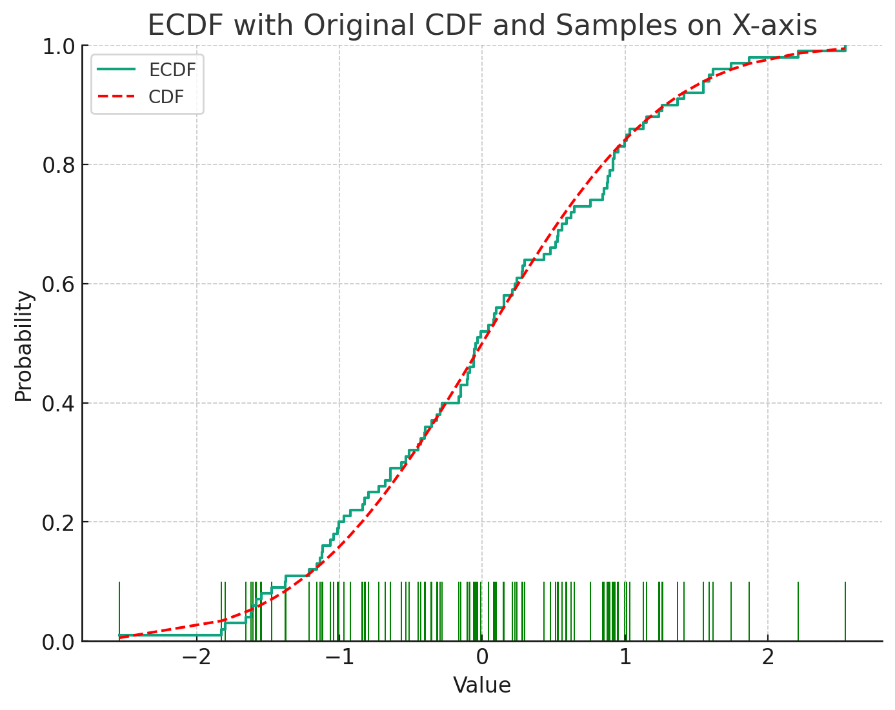
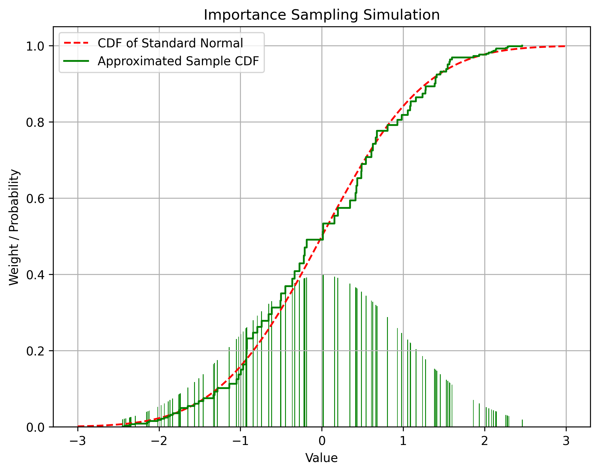
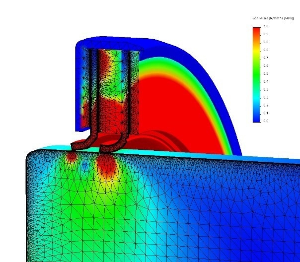

> Translated with the help of ChatGPT and Google Translator

This time, I studied particle filters, which I had been putting off. The purpose of this article is to explain the principles of particle filters in detail so that anyone can understand them.

If you search the Internet, you will find countless articles, including papers, that explain particle filters in detail. However, articles that provide easy explanations only explain important concepts through abstract metaphors without proof. In that case, although it is easy to implement in code, it is difficult to know why it works or does not work, and whether modifying the algorithm will mathematically guarantee optimality.

On the other hand, most articles that explain the content in detail, such as papers, are skipped over without explaining the easy parts. However, the easy part was not at the level of equation expansion or factorization, but could be proven only by applying various complex theorems, so it was often difficult to understand the flow. Moreover, many articles, including Wikipedia and papers, use various notations without explanation, making it difficult to interpret the correct meaning of the expression in the first place.

So, I would like to explain particle filters by including not only abstract concepts but also rigorous mathematical proofs so that even people with only a high school level of mathematical knowledge can understand them.

Specifically, you will need the following background knowledge:

- High school level probability theory (conditional probability, joint probability, Bayes' theorem)
- Concept of integration

Because the content is long, it is organized in written form.

# Filter

In order to understand various filters, including particle filters, it is essential to first understand the concept of filters. In signal processing and control engineering, a filter refers to a device or mathematical structure that passes only the desired signal from a signal in which various signals are overlapped.

The reason a filter is needed is because signals inevitably contain noise. From a control or signal processing perspective, all signals are considered the sum of the desired signal and noise. In an ideal environment where signals are transmitted without loss, a filter would be unnecessary, but in reality, noise is included for various reasons, including measurement uncertainty, so a filter is necessary.

The operation of the filter is fundamentally divided into a process of obtaining the signal value and a process of estimating the true value from this. At this time, obtaining the value of the signal is called **measurement** or **observation**, and estimating the true value from this is called **estimate** or \*_prediction_ It is said to be \*.

Depending on the characteristics of the signal, filters are implemented in various ways. For example, in electronics, the frequencies of signals and noise are often different. From this, the filter is implemented by attenuating everything except the desired frequency band. The most basic of them is the moving average. Moving average estimates the current true value from the (weighted) average of previous measurement values, and can be seen as attenuating high-frequency signals in the frequency domain.

On the other hand, there are cases where it is difficult to distinguish between signal and noise using this method when the system is complex or has large nonlinearity. In such cases, a filter based on probability theory can be used. A stochastic filter approaches the method of calculating the probability distribution of a signal rather than estimating a single true value of the signal. Mathematically, this is expressed as a conditional probability distribution of the true value given the measured values up to the current point as shown below.

$$
p(x_t | z_t, z_{t-1}, \cdots, z_0)
$$

> When a comma `,` is used in a probability distribution, it means a joint probability distribution ($a\cap b$). Therefore, the above equation can be interpreted as follows.
>
> $$
> \begin{align*}
> p(x_t | z_t, z_{t-1}, \cdots, z_0) &= p(x_t | z_t \cap z_{t-1} \cap \cdots \cap z_0)\\
> &= p(x_t \cap z_t \cap z_{t-1} \cap \cdots \cap z_0) / p(z_t \cap z_{t-1} \cap \cdots \cap z_0)
> \end{align*}
> $$

# Bayes Filter

A Bayes filter is a method of expressing the above probability distribution by combining other probability distributions that are already known. This is because the above equation is simply a mathematical expression of the sentence 'probability distribution of the true value given the measured values', and does not tell us at all how to calculate the probability distribution.

The Bayes filter assumes that the two probability distributions below are already known.

- $p(z_t | x_t)$: Probability distribution of the measured value when the true value is given
- $p(x_t | x_{t-1})$: Probability distribution of the true value given the previous true value

These two probability distributions are called **measurement model** and **system model**, respectively, and using these two probability distributions, the probability distribution of the true value can be recursively calculated as follows. .

$$
p(x_t | z_{t-1}, z_{t-2}, \cdots, z_0) = \int p(x_t | x_{t-1}) p(x_{t-1} | z_{t- 1}, z_{t-2}, \cdots, z_0) dx_{t-1}
$$

$$
p(x_t | z_t, z_{t-1}, \cdots, z_0) = \frac{p(z_t | x_t) p(x_t | z_{t-1}, z_{t-2}, \cdots, z_0 )}{\int p(z_t | x_t) p(x_t | z_{t-1}, z_{t-2}, \cdots, z_0) dx_t}
$$

Below, we explain other concepts necessary to derive the Bayes filter and derive the Bayes filter from them.

## Conditional Independence

Since the concept of conditional independence is often used in the derivation of Bayes filters, it is important to understand conditional independence. Conditional independence means that **given an event $A$**, events $B$ and $C$ are independent. Below are various expressions for conditional independence, all of which are equivalent.

- $p(B, C|A) = p(B|A)p(C|A)$: Given $A$, the joint probability distribution of $B$ and $C$ is It is equal to the product of the probability distribution of $.
- $p(A \cap B \cap C) = p(A \cap B) p(A \cap C) / P(A)$: The above equation is expanded according to the definition of conditional probability.
- $p(B|A, C) = p(B|A)$: Given $A$, the probability distribution of $B$ is not affected by $C$.
- $p(C|A, B) = p(C|A)$: Given $A$, the probability distribution of $C$ is not affected by $B$.

What is important here is that $B$ and $C$ are independent only when $A$ is given. That is, if $B$ and $C$ are conditionally independent with respect to $A$, $B$ and $C$ are generally not independent.

Additionally, if two variables $A and B$ are conditionally independent with respect to the other variable $C$, the following important properties hold true.

$$
p(A | B) = \int p (A |C) p(C|B) dC
$$

This equation is called Chapman–Kolmogorov Equation (CKE). More precisely, CKE refers to a more general equation for several random variables, and the above equation can be said to be a special case of CKE that deals with three random variables.

The proof is as follows.

> Since $A$ and $B$ are conditionally independent of $C$,
>
> $$
> p(A | C) = p(A | B, C)
> $$
>
> Substituting this into the above equation gives
>
> $$
> p(A | B) = \int p(A | B, C) p(C | B) dC
> $$
>
> If we expand the right side according to the definition of conditional probability, we get
>
> $$
> = \int \frac{p(A \cap B \cap C)}{p(B \cap C)} \frac{p(C \cap B)}{p(B)} dC\\
> $$
>
> $$
> = \int \frac{p(A \cap B \cap C)}{p(B)} dC
> $$
>
> By the law of total probability
>
> $$
> = \frac{p(A \cap B)}{p(B)}
> $$
>
> By definition of conditional probability
>
> $$
> = p(A | B)
> $$

## Markov Chain

When a system satisfies the following properties, it is called a **Markov chain**.

$$
p(x_t | x_{t-1}, x_{t-2}, \cdots, x_0) = p(x_t | x_{t-1})
$$

This indicates that the current state of the system depends only on the state immediately before it and does not depend on other past states. Many systems, including real-world physical phenomena, satisfy this property.

Markov chains can be interpreted in terms of conditional independence. In other words, given $x_{t-1}$, the probability distribution of $x_t$ is conditionally independent with respect to $x_{t-2}, \cdots, and x_0$.

## Hidden Markov Chain

However, in general, it is impossible to directly measure the entire state of the system, and only part of the system can be measured indirectly. This Markov chain is called a **hidden Markov chain**.

$$
\begin{array}{cccccccccc}
X_{0} & \to & X_{1} & \to & X_{2} & \to & X_{3} & \to & \cdots & \text{signal} \\
\downarrow & & \downarrow & & \downarrow & & \downarrow & & \cdots & \\
Z_{0} & & Z_{1} & & Z_{2} & & Z_{3} & & \cdots & \text{observation}
\end{array}
$$

In the above diagram, the arrow $X$ is a state and cannot be measured directly. $Z$ is the observed value obtained through measurement. The arrow $A\to B$ indicates that the random variable $B$ depends only on $A$. this can also be interpreted to mean that for any random variable $C$ other than $A$, $B$ and $C$ are conditionally independent of $A$.

## Bayes' theorem

Bayes' theorem states that the following relationship holds true for conditional probability.

$$
p(A|B) = \frac{p(B|A)p(A)}{p(B)}
$$

Bayes' theorem can be interpreted in two ways:

- Inverse probability problem: Finding $P(A|B)$ given $P(B|A)$
  - Example) Given the probability of testing positive when having a disease, finding the probability of being sick when testing positive is given.
- Posterior probability estimation: updating the prior probability $P(A)$ to a more accurate probability through the measured value $B$
  - Example) In general, you know the probability of contracting a certain disease, but when you learn new test results, you recalculate the probability of contracting the disease.

Bayes filter uses Bayes' theorem in terms of posterior probability estimation. In other words, the measured value is reflected in the previously known probability distribution and updated to a more accurate probability distribution is repeated.

## Derivation of Bayes filter

If we recall again the probability distribution we want to find, it is as follows.

$$
p(x_t | z_t, z_{t-1}, \cdots, z_0)
$$

To calculate this, assume that you know the two probability distributions below.

- $p(x_t | x_{t-1})$: system model
- $p(z_t | x_t)$: measurement model

From this, Bayes' filter is derived by applying Bayes' theorem as follows.

First, if you apply Bayes' theorem to the equation you want to find,

$$
p(x_t | z_t, z_{t-1}, \cdots, z_0) = \frac{p(z_t, z_{t-1}, \cdots, z_0 | x_t) p(x_t)}{p(z_t, z_{t-1}, \cdots, z_0)}
$$

At this time, $z_t$ depends only on $x_t$ according to the assumption of the hidden Markov chain, so it is conditionally independent with respect to any random variable $k$ other than $x_t$. That is, the following holds true.

$$
\forall k \neq x_t, p(z_t, k | x_t) = p(z_t | x_t) p(k | x_t)
$$

From this, if we set $k=z_{t-1}, z_{t-2}, \cdots, z_0$,

$$
p(z_t, z_{t-1}, \cdots, z_0 | x_t) = p(z_t | x_t) p(z_{t-1}, z_{t-2}, \cdots, z_0 | x_t)
$$

Applying this again to Bayes' theorem, we get

$$
= \frac{p(z_t | x_t) p(z_{t-1}, z_{t-2}, \cdots, z_0 | x_t) p(x_t)}{p(z_t, z_{t-1}, \cdots,z_0)}
$$

However, according to the definition of conditional probability, $p(z_{t-1}, z_{t-2}, \cdots, z_0 | x_t) p(x_t) = p(z_{t-1}, z_{t-2 }, \cdots, z_0, x_t)$, so

$$
= \frac{p(z_t | x_t) p(z_{t-1}, z_{t-2}, \cdots, z_0, x_t)}{p(z_t, z_{t-1}, \cdots, z_0 )}
$$

Divide the denominator and numerator by $p(z_{t-1}, z_{t-2}, \cdots, z_0)$, respectively.

$$
= \frac{p(z_t | x_t) p(x_t | z_{t-1}, z_{t-2}, \cdots, z_0)}{p(z_t | z_{t-1}, z_{t- 2}, \cdots, z_0)}
$$

At this time, the denominator $p(z_t | z_{t-1}, z_{t-2}, \cdots, z_0)$ is decomposed by CKE, which was previously discussed in the conditional independence section, as follows.

$$
p(z_t | z_{t-1}, z_{t-2}, \cdots, z_0) = \int p(z_t | x_t) p(x_t | z_{t-1}, z_{t-2}, \cdots, z_0) dx_t
$$

Substituting this back into the equation, we get:

$$
p(x_t | z_t, z_{t-1}, \cdots, z_0) = \frac{p(z_t | x_t) p(x_t | z_{t-1}, z_{t-2}, \cdots, z_0 )}{\int p(z_t | x_t) p(x_t | z_{t-1}, z_{t-2}, \cdots, z_0) dx_t}
$$

The unknown part of this equation is $p(x_t | z_{t-1}, z_{t-2}, \cdots, z_0)$. At this time, according to the assumption of the Markov model, $x_t$ depends only on $x_{t-1}$, so $x_t$ is conditionally independent from $z_{t-1}, z_{t-2}, \cdots, z_0$ am. Therefore, it is similarly decomposed by CKE as follows.

$$
p(x_t | z_{t-1}, z_{t-2}, \cdots, z_0) = \int p(x_t | x_{t-1}) p(x_{t-1} | z_{t- 1}, z_{t-2}, \cdots, z_0) dx_{t-1}
$$

At this time, the unknown part of this equation, $p(x_{t-1} | z_{t-1}, z_{t-2}, \cdots, z_0)$, is the original expression $p(x_t | z_t, z_ It is a form with only one subscript reduced from {t-1}, \cdots, z_0)$. From this, the following recursive estimation can be performed.

1. Assume you know $p(x_{t-1} | z_{t-1}, z_{t-2}, \cdots, z_0)$.
1. Calculate $p(x_t | z_{t-1}, z_{t-2}, \cdots, z_0)$ from this. Since this calculates the probability distribution of the true value at time $t$ based on information up to time $t-1$, this process is called **estimation** or **prediction** (prediction).
1. Calculate $p(x_t | z_t, z_{t-1}, \cdots, z_0)$ from this. This process is called **update** because it recalculates the probability distribution of the true value by reflecting the new measured value in the estimated value.

When you first start calculating, an initial estimate $p(x_0)$ is needed. $p(x_0)$ is a probability distribution in the case where there is no information, so a uniform probability distribution or normal distribution can be used. The more precise the initial estimate is used, the more accurate the subsequent estimate becomes.

The method of estimating the probability distribution of the true value as shown above is called **Bayes filter** and is the theoretical basis for all probabilistic filtering.

However, Bayesian filters must perform integration during the prediction process, but integration of non-linear or numerically defined functions is often very difficult or sometimes impossible. Therefore, in general, Bayes filters cannot be directly applied to real-world problems, and various methods to approximate them have been proposed.

Methods for approximating arbitrary probability distributions are largely divided into **parametric methods** and **nonparametric methods**. The parametric method is a method of estimating the parameters of the model assuming that the probability distribution follows a specific type of probability distribution. This can be used when there is a theoretical basis for the probability distribution. On the other hand, the non-parametric method is a method of approximating the probability distribution using measured values without making any assumptions about the probability distribution.

**Kalman filter** is an approximation to the Bayes filter through a parametric method, and is a method that allows integrals to be solved analytically by assuming that the linearity and error of each model are normal distribution.
The Kalman filter provides very accurate estimates when the amount of calculation is not large and linearity and normal distribution assumptions are satisfied.
However, if important assumptions such as linearity are not satisfied, the filter may diverge.

**Particle filter**, which will be discussed later, is a non-parametric approximation to the Bayes filter and is a method of approximating the Bayes filter using Monte Carlo sampling.
Particle filters make no assumptions about the model, so they can be used even when assumptions such as linearity are not met.
However, since it is an approximation through sampling, it has the disadvantage that the calculation amount is large and the accuracy may be low.

# Particle Filter

It was previously said that the Bayes filter estimates the probability distribution of the true value by repeating the following two steps.

- prediction
  $$p(x_t | z_{t-1}, z_{t-2}, \cdots, z_0) = \int p(x_t | x_{t-1}) p(x_{t-1} | z_{ t-1}, z_{t-2}, \cdots, z_0) dx_{t-1}$$
- update
  $$p(x_t | z_t, z_{t-1}, \cdots, z_0) = \frac{p(z_t | x_t) p(x_t | z_{t-1}, z_{t-2}, \cdots , z_0)}{\int p(z_t | x_t) p(x_t | z_{t-1}, z_{t-2}, \cdots, z_0) dx_t}$$

However, in general, a system is a two-dimensional or more vector, and the system model is given as a matrix equation. Therefore, the integration in the prediction step becomes multiple integrations in high dimensions, and the integration area can become very complicated.

## Empirical Distribution Function

In this case, the integral can be approximated using an empirical distribution function. The empirical distribution function is a method of approximating the probability distribution by sampling the measured values when it is difficult to directly obtain the value of a probability distribution function but easy to sample. At this time, when the number of samples becomes sufficiently large, the distribution of samples converges to the original probability distribution. Mathematically, this can be expressed as follows.

$$
\hat p(x) := \frac{1}{n} \sum_{i=1}^n \delta(x - x_i) \approx p(x)
$$

At this time, $x_i$ is a value sampled from the probability distribution $p(x)$, $\delta(x - x_i)$ is the Dirac-delta function, $\delta(0) = \infty$, and $\delta(x) = 0$ ($x \neq 0$). The integral of the Dirac-delta function becomes 1. Alternatively, the above equation can be integrated and expressed in the form of a cumulative distribution function as shown below.

$$
\hat F(x) = \frac{1}{n} \sum_{i=1}^n \bold{1}_{x_i \leq x}\approx F(x)
$$

In this case, $\bold{1}_{x_i \leq x}$ is a function that is 1 when $x_i \leq x$, and 0 otherwise.

Below is an empirical distribution function calculated using samples sampled from a normal distribution.


## Importance Sampling

However, there is a problem that in order to obtain the empirical distribution function through simulation rather than real-life experiment, the original probability distribution must be known. In other words, an attempt was made to use empirical sampling to obtain the probability distribution, but a paradoxical problem arises in that the original probability distribution must be known in order to do so.

At this time, even if sampling is not possible from the original probability distribution, the probability distribution can be approximated through sampling by using importance sampling. Importance sampling is a method of sampling from another probability distribution $q(x)$ and using it to approximate the expected value of $p(x)$, even if the probability distribution $p(x)$ is not known, as follows.

$$
E_p[f(x)] = \int f(x) p(x) dx = \int f(x) \frac{p(x)}{q(x)} q(x) dx \approx \frac{ 1}{n} \sum_{i=1}^n f(x_i) \frac{p(x_i)}{q(x_i)}
$$

Below is an approximation of the cumulative probability density function of the normal distribution using importance sampling from the uniform probability distribution.



At this time, the probability distribution $q(x)$ on which sampling is performed is called the importance distribution or proposal distribution. The proposed distribution can select an arbitrary probability distribution with non-zero values where the probability density of the original distribution is greater than 0, but the more similar the original distribution is, the higher the approximation accuracy. The proposed distribution generally uses a normal distribution or uniform distribution that is easy to sample.

However, it should be noted that the mean of the probability distribution obtained as a result of importance sampling converges to the original probability distribution, but the variance is different from the original probability distribution.

## Sequential Importance Sampling

Particle filters approximate Bayesian filters using importance sampling, as mentioned earlier. This is called Sequential Importance Sampling (SIS). The proof of SIS is a bit complicated. First, when each particle moves along a specific probability distribution over time, we will obtain the probability distribution of the trajectory itself and then show that it is also the same as the probability distribution of the particle.

> In general, if you look at other articles, in this calculation, all proposed probability distributions are expressed with a single symbol, $q$. However, in this article, different probability distributions will be assigned different symbols to avoid confusion. The symbol $p$ generally represents the probability distribution of a random variable, and other symbols represent specific probability distributions. These should not be confused.

### Probability distribution of particle trajectories

First, extract $n$ samples $x_0^{(1)}, x_0^{(2)}, \cdots, x_0^{(n)}$ from the initial probability distribution $q_0(x)$. Obviously, $p(x_0) = q_0(x)$.

And let us assume that each particle $x_0^{(i)}$ moves according to the probability distribution $r_t^{(i)}(x^{(i)}_{t+1})$ over time. .

> Where a particle will be at the next instant generally depends on where it was at the previous instant. Therefore, although not explicitly stated, $r_t^{(i)}(x^{(i)}_{t+1})$ is generally dependent on $x^{(i)}_t$.

Then, for each particle $x^{(i)}$, the probability that the particle is initially at $x_0^{(i)}$ and at the next instant is at $x_1^{(i)}$ is same.

$$
p(x_1^{(i)}, x_0^{(i)}) = q_0(x_0^{(i)}) r_0^{(i)}(x_1^{(i)})
$$

Expanding, the probability that each particle moves along the trajectory $x_0^{(i)}, x_1^{(i)}, \cdots, x_t^{(i)}$ over time is as follows.

$$
p(x_t^{(i)}, x_{t-1}^{(i)}, \cdots, x_0^{(i)}) = q_0(x_0^{(i)}) r_0^{(i )}(x_1^{(i)}) r_1^{(i)}(x_2^{(i)}) \cdots r_{t-1}^{(i)}(x_t^{(i)})
$$

At this time, let the probability distribution of the particle trajectory at time $t$ be $q_t$. Then $q_t$ is expressed as follows.

$$
q_t(x_0^{(i)}, x_1^{(i)}, \cdots, x_t^{(i)}) = q_0(x_0^{(i)}) r_0^{(i)}(x_1^ {(i)}) r_1^{(i)}(x_2^{(i)}) \cdots r_{t-1}^{(i)}(x_t^{(i)})
$$

Expressing this in ignition form is as follows.

$$
q_t(x_0^{(i)}, x_1^{(i)}, \cdots, x_t^{(i)}) = q_{t-1}(x_0^{(i)}, x_1^{(i )}, \cdots, x_{t-1}^{(i)}) r_{t-1}^{(i)}(x_t^{(i)})
\tag{1}
$$

This is the probability distribution that each particle moves along a specific trajectory over time.

### Probability distribution of state trajectory

Next, the probability distribution of the original state that we want to obtain is as follows.

$$
p(x_0, x_1, \cdots, x_t | z_0, z_1, \cdots, z_t)
$$

This is slightly different from the probability distributions discussed earlier. Previously, we discussed the probability distribution of the current state given the observed values up to the current point. However, this includes all probability distributions of states at previous times, given the observations up to the current point.

At this time, let us assume that there is an appropriate weight $w_t^{(i)}$ so that the probability distribution of the particle approximates the probability distribution to be obtained according to the principle of importance sampling. In other words, let’s say the following conditions are satisfied.

$$
p(x_0, x_1, \cdots, x_t | z_0, z_1, \cdots, z_t) \approx \sum_{i=1}^n w_t^{(i)} \delta(x_0, x_1, \cdots, x_t - x_0^{(i)}, x_1^{(i)}, \cdots, x_t^{(i)})
$$

What we want to achieve is to find this $w_t^{(i)}$. According to importance sampling, $w_t^{(i)}$ should be:

$$
w_t^{(i)} = \frac{p(x_0^{(i)}, x_1^{(i)}, \cdots, x_t^{(i)} | z_0, z_1, \cdots, z_t)} {q_t(x_0^{(i)}, x_1^{(i)}, \cdots, x_t^{(i)})}
$$

Since the expression is long, from now on, $x_0^{(i)}, x_1^{(i)}, \cdots, x_t^{(i)}$ will be simply called $x_{0:t}^{(i)}$ I will mark it. Using this notation, the above equation is simply expressed as follows.

$$
w_t^{(i)} = \frac{p(x_{0:t}^{(i)} | z_{0:t})}{q_t(x_{0:t}^{(i)}) }
\tag{2}
$$

Now we will decompose the molecule on the right side using Bayes' theorem. First, if we expand this equation according to the definition of conditional probability, we get

$$
p(x_{0:t}^{(i)} | z_{0:t}) = \frac{p(x_{0:t}^{(i)}, z_{0:t})}{ p(z_{0:t})}
$$

According to the definition of conditional probability, if we take out only $z_{t}$,

$$
= \frac{p(z_t | x_{0:t}^{(i)}, z_{0:t-1}) p(x_{0:t}^{(i)}, z_{0:t -1})}{p(z_{0:t})}
$$

Again, according to the definition of conditional probability, if we take out only $x_{t}^{(i)}$,

$$
= \frac{p(z_t | x_{0:t}^{(i)}, z_{0:t-1}) p(x_{t}^{(i)} | x_{0:t-1 }^{(i)}, z_{0:t-1}) p(x_{0:t-1}^{(i)}, z_{0:t-1})}{p(z_{0 :t})}
$$

Divide both the denominator and numerator by $p(z_{0:t-1})$

$$
= \frac{p(z_t | x_{0:t}^{(i)}, z_{0:t-1}) p(x_{t}^{(i)} | x_{0:t-1 }^{(i)}, z_{0:t-1}) p(x_{0:t-1}^{(i)}, z_{0:t-1}) / p(z_{0: t-1})}{p(z_{0:t}) / p(z_{0:t-1})}
$$

According to the definition of conditional probability

$$
= \frac{p(z_t | x_{0:t}^{(i)}, z_{0:t-1}) p(x_{t}^{(i)} | x_{0:t-1 }^{(i)}, z_{0:t-1}) p(x_{0:t-1}^{(i)} | z_{0:t-1})}{p(z_t | z_ {0:t-1})}
$$

At this time, the denominator of this equation is a constant, so it can be omitted. What we are looking for now is the numerator of $w_t^{(i)}$, and since $\sum_{i=1}^n w_t^{(i)} = 1$, the relative size of each $w_t^{(i)}$ Because it's only important. therefore

$$
p(x_{0:t}^{(i)} | z_{0:t}) \propto p(z_t | x_{0:t}^{(i)}, z_{0:t-1}) p(x_{t}^{(i)} | x_{0:t-1}^{(i)}, z_{0:t-1}) p(x_{0:t-1}^{( i)} |z_{0:t-1})
$$

Here, if we eliminate variables that can be ignored according to the Markov chain assumption, we get the following conclusion.

$$
p(x_{0:t}^{(i)} | z_{0:t}) \propto p(z_t | x_{t}^{(i)}) p(x_{t}^{(i) } | x_{t-1}^{(i)}) p(x_{0:t-1}^{(i)} | z_{0:t-1})
\tag{3}
$$

This is the probability distribution that a state will follow a certain trajectory given the observations.

### Importance Updates

Next, the importance update equation is derived through this. Substituting equation (3) into equation (2), we get

$$
w_t^{(i)} \propto \frac{p(z_t | x_{t}^{(i)}) p(x_{t}^{(i)} | x_{t-1}^{(i)}) p(x_{0:t -1}^{(i)} | z_{0:t-1})}{q_t(x_{0:t}^{(i)})}
\tag{4}
$$

Substituting equation (1) into equation (4), we get

$$
w_t^{(i)} \propto \frac{p(z_t | x_{t}^{(i)}) p(x_{t}^{(i)} | x_{t-1}^{(i )}) p(x_{0:t-1}^{(i)} | z_{0:t-1})}{q_{t-1}(x_{0:t-1}^{(i )}) r_{t-1}^{(i)}(x_t^{(i)})}
$$

If we bundle the terms of time $t-1$, we get

$$
w_t^{(i)} \propto \frac{p(z_t | x_{t}^{(i)}) p(x_{t}^{(i)} | x_{t-1}^{(i )})}{r_{t-1}^{(i)}(x_t^{(i)})}\frac{p(x_{0:t-1}^{(i)} | z_{0 :t-1})}{q_{t-1}(x_{0:t-1}^{(i)})}
$$

According to the definition of $w_t^{(i)}$

$$
w_t^{(i)} \propto \frac{p(z_t | x_{t}^{(i)}) p(x_{t}^{(i)} | x_{t-1}^{(i )})}{r_{t-1}^{(i)}(x_t^{(i)})} w_{t-1}^{(i)}
$$

This is the most basic update formula for particle filters, and it is called Sequential Importance Sampling (SIS).

And in general, to reduce the amount of calculation, $r_t^{(i)}(x_t^{(i)})$ is appropriately changed to $p(x*t^{(i)} | x*{t-1}^{(i) }) Select with $. Then, the equation becomes simple as follows.

$$
w_t^{(i)} \propto p(z_t | x_{t}^{(i)}) w_{t-1}^{(i)}
$$

The entire logic of the SIS-based particle filter is expressed in pseudocode as follows.

```python
xs = sample_from_prior()
ws = [1.0] * n_particles

for t in range(1, T):
     #Observation
     z = observe()

     for i in range(n_particles):
         #Prediction
         xs[i] = transition(xs[i])
         #Update
         ws[i] *= likelihood(z, xs[i])

     # Normalize
     ws_sum = sum(ws)
     for i in range(n_particles):
         ws[i] /= ws_sum
```

## Resampling

However, if the above method is used as is, the importance of particles with low importance continues to decrease and converges to 0 in just a few steps, and all importance is concentrated on one particle. This is called degeneracy. When degeneracy occurs, not only is most of the calculation amount consumed in unnecessary calculations where the probability density is almost 0, but the filter performance is greatly reduced as the particles do not approximate the entire probability distribution and only represent a single point.

Accordingly, when the filter is degraded, resampling is necessary to replicate particles of high importance and remove particles of low importance. This can be interpreted as reducing the number of samples in meaningless parts that are close to 0 in the probability distribution and densely sampling important parts. From another perspective, resampling is the same as performing empirical sampling from the probability distribution represented by importance sampling. Therefore, this does not change the probability distribution it is intended to represent.

> 
>
> The image above shows the composition of the mesh in Finite Element Analysis. You can see that a dense mesh is allocated to important parts that receive a lot of force, and a small mesh is allocated to unimportant parts. This is similar to the concept of resampling.

The following methods are generally used for resampling:

- Multinomial Resampling: Randomly samples particles in proportion to their importance
- Systematic Resampling: Sampling at even intervals according to importance
- Stratified Resampling: Divide into layers according to importance and sample uniformly from each layer.
- Residual Resampling: Perform sampling in proportion to the weight and perform additional sampling using the remaining weight.

There are various resampling methods, but it is known that no method always shows better performance than other methods. In general, polynomial resampling, which is simple to implement, is often used.

Because resampling replicates high-importance particles as they are, several identical particles are created immediately after resampling. However, since the importance sampling in the prediction step in the very next step (the `transition` function in the pseudo-code above) is a stochastic process, each particle becomes different.

The timing of performing resampling also varies. The simplest way is to perform resampling at every step, and it is often used in practice. However, in that case, the amount of calculation increases and all the particles are gathered in the high probability distribution, which may reduce the expressiveness of the filter. Therefore, resampling is performed at specific intervals rather than at every step. In general, a method of performing resampling when the filter has degenerated below a certain level is often used.

The effective sample size is mainly used to determine the level of filter degradation.

$$
N_{\text{eff}} = \frac{1}{\sum_{i=1}^n (w_t^{(i)})^2}
$$

This is actually a formula obtained by using the variance difference from ideal Monte Carlo sampling. However, intuitively, if only one sample has a weight and the rest are 0, this value becomes 1, and conversely, if all samples have a weight of $1/n$, this value becomes $n$. Therefore, if this value becomes smaller than a certain threshold $N_{\text{th}}$, the filter can be judged to be degenerated.

If the pseudocode is modified to reflect resampling based on the effective sample size, it is as follows.

```python
xs = sample_from_prior()
ws = [1.0] * n_particles

for t in range(1, T):
     #Observation
     z = observe()

     for i in range(n_particles):
         #Prediction
         xs[i] = transition(xs[i])
         #Update
         ws[i] *= likelihood(z, xs[i])

     # Normalize
     ws_sum = sum(ws)
     for i in range(n_particles):
         ws[i] /= ws_sum

     #Resampling
     if effective_sample_size(ws) < N_th:
         xs, ws = resample(xs, ws)
```

This is an implementation of a typical particle filter.

## Implementation

Below is a simulation that implements a simple particle filter to follow the mouse position.

<iframe height="900px" src="./assets/particle-filter.html"></iframe>

In the simulation above, the red dot represents the current location of the mouse, and the black dot represents a landmark whose location is known. The simulation space is square-shaped with each side being 10 m. At every time step, the distance from the current mouse position to the landmark is measured, and this measurement includes normally distributed noise with a 95% confidence interval of 1 m. The particle filter uses 100 particles to estimate the mouse's position from these measurements. Estimates are indicated by white dots. Polynomial resampling is used as a resampling method, and resampling is performed if $N_\text{eff} < N_{\text{th}}=0.5N$ or less. The system model used an appropriate normal distribution. The timestep may vary depending on the viewer's environment using `requestAnimationFrame`.

This example is intended to visually demonstrate the behavior of a particle filter, and uses much worse values than would be practical. Typically, more than 1,000 particles are used, the number of landmarks is much larger, and the sensor error is much smaller. Additionally, a much more sophisticated system model is used that reflects user input or current status (speed, etc.).

## references

- Elfring J, Torta E, van de Molengraft R. Particle Filters: A Hands-On Tutorial. Sensors (Basel). 2021 Jan 9;21(2):438. doi: 10.3390/s21020438. PMID: 33435468; PMCID: PMC7826670.
- https://en.wikipedia.org/wiki/Particle_filter
- M. S. Arulampalam, S. Maskell, N. Gordon and T. Clapp, "A tutorial on particle filters for online nonlinear/non-Gaussian Bayesian tracking," in IEEE Transactions on Signal Processing, vol. 50, no. 2, pp. 174-188, Feb. 2002, doi: 10.1109/78.978374.
- Doucet, Arnaud, Simon Godsill, and Christophe Andrieu, 'On Sequential Monte Carlo Sampling Methods for Bayesian Filtering', in Andrew C Harvey, and Tommaso Proietti (eds), Readings In Unobserved Components Models (Oxford, 2005; online edn, Oxford Academic, 31 Oct. 2023), https://doi.org/10.1093/oso/9780199278657.003.0022, accessed 14 Feb. 2024.
- https://en.wikipedia.org/wiki/Importance_sampling
- Bergman, N. (1999). Recursive Bayesian Estimation: Navigation and Tracking Applications (PhD dissertation, Linköping University). Retrieved from https://urn.kb.se/resolve?urn=urn:nbn:se:liu:diva-98184
