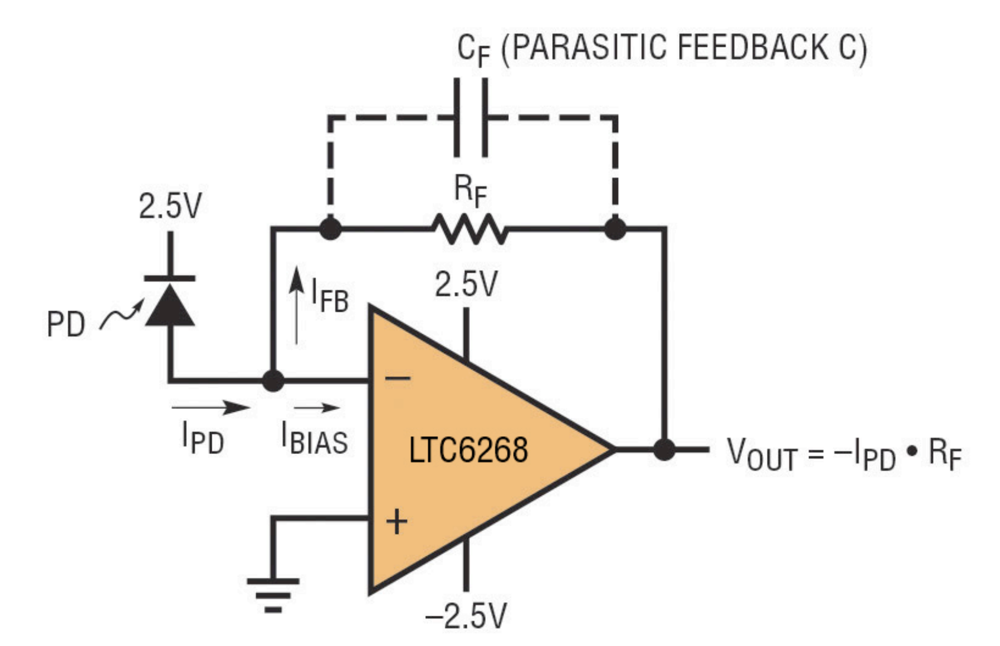

최근에 어떤 프로젝트를 진행하면서 여러 개의 포토다이오드를 고속으로 사용해야 하는 일이 있었다. 이를 진행하면서 포토다이오드 회로 구성에 대해 공부해서 이를 정리한다.

## Photodiode

포토다이오드는 빛을 받아 전류를 발생하는 반도체 소자다. 포토다이오드의 등가 회로는 다음과 같다.

이때 $R_j$는 대단히 크고 (kΩ~GΩ), $R_s$는 대단히 작다 (Ω~mΩ). 이들은 일반적으로 무시할 수 있다. 그런데 $C_j$는 일반적으로 수 pF 정도로 작은 용량이지만 고속으로 사용할 때는 시상수에 영향을 미치므로 무시할 수 없다. 이에 대해서는 아래에서 다룬다.

### Photoconductive Mode vs. Photovoltaic Mode

포토다이오드는 크게 Photoconductive Mode(광전도 모드)와 Photovoltaic Mode(광기전력 모드)의 두 가지 방식으로 동작할 수 있다.

#### Photoconductive Mode (광전도 모드)

Photoconductive Mode는 역바이어스(Reverse Bias)를 인가한 상태에서 동작하는 방식이다. 역바이어스를 걸면 포토다이오드의 내부 전기장이 증가하여 전자-정공 쌍이 더 빠르게 분리되므로 응답 속도가 빨라진다. 이 방식에서는 빛의 강도에 따라 광전류(Photocurrent)가 선형적으로 변화하며, 빠른 신호 응답이 가능하기 때문에 고속 센서 및 광통신 시스템에서 주로 사용된다.

#### Photovoltaic Mode (광기전력 모드)

Photovoltaic Mode는 외부 바이어스 없이 동작하며, 빛을 받으면 자연스럽게 전압이 발생하는 방식이다. 이는 태양광 전지(Solar Cell)와 같은 원리로 작동하며, 일반적으로 저전력 센서에 사용된다. 이 모드는 Dark Current가 거의 없고 노이즈가 적지만, 응답 속도가 상대적으로 느리다.

> 이러한 반응 속도 차이는 위 등가회로에서 $C_j$로 모델링된다.

대부분의 고속 응용에서는 Photoconductive Mode를 사용하며, 저속이지만 안정성이 중요한 경우 Photovoltaic Mode가 선택된다.

## Photodiode Circuit

기존에 포토트랜지스터를 이용한 적이 있었다. 포토트랜지스터는 형태가 포토다이오드와 비슷하지만 포토다이오드와 트랜지스터를 합쳐놓은 것과 동일하게 기능하므로 애초에 훨씬 큰 전류(수십 mA 이상)이 발생한다. 따라서 이것을 analog to digital converter (ADC) 등으로 측정할 때는 pull-down 저항과 간단한 필터 정도만 잘 설계해주면 어렵지 않게 사용할 수 있었다.

#### Trans-impedance Amplifier

그러나 포토다이오드는 전류가 훨씬 작기 때문에 이를 측정하기 위해서는 전류 증폭이 필요하다. 그래서 전자공학을 전공한 친구 미스터 빈에게 도움을 받은 결과, 다음과 같은 trans-impedance amplifier (TIA) 회로를 사용하면 된다는 것을 알게 되었다. TIA란 전류를 전압으로 변환하는 회로이며 포토다이오드 사용 시 가장 많이 사용되는 회로 중 하나다.

위는 포토다이오드를 photoconductive mode로 사용하는 경우의 회로다. 그 이득은 $-R_F$이며 이는 반전 증폭기(inverting amplifier)이다.

위는 포토다이오드를 photovoltaic mode로 사용하는 경우의 회로다. 그 이득은 $R_F$이며 이는 비반전 증폭기(non-inverting amplifier)이므로 단전원 Op-amp를 사용할 수 있다는 장점이 있다.

다만 이 경우 $I_\text{PD}$가 0이라면 $V_\text{OUT}$는 완전히 0이 되어야 한다. 그러나 단전원 Op-amp를 사용하면 실제로는 0에 가까운 값에서 포화(saturation)된다. 이를 피하기 위해서는 비반전입력을 전압 분배 회로를 이용하여 0V보다 약간 더 높게 (VCC의 2%정도) 설정해주면 된다.

이번 프로젝트에서는 음전압을 사용하기가 곤란할 뿐만 아니라 광도를 정확히 측정하는 것이 중요하기 때문에 photovoltaic mode를 사용하기로 결정했다.

#### Sampling Rate

TIA 회로에서는 $R_F$를 크게 하면 높은 이득을 얻을 수 있다. 그러나 앞서 언급한 것처럼 포토다이오드의 등가 회로에는 커패시턴스가 존재하므로 이것이 RC 저역통과필터를 구성하게 된다. 따라서 $R_F$에 따라 원하는 샘플링 속도를 달성할 수 없을 수 있으므로 이를 확인해보아야 한다.

예를 들어 포토다이오드의 $C_j=5\text{pF}$이며 최대 광량 하에서 일반적으로 $I_\text{PD}=10\mu\text{A}$ 정도의 전류를 발생한다고 하자. 이때 최대 광량 하에서 5V정도의 전압을 얻기 위해서는 피드백 저항을 $R_F=5\text{V}/10\mu\text{A}=500\text{k}\Omega$ 정도로 설정해야 한다.

이때 시상수를 계산해보면 $\tau=R_FC_j=500\text{k}\Omega\times5\text{pF}=2.5\mu\text{s}$이다. 이때 아날로그 값 샘플링을 위해서는 시상수의 5배 정도의 시간이 필요하므로 샘플링 시간은 12.5µs 정도로 설정해야 한다. (99.3%) 그러므로 이 회로는 최대 80kHz 정도의 샘플링 속도까지만 사용할 수 있다.

#### Actual Circuit Design

실제 사용할 소자의 특성은 다음과 같다.

- $C_j=4\text{pF}$
- $I_\text{PD}=17\mu\text{A}$
- 최대 광량 하에서 $V_\text{OUT}=4.5\text{V}$

최대 전압인 4.5V는 Op-amp의 동작 전압이 5V이므로 일반적인 선형 구간인 90% 정도를 사용한 것이다.

따라서 $R_F=4.5\text{V}/17\mu\text{A}=265\text{k}\Omega$ 정도로 설정하면 된다. 이때 시상수는 $\tau=265\text{k}\Omega\times4\text{pF}=1.06\mu\text{s}$이므로 샘플링 시간은 $5\tau=5.3µs$ 정도가 된다. 그러므로 이 회로는 188kHz 정도의 최대 샘플링 속도를 가진다.

#### Additional Considerations

포토다이오드를 실제로 사용할 때에는 단순히 포토다이오드 자체의 특성뿐만 아니라 ADC, Multiplexer(MUX), Op-amp 등의 주변 회로 요소들도 함께 고려해야 한다. 특히 고속으로 동작하는 시스템에서는 각 요소의 응답 속도와 지연 시간(settling time)이 전체 샘플링 속도에 영향을 미친다.

이번 프로젝트에서는 최대 200kHz의 샘플링 속도를 가진 ADC를 사용할 예정이며 이를 절반인 100kHz의 샘플링 속도로 동작하도록 설계했다. 따라서 포토다이오드 및 TIA 회로가 최소한 이 속도를 만족해야 한다.

추가적으로 16개의 포토다이오드를 MUX를 통해 다중화(multiplexing)하여 사용하기 때문에 MUX의 전환 시간과 Op-amp의 Slew Rate 및 Settling Time도 고려해야 한다. 데이터시트에 따르면 사용된 MUX의 전환 시간과 Propagation Delay는 ns 단위로 매우 짧아 무시할 수 있다. 하지만 Op-amp의 0.1% Settling Time은 약 7µs로 이는 전체 샘플링 속도의 주요 제한 요소가 된다. 이는 약 143kHz의 최대 샘플링 속도를 의미하며 설계 목표인 100kHz는 충분히 만족할 수 있다.

마지막으로 ADC의 Track & Hold(샘플링) 시간도 중요한 요소다. 사용된 ADC는 3.2MHz 클럭에서 동작하며 3사이클의 Track Time을 가지므로 약 1µs의 추가 샘플링 시간이 필요하다. 이를 고려하면 전체 샘플링 시간은 약 8µs, 즉 125kHz의 이론적인 샘플링 속도를 얻을 수 있다. 따라서 최종적으로 100kHz의 샘플링 속도를 충분히 유지할 수 있는 설계임을 확인할 수 있다.

## Conclusion

포토다이오드를 사용하는 경우 회로를 구성하는 방법과 그때의 고려사항을 공부하고 정리했다.

## References

#### Technical Notes

- https://www.ti.com/lit/an/sboa061/sboa061.pdf
- https://www.analog.com/media/en/technical-documentation/technical-articles/s54_en-circuits.pdf
- https://www.ti.com/lit/ug/tidu535/tidu535.pdf

#### Datasheets of Components

- [Photodiode(VEMD2020X01)](https://www.lcsc.com/datasheet/lcsc_datasheet_2410121811_Vishay-Intertech-VEMD2020X01_C3210968.pdf)
- [Op-amp(OPA378)](https://www.ti.com/lit/ds/symlink/opa378.pdf)
- [Mux(74HC4067)](https://www.ti.com/lit/ds/symlink/cd74hc4067.pdf)
- [ADC(ADC124S021)](https://www.ti.com/lit/ds/symlink/adc124s021.pdf)
