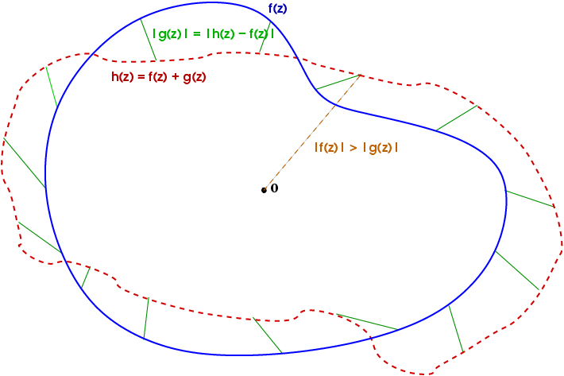

어제 유튜브를 보다가 아래와 같은 아주 재미있는 영상을 발견했습니다. 바로 Rouché's Theorem을 사용하여 복소함수의 어떤 영역 내에서의 근의 개수를 찾는 방법을 설명한 영상이었습니다.

<iframe width="560" height="315" src="https://www.youtube.com/embed/L7qC5pm2tmA" title="YouTube video player" frameborder="0" allow="accelerometer; autoplay; clipboard-write; encrypted-media; gyroscope; picture-in-picture" allowfullscreen></iframe>

# Definition

이 영상에서 설명하는 Rouché's Theorem을 간단히 풀어보자면 다음과 같습니다.

**"어떤 영역 $D$의 경계 $\partial D$ 위에서 $|f(z)|>|g(z)|$가 항상 성립한다면  D 내부에서 $f(z)$ 와 $f(z)+g(z)$ 의 근의 개수가 같다."**

그리고 $|f|>|g|$ 가 항상 성립할 때 $f$가 $g$에 대해 dominant하다고 표현합니다.

이를 이용하면 어떤 복잡한 다항함수 $h(z)$의 어떤 영역 $D$ 내에서의 근의 개수를 구하고자 할 때,  $h(z)$ 를 dominant하고 간단한 항 $f$와 그렇지 않은 항 $g$로 나누어 문제를 쉽게 해결할 수 있습니다.

# Example

위 영상에서 나온 예시를 그대로 따라해보겠습니다. 함수 $h(z)=z^5+3z^2+1$ 의 $D = \set{z|1<|z|<2}$ 위에서의 근의 개수를 구하고자 합니다.

그러기 위해 영역을 $D_1 = \{z | |z| <1\}, D_2 = \{z ||z|<2\}$ 로 나눈 후, $D_2$ 에서의 근의 개수에 $D_1$ 및 $\partial D_1$ 에서의 근의 개수를 빼도록 하겠습니다.

먼저 각 영역 내부의 근의 개수에 대하여, $\partial D_1$ 에서는 $|z|=1$ 이므로 $|z^5|=1, |3z^2|=3$ 이므로 $|z^5+1|\leq|z^5|+1=2<|3z^2|$ 가 성립합니다.

그러므로 $f(z)=3z^2, g(z)=z^5+1$ 로 $h$ 를 나눌 수 있습니다.

따라서 $D_1$ 내부의 $h(z)$ 의 근의 개수는 $f(z)$ 의 근의 개수와 같은 2개입니다. ($z=0$ 에서 중근)

> 이때 근의 개수만 같지, 근의 값까지 똑같지는 않다는 점에 주의해야 합니다. 그러므로 (일반적으로) $h$ 는 $z=0$ 에서 근을 가지지 않습니다.

비슷하게 $\partial D_2 = \{ z| |z|=2\}$ 위에서는 $|z^5|=32>|3z^2|+1=4>|3z^2+1|$ 이므로 $f(z)=z^5, g(z)=3z^2+1$ 로 $h$ 를 나눌 수 있습니다.

따라서 $D_2$ 내부의 $h(z)$ 의 근의 개수는 $f(z)$의 근의 개수와 같은 5개입니다.

마지막으로 $\partial D_1 = \{z||z|=1\}$ 위에서 $h$가 근을 가지지 않음을 보이면 됩니다.

이것 역시 위 영상에서는 매우 간단한 방식으로 보였는데, 아래와 같습니다.

만약 $|z|=1$ 인 근이 존재한다면
$$
z^5+3z^2+1=0\\
\therefore 3z^2=-z^5-1\\
\therefore |3z^2| = |z^5+1|\\
\therefore 3 = |z^5+1| < |z^5| + 1 = 2\\
\therefore 3<2
$$
가 성립해야합니다. 자명히 이는 거짓이므로 $z^5+3z^2+1=0$ 를 만족하는 $|z|=1$은 존재하지 않습니다.

> 이는 사실 $\partial D_1$ 위에서 $f(z)$ 가 $g(z)$ 에 대해 dominant 하므로 자명히 성립할 수밖에 없습니다. 만약 경계 위에 근이 존재한다면 $h=f+g = 0$ 이므로 $f=-g$ 가 성립할 것이며 따라서 $|f|=|g|$ 이므로 $f$ 가 dominant하지 않다는 의미이기 때문입니다.

그러므로 $D_2$ 내부의 근의 개수 - $\partial D_1$ 위의 근의 개수 - $D_1$ 내부의 근의 개수 = $5-0-2= 3$ 을 얻습니다.

