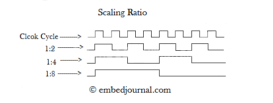

> Translated with the help of ChatGPT and Google Translator

# What is a timer?

A timer is an essential device in the ARM architecture. ARM's timers can be connected to a variety of other peripherals. Therefore, beyond simply generating an interrupt after a certain time or at a certain cycle, it can be used for numerous purposes such as PWM generation and encoder counter. This time I would like to organize things a little bit about this timer.

# Timer structure

ARM's timer can be used for many purposes as mentioned above, but in this post, we will only deal with the case where the timer is used for the purpose of generating an interrupt at a regular interval.

To properly control a timer, you must understand four concepts:

-Counter

- Auto Reload Register (ARR)
- Prescaler
- Prelaod

## Counter

A counter is literally a counter that increments a number, implemented as a single register (usually 16 bits). Every timer has its own counter register. When you start a timer, the value of this counter register continues to increase by 1 per clock. Then, when an overflow occurs in the register and it returns to 0, a timer interrupt occurs.

## Auto Reload Register (ARR)

ARR is a register with the same size as the counter, and is responsible for determining when an overflow will occur in the counter. Of course, if the counter reaches the limit of what can be stored in the register, overflow will inevitably occur, but then the counter will always operate in the same cycle, so it will not be very useful. Specifically, the counter overflows and returns to 0 in the clock immediately after the counter reaches the same value as ARR. For example, if ARR = 3, the counter operates as follows.

**0** > 1 > 2 > 3 > **0** > 1 > 2 > 3 > **0** > 1 > 2 > 3 > ....

Therefore, in the timer, an interrupt occurs once every ARR **+1** clock. Expressed mathematically, if the clock supplied to the timer is $f$Hz and the timer's $ARR$ value is $a$, the timer's interrupt occurs at $f/(a+1)$Hz. Therefore, if $a=0$, a timer interrupt occurs every clock (of course, then the CPU will not be able to operate properly), and if $a=65535$, an interrupt occurs once every 6553**6** clock. do.

Of course, ARR usually uses large values in the hundreds to tens of thousands, so a small difference of about 1 is not a big problem. However, when performing precise control where timing is very important, these errors can accumulate and cause major problems.

## Prescaler

Prescaler is not easy to translate into Korean. I think it's usually translated as 'divider'. Dividing means splitting the cycle. At first glance, it seems like splitting the cycle makes the cycle smaller and the timer runs faster**, but in reality, the opposite is true.** The divider makes the clock supplied to the counter slower. It is a device that creates clocks, and when dividing, multiple clocks supplied to the timer are combined into one, causing the timer to operate more slowly. At this time, the ratio of how many clocks are combined into one is called **division ratio**. The figure below shows divided clocks when the division ratio is 2, 4, and 8 for the supplied clock.

Intuitively, a divider, like a timer, has a counter inside it, so this counter increases according to the edge of the clock, and when the counter reaches the division ratio value, it overflows and inverts the output.

However, the important point here is that the **prescaler value is not a division ratio** but a value that determines when the divider's internal counter will overflow, so **just as in the case of ARR**, the clock input to the divider is $f$Hz. If the division ratio is $p$, the output clock of the divider will be $f/(p+1)$, **not** $f/p$. In fact, if you search the Internet, many materials (especially domestic materials) miss this fact.

Unlike ARR, the prescaler is often set to a small value such as 5 or 10. In this case, if you understand and set this prescaler as a division ratio, a large error of about 10 to 20% may occur. Therefore, when using a prescaler, you must keep in mind that the setting value + 1 becomes the division ratio.

to sum it up

- The clock supplied to the timer is $f_c$Hz
- ARR value is $a$
- Prescaler value is $p$

When , the timer interrupt occurrence frequency $f_i$ can be calculated as follows.

$$
f_i=\frac{f_c}{(a+1)(p+1)}
$$

In actual development (since there is not much to control an extremely wide range of frequencies), the prescaler value is calculated and fixed in advance, and the timer period is controlled by controlling ARR.

## Preload

Unlike the three above, Preload is not a numerical value, but a setting that determines the change point when changing ARR.

- If preload is set (enabled), even if the ARR value is changed, it does not change immediately. It is stored for a while in the preload register, and when a counter overflow occurs, the ARR value is updated at the same time.
- If preload is not set (disabled), ARR changes immediately when changing the ARR value.

But why is this setting necessary?

Let's consider the process of changing ARR from 500 to 490 without preload set. Under normal circumstances, for example if the counter value is 123 or 321, there is no problem. The counter increments, and when it reaches 490 instead of 500, an overflow occurs and it returns to 0. But what would happen if **the counter value happened to be 495** at the time of changing the ARR from 500 to 490?

In this case, ARR should limit the counter value, but it failed to do so, and the counter became larger than ARR. However, in ARM, the counter is designed to overflow when it **equals** the ARR value, so in this case, overflow does not occur. So, the counter returns to 0 only after increasing to the limit the counter value can have (65535 for a 16-bit counter). In other words, the interrupt call cycle suddenly becomes extremely long.

Preload is a setting created to solve this problem. If preload is set, even if the ARR is changed to 490 when the counter is 495, the actual ARR is fixed at 500 and is set to 490 only after the counter reaches 500 and overflow occurs, so this problem can be solved.

Another way to solve this problem is to use down-counter instead of up-counter. In down-counter, opposite to up-counter, the number continues to decrease. Then, when it reaches 0, an underflow occurs and the counter value changes to ARR. In this case, the above problem does not occur regardless of whether preload is set or not.

### Example

I actually had this problem. (This is also the reason why I wrote this article.) When driving the step motor, I ran it without setting preload, and it seemed to run well at first, but suddenly the timing was incorrect. Stepper motors are very sensitive to timing, so if the timing is even slightly off, they may step out of sync or make unpleasant noises. So I couldn't let it go without solving it... I had a lot of trouble finding out the cause.

This problem even occurs only when the counter value is between the old ARR and the new ARR. Therefore, if you are decreasing ARR very slowly, this problem is not easy to spot. In other words, no problems may occur during testing, but problems may arise after using it for a while.
