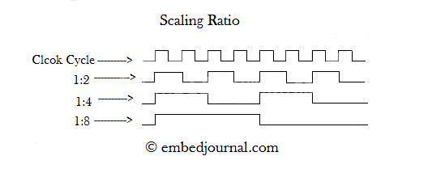

# 타이머란?

ARM 아키텍쳐에서 타이머는 빼 놓을 수 없는 장치입니다. ARM의 타이머는 다양한 다른 주변장치와 연결될 수 있습니다. 그래서 단순히 특정 시간 뒤에, 혹은 일정한 주기로 인터럽트를 발생시키는 것을 넘어서 PWM 생성, 엔코더 카운터 등 수많은 용도로 사용될 수 있습니다. 이번에는 이 타이머에 대해 약간 정리를 해 두고자 합니다.

# 타이머 구조

ARM의 타이머는 상기한 것과 같이 많은 용도로 사용될 수 있지만 이 포스트에서는 일정한 주기로 인터럽트를 발생시키는 목적으로 타이머를 사용하는 경우만을 다루기로 하겠습니다.

타이머를 올바르게 제어하기 위해서는 다음 네 가지 개념을 이해해야 합니다.

- Counter
- Auto Reload Register (ARR)
- Prescaler
- Prelaod

## Counter

카운터는 하나의 레지스터(보통 16비트)로 구현되는, 말 그대로 숫자가 증가하는 카운터입니다. 모든 타이머는 자기만의 카운터 레지스터를 가지고 있습니다. 타이머를 시작하면 이 카운터 레지스터의 값이 1클럭당 1씩 계속 증가합니다. 그러다가 레지스터에서 overflow가 발생하여 0으로 되돌아올 때 타이머 인터럽트가 발생합니다.

## Auto Reload Register (ARR)

ARR은 카운터와 동일한 크기를 갖는 레지스터로, 카운터에서 언제 overflow가 발생할지 결정하는 역할을 합니다. 물론 카운터가 레지스터에 저장할 수 있는 한계에 도달하면 어쩔 수 없이 overflow가 발생하겠지만, 그러면 카운터는 항상 똑같은 주기로만 동작하므로 별로 유용하지 않을 것입니다. 구체적으로, 카운터는 ARR과 같은 값이 된 바로 다음 클럭에 overflow가 발생해서 0으로 되돌아갑니다. 예를 들어 ARR = 3이라 하면 카운터는 아래와 같이 동작합니다.

**0** > 1 > 2 > 3 > **0** > 1 > 2 > 3 > **0** > 1 > 2 > 3 > ....

그러므로 타이머에서는 ARR **+1** 클럭마다 한 번씩 인터럽트가 발생하게 됩니다. 수식으로 나타내보면, 타이머에 공급되는 클럭이 $f$Hz라 하고 타이머의 $ARR$ 값이 $a$라 할 때 타이머의 인터럽트는 $f/(a+1)$Hz로 발생하게 됩니다. 그러므로 $a=0$이라 하면 매 클럭마다 타이머 인터럽트가 발생하고(물론 그러면 CPU가 제대로 동작할 수 없을 것입니다.) $a=65535$라 하면 6553**6**클럭마다 한 번씩 인터럽트가 발생합니다.

물론 보통 ARR은 수백~수만의 큰 값을 사용하므로 1정도의 작은 차이는 별로 문제가 되지 않습니다. 그러나 타이밍이 아주 중요한, 정밀한 제어를 할 때에는 이런 오차가 누적되어 큰 문제가 발생할 수도 있습니다.

## Prescaler

Prescaler는 한국어로 변역하기가 쉽지 않습니다. 보통 '분주기'정도로 번역하는 것 같습니다. 분주란 주기를 쪼갠다는 뜻으로, 언듯 들으면 주기를 쪼갰으니까 주기가 작아져서, 타이머가 더 빨리 동작할 것 같지**만 실제로는 그 반대입니다.** 분주기는 카운터에 공급되는 클럭을 더 느리게 만들어주는 장치로, 분주를 하게 되면 타이머에 공급되는 여러 클럭이 하나로 합쳐져서 타이머가 더 느리게 동작하게 됩니다. 이때 몇 개의 클럭을 하나로 합치는지의 비율을 **분주비**라 합니다. 아래 그림은 공급되는 Clock에 대해 분주비가 2, 4, 8인 경우의 분주된 클럭을 보여줍니다.

직관적으로, 분주기는 타이머와 마찬가지로 내부에 카운터를 가지고 있어서 이 카운터가 클럭의 edge에 맞추어 증가하다가, 카운터가 분주비 값에 도달하면 overflow가 발생하면서 출력을 반전시키는 장치로 이해할 수 있습니다.

그런데 여기서 중요한 점은 **prescaler값은 분주비가 아니라** 분주기 내부 카운터가 언제 overflow될지 결정하는 값이라서, **ARR의 경우와 똑같이** 분주기에 입력되는 클럭이 $f$Hz라 하고 분주비가 $p$라 하면 분주기의 출력 클럭은 $f/p$가 **아니라** $f/(p+1)$이 된다는 점입니다. 실제로 인터넷을 찾아보면 많은 자료들이(특히 국내 자료들이) 이 사실을 놓치고 있습니다.

ARR과 다르게 prescaler는 5나 10정도로 작은 값으로 설정하는 일이 많습니다. 이런 경우 이 prescaler를 분주비로 이해하고 설정하게 되면 10~20%정도의 큰 오차가 발생할 수 있습니다. 그러므로 prescaler를 사용할 때에는 꼭 설정값+1이 분주비가 된다는 점을 생각하면서 사용해야 합니다.

정리하자면

- 타이머에 공급되는 클럭이 $f_c$Hz
- ARR 값이 $a$
- Prescaler 값이 $p$

일 때 타이머 인터럽트의 발생 주파수 $f_i$는 다음과 같이 계산할 수 있습니다.
$$
f_i=\frac{f_c}{(a+1)(p+1)}
$$
실제로 개발할 때에는 (엄청나게 넓은 범위의 주파수를 제어할 일은 그렇게 많지 않으므로) prescaler값은 미리 계산하여 고정해놓고 ARR을 제어하여 타이머 주기를 제어하게 됩니다.

## Preload

Preload는 위의 3개와는 다르게 어떤 숫자 값이 아니라 ARR을 변경할 때 그 변경 시점을 결정하는 설정입니다.

- 만약 preload가 설정되어 있으면(enable) ARR값을 바꾼다 하더라도 즉시 바뀌지 않고 preload register라는 곳에 잠시 저장되어있다가 카운터 overflow가 발생할 때 동시에 ARR값이 업데이트됩니다.
- 만약 preload가 설정되어 있지 않으면(disable) ARR값을 바꿀 때 ARR이 즉시 바뀝니다.

그런데 이런 설정이 왜 필요한 걸까요?

preload가 설정되어있지 않은 상태에서 ARR을 500에서 490으로 바꾸는 과정을 생각해봅시다. 일반적인 상황이라면, 예를 들어 카운터 값이 123이나 321이라면 아무런 문제가 없습니다. 카운터는 증가하다가, 500대신 490에 도달하면 overflow가 발생하고 0으로 되돌아갑니다. 그런데 ARR을 500에서 490으로 바꾸는 그 타이밍에 **하필이면 카운터 값이 495였다면** 어떻게 될까요?

이 경우 ARR이 카운터 값을 제한해줘야 하는데 그러지 못하고 ARR보다 카운터가 커지는 현상이 발생했습니다. 그런데 ARM에서 카운터는 ARR값과 **같아질 때** overflow가 발생하도록 디자인돼있기 때문에 이런 경우에는 overflow가 발생하지 않습니다. 그래서 카운터는 카운터 값이 가질 수 있는 한계치(16비트 카운터라면 65535)까지 증가한 후에야 다시 0으로 되돌아옵니다. 즉, 인터럽트 호출 주기가 갑자기 엄청 길어지게 됩니다.

 Preload는 이런 일을 해결하기 위해서 만들어진 설정입니다. 만약 preload가 설정돼있었다면 카운터가 495였을 때 ARR을 490으로 바꾼다 하더라도 실제 ARR은 500으로 고정되어있고, 카운터가 500에 도달하여 overflow가 발생한 후에야 490으로 설정되므로 이러한 문제를 해결할 수 있습니다.

이 문제를 해결하는 다른 방법은 up-counter 대신 down-counter를 사용하는 것입니다. down-counter는 up-counter와 반대로 숫자가 계속 줄어듭니다. 그러다가 0에 도달하면 언더플로우가 발생하고 카운터 값이 ARR로 바뀝니다. 이 경우에는 preload 설정 여부에 관계 없이 위와 같은 문제가 발생하지 않습니다.

### TMI

저는 실제로 이 문제를 겪었었습니다. (이 글을 쓰게 된 계기이기도 합니다.) 스텝 모터를 구동할 때 preload를 설정하지 않은 채로 구동했더니 처음에는 잘 돌아가는 것처럼 보이다가 갑자기 타이밍이 안 맞는 일이 발생했었습니다. 스텝 모터는 타이밍에 아주 민감해서 조금이라도 타이밍이 맞지 않으면 탈조가 나거나 듣기 싫은 소음이 발생합니다. 그래서 해결 안 하고 넘길 수도 없고...원인을 알아내느라 고생을 많이 했습니다.

심지어 이런 문제는 카운터 값이 이전 ARR과 새로운 ARR사이에 위치하는 경우에만 발생합니다. 그러므로 ARR을 매우 천천히 감소시키는 경우에는 이 문제를 발견하기가 쉽지 않습니다. 즉, 테스트 중에는 아무 문제도 발생하지 않더니, 실제로 한참 사용하다보니까 문제가 발생할 수도 있습니다.
